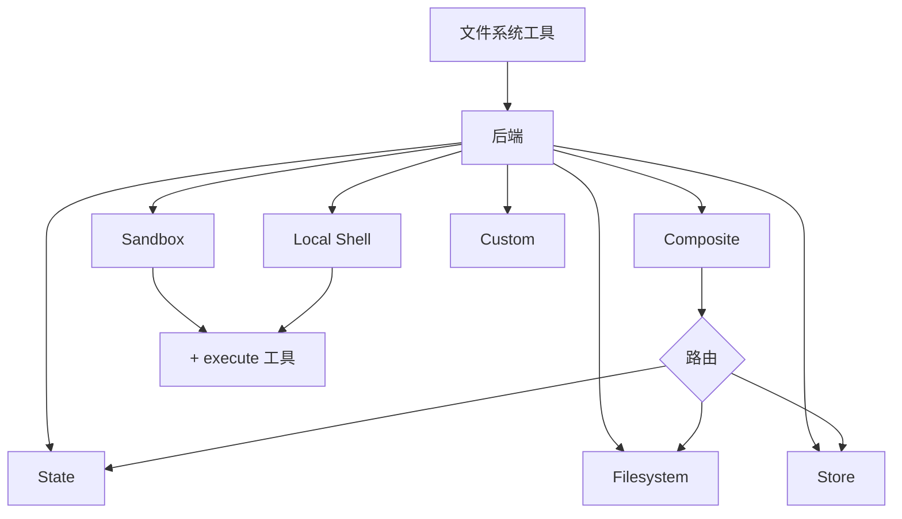

import BackendState from '/snippets/backend-state.mdx';
import BackendFilesystem from '/snippets/backend-filesystem.mdx';
import BackendLocalShell from '/snippets/backend-local-shell.mdx';
import BackendStore from '/snippets/backend-store.mdx';
import BackendComposite from '/snippets/backend-composite.mdx';

Deep Agent 通过 `ls`、`read_file`、`write_file`、`edit_file`、`glob` 和 `grep` 等工具向 Agent 暴露文件系统接口。这些工具通过可插拔的后端来运行。`read_file` 工具原生支持所有后端上的图片文件（`.png`、`.jpg`、`.jpeg`、`.gif`、`.webp`），并将其作为多模态内容块返回。

沙箱和 `LocalShellBackend` 还提供 `execute` 工具。



本页介绍如何[选择后端](#指定后端)、[将不同路径路由到不同后端](#路由到不同后端)、[实现自定义虚拟文件系统](#使用虚拟文件系统)（如 S3 或 Postgres）、[添加策略钩子](#添加策略钩子)以及[遵循后端协议](#协议参考)。

## 快速开始

以下是几个预构建的文件系统后端，你可以快速在 Deep Agent 中使用：

| 内置后端 | 说明 |
|---|---|
| [默认](#statebackend-临时存储) | `agent = create_deep_agent()` <br></br> 临时存储在状态中。Agent 的默认文件系统后端存储在 `langgraph` 状态中。注意该文件系统仅在_单个线程_内持久化。 |
| [本地文件系统持久化](#filesystembackend-本地磁盘) | `agent = create_deep_agent(backend=FilesystemBackend(root_dir="/Users/nh/Desktop/"))` <br></br>为 Deep Agent 提供对本地机器文件系统的访问权限。你可以指定 Agent 可访问的根目录。注意提供的 `root_dir` 必须是绝对路径。 |
| [持久 Store（LangGraph Store）](#storebackend-langgraph-store) | `agent = create_deep_agent(backend=lambda rt: StoreBackend(rt))` <br></br>为 Agent 提供_跨线程持久化_的长期存储访问。非常适合存储在多次执行中通用的长期记忆或指令。 |
| [沙箱](/oss/deepagents/sandboxes) | `agent = create_deep_agent(backend=sandbox)` <br></br>在隔离环境中执行代码。沙箱提供文件系统工具以及用于运行 shell 命令的 `execute` 工具。可选择 Modal、Daytona、Deno 或本地 VFS。 |
| [本地 Shell](#localshellbackend-本地-shell) | `agent = create_deep_agent(backend=LocalShellBackend(root_dir=".", env={"PATH": "/usr/bin:/bin"}))` <br></br>直接在宿主机上进行文件系统操作和 shell 执行。无隔离——仅在受控的开发环境中使用。参见下方[安全注意事项](#本地-shell)。 |
| [组合后端](#compositebackend-路由器) | 默认临时存储，`/memories/` 持久化。组合后端具有最大的灵活性。你可以指定文件系统中的不同路由指向不同后端。参见下方的组合路由示例。 |


## 内置后端

### StateBackend（临时存储）

<BackendState />

**工作原理：**
- 将文件存储在当前线程的 LangGraph Agent 状态中。
- 通过检查点在同一线程的多个 Agent 轮次间持久化。

**最适合：**
- 作为 Agent 写入中间结果的暂存区。
- 自动驱逐大型工具输出，Agent 随后可以分段重新读取。

注意此后端在主 Agent（supervisor）和子 Agent 之间共享，子 Agent 写入的任何文件在该子 Agent 执行完成后仍然保留在 LangGraph Agent 状态中。这些文件将继续对主 Agent 和其他子 Agent 可用。

### FilesystemBackend（本地磁盘）

<Warning>
此后端赋予 Agent 直接的文件系统读写权限。
请谨慎使用，仅在适当的环境中使用。

**适用场景：**
- 本地开发 CLI（编码助手、开发工具）
- CI/CD 流水线（参见下方安全注意事项）

**不适用场景：**
- Web 服务器或 HTTP API——请改用 `StateBackend`、`StoreBackend` 或[沙箱后端](/oss/deepagents/sandboxes)

**安全风险：**
- Agent 可以读取任何可访问的文件，包括敏感信息（API 密钥、凭证、`.env` 文件）
- 结合网络工具，敏感信息可能通过 SSRF 攻击被窃取
- 文件修改是永久且不可逆的

**建议的安全措施：**
1. 启用[人工干预（HITL）中间件](/oss/deepagents/human-in-the-loop)来审查敏感操作。
1. 将敏感信息从可访问的文件系统路径中排除（尤其在 CI/CD 中）。
1. 在需要文件系统交互的生产环境中使用[沙箱后端](/oss/deepagents/sandboxes)。
1. **务必**配合 `root_dir` 使用 `virtual_mode=True` 以启用基于路径的访问限制（阻止 `..`、`~` 和根目录外的绝对路径）。
   注意默认设置（`virtual_mode=False`）即使设置了 `root_dir` 也不提供任何安全保障。
</Warning>

<BackendFilesystem />

**工作原理：**
- 在可配置的 `root_dir` 下读写真实文件。
- 可选设置 `virtual_mode=True` 以对 `root_dir` 下的路径进行沙箱化和规范化。
- 使用安全的路径解析，尽可能阻止不安全的符号链接遍历，可使用 ripgrep 进行快速 `grep`。

**最适合：**
- 本地机器上的项目
- CI 沙箱
- 挂载的持久化存储卷

### LocalShellBackend（本地 Shell）

<Warning>
此后端赋予 Agent 直接的文件系统读写权限**以及**在宿主机上不受限制的 shell 执行能力。
请极其谨慎地使用，仅在适当的环境中使用。

**适用场景：**
- 本地开发 CLI（编码助手、开发工具）
- 你信任 Agent 生成代码的个人开发环境
- 具有适当密钥管理的 CI/CD 流水线

**不适用场景：**
- 生产环境（如 Web 服务器、API、多租户系统）
- 处理不受信任的用户输入或执行不受信任的代码

**安全风险：**
- Agent 可以以你的用户权限执行**任意 shell 命令**
- Agent 可以读取任何可访问的文件，包括敏感信息（API 密钥、凭证、`.env` 文件）
- 敏感信息可能被暴露
- 文件修改和命令执行是**永久且不可逆的**
- 命令直接在宿主系统上运行
- 命令可以消耗无限的 CPU、内存和磁盘资源

**建议的安全措施：**
1. 启用[人工干预（HITL）中间件](/oss/deepagents/human-in-the-loop)来在执行前审查和批准操作。这是**强烈推荐的**。
2. 仅在专用开发环境中运行。切勿在共享或生产系统上使用。
3. 在需要 shell 执行的生产环境中使用[沙箱后端](/oss/deepagents/sandboxes)。

**注意：** 启用 shell 访问后 `virtual_mode=True` 不提供安全保障，因为命令可以访问系统上的任何路径。
</Warning>

<BackendLocalShell />

**工作原理：**
- 扩展 `FilesystemBackend`，增加用于在宿主机上运行 shell 命令的 `execute` 工具。
- 命令使用 `subprocess.run(shell=True)` 直接在你的机器上运行，没有沙箱隔离。
- 支持 `timeout`（默认 120 秒）、`max_output_bytes`（默认 100,000）、`env` 和 `inherit_env` 等环境变量配置。
- Shell 命令以 `root_dir` 作为工作目录，但可以访问系统上的任何路径。

**最适合：**
- 本地编码助手和开发工具
- 开发阶段你信任 Agent 时的快速迭代

### StoreBackend（LangGraph Store）

<BackendStore />

**工作原理：**
- 将文件存储在运行时提供的 LangGraph @[`BaseStore`] 中，实现跨线程的持久化存储。

**最适合：**
- 已经配置了 LangGraph Store 运行的场景（例如，Redis、Postgres 或 @[`BaseStore`] 背后的云端实现）。
- 通过 LangSmith Deployment 部署 Agent 时（会自动为你的 Agent 配置一个 Store）。


### CompositeBackend（路由器）

<BackendComposite />

**工作原理：**
- 根据路径前缀将文件操作路由到不同的后端。
- 在列表和搜索结果中保留原始的路径前缀。

**最适合：**
- 当你希望 Agent 同时拥有临时存储和跨线程存储时，`CompositeBackend` 允许你同时提供 `StateBackend` 和 `StoreBackend`。
- 当你有多个信息来源需要作为单一文件系统提供给 Agent 时。
    - 例如：你的长期记忆存储在某个 Store 的 `/memories/` 下，同时有一个自定义后端在 /docs/ 路径下提供文档。

## 指定后端

- 通过 `create_deep_agent(backend=...)` 传入后端。文件系统中间件将使用它处理所有工具操作。
- 你可以传入以下任一类型：
    - 实现了 `BackendProtocol` 的实例（例如 `FilesystemBackend(root_dir=".")`），或
    - 工厂函数 `BackendFactory = Callable[[ToolRuntime], BackendProtocol]`（用于需要运行时的后端，如 `StateBackend` 或 `StoreBackend`）。
- 如果省略，默认为 `lambda rt: StateBackend(rt)`。


## 路由到不同后端

将命名空间的不同部分路由到不同后端。常用于将 `/memories/*` 持久化，其他内容保持临时存储。

:::python
```python
from deepagents import create_deep_agent
from deepagents.backends import CompositeBackend, StateBackend, FilesystemBackend

composite_backend = lambda rt: CompositeBackend(
    default=StateBackend(rt),
    routes={
        "/memories/": FilesystemBackend(root_dir="/deepagents/myagent", virtual_mode=True),
    },
)

agent = create_deep_agent(backend=composite_backend)
```
:::

:::js
```typescript
import { createDeepAgent, CompositeBackend, FilesystemBackend, StateBackend } from "deepagents";

const compositeBackend = (rt) => new CompositeBackend(
  new StateBackend(rt),
  {
    "/memories/": new FilesystemBackend({ rootDir: "/deepagents/myagent", virtualMode: true }),
  },
);

const agent = createDeepAgent({ backend: compositeBackend });
```
:::

行为说明：
- `/workspace/plan.md` → `StateBackend`（临时存储）
- `/memories/agent.md` → `FilesystemBackend`，位于 `/deepagents/myagent` 目录下
- `ls`、`glob`、`grep` 会聚合结果并显示原始路径前缀。

注意事项：
- 更长的前缀优先匹配（例如，路由 `"/memories/projects/"` 可以覆盖 `"/memories/"`）。
- 对于 StoreBackend 路由，确保 Agent 运行时提供了 Store（`runtime.store`）。

## 使用虚拟文件系统

构建自定义后端，将远程或数据库文件系统（如 S3 或 Postgres）映射到工具命名空间中。

设计指南：

- 路径是绝对路径（`/x/y.txt`）。决定如何将其映射到你的存储键/行。
- 高效实现 `ls_info` 和 `glob_info`（尽可能使用服务端列表，否则本地过滤）。
- 对于缺失文件或无效正则表达式，返回用户可读的错误字符串。
- 对于外部持久化，在结果中设置 `files_update=None`；只有基于状态的后端才应返回 `files_update` 字典。

S3 风格实现大纲：

:::python
```python
from deepagents.backends.protocol import BackendProtocol, WriteResult, EditResult
from deepagents.backends.utils import FileInfo, GrepMatch

class S3Backend(BackendProtocol):
    def __init__(self, bucket: str, prefix: str = ""):
        self.bucket = bucket
        self.prefix = prefix.rstrip("/")

    def _key(self, path: str) -> str:
        return f"{self.prefix}{path}"

    def ls_info(self, path: str) -> list[FileInfo]:
        # 列出 _key(path) 下的对象；构建 FileInfo 条目（path, size, modified_at）
        ...

    def read(self, file_path: str, offset: int = 0, limit: int = 2000) -> str:
        # 获取对象；返回带行号的内容或错误字符串
        ...

    def grep_raw(self, pattern: str, path: str | None = None, glob: str | None = None) -> list[GrepMatch] | str:
        # 可选服务端过滤；否则列出并扫描内容
        ...

    def glob_info(self, pattern: str, path: str = "/") -> list[FileInfo]:
        # 在键中相对于 path 应用 glob 匹配
        ...

    def write(self, file_path: str, content: str) -> WriteResult:
        # 强制仅创建语义；返回 WriteResult(path=file_path, files_update=None)
        ...

    def edit(self, file_path: str, old_string: str, new_string: str, replace_all: bool = False) -> EditResult:
        # 读取 → 替换（遵循唯一性 vs replace_all）→ 写入 → 返回出现次数
        ...
```
:::

Postgres 风格实现大纲：

- 表结构 `files(path text primary key, content text, created_at timestamptz, modified_at timestamptz)`
- 将工具操作映射到 SQL：
  - `ls_info` 使用 `WHERE path LIKE $1 || '%'`
  - `glob_info` 在 SQL 中过滤，或先获取再用 Python 应用 glob
  - `grep_raw` 可以按扩展名或最后修改时间获取候选行，然后逐行扫描

## 添加策略钩子

通过子类化或包装后端来强制执行企业级规则。

阻止特定前缀下的写入/编辑操作（子类方式）：

:::python
```python
from deepagents.backends.filesystem import FilesystemBackend
from deepagents.backends.protocol import WriteResult, EditResult

class GuardedBackend(FilesystemBackend):
    def __init__(self, *, deny_prefixes: list[str], **kwargs):
        super().__init__(**kwargs)
        self.deny_prefixes = [p if p.endswith("/") else p + "/" for p in deny_prefixes]

    def write(self, file_path: str, content: str) -> WriteResult:
        if any(file_path.startswith(p) for p in self.deny_prefixes):
            return WriteResult(error=f"Writes are not allowed under {file_path}")
        return super().write(file_path, content)

    def edit(self, file_path: str, old_string: str, new_string: str, replace_all: bool = False) -> EditResult:
        if any(file_path.startswith(p) for p in self.deny_prefixes):
            return EditResult(error=f"Edits are not allowed under {file_path}")
        return super().edit(file_path, old_string, new_string, replace_all)
```
:::

通用包装器（适用于任何后端）：

:::python
```python
from deepagents.backends.protocol import BackendProtocol, WriteResult, EditResult
from deepagents.backends.utils import FileInfo, GrepMatch

class PolicyWrapper(BackendProtocol):
    def __init__(self, inner: BackendProtocol, deny_prefixes: list[str] | None = None):
        self.inner = inner
        self.deny_prefixes = [p if p.endswith("/") else p + "/" for p in (deny_prefixes or [])]

    def _deny(self, path: str) -> bool:
        return any(path.startswith(p) for p in self.deny_prefixes)

    def ls_info(self, path: str) -> list[FileInfo]:
        return self.inner.ls_info(path)
    def read(self, file_path: str, offset: int = 0, limit: int = 2000) -> str:
        return self.inner.read(file_path, offset=offset, limit=limit)
    def grep_raw(self, pattern: str, path: str | None = None, glob: str | None = None) -> list[GrepMatch] | str:
        return self.inner.grep_raw(pattern, path, glob)
    def glob_info(self, pattern: str, path: str = "/") -> list[FileInfo]:
        return self.inner.glob_info(pattern, path)
    def write(self, file_path: str, content: str) -> WriteResult:
        if self._deny(file_path):
            return WriteResult(error=f"Writes are not allowed under {file_path}")
        return self.inner.write(file_path, content)
    def edit(self, file_path: str, old_string: str, new_string: str, replace_all: bool = False) -> EditResult:
        if self._deny(file_path):
            return EditResult(error=f"Edits are not allowed under {file_path}")
        return self.inner.edit(file_path, old_string, new_string, replace_all)
```
:::

## 协议参考

后端必须实现 `BackendProtocol`。

必需的接口：
- `ls_info(path: str) -> list[FileInfo]`
  - 返回至少包含 `path` 的条目。可用时包含 `is_dir`、`size`、`modified_at`。按 `path` 排序以确保输出确定性。
- `read(file_path: str, offset: int = 0, limit: int = 2000) -> str`
  - 返回带行号的内容。文件不存在时返回 `"Error: File '/x' not found"`。
- `grep_raw(pattern: str, path: Optional[str] = None, glob: Optional[str] = None) -> list[GrepMatch] | str`
  - 返回结构化匹配结果。对于无效正则表达式，返回类似 `"Invalid regex pattern: ..."` 的字符串（不要抛出异常）。
- `glob_info(pattern: str, path: str = "/") -> list[FileInfo]`
  - 以 `FileInfo` 条目返回匹配的文件（无匹配时返回空列表）。
- `write(file_path: str, content: str) -> WriteResult`
  - 仅创建语义。冲突时返回 `WriteResult(error=...)`。成功时设置 `path`，对于状态后端设置 `files_update={...}`；外部后端应使用 `files_update=None`。
- `edit(file_path: str, old_string: str, new_string: str, replace_all: bool = False) -> EditResult`
  - 除非 `replace_all=True`，否则强制 `old_string` 的唯一性。未找到时返回错误。成功时包含 `occurrences`。

辅助类型：
- `WriteResult(error, path, files_update)`
- `EditResult(error, path, files_update, occurrences)`
- `FileInfo` 字段：`path`（必需），可选 `is_dir`、`size`、`modified_at`。
- `GrepMatch` 字段：`path`、`line`、`text`。
