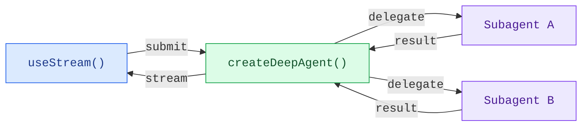

构建能够实时可视化 Deep Agent 工作流的前端。这些模式展示了如何渲染子 Agent 进度、任务规划以及来自 `createDeepAgent` 创建的 Agent 的流式内容。

## 架构

Deep Agent 采用协调者-工作者架构。主 Agent 规划任务并委托给专门的子 Agent，每个子 Agent 独立运行。在前端，`useStream` 同时展示协调者的消息和每个子 Agent 的流式状态。



:::python

```python
from deepagents import create_deep_agent

agent = create_deep_agent(
    tools=[get_weather],
    system_prompt="You are a helpful assistant",
    subagents=[
        {
            "name": "researcher",
            "description": "Research assistant",
        }
    ],
)
```

:::

:::js

```ts
import { createDeepAgent } from "deepagents";

const agent = createDeepAgent({
  tools: [getWeather],
  system: "You are a helpful assistant",
  subagents: [
    {
      name: "researcher",
      description: "Research assistant",
    },
  ],
});
```

:::

在前端，使用 `useStream` 连接，方式与 `createAgent` 相同。Deep Agent 模式使用 `useStream` 的额外特性（如 `stream.subagents`、`stream.values.todos` 和 `filterSubagentMessages`）来渲染子 Agent 专属的 UI。

```ts
import { useStream } from "@langchain/react";

function App() {
  const stream = useStream<typeof agent>({
    apiUrl: "http://localhost:2024",
    assistantId: "agent",
  });

  // 消息之外的 Deep Agent 状态
  const todos = stream.values?.todos;
  const subagents = stream.subagents;
}
```

## 模式

<CardGroup cols={2}>
  <Card title="子 Agent 流式输出" icon="arrows-split" href="/oss/deepagents/frontend/subagent-streaming">
    展示专业子 Agent 的流式内容、进度跟踪和可折叠卡片。
  </Card>
  <Card title="待办列表" icon="list-check" href="/oss/deepagents/frontend/todo-list">
    通过与 Agent 状态同步的实时待办列表追踪 Agent 进度。
  </Card>
</CardGroup>

## 相关模式

[LangChain 前端模式](/oss/langchain/frontend/overview)——包括 Markdown 消息、工具调用和人工干预——同样适用于 Deep Agent。Deep Agent 基于相同的 LangGraph 运行时构建，因此 `useStream` 提供相同的核心 API。
