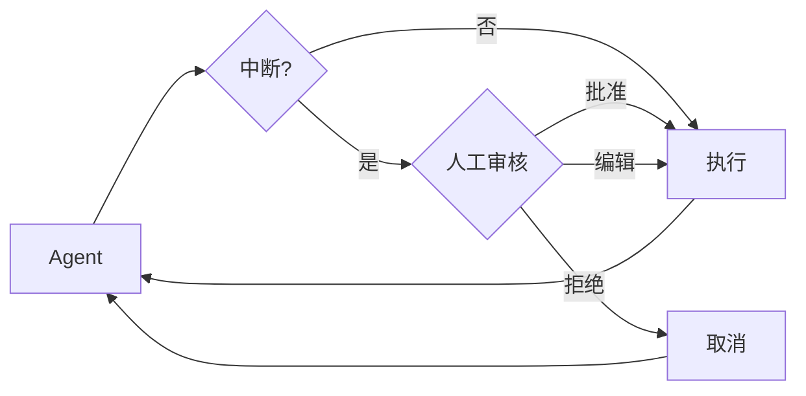

import HitlBasicConfig from '/snippets/hitl-basic-config.mdx';

某些工具操作可能比较敏感，需要在执行前获得人工审批。Deep Agent 通过 LangGraph 的中断（interrupt）功能支持人工干预工作流。你可以使用 `interrupt_on` 参数配置哪些工具需要审批。



## 基本配置

`interrupt_on` 参数接受一个字典，将工具名称映射到中断配置。每个工具可以配置为：

- **`True`**：使用默认行为启用中断（允许批准、编辑、拒绝）
- **`False`**：对此工具禁用中断
- **`{"allowed_decisions": [...]}`**：自定义配置，指定允许的决策类型

<HitlBasicConfig />

## 决策类型

`allowed_decisions` 列表控制人工在审查工具调用时可以采取的操作：

- **`"approve"`**：使用 Agent 提议的原始参数执行工具
- **`"edit"`**：在执行前修改工具参数
- **`"reject"`**：完全跳过此工具调用的执行

你可以为每个工具自定义可用的决策类型：

:::python
```python
interrupt_on = {
    # 敏感操作：允许所有选项
    "delete_file": {"allowed_decisions": ["approve", "edit", "reject"]},

    # 中等风险：仅允许批准或拒绝
    "write_file": {"allowed_decisions": ["approve", "reject"]},

    # 必须批准（不允许拒绝）
    "critical_operation": {"allowed_decisions": ["approve"]},
}
```
:::

:::js
```typescript
const interruptOn = {
  // 敏感操作：允许所有选项
  delete_file: { allowedDecisions: ["approve", "edit", "reject"] },

  // 中等风险：仅允许批准或拒绝
  write_file: { allowedDecisions: ["approve", "reject"] },

  // 必须批准（不允许拒绝）
  critical_operation: { allowedDecisions: ["approve"] },
};
```
:::

## 处理中断

当触发中断时，Agent 暂停执行并返回控制权。检查结果中的中断信息并进行相应处理。

:::python
```python
import uuid
from langgraph.types import Command

# 创建带有 thread_id 的配置以实现状态持久化
config = {"configurable": {"thread_id": str(uuid.uuid4())}}

# 调用 Agent
result = agent.invoke(
    {"messages": [{"role": "user", "content": "Delete the file temp.txt"}]},
    config=config,
    version="v2",  # [!code highlight]
)

# 检查执行是否被中断
if result.interrupts:  # [!code highlight]
    # 提取中断信息
    interrupt_value = result.interrupts[0].value  # [!code highlight]
    action_requests = interrupt_value["action_requests"]
    review_configs = interrupt_value["review_configs"]

    # 创建工具名称到审查配置的映射
    config_map = {cfg["action_name"]: cfg for cfg in review_configs}

    # 向用户展示待审批的操作
    for action in action_requests:
        review_config = config_map[action["name"]]
        print(f"Tool: {action['name']}")
        print(f"Arguments: {action['args']}")
        print(f"Allowed decisions: {review_config['allowed_decisions']}")

    # 获取用户决策（每个 action_request 一个，按顺序）
    decisions = [
        {"type": "approve"}  # 用户批准了删除操作
    ]

    # 使用决策恢复执行
    result = agent.invoke(
        Command(resume={"decisions": decisions}),
        config=config,  # 必须使用相同的 config！
        version="v2",
    )

# 处理最终结果
print(result.value["messages"][-1].content)  # [!code highlight]
```
:::

:::js
```typescript
import { v4 as uuidv4 } from "uuid";
import { Command } from "@langchain/langgraph";

// 创建带有 thread_id 的配置以实现状态持久化
const config = { configurable: { thread_id: uuidv4() } };

// 调用 Agent
let result = await agent.invoke({
  messages: [{ role: "user", content: "Delete the file temp.txt" }],
}, config);

// 检查执行是否被中断
if (result.__interrupt__) {
  // 提取中断信息
  const interrupts = result.__interrupt__[0].value;
  const actionRequests = interrupts.actionRequests;
  const reviewConfigs = interrupts.reviewConfigs;

  // 创建工具名称到审查配置的映射
  const configMap = Object.fromEntries(
    reviewConfigs.map((cfg) => [cfg.actionName, cfg])
  );

  // 向用户展示待审批的操作
  for (const action of actionRequests) {
    const reviewConfig = configMap[action.name];
    console.log(`Tool: ${action.name}`);
    console.log(`Arguments: ${JSON.stringify(action.args)}`);
    console.log(`Allowed decisions: ${reviewConfig.allowedDecisions}`);
  }

  // 获取用户决策（每个 actionRequest 一个，按顺序）
  const decisions = [
    { type: "approve" }  // 用户批准了删除操作
  ];

  // 使用决策恢复执行
  result = await agent.invoke(
    new Command({ resume: { decisions } }),
    config  // 必须使用相同的 config！
  );
}

// 处理最终结果
console.log(result.messages[result.messages.length - 1].content);
```
:::

## 多工具调用

当 Agent 调用多个需要审批的工具时，所有中断会被批量合并为一次中断。你必须按顺序为每个中断提供决策。

:::python
```python
config = {"configurable": {"thread_id": str(uuid.uuid4())}}

result = agent.invoke(
    {"messages": [{
        "role": "user",
        "content": "Delete temp.txt and send an email to admin@example.com"
    }]},
    config=config,
    version="v2",  # [!code highlight]
)

if result.interrupts:  # [!code highlight]
    interrupt_value = result.interrupts[0].value  # [!code highlight]
    action_requests = interrupt_value["action_requests"]

    # 两个工具需要审批
    assert len(action_requests) == 2

    # 按 action_requests 的顺序提供决策
    decisions = [
        {"type": "approve"},  # 第一个工具：delete_file
        {"type": "reject"}    # 第二个工具：send_email
    ]

    result = agent.invoke(
        Command(resume={"decisions": decisions}),
        config=config
    )
```
:::

:::js
```typescript
const config = { configurable: { thread_id: uuidv4() } };

let result = await agent.invoke({
  messages: [{
    role: "user",
    content: "Delete temp.txt and send an email to admin@example.com"
  }]
}, config);

if (result.__interrupt__) {
  const interrupts = result.__interrupt__[0].value;
  const actionRequests = interrupts.actionRequests;

  // 两个工具需要审批
  console.assert(actionRequests.length === 2);

  // 按 actionRequests 的顺序提供决策
  const decisions = [
    { type: "approve" },  // 第一个工具：delete_file
    { type: "reject" }    // 第二个工具：send_email
  ];

  result = await agent.invoke(
    new Command({ resume: { decisions } }),
    config
  );
}
```
:::

## 编辑工具参数

当 `"edit"` 在允许的决策列表中时，你可以在执行前修改工具参数：

:::python
```python
if result.interrupts:  # [!code highlight]
    interrupt_value = result.interrupts[0].value  # [!code highlight]
    action_request = interrupt_value["action_requests"][0]

    # Agent 提议的原始参数
    print(action_request["args"])  # {"to": "everyone@company.com", ...}

    # 用户决定编辑收件人
    decisions = [{
        "type": "edit",
        "edited_action": {
            "name": action_request["name"],  # 必须包含工具名称
            "args": {"to": "team@company.com", "subject": "...", "body": "..."}
        }
    }]

    result = agent.invoke(
        Command(resume={"decisions": decisions}),
        config=config
    )
```
:::

:::js
```typescript
if (result.__interrupt__) {
  const interrupts = result.__interrupt__[0].value;
  const actionRequest = interrupts.actionRequests[0];

  // Agent 提议的原始参数
  console.log(actionRequest.args);  // { to: "everyone@company.com", ... }

  // 用户决定编辑收件人
  const decisions = [{
    type: "edit",
    editedAction: {
      name: actionRequest.name,  // 必须包含工具名称
      args: { to: "team@company.com", subject: "...", body: "..." }
    }
  }];

  result = await agent.invoke(
    new Command({ resume: { decisions } }),
    config
  );
}
```
:::

## 子 Agent 中断

使用子 Agent 时，你可以在[工具调用上](#工具调用中断)和[工具调用内部](#工具调用内部中断)使用中断。

### 工具调用中断

每个子 Agent 可以有自己的 `interrupt_on` 配置，覆盖主 Agent 的设置：

:::python
```python
agent = create_deep_agent(
    tools=[delete_file, read_file],
    interrupt_on={
        "delete_file": True,
        "read_file": False,
    },
    subagents=[{
        "name": "file-manager",
        "description": "Manages file operations",
        "system_prompt": "You are a file management assistant.",
        "tools": [delete_file, read_file],
        "interrupt_on": {
            # 覆盖：在此子 Agent 中要求读取也需要审批
            "delete_file": True,
            "read_file": True,  # 与主 Agent 不同！
        }
    }],
    checkpointer=checkpointer
)
```
:::

:::js
```typescript
const agent = createDeepAgent({
  tools: [deleteFile, readFile],
  interruptOn: {
    delete_file: true,
    read_file: false,
  },
  subagents: [{
    name: "file-manager",
    description: "Manages file operations",
    systemPrompt: "You are a file management assistant.",
    tools: [deleteFile, readFile],
    interruptOn: {
      // 覆盖：在此子 Agent 中要求读取也需要审批
      delete_file: true,
      read_file: true,  // 与主 Agent 不同！
    }
  }],
  checkpointer
});
```
:::

当子 Agent 触发中断时，处理方式相同——检查 `__interrupt__` 并使用 `Command` 恢复执行。

### 工具调用内部中断

子 Agent 工具可以直接调用 `interrupt()` 来暂停执行并等待审批：

:::python

```python
from langchain.agents import create_agent
from langchain_anthropic import ChatAnthropic
from langchain.messages import HumanMessage
from langchain.tools import tool
from langgraph.checkpoint.memory import InMemorySaver
from langgraph.types import Command, interrupt

from deepagents.graph import create_deep_agent
from deepagents.middleware.subagents import CompiledSubAgent


@tool(description="Request human approval before proceeding with an action.")
def request_approval(action_description: str) -> str:
    """使用 interrupt() 原语请求人工审批。"""
    # interrupt() 暂停执行并返回传递给 Command(resume=...) 的值
    approval = interrupt({
        "type": "approval_request",
        "action": action_description,
        "message": f"Please approve or reject: {action_description}",
    })

    if approval.get("approved"):
        return f"Action '{action_description}' was APPROVED. Proceeding..."
    else:
        return f"Action '{action_description}' was REJECTED. Reason: {approval.get('reason', 'No reason provided')}"


def main():
    checkpointer = InMemorySaver()
    model = ChatAnthropic(
        model_name="claude-sonnet-4-6",
        max_tokens=4096,
    )

    compiled_subagent = create_agent(
        model=model,
        tools=[request_approval],
        name="approval-agent",
    )

    parent_agent = create_deep_agent(
        checkpointer=checkpointer,
        subagents=[
            CompiledSubAgent(
                name="approval-agent",
                description="An agent that can request approvals",
                runnable=compiled_subagent,
            )
        ],
    )

    thread_id = "test_interrupt_directly"
    config = {"configurable": {"thread_id": thread_id}}

    print("Invoking agent - sub-agent will use request_approval tool...")

    result = parent_agent.invoke(
        {
            "messages": [
                HumanMessage(
                    content="Use the task tool to launch the approval-agent sub-agent. "
                    "Tell it to use the request_approval tool to request approval for 'deploying to production'."
                )
            ]
        },
        config=config,
    )

    # 检查中断
    if result.interrupts:  # [!code highlight]
        interrupt_value = result.interrupts[0].value  # [!code highlight]
        print(f"\nInterrupt received!")
        print(f"  Type: {interrupt_value.get('type')}")
        print(f"  Action: {interrupt_value.get('action')}")
        print(f"  Message: {interrupt_value.get('message')}")

        print("\nResuming with Command(resume={'approved': True})...")
        result2 = parent_agent.invoke(
            Command(resume={"approved": True}),
            config=config,
        )

        if not result2.interrupts:  # [!code highlight]
            print("\nExecution completed!")
            # 查找工具响应
            tool_msgs = [m for m in result2.value.get("messages", []) if m.type == "tool"]  # [!code highlight]
            if tool_msgs:
                print(f"  Tool result: {tool_msgs[-1].content}")
        else:
            print("\nAnother interrupt occurred")
    else:
        print("\n  No interrupt - the model may not have called request_approval")


if __name__ == "__main__":
    main()
```

运行后，将产生以下输出：

```python
Invoking agent - sub-agent will use request_approval tool...

Interrupt received!
  Type: approval_request
  Action: deploying to production
  Message: Please approve or reject: deploying to production

Resuming with Command(resume={'approved': True})...

Execution completed!
  Tool result: Great! The approval request has been processed. The action **"deploying to production"** was **APPROVED**. You can now proceed with the production deployment.
```

:::

:::js
```typescript
import { createAgent, tool } from "langchain";
import { ChatOpenAI } from "@langchain/openai";
import { HumanMessage } from "@langchain/core/messages";
import { MemorySaver, Command, interrupt } from "@langchain/langgraph";
import { createDeepAgent } from "deepagents";
import { z } from "zod";

const requestApproval = tool(
  async ({ actionDescription }: { actionDescription: string }) => {
    const approval = interrupt({
      type: "approval_request",
      action: actionDescription,
      message: `Please approve or reject: ${actionDescription}`,
    }) as { approved?: boolean; reason?: string };

    if (approval.approved) {
      return `Action '${actionDescription}' was APPROVED. Proceeding...`;
    } else {
      return `Action '${actionDescription}' was REJECTED. Reason: ${
        approval.reason || "No reason provided"
      }`;
    }
  },
  {
    name: "request_approval",
    description: "Request human approval before proceeding with an action.",
    schema: z.object({
      actionDescription: z
        .string()
        .describe("The action that requires approval"),
    }),
  }
);

async function main() {
  const checkpointer = new MemorySaver();
  const model = new ChatOpenAI({
    model: "gpt-4o-mini",
    maxTokens: 4096,
  });

  const compiledSubagent = createAgent({
    model: model,
    tools: [requestApproval],
    name: "approval-agent",
  });

  const parentAgent = await createDeepAgent({
    checkpointer: checkpointer,
    subagents: [
      {
        name: "approval-agent",
        description: "An agent that can request approvals",
        runnable: compiledSubagent as any,
      },
    ],
  });

  const threadId = "test_interrupt_directly";
  const config = { configurable: { thread_id: threadId } };

  console.log("Invoking agent - sub-agent will use request_approval tool...");

  let result = await parentAgent.invoke(
    {
      messages: [
        new HumanMessage({
          content:
            "Use the task tool to launch the approval-agent sub-agent. " +
            "Tell it to use the request_approval tool to request approval for 'deploying to production'.",
        }),
      ],
    },
    config
  );

  if (result.__interrupt__) {
    const interruptValue = result.__interrupt__[0].value as {
      type?: string;
      action?: string;
      message?: string;
    };
    console.log("\nInterrupt received!");
    console.log(`  Type: ${interruptValue.type}`);
    console.log(`  Action: ${interruptValue.action}`);
    console.log(`  Message: ${interruptValue.message}`);

    console.log("\nResuming with Command(resume={'approved': true})...");
    const result2 = await parentAgent.invoke(
      new Command({ resume: { approved: true } }),
      config
    );

    if (!result2.__interrupt__) {
      console.log("\nExecution completed!");
      // 查找工具响应
      const toolMsgs = result2.messages?.filter((m) => m.type === "tool") || [];
      if (toolMsgs.length > 0) {
        const lastToolMsg = toolMsgs[toolMsgs.length - 1];
        console.log(`  Tool result: ${lastToolMsg.content}`);
      }
    } else {
      console.log("\nAnother interrupt occurred");
    }
  } else {
    console.log(
      "\n  No interrupt - the model may not have called request_approval"
    );
  }
}

main().catch(console.error);
```

运行后，将产生以下输出：

```typescript
Invoking agent - sub-agent will use request_approval tool...

Interrupt received!
  Type: approval_request
  Action: deploying to production
  Message: Please approve or reject: deploying to production

Resuming with Command(resume={'approved': true})...

Execution completed!
  Tool result: Approval for "deploying to production" has been granted. You can proceed with the deployment.
```

:::

## 最佳实践

### 始终使用 checkpointer

人工干预需要 checkpointer 来在中断和恢复之间持久化 Agent 状态：

:::python
```python
from langgraph.checkpoint.memory import MemorySaver

checkpointer = MemorySaver()
agent = create_deep_agent(
    tools=[...],
    interrupt_on={...},
    checkpointer=checkpointer  # 人工干预必需
)
```
:::

### 使用相同的线程 ID

恢复执行时，必须使用包含相同 `thread_id` 的配置：

:::python
```python
# 首次调用
config = {"configurable": {"thread_id": "my-thread"}}
result = agent.invoke(input, config=config)

# 恢复执行（使用相同的 config）
result = agent.invoke(Command(resume={...}), config=config)
```
:::

### 决策顺序与操作一一对应

decisions 列表必须与 `action_requests` 的顺序一致：

:::python
```python
if result.interrupts:  # [!code highlight]
    interrupt_value = result.interrupts[0].value  # [!code highlight]
    action_requests = interrupt_value["action_requests"]

    # 按顺序为每个操作创建一个决策
    decisions = []
    for action in action_requests:
        decision = get_user_decision(action)  # 你的逻辑
        decisions.append(decision)

    result = agent.invoke(
        Command(resume={"decisions": decisions}),
        config=config
    )
```
:::

### 按风险等级定制配置

根据工具的风险等级配置不同的中断策略：

:::python
```python
interrupt_on = {
    # 高风险：完全控制（批准、编辑、拒绝）
    "delete_file": {"allowed_decisions": ["approve", "edit", "reject"]},
    "send_email": {"allowed_decisions": ["approve", "edit", "reject"]},

    # 中等风险：不允许编辑
    "write_file": {"allowed_decisions": ["approve", "reject"]},

    # 低风险：无中断
    "read_file": False,
    "list_files": False,
}
```
:::
