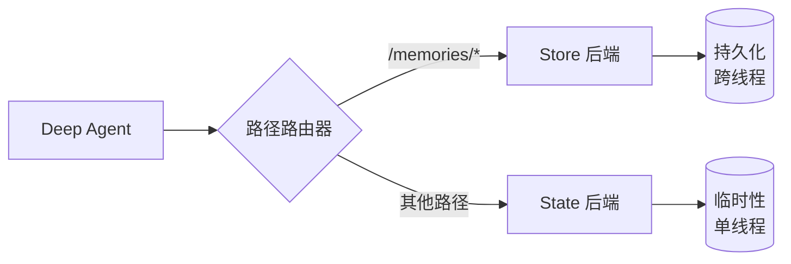

Deep Agent 自带本地文件系统用于卸载记忆。默认情况下，该文件系统存储在 Agent 状态中，且**仅在单个线程内有效**——对话结束后文件将丢失。

你可以通过使用 `CompositeBackend` 将特定路径路由到持久化存储，从而为 Deep Agent 扩展**长期记忆**能力。这种方式支持混合存储：部分文件跨线程持久保存，而其他文件则保持临时性。



## 设置

通过使用 `CompositeBackend` 将 `/memories/` 路径路由到 `StoreBackend` 来配置长期记忆：

:::python
```python
from deepagents import create_deep_agent
from deepagents.backends import CompositeBackend, StateBackend, StoreBackend
from langgraph.store.memory import InMemoryStore
from langgraph.checkpoint.memory import MemorySaver

checkpointer = MemorySaver()

def make_backend(runtime):
    return CompositeBackend(
        default=StateBackend(runtime),  # 临时存储
        routes={
            "/memories/": StoreBackend(runtime)  # 持久存储
        }
    )

agent = create_deep_agent(
    store=InMemoryStore(),  # 适合本地开发；部署到 LangSmith 时可省略
    backend=make_backend,
    checkpointer=checkpointer
)
```
:::

:::js
```typescript
import { createDeepAgent } from "deepagents";
import { CompositeBackend, StateBackend, StoreBackend } from "deepagents";
import { InMemoryStore } from "@langchain/langgraph-checkpoint";

const agent = createDeepAgent({
  store: new InMemoryStore(),  // 适合本地开发；部署到 LangSmith 时可省略
  backend: (config) => new CompositeBackend(
    new StateBackend(config),  // 临时存储
    { "/memories/": new StoreBackend(config) }  // 持久存储
  ),
});
```
:::

## 工作原理

使用 `CompositeBackend` 时，Deep Agent 维护**两套独立的文件系统**：

### 1. 短期（临时）文件系统
- 存储在 Agent 状态中（通过 `StateBackend`）
- 仅在单个线程内持久化
- 线程结束后文件丢失
- 通过标准路径访问：`/notes.txt`、`/workspace/draft.md`

### 2. 长期（持久）文件系统
- 存储在 LangGraph Store 中（通过 `StoreBackend`）
- 跨所有线程和对话持久保存
- 在 Agent 重启后依然存在
- 通过 `/memories/` 前缀路径访问：`/memories/preferences.txt`

### 路径路由

`CompositeBackend` 根据路径前缀来路由文件操作：
- 路径以 `/memories/` 开头的文件存储在 Store 中（持久化）
- 不含此前缀的文件保留在临时状态中
- 所有文件系统工具（`ls`、`read_file`、`write_file`、`edit_file`）均可用于这两种存储

<Note>
    `CompositeBackend` 在存储前会剥离路由前缀。例如，`/memories/preferences.txt` 在 `StoreBackend` 中存储为 `/preferences.txt`。Agent 始终使用完整路径。详情参见 [CompositeBackend](/oss/deepagents/backends#compositebackend-router)。
</Note>

:::python
```python
# 临时文件（线程结束后丢失）
agent.invoke({
    "messages": [{"role": "user", "content": "Write draft to /draft.txt"}]
})

# 持久文件（跨线程保留）
agent.invoke({
    "messages": [{"role": "user", "content": "Save final report to /memories/report.txt"}]
})
```
:::

:::js
```typescript
// 临时文件（线程结束后丢失）
await agent.invoke({
  messages: [{ role: "user", content: "Write draft to /draft.txt" }],
});

// 持久文件（跨线程保留）
await agent.invoke({
  messages: [{ role: "user", content: "Save final report to /memories/report.txt" }],
});
```
:::

## 跨线程持久化

`/memories/` 中的文件可以从任何线程访问：

:::python
```python
import uuid

# 线程 1：写入长期记忆
config1 = {"configurable": {"thread_id": str(uuid.uuid4())}}
agent.invoke({
    "messages": [{"role": "user", "content": "Save my preferences to /memories/preferences.txt"}]
}, config=config1)

# 线程 2：从长期记忆读取（不同的对话！）
config2 = {"configurable": {"thread_id": str(uuid.uuid4())}}
agent.invoke({
    "messages": [{"role": "user", "content": "What are my preferences?"}]
}, config=config2)
# Agent 可以读取第一个线程中写入的 /memories/preferences.txt
```
:::

:::js
```typescript
import { v4 as uuidv4 } from "uuid";

// 线程 1：写入长期记忆
const config1 = { configurable: { thread_id: uuidv4() } };
await agent.invoke({
  messages: [{ role: "user", content: "Save my preferences to /memories/preferences.txt" }],
}, config1);

// 线程 2：从长期记忆读取（不同的对话！）
const config2 = { configurable: { thread_id: uuidv4() } };
await agent.invoke({
  messages: [{ role: "user", content: "What are my preferences?" }],
}, config2);
// Agent 可以读取第一个线程中写入的 /memories/preferences.txt
```
:::

## 从外部代码访问记忆（LangSmith）

如果将 Agent 部署到 LangSmith，你可以使用 [Store API](/langsmith/agent-server-api/store) 从服务端代码（Agent 外部）读写记忆。`StoreBackend` 使用命名空间 `(assistant_id, "filesystem")` 来存储文件。

:::python
```python
from langgraph_sdk import get_client

client = get_client(url="<DEPLOYMENT_URL>")

# 读取记忆文件（路径不含 /memories/ 前缀）
item = await client.store.get_item(
    (assistant_id, "filesystem"),
    "/preferences.txt"
)

# 写入记忆文件
await client.store.put_item(
    (assistant_id, "filesystem"),
    "/preferences.txt",
    {
        "content": ["line 1", "line 2"],
        "created_at": "2024-01-15T10:30:00Z",
        "modified_at": "2024-01-15T10:30:00Z"
    }
)

# 搜索项目
items = await client.store.search_items(
    (assistant_id, "filesystem")
)
```
:::

:::js
```typescript
import { Client } from "@langchain/langgraph-sdk";

const client = new Client({ apiUrl: "<DEPLOYMENT_URL>" });

// 读取记忆文件（路径不含 /memories/ 前缀）
const item = await client.store.getItem(
  [assistantId, "filesystem"],
  "/preferences.txt"
);

// 写入记忆文件
await client.store.putItem(
  [assistantId, "filesystem"],
  "/preferences.txt",
  {
    content: ["line 1", "line 2"],
    created_at: "2024-01-15T10:30:00Z",
    modified_at: "2024-01-15T10:30:00Z"
  }
);

// 搜索项目
const items = await client.store.searchItems([assistantId, "filesystem"]);
```
:::

<Note>
    键名不包含 `/memories/` 前缀，因为 `CompositeBackend` 在存储前会将其剥离。详情参见[路径路由](#路径路由)。
</Note>

更多信息请参阅 [Store API 参考](/langsmith/agent-server-api/store)。

## 使用场景

### 用户偏好

存储跨会话持久化的用户偏好：

:::python
```python
agent = create_deep_agent(
    store=InMemoryStore(),
    backend=lambda rt: CompositeBackend(
        default=StateBackend(rt),
        routes={"/memories/": StoreBackend(rt)}
    ),
    system_prompt="""When users tell you their preferences, save them to
    /memories/user_preferences.txt so you remember them in future conversations."""
)
```
:::

:::js
```typescript
const agent = createDeepAgent({
  store: new InMemoryStore(),
  backend: (config) => new CompositeBackend(
    new StateBackend(config),
    { "/memories/": new StoreBackend(config) }
  ),
  systemPrompt: `When users tell you their preferences, save them to /memories/user_preferences.txt so you remember them in future conversations.`,
});
```
:::

### 自我改进指令

Agent 可以根据反馈更新自身的指令：

:::python
```python
agent = create_deep_agent(
    store=InMemoryStore(),
    backend=lambda rt: CompositeBackend(
        default=StateBackend(rt),
        routes={"/memories/": StoreBackend(rt)}
    ),
    system_prompt="""You have a file at /memories/instructions.txt with additional
    instructions and preferences.

    Read this file at the start of conversations to understand user preferences.

    When users provide feedback like "please always do X" or "I prefer Y",
    update /memories/instructions.txt using the edit_file tool."""
)
```
:::

:::js
```typescript
const agent = createDeepAgent({
  store: new InMemoryStore(),
  backend: (config) => new CompositeBackend(
    new StateBackend(config),
    { "/memories/": new StoreBackend(config) }
  ),
  systemPrompt: `You have a file at /memories/instructions.txt with additional instructions and preferences.

  Read this file at the start of conversations to understand user preferences.

  When users provide feedback like "please always do X" or "I prefer Y", update /memories/instructions.txt using the edit_file tool.`,
});
```
:::

随着时间推移，指令文件会积累用户偏好，帮助 Agent 持续改进。

### 知识库

在多次对话中逐步构建知识库：

:::python
```python
# 对话 1：了解一个项目
agent.invoke({
    "messages": [{"role": "user", "content": "We're building a web app with React. Save project notes."}]
})

# 对话 2：使用该知识
agent.invoke({
    "messages": [{"role": "user", "content": "What framework are we using?"}]
})
# Agent 从上一次对话中读取 /memories/project_notes.txt
```
:::

:::js
```typescript
// 对话 1：了解一个项目
await agent.invoke({
  messages: [{ role: "user", content: "We're building a web app with React. Save project notes." }],
});

// 对话 2：使用该知识
await agent.invoke({
  messages: [{ role: "user", content: "What framework are we using?" }],
});
// Agent 从上一次对话中读取 /memories/project_notes.txt
```
:::

### 研究项目

跨会话维护研究状态：

:::python
```python
research_agent = create_deep_agent(
    store=InMemoryStore(),
    backend=lambda rt: CompositeBackend(
        default=StateBackend(rt),
        routes={"/memories/": StoreBackend(rt)}
    ),
    system_prompt="""You are a research assistant.

    Save your research progress to /memories/research/:
    - /memories/research/sources.txt - List of sources found
    - /memories/research/notes.txt - Key findings and notes
    - /memories/research/report.md - Final report draft

    This allows research to continue across multiple sessions."""
)
```
:::

:::js
```typescript
const researchAgent = createDeepAgent({
  store: new InMemoryStore(),
  backend: (config) => new CompositeBackend(
    new StateBackend(config),
    { "/memories/": new StoreBackend(config) }
  ),
  systemPrompt: `You are a research assistant.

  Save your research progress to /memories/research/:
  - /memories/research/sources.txt - List of sources found
  - /memories/research/notes.txt - Key findings and notes
  - /memories/research/report.md - Final report draft

  This allows research to continue across multiple sessions.`,
});
```
:::

## Store 实现

任何 LangGraph `BaseStore` 实现均可使用：

### InMemoryStore（开发环境）

适合测试和开发，但重启后数据丢失：

:::python
```python
from langgraph.store.memory import InMemoryStore

store = InMemoryStore()
agent = create_deep_agent(
    store=store,
    backend=lambda rt: CompositeBackend(
        default=StateBackend(rt),
        routes={"/memories/": StoreBackend(rt)}
    )
)
```
:::

:::js
```typescript
import { InMemoryStore } from "@langchain/langgraph-checkpoint";
import { createDeepAgent, CompositeBackend, StateBackend, StoreBackend } from "deepagents";

const store = new InMemoryStore();
const agent = createDeepAgent({
  store,
  backend: (config) => new CompositeBackend(
    new StateBackend(config),
    { "/memories/": new StoreBackend(config) }
  ),
});
```
:::

### PostgresStore（生产环境）

生产环境建议使用持久化存储：

:::python
```python
from langgraph.store.postgres import PostgresStore
import os

# 使用 PostgresStore.from_conn_string 作为上下文管理器
store_ctx = PostgresStore.from_conn_string(os.environ["DATABASE_URL"])
store = store_ctx.__enter__()
store.setup()

agent = create_deep_agent(
    store=store,
    backend=lambda rt: CompositeBackend(
        default=StateBackend(rt),
        routes={"/memories/": StoreBackend(rt)}
    )
)
```
:::

:::js
```typescript
import { PostgresStore } from "@langchain/langgraph-checkpoint-postgres";
import { createDeepAgent, CompositeBackend, StateBackend, StoreBackend } from "deepagents";

const store = new PostgresStore({
  connectionString: process.env.DATABASE_URL,
});
const agent = createDeepAgent({
  store,
  backend: (config) => new CompositeBackend(
    new StateBackend(config),
    { "/memories/": new StoreBackend(config) }
  ),
});
```
:::

## FileData 数据结构

通过 `StoreBackend` 存储的文件使用以下数据结构：

```python
{
    "content": ["line 1", "line 2", "line 3"],  # 字符串列表（每行一个元素）
    "created_at": "2024-01-15T10:30:00Z",       # ISO 8601 时间戳
    "modified_at": "2024-01-15T11:45:00Z"       # ISO 8601 时间戳
}
```

你可以使用 `create_file_data` 辅助函数来创建格式正确的文件数据：

:::python
```python
from deepagents.backends.utils import create_file_data

file_data = create_file_data("Hello\nWorld")
# {'content': ['Hello', 'World'], 'created_at': '...', 'modified_at': '...'}
```
:::

:::js
```typescript
import { createFileData } from "deepagents";

const fileData = createFileData("Hello\nWorld");
// { content: ['Hello', 'World'], created_at: '...', modified_at: '...' }
```
:::

关于后端协议的更多细节，请参见[后端](/oss/deepagents/backends#protocol-reference)。

## 最佳实践

### 使用描述性路径

用清晰的路径组织持久化文件：

```
/memories/user_preferences.txt
/memories/research/topic_a/sources.txt
/memories/research/topic_a/notes.txt
/memories/project/requirements.md
```

### 在系统提示词中说明记忆结构

在系统提示词中告知 Agent 各路径存储了什么内容：

```
你的持久化记忆结构：
- /memories/preferences.txt：用户偏好和设置
- /memories/context/：关于用户的长期上下文
- /memories/knowledge/：随时间积累的事实和信息
```

### 定期清理旧数据

实施定期清理过时的持久化文件，以保持存储规模可控。

### 选择合适的存储方案

- **开发环境**：使用 `InMemoryStore` 快速迭代
- **生产环境**：使用 `PostgresStore` 或其他持久化存储
- **多租户场景**：考虑在 Store 中使用基于 `assistant_id` 的命名空间隔离
