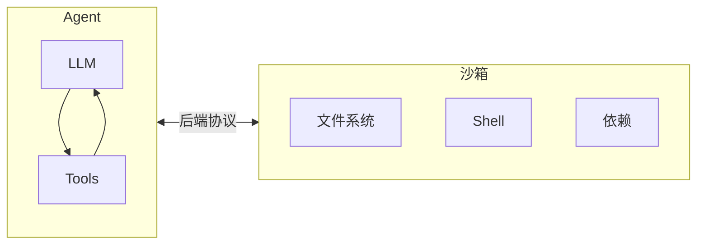
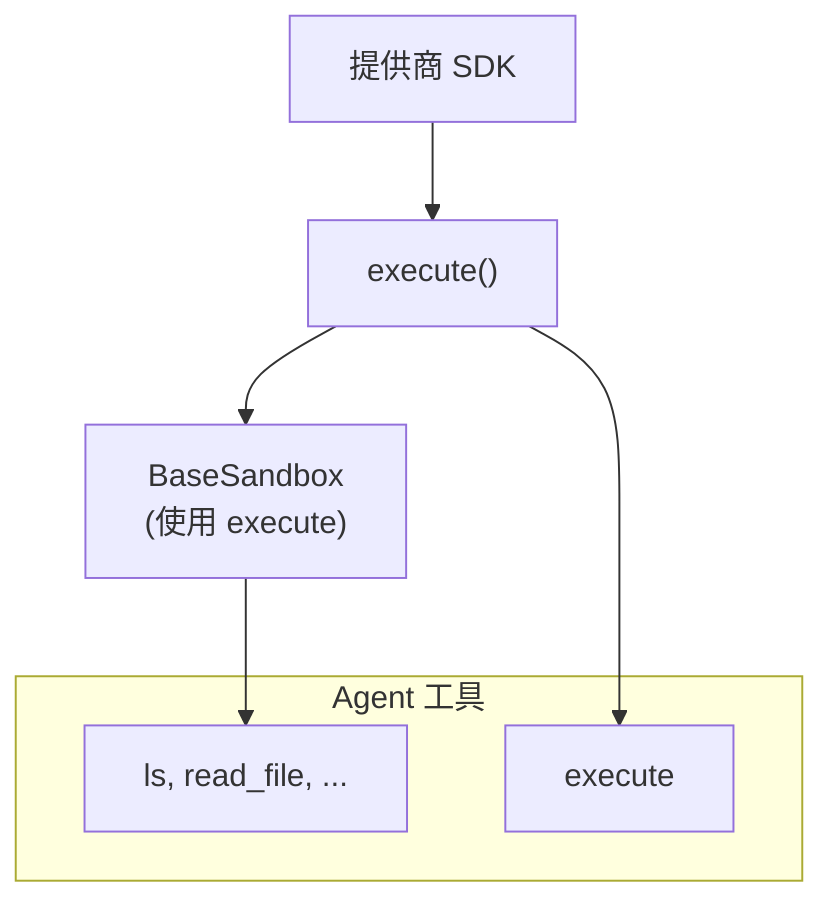
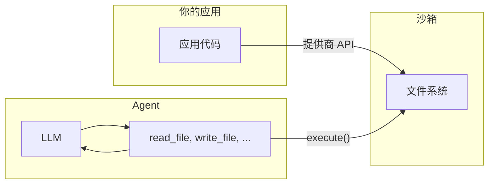

import SandboxBasicPy from '/snippets/deepagents-sandbox-basic-py.mdx';
import SandboxBasicJs from '/snippets/deepagents-sandbox-basic-js.mdx';

Agent 会生成代码、与文件系统交互并运行 shell 命令。由于我们无法预测 Agent 可能做什么，因此必须确保其运行环境是隔离的，以防它访问凭证、文件或网络。沙箱通过在 Agent 的执行环境和宿主系统之间创建边界来提供这种隔离。

在 Deep Agent 中，**沙箱是[后端](/oss/deepagents/backends)**，定义了 Agent 运行的环境。与其他后端（State、Filesystem、Store）只暴露文件操作不同，沙箱后端还为 Agent 提供 `execute` 工具来运行 shell 命令。配置沙箱后端后，Agent 将获得：

- 所有标准文件系统工具（`ls`、`read_file`、`write_file`、`edit_file`、`glob`、`grep`）
- 用于在沙箱中运行任意 shell 命令的 `execute` 工具
- 保护宿主系统的安全边界



## 为什么使用沙箱？

沙箱用于安全保障。
它们让 Agent 能够执行任意代码、访问文件和使用网络，而不会危及你的凭证、本地文件或宿主系统。
当 Agent 自主运行时，这种隔离至关重要。

沙箱特别适用于：

- 编码 Agent：自主运行的 Agent 可以使用 shell、git、克隆仓库（许多提供商提供原生 git API，如 [Daytona 的 git 操作](https://www.daytona.io/docs/en/git-operations/)），并运行 Docker-in-Docker 来执行构建和测试流水线
- 数据分析 Agent：在安全、隔离的环境中加载文件、安装数据分析库（pandas、numpy 等）、运行统计计算，以及创建 PowerPoint 演示文稿等输出

## 集成模式

根据 Agent 运行的位置，有两种将 Agent 与沙箱集成的架构模式。

### Agent 在沙箱中运行模式

Agent 在沙箱内运行，你通过网络与其通信。你构建一个预装了 Agent 框架的 Docker 或 VM 镜像，在沙箱内运行它，然后从外部连接发送消息。

优势：

- ✅ 与本地开发高度一致。
- ✅ Agent 与环境紧密耦合。

权衡：

- 🔴 API 密钥必须存在于沙箱内（安全风险）。
- 🔴 更新需要重新构建镜像。
- 🔴 需要通信基础设施（WebSocket 或 HTTP 层）。

要在沙箱中运行 Agent，需要构建镜像并安装 deepagents。

```dockerfile
FROM python:3.11
RUN pip install deepagents-cli
```

然后在沙箱内运行 Agent。
要在沙箱内使用 Agent，你需要添加额外的基础设施来处理应用程序与沙箱内 Agent 之间的通信。

### 沙箱作为工具模式

Agent 在你的机器或服务器上运行。当需要执行代码时，它调用沙箱工具（如 `execute`、`read_file` 或 `write_file`），这些工具通过调用提供商的 API 在远程沙箱中执行操作。

优势：

- ✅ 即时更新 Agent 代码，无需重建镜像。
- ✅ Agent 状态和执行环境更清晰地分离。
    - API 密钥保留在沙箱之外。
    - 沙箱故障不会丢失 Agent 状态。
    - 可选择在多个沙箱中并行运行任务。
- ✅ 仅为执行时间付费。

权衡：

- 🔴 每次执行调用都有网络延迟。

示例：

:::python

```python
from dotenv import load_dotenv
from daytona import Daytona

from langchain_daytona import DaytonaSandbox
from deepagents import create_deep_agent


load_dotenv()

# 也可以使用 E2B、Runloop、Modal
sandbox = Daytona().create()
backend = DaytonaSandbox(sandbox=sandbox)

agent = create_deep_agent(
    backend=backend,
    system_prompt="You are a coding assistant with sandbox access. You can create and run code in the sandbox.",
)

try:
    result = agent.invoke(
        {
            "messages": [
                {
                    "role": "user",
                    "content": "Create a hello world Python script and run it",
                }
            ]
        }
    )
    print(result["messages"][-1].content)
except Exception:
    # 可选：异常时主动删除沙箱
    sandbox.stop()
    raise
```

:::

:::js

```typescript
import "dotenv/config";
import { DaytonaSandbox } from "@langchain/daytona";
import { createDeepAgent } from "deepagents";

// 也可以使用 E2B、Runloop、Modal
const sandbox = await DaytonaSandbox.create();

const agent = createDeepAgent({
  backend: sandbox,
  systemPrompt:
    "You are a coding assistant with sandbox access. You can create and run code in the sandbox.",
});

try {
  const result = await agent.invoke({
    messages: [
      {
        role: "user",
        content: "Create a hello world Python script and run it",
      },
    ],
  });
  const lastMessage = result.messages[result.messages.length - 1];
  console.log(
    typeof lastMessage.content === "string"
      ? lastMessage.content
      : String(lastMessage.content),
  );
} finally {
  // 可选：Agent 完成时主动删除沙箱
  await sandbox.close();
  throw err;
}
```

:::

本文档中的示例使用沙箱作为工具模式。
当提供商的 SDK 处理通信层且你希望生产环境与本地开发一致时，选择 Agent 在沙箱中运行模式。
当你需要快速迭代 Agent 逻辑、将 API 密钥保留在沙箱外部，或偏好更清晰的关注点分离时，选择沙箱作为工具模式。

## 可用的提供商

关于特定提供商的设置、身份验证和生命周期详情，请参见提供商集成页面：

:::js

<CardGroup cols={2}>
    <Card title="Modal" icon="/images/providers/modal-icon.svg" href="/oss/integrations/providers/modal">
        ML/AI 工作负载，GPU 访问，Python。
    </Card>
    <Card title="Daytona" icon="/images/providers/daytona-icon.svg" href="/oss/integrations/providers/daytona">
        TypeScript/Python 开发，快速冷启动。
    </Card>
    <Card title="Deno" icon="/images/providers/deno-icon.svg" href="/oss/integrations/providers/deno">
        Deno/JavaScript 工作负载，微虚拟机。
    </Card>
    <Card title="Node VFS" icon="/images/providers/nodejs-icon.svg" href="/oss/integrations/providers/node-vfs">
        本地开发，测试，无需云服务。
    </Card>
</CardGroup>
:::

:::python
<CardGroup cols={2}>
    <Card title="Modal" icon="/images/providers/modal-icon.svg" href="/oss/integrations/providers/modal">
        ML/AI 工作负载，GPU 访问。
    </Card>
    <Card title="Daytona" icon="/images/providers/daytona-icon.svg" href="/oss/integrations/providers/daytona">
        TypeScript/Python 开发，快速冷启动。
    </Card>
    <Card title="Runloop" href="/oss/integrations/providers/runloop">
        一次性开发盒，用于隔离的代码执行。
    </Card>
</CardGroup>
:::

如果你是沙箱平台提供商并希望贡献集成，请参见[贡献沙箱集成](/oss/contributing/integrations-langchain)。

:::js

## 基本用法

<SandboxBasicJs />

:::

:::python
## 基本用法

以下示例假设你已经使用提供商的 SDK 创建了沙箱/开发盒，并已设置好凭证。关于注册、身份验证和特定提供商的生命周期详情，请参见[可用的提供商](#可用的提供商)。

<SandboxBasicPy />

:::

## 沙箱工作原理

### 隔离边界

所有沙箱提供商都保护你的宿主系统不受 Agent 文件系统和 shell 操作的影响。Agent 无法读取你的本地文件、访问你机器上的环境变量，也无法干扰其他进程。但是，沙箱本身**不能**防御：

- **上下文注入** — 控制 Agent 部分输入的攻击者可以指示它在沙箱内运行任意命令。沙箱是隔离的，但 Agent 在其内部拥有完全控制权。
- **网络数据窃取** — 除非阻止网络访问，否则被注入上下文的 Agent 可以通过 HTTP 或 DNS 将数据发送出沙箱。部分提供商支持阻止网络访问（例如 Modal 的 `blockNetwork: true`）。

关于如何处理密钥和缓解这些风险，请参见[安全注意事项](#安全注意事项)。

### `execute` 方法

沙箱后端采用简洁的架构：提供商唯一需要实现的方法是 `execute()`，它运行一条 shell 命令并返回其输出。所有其他文件系统操作——`read`、`write`、`edit`、`ls`、`glob`、`grep`——都由 `BaseSandbox` 基类在 `execute()` 之上构建，基类构造脚本并通过 `execute()` 在沙箱内运行它们。



这种设计意味着：
- **添加新提供商很简单。** 实现 `execute()` —— 基类处理其他一切。
- **`execute` 工具按条件可用。** 在每次模型调用时，Harness 会检查后端是否实现了 `SandboxBackendProtocol`。如果没有，该工具会被过滤掉，Agent 永远看不到它。

当 Agent 调用 `execute` 工具时，它提供一个 `command` 字符串，并获取合并后的 stdout/stderr、退出码，以及当输出过大时的截断通知。

你也可以在应用代码中直接调用后端的 `execute()` 方法。

:::python
<Tabs>
  <Tab title="Modal">

```python
import modal

from langchain_modal import ModalSandbox

app = modal.App.lookup("your-app")
modal_sandbox = modal.Sandbox.create(app=app)
backend = ModalSandbox(sandbox=modal_sandbox)

result = backend.execute("python --version")
print(result.output)
```

  </Tab>
  <Tab title="Runloop">

<CodeGroup>
```bash pip
pip install langchain-runloop
```

```bash uv
uv add langchain-runloop
```
</CodeGroup>

```python
from runloop_api_client import RunloopSDK

from langchain_runloop import RunloopSandbox

api_key = "..."
client = RunloopSDK(bearer_token=api_key)

devbox = client.devbox.create()
backend = RunloopSandbox(devbox=devbox)

try:
    result = backend.execute("python --version")
    print(result.output)
finally:
    devbox.shutdown()
```

  </Tab>
  <Tab title="Daytona">

<CodeGroup>
```bash pip
pip install langchain-daytona
```

```bash uv
uv add langchain-daytona
```
</CodeGroup>

```python
from daytona import Daytona

from langchain_daytona import DaytonaSandbox

sandbox = Daytona().create()
backend = DaytonaSandbox(sandbox=sandbox)

result = backend.execute("python --version")
print(result.output)
```

  </Tab>
</Tabs>
:::

例如：

```
4
[Command succeeded with exit code 0]
```

```
bash: foobar: command not found
[Command failed with exit code 127]
```

如果命令产生了非常大的输出，结果会自动保存到文件中，并指示 Agent 使用 `read_file` 来分段访问。这可以防止上下文窗口溢出。

### 两种文件访问方式

文件在沙箱中有两种不同的进出方式，理解何时使用哪种非常重要：

**Agent 文件系统工具** — `read_file`、`write_file`、`edit_file`、`ls`、`glob`、`grep` 和 `execute` 是 LLM 在执行过程中调用的工具。这些工具通过沙箱内的 `execute()` 执行。Agent 使用它们来读取代码、写入文件以及运行命令作为其任务的一部分。

**文件传输 API** — `uploadFiles()` 和 `downloadFiles()` 方法由你的应用代码调用。它们使用提供商的原生文件传输 API（而非 shell 命令），专为在宿主环境和沙箱之间传输文件而设计。用途包括：
- 在 Agent 运行前用源代码、配置或数据**预填充沙箱**
- Agent 完成后**获取产物**（生成的代码、构建输出、报告）
- **预装依赖项**供 Agent 使用



:::js
## 文件操作

### 预填充沙箱

使用 `uploadFiles()` 在 Agent 运行前填充沙箱。文件内容以 `Uint8Array` 形式提供：

```typescript
const encoder = new TextEncoder();
const responses = await sandbox.uploadFiles([
  ["src/index.js", encoder.encode("console.log('Hello')")],
  ["package.json", encoder.encode('{"name": "my-app"}')],
]);

// 每个响应表示成功或失败
for (const res of responses) {
  if (res.error) {
    console.error(`Failed to upload ${res.path}: ${res.error}`);
  }
}
```

### 获取产物

使用 `downloadFiles()` 在 Agent 完成后从沙箱获取文件：

```typescript
const results = await sandbox.downloadFiles(["src/index.js", "output.txt"]);

const decoder = new TextDecoder();
for (const result of results) {
  if (result.content) {
    console.log(`${result.path}: ${decoder.decode(result.content)}`);
  } else {
    console.error(`Failed to download ${result.path}: ${result.error}`);
  }
}
```

<Note>
在沙箱内部，Agent 使用自己的文件系统工具（`read_file`、`write_file`）— 而非 `uploadFiles` 或 `downloadFiles`。这些方法是供你的应用代码在宿主和沙箱之间传输文件使用的。
</Note>
:::

:::python
## 文件操作

deepagents 沙箱后端支持文件传输 API，用于在应用和沙箱之间传输文件。

### 预填充沙箱

使用 `upload_files()` 在 Agent 运行前填充沙箱。路径必须是绝对路径，内容为 `bytes`：

<Tabs>
  <Tab title="Modal">

```python
import modal

from langchain_modal import ModalSandbox

app = modal.App.lookup("your-app")
modal_sandbox = modal.Sandbox.create(app=app)
backend = ModalSandbox(sandbox=modal_sandbox)

backend.upload_files(
    [
        ("/src/index.py", b"print('Hello')\n"),
        ("/pyproject.toml", b"[project]\nname = 'my-app'\n"),
    ]
)
```

  </Tab>
  <Tab title="Runloop">

<CodeGroup>
```bash pip
pip install langchain-runloop
```

```bash uv
uv add langchain-runloop
```
</CodeGroup>

```python
from runloop_api_client import RunloopSDK

from langchain_runloop import RunloopSandbox

api_key = "..."
client = RunloopSDK(bearer_token=api_key)

devbox = client.devbox.create()
backend = RunloopSandbox(devbox=devbox)

backend.upload_files(
    [
        ("/src/index.py", b"print('Hello')\n"),
        ("/pyproject.toml", b"[project]\nname = 'my-app'\n"),
    ]
)
```

  </Tab>
  <Tab title="Daytona">

<CodeGroup>
```bash pip
pip install langchain-daytona
```

```bash uv
uv add langchain-daytona
```
</CodeGroup>

```python
from daytona import Daytona

from langchain_daytona import DaytonaSandbox

sandbox = Daytona().create()
backend = DaytonaSandbox(sandbox=sandbox)

backend.upload_files(
    [
        ("/src/index.py", b"print('Hello')\n"),
        ("/pyproject.toml", b"[project]\nname = 'my-app'\n"),
    ]
)
```

  </Tab>
</Tabs>

### 获取产物

使用 `download_files()` 在 Agent 完成后从沙箱获取文件：

<Tabs>
  <Tab title="Modal">

```python
import modal

from langchain_modal import ModalSandbox

app = modal.App.lookup("your-app")
modal_sandbox = modal.Sandbox.create(app=app)
backend = ModalSandbox(sandbox=modal_sandbox)

results = backend.download_files(["/src/index.py", "/output.txt"])
for result in results:
    if result.content is not None:
        print(f"{result.path}: {result.content.decode()}")
    else:
        print(f"Failed to download {result.path}: {result.error}")
```

  </Tab>
  <Tab title="Runloop">

<CodeGroup>
```bash pip
pip install langchain-runloop
```

```bash uv
uv add langchain-runloop
```
</CodeGroup>

```python
from runloop_api_client import RunloopSDK

from langchain_runloop import RunloopSandbox

api_key = "..."
client = RunloopSDK(bearer_token=api_key)

devbox = client.devbox.create()
backend = RunloopSandbox(devbox=devbox)

results = backend.download_files(["/src/index.py", "/output.txt"])
for result in results:
    if result.content is not None:
        print(f"{result.path}: {result.content.decode()}")
    else:
        print(f"Failed to download {result.path}: {result.error}")
```

  </Tab>
  <Tab title="Daytona">

<CodeGroup>
```bash pip
pip install langchain-daytona
```

```bash uv
uv add langchain-daytona
```
</CodeGroup>

```python
from daytona import Daytona

from langchain_daytona import DaytonaSandbox

sandbox = Daytona().create()
backend = DaytonaSandbox(sandbox=sandbox)

results = backend.download_files(["/src/index.py", "/output.txt"])
for result in results:
    if result.content is not None:
        print(f"{result.path}: {result.content.decode()}")
    else:
        print(f"Failed to download {result.path}: {result.error}")
```

  </Tab>
</Tabs>

<Note>
在沙箱内部，Agent 使用文件系统工具（`read_file`、`write_file`）。`upload_files` 和 `download_files` 方法是供你的应用代码在宿主和沙箱之间传输文件使用的。
</Note>
:::

## 生命周期与清理

沙箱在关闭之前会持续消耗资源和费用。
为避免为不再需要的资源付费，请在应用不再需要时及时关闭沙箱。

<Tip>
**聊天应用的 TTL。** 当用户可能在空闲后重新参与时，你通常不知道他们是否或何时会返回。在沙箱上配置存活时间（TTL）——例如归档 TTL 或删除 TTL——这样提供商会自动清理空闲的沙箱。许多沙箱提供商支持此功能。
</Tip>

### 基本生命周期

:::js

```typescript
// 创建并初始化
const sandbox = await ModalSandbox.create(options);

// 使用沙箱（直接使用或通过 Agent）
const result = await sandbox.execute("echo hello");

// 完成后清理
await sandbox.close();
```
:::

:::python

<Tabs>
  <Tab title="Modal">

```python
import modal

from langchain_modal import ModalSandbox

app = modal.App.lookup("your-app")
modal_sandbox = modal.Sandbox.create(app=app)
backend = ModalSandbox(sandbox=modal_sandbox)

result = backend.execute("echo hello")
# ... 使用沙箱
modal_sandbox.terminate()
```

  </Tab>
  <Tab title="Runloop">

```python
from runloop_api_client import RunloopSDK

from langchain_runloop import RunloopSandbox

client = RunloopSDK(bearer_token="...")
devbox = client.devbox.create()
backend = RunloopSandbox(devbox=devbox)

result = backend.execute("echo hello")
# ... 使用沙箱
devbox.shutdown()
```

  </Tab>
  <Tab title="Daytona">

```python
from daytona import Daytona

from langchain_daytona import DaytonaSandbox

sandbox = Daytona().create()
backend = DaytonaSandbox(sandbox=sandbox)

result = backend.execute("echo hello")
# ... 使用沙箱
sandbox.stop()
```

  </Tab>
</Tabs>
:::

### 按对话管理生命周期

在聊天应用中，一个对话通常由一个 `thread_id` 表示。
一般来说，每个 `thread_id` 应该使用其专属的沙箱。

将沙箱 ID 与 `thread_id` 的映射关系存储在你的应用中，或者如果沙箱提供商允许为沙箱附加元数据，则存储在沙箱中。

:::python

以下示例展示了使用 Daytona 的获取或创建模式。
对于其他提供商，请参考沙箱提供商 API 中等效的标签、元数据和 TTL 选项：

```python
import uuid

from daytona import CreateSandboxFromSnapshotParams, Daytona
from langchain_daytona import DaytonaSandbox

client = Daytona()
thread_id = str(uuid.uuid4())

from deepagents import create_deep_agent

# 按 thread_id 获取或创建沙箱
try:
    sandbox = client.find_one(labels={"thread_id": thread_id})
except Exception:
    params = CreateSandboxFromSnapshotParams(
        labels={"thread_id": thread_id},
        # 添加 TTL 以便在空闲时自动清理沙箱
        auto_delete_interval=3600,
    )
    sandbox = client.create(params)

backend = DaytonaSandbox(sandbox=sandbox)
agent = create_deep_agent(
    backend=backend,
    system_prompt="You are a coding assistant with sandbox access. You can create and run code in the sandbox.",
)

try:
    result = agent.invoke(
        {
            "messages": [
                {
                    "role": "user",
                    "content": "Create a hello world Python script and run it",
                }
            ]
        },
        config={
            "configurable": {
                "thread_id": thread_id,
            }
        },
    )
    print(result["messages"][-1].content)
except Exception:
    # 可选：异常时主动删除沙箱
    client.delete(sandbox)
    raise
```

:::

:::js

```typescript
import "dotenv/config";
import { randomUUID } from "node:crypto";
import { Daytona } from "@daytonaio/sdk";
import type { CreateSandboxFromSnapshotParams } from "@daytonaio/sdk";
import { DaytonaSandbox } from "@langchain/daytona";
import { createDeepAgent } from "deepagents";

const client = new Daytona();
const threadId = randomUUID();

// 按 thread_id 获取或创建沙箱
let sandbox;
try {
    sandbox = await client.findOne({ labels: { thread_id: threadId } });
} catch {
    const params: CreateSandboxFromSnapshotParams = {
        labels: { thread_id: threadId },
        // 添加 TTL 以便在空闲时自动清理沙箱（分钟）
        autoDeleteInterval: 3600,
    };
sandbox = await client.create(params);
}

const backend = await DaytonaSandbox.fromId(sandbox.id);
const agent = createDeepAgent({
    backend,
    systemPrompt:
        "You are a coding assistant with sandbox access. You can create and run code in the sandbox.",
});

try {
    const result = await agent.invoke(
        {
            messages: [
                {
                role: "user",
                content: "Create a hello world Python script and run it",
                },
            ],
        },
        {
            configurable: {
                thread_id: threadId,
            },
        },
    );
    const lastMessage = result.messages[result.messages.length - 1];
    console.log(
        typeof lastMessage.content === "string"
        ? lastMessage.content
        : String(lastMessage.content),
    );
} catch (err) {
    // 可选：异常时主动删除沙箱
    await client.delete(sandbox);
    throw err;
}
```

:::

## 安全注意事项

沙箱将代码执行与宿主系统隔离，但它们无法防御**上下文注入**。控制 Agent 部分输入的攻击者可以指示它在沙箱内读取文件、运行命令或窃取数据。这使得沙箱内的凭证尤其危险。

<Warning>
**切勿将密钥放入沙箱。** 通过环境变量、挂载文件或 `secrets` 选项注入沙箱的 API 密钥、令牌、数据库凭证等敏感信息，可以被上下文注入的 Agent 读取和窃取。即使是短期或范围有限的凭证也是如此——如果 Agent 能访问它们，攻击者也能。
</Warning>

### 安全处理密钥

如果你的 Agent 需要调用需认证的 API 或访问受保护的资源，你有两个选择：

1. **将密钥保留在沙箱外部的工具中。** 定义在宿主环境（而非沙箱内部）运行的工具，并在那里处理认证。Agent 通过名称调用这些工具，但永远看不到凭证。这是推荐的方式。

2. **使用注入凭证的网络代理。** 某些沙箱提供商支持代理，它们会拦截沙箱发出的 HTTP 请求，并在转发前附加凭证（如 `Authorization` 头）。Agent 永远看不到密钥——它只是向 URL 发送普通请求。这种方式目前尚未在各提供商间广泛可用。

<Warning>
如果你必须将密钥注入沙箱（不推荐），请采取以下预防措施：

- 为**所有**工具调用（而非仅敏感操作）启用[人工干预](/oss/deepagents/human-in-the-loop)审批
- 阻止或限制沙箱的网络访问以减少数据窃取途径
- 使用尽可能窄的凭证范围和尽可能短的有效期
- 监控沙箱网络流量中的异常出站请求

即使采取了这些防护措施，这仍然是一种不安全的变通方案。足够有创意的上下文注入攻击可以绕过输出过滤和人工干预审查。
</Warning>

### 通用最佳实践

- 在应用中使用沙箱输出前先进行审查
- 在不需要时阻止沙箱的网络访问
- 使用[中间件](/oss/langchain/middleware)过滤或脱敏工具输出中的敏感信息
- 将沙箱内产生的一切视为不受信任的输入
