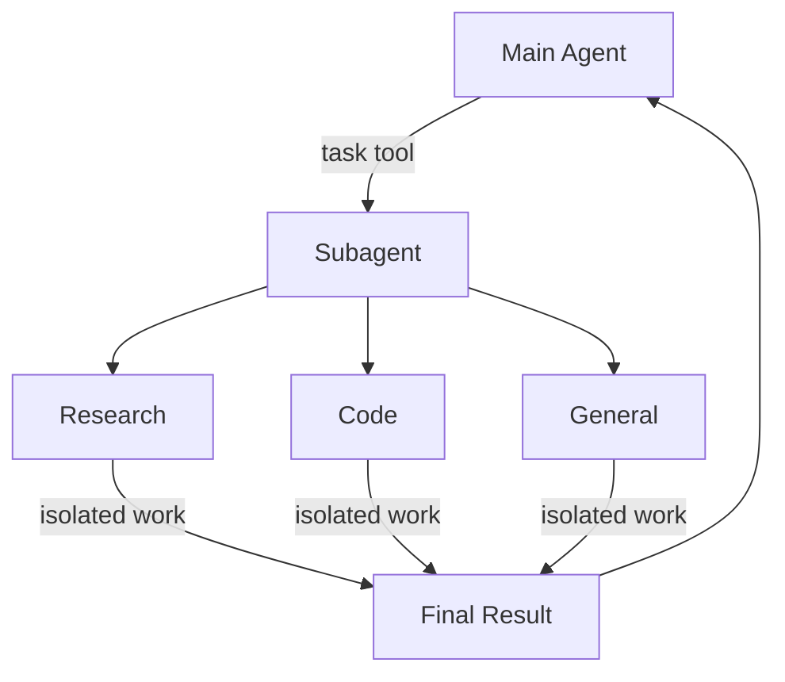

import SubagentBasic from '/snippets/subagent-basic.mdx';

Deep Agent 可以创建子 Agent 来委派工作。你可以在 `subagents` 参数中指定自定义子 Agent。子 Agent 适用于[上下文隔离](https://www.dbreunig.com/2025/06/26/how-to-fix-your-context.html#context-quarantine)（保持主 Agent 的上下文清洁）以及提供专门的指令。



## 为什么使用子 Agent？

子 Agent 解决了**上下文膨胀问题**。当 Agent 使用产生大量输出的工具（网络搜索、文件读取、数据库查询）时，上下文窗口会迅速被中间结果填满。子 Agent 隔离了这些详细工作——主 Agent 只接收最终结果，而不是产生该结果的数十次工具调用。

**何时使用子 Agent：**
- ✅ 会使主 Agent 上下文混乱的多步骤任务
- ✅ 需要自定义指令或工具的专业领域
- ✅ 需要不同模型能力的任务
- ✅ 当你希望主 Agent 专注于高层协调时

**何时不应使用子 Agent：**
- ❌ 简单的单步骤任务
- ❌ 需要维护中间上下文时
- ❌ 开销大于收益时

## 配置

`subagents` 应为字典或 `CompiledSubAgent` 对象的列表。有两种类型：

### SubAgent（基于字典）

对于大多数用例，将子 Agent 定义为包含以下字段的字典：

:::python

| Field | Type | Description |
|-------|------|-------------|
| `name` | `str` | Required. Unique identifier for the subagent. The main agent uses this name when calling the `task()` tool. The subagent name becomes metadata for `AIMessage`s and for streaming, which helps to differentiate between agents. |
| `description` | `str` | Required. Description of what this subagent does. Be specific and action-oriented. The main agent uses this to decide when to delegate. |
| `system_prompt` | `str` | Required. Instructions for the subagent. Custom subagents must define their own. Include tool usage guidance and output format requirements.<br></br>Does not inherit from main agent. |
| `tools` | `list[Callable]` | Required. Tools the subagent can use. Custom subagents specify their own. Keep this minimal and include only what's needed.<br></br>Does not inherit from main agent. |
| `model` | `str` \| `BaseChatModel` | Optional. Overrides the main agent's model. Omit to use the main agent's model.<br></br>Inherits from main agent by default. You can pass either a model identifier string like `'openai:gpt-5'` (using the `'provider:model'` format) or a LangChain chat model object (`init_chat_model("gpt-5")` or `ChatOpenAI(model="gpt-5")`). |
| `middleware` | `list[Middleware]` | Optional. Additional middleware for custom behavior, logging, or rate limiting.<br></br>Does not inherit from main agent. |
| `interrupt_on` | `dict[str, bool]` | Optional. Configure [human-in-the-loop](/oss/deepagents/human-in-the-loop) for specific tools. Subagent value overrides main agent. Requires checkpointer.<br></br>Inherits from main agent by default. Subagent value overrides the default. |
| `skills` | `list[str]` | Optional. [Skills](/oss/deepagents/skills) source paths. When specified, the subagent will load skills from these directories (e.g., `["/skills/research/", "/skills/web-search/"]`). This allows subagents to have different skill sets than the main agent.<br></br>Does not inherit from main agent. Only the general-purpose subagent inherits the main agent's skills. When a subagent has skills, it runs its own independent `SkillsMiddleware` instance. Skill state is fully isolated — a subagent's loaded skills are not visible to the parent, and vice versa. |

:::

:::js

| Field | Type | Description |
|-------|------|-------------|
| `name` | `str` | Required. Unique identifier for the subagent. The main agent uses this name when calling the `task()` tool. The subagent name becomes metadata for `AIMessage`s and for streaming, which helps to differentiate between agents. |
| `description` | `str` | Required. Description of what this subagent does. Be specific and action-oriented. The main agent uses this to decide when to delegate. |
| `system_prompt` | `str` | Required. Instructions for the subagent. Custom subagents must define their own. Include tool usage guidance and output format requirements.<br></br>Does not inherit from main agent. |
| `tools` | `list[Callable]` | Required. Tools the subagent can use. Custom subagents specify their own. Keep this minimal and include only what's needed.<br></br>Does not inherit from main agent. |
| `model` | `str` \| `BaseChatModel` | Optional. Overrides the main agent's model. Omit to use the main agent's model.<br></br>Inherits from main agent by default. You can pass either a model identifier string like `'openai:gpt-5'` (using the `'provider:model'` format) or a LangChain chat model object (`await initChatModel("gpt-5")` or `new ChatOpenAI({ model: "gpt-5" })`). |
| `middleware` | `list[Middleware]` | Optional. Additional middleware for custom behavior, logging, or rate limiting.<br></br>Does not inherit from main agent. |
| `interrupt_on` | `dict[str, bool]` | Optional. Configure [human-in-the-loop](/oss/deepagents/human-in-the-loop) for specific tools. Subagent value overrides main agent. Requires checkpointer.<br></br>Inherits from main agent by default. Subagent value overrides the default. |
| `skills` | `list[str]` | Optional. [Skills](/oss/deepagents/skills) source paths. When specified, the subagent will load skills from these directories (e.g., `["/skills/research/", "/skills/web-search/"]`). This allows subagents to have different skill sets than the main agent.<br></br>Does not inherit from main agent. Only the general-purpose subagent inherits the main agent's skills. When a subagent has skills, it runs its own independent `SkillsMiddleware` instance. Skill state is fully isolated — a subagent's loaded skills are not visible to the parent, and vice versa. |

:::


### CompiledSubAgent

对于复杂的工作流，使用预构建的 LangGraph 图：

| Field | Type | Description |
|-------|------|-------------|
| `name` | `str` | Required. Unique identifier for the subagent. The subagent name becomes metadata for `AIMessage`s and for streaming, which helps to differentiate between agents. |
| `description` | `str` | Required. What this subagent does. |
| `runnable` | `Runnable` | Required. A compiled LangGraph graph (must call `.compile()` first). |

## 使用 SubAgent

<SubagentBasic />

## 使用 CompiledSubAgent

对于更复杂的用例，你可以提供自定义子 Agent。
你可以使用 LangChain 的 `create_agent` 创建自定义子 Agent，或使用 [graph API](/oss/langgraph/graph-api) 构建自定义 LangGraph 图。

如果你正在创建自定义 LangGraph 图，确保图具有[名为 `"messages"` 的状态键](/oss/langgraph/quickstart#2-define-state)：

:::python
```python
from deepagents import create_deep_agent, CompiledSubAgent
from langchain.agents import create_agent

# Create a custom agent graph
custom_graph = create_agent(
    model=your_model,
    tools=specialized_tools,
    prompt="You are a specialized agent for data analysis..."
)

# Use it as a custom subagent
custom_subagent = CompiledSubAgent(
    name="data-analyzer",
    description="Specialized agent for complex data analysis tasks",
    runnable=custom_graph
)

subagents = [custom_subagent]

agent = create_deep_agent(
    model="claude-sonnet-4-6",
    tools=[internet_search],
    system_prompt=research_instructions,
    subagents=subagents
)
```
:::

:::js
```typescript
import { createDeepAgent, CompiledSubAgent } from "deepagents";
import { createAgent } from "langchain";

// Create a custom agent graph
const customGraph = createAgent({
  model: yourModel,
  tools: specializedTools,
  prompt: "You are a specialized agent for data analysis...",
});

// Use it as a custom subagent
const customSubagent: CompiledSubAgent = {
  name: "data-analyzer",
  description: "Specialized agent for complex data analysis tasks",
  runnable: customGraph,
};

const subagents = [customSubagent];

const agent = createDeepAgent({
  model: "claude-sonnet-4-6",
  tools: [internetSearch],
  systemPrompt: researchInstructions,
  subagents: subagents,
});
```
:::

## 流式输出

流式输出追踪信息时，Agent 名称可通过元数据中的 `lc_agent_name` 获取。
在查看追踪信息时，你可以使用此元数据区分数据来自哪个 Agent。

以下示例创建了一个名为 `main-agent` 的 Deep Agent 和一个名为 `research-agent` 的子 Agent：

```python
import os
from typing import Literal
from tavily import TavilyClient
from deepagents import create_deep_agent

tavily_client = TavilyClient(api_key=os.environ["TAVILY_API_KEY"])

def internet_search(
    query: str,
    max_results: int = 5,
    topic: Literal["general", "news", "finance"] = "general",
    include_raw_content: bool = False,
):
    """Run a web search"""
    return tavily_client.search(
        query,
        max_results=max_results,
        include_raw_content=include_raw_content,
        topic=topic,
    )

research_subagent = {
    "name": "research-agent",
    "description": "Used to research more in depth questions",
    "system_prompt": "You are a great researcher",
    "tools": [internet_search],
    "model": "claude-sonnet-4-6",  # Optional override, defaults to main agent model
}
subagents = [research_subagent]

agent = create_deep_agent(
    model="claude-sonnet-4-6",
    subagents=subagents,
    name="main-agent"
)
```

当你向 Deep Agent 发送提示时，子 Agent 或 Deep Agent 执行的所有 Agent 运行都会在其元数据中包含 Agent 名称。
在本例中，名为 `"research-agent"` 的子 Agent 在其关联的 Agent 运行元数据中会包含 `{'lc_agent_name': 'research-agent'}`：


## 结构化输出

所有子 Agent 都支持[结构化输出](/oss/langchain/structured-output)，你可以用它来验证子 Agent 的输出。

:::python
你可以将期望的结构化输出 Schema 作为 `response_format` 参数传给 `create_agent()` 调用。
当模型生成结构化数据时，数据会被捕获和验证。
结构化对象本身不会返回给父 Agent。
在子 Agent 中使用结构化输出时，将结构化数据包含在 `ToolMessage` 中。
:::
:::js
你可以将期望的结构化输出 Schema 作为 `responseFormat` 参数传给 `createAgent()` 调用。
当模型生成结构化数据时，数据会被捕获和验证。结构化对象本身不会返回给父 Agent。
在子 Agent 中使用结构化输出时，将结构化数据包含在 `ToolMessage` 中。
:::

更多信息请参见 [response format](/oss/langchain/structured-output#response-format)。
## 通用子 Agent

除了任何用户定义的子 Agent 外，Deep Agent 始终可以访问一个 `general-purpose`（通用）子 Agent。该子 Agent：

- 与主 Agent 具有相同的系统提示词
- 可以访问所有相同的工具
- 使用相同的模型（除非被覆盖）
- 继承主 Agent 的技能（当配置了技能时）

### 覆盖通用子 Agent

:::python
在 `subagents` 列表中包含一个 `name="general-purpose"` 的子 Agent 来替换默认的通用子 Agent。用此方式为通用子 Agent 配置不同的模型、工具或系统提示词：

```python
from deepagents import create_deep_agent

# Main agent uses Claude; general-purpose subagent uses GPT
agent = create_deep_agent(
    model="claude-sonnet-4-6",
    tools=[internet_search],
    subagents=[
        {
            "name": "general-purpose",
            "description": "General-purpose agent for research and multi-step tasks",
            "system_prompt": "You are a general-purpose assistant.",
            "tools": [internet_search],
            "model": "openai:gpt-4o",  # Different model for delegated tasks
        },
    ],
)
```
:::

:::js
在 `subagents` 列表中包含一个 `name: "general-purpose"` 的子 Agent 来替换默认的通用子 Agent。用此方式为通用子 Agent 配置不同的模型、工具或系统提示词：

```typescript
import { createDeepAgent } from "deepagents";

// Main agent uses Claude; general-purpose subagent uses GPT
const agent = await createDeepAgent({
  model: "claude-sonnet-4-6",
  tools: [internetSearch],
  subagents: [
    {
      name: "general-purpose",
      description: "General-purpose agent for research and multi-step tasks",
      systemPrompt: "You are a general-purpose assistant.",
      tools: [internetSearch],
      model: "openai:gpt-4o",  // Different model for delegated tasks
    },
  ],
});
```
:::

当你提供了一个与通用子 Agent 同名的子 Agent 时，默认的通用子 Agent 将不会被添加。你的配置完全替换它。

### 何时使用

通用子 Agent 非常适合在不需要专门行为的情况下进行上下文隔离。主 Agent 可以将复杂的多步骤任务委派给该子 Agent，并获得简洁的结果，而不会因中间工具调用导致上下文膨胀。

<Card title="示例">
    主 Agent 不必自己进行 10 次网络搜索并将结果填满上下文，而是委派给通用子 Agent：`task(name="general-purpose", task="Research quantum computing trends")`。子 Agent 在内部执行所有搜索，只返回摘要。
</Card>

### 技能继承

使用 `create_deep_agent` 配置[技能](/oss/deepagents/skills)时：

- **通用子 Agent**：自动从主 Agent 继承技能
- **自定义子 Agent**：默认不继承技能——使用 `skills` 参数为其提供独立的技能

<Note>
    只有配置了技能的子 Agent 才会获得 `SkillsMiddleware` 实例——没有 `skills` 参数的自定义子 Agent 不会获得。存在时，技能状态在两个方向上完全隔离：父 Agent 的技能对子 Agent 不可见，子 Agent 的技能也不会传播回父 Agent。
</Note>

:::python
```python
from deepagents import create_deep_agent

# Research subagent with its own skills
research_subagent = {
    "name": "researcher",
    "description": "Research assistant with specialized skills",
    "system_prompt": "You are a researcher.",
    "tools": [web_search],
    "skills": ["/skills/research/", "/skills/web-search/"],  # Subagent-specific skills
}

agent = create_deep_agent(
    model="claude-sonnet-4-6",
    skills=["/skills/main/"],  # Main agent and GP subagent get these
    subagents=[research_subagent],  # Gets only /skills/research/ and /skills/web-search/
)
```
:::

:::js
```typescript
import { createDeepAgent, SubAgent } from "deepagents";

// Research subagent with its own skills
const researchSubagent: SubAgent = {
  name: "researcher",
  description: "Research assistant with specialized skills",
  systemPrompt: "You are a researcher.",
  tools: [webSearch],
  skills: ["/skills/research/", "/skills/web-search/"],  // Subagent-specific skills
};

const agent = createDeepAgent({
  model: "claude-sonnet-4-6",
  skills: ["/skills/main/"],  // Main agent and GP subagent get these
  subagents: [researchSubagent],  // Gets only /skills/research/ and /skills/web-search/
});
```
:::

## 最佳实践

### 编写清晰的描述

主 Agent 使用描述来决定调用哪个子 Agent。要具体明确：

✅ **Good:** `"Analyzes financial data and generates investment insights with confidence scores"`

❌ **Bad:** `"Does finance stuff"`

### 保持系统提示词详尽

包含关于如何使用工具和格式化输出的具体指导：

:::python
```python
research_subagent = {
    "name": "research-agent",
    "description": "Conducts in-depth research using web search and synthesizes findings",
    "system_prompt": """You are a thorough researcher. Your job is to:

    1. Break down the research question into searchable queries
    2. Use internet_search to find relevant information
    3. Synthesize findings into a comprehensive but concise summary
    4. Cite sources when making claims

    Output format:
    - Summary (2-3 paragraphs)
    - Key findings (bullet points)
    - Sources (with URLs)

    Keep your response under 500 words to maintain clean context.""",
    "tools": [internet_search],
}
```
:::

:::js
```typescript
const researchSubagent = {
  name: "research-agent",
  description: "Conducts in-depth research using web search and synthesizes findings",
  systemPrompt: `You are a thorough researcher. Your job is to:

  1. Break down the research question into searchable queries
  2. Use internet_search to find relevant information
  3. Synthesize findings into a comprehensive but concise summary
  4. Cite sources when making claims

  Output format:
  - Summary (2-3 paragraphs)
  - Key findings (bullet points)
  - Sources (with URLs)

  Keep your response under 500 words to maintain clean context.`,
  tools: [internetSearch],
};
```
:::

### 最小化工具集

只给子 Agent 提供它需要的工具。这可以提高专注度和安全性：

:::python
```python
# ✅ Good: Focused tool set
email_agent = {
    "name": "email-sender",
    "tools": [send_email, validate_email],  # Only email-related
}

# ❌ Bad: Too many tools
email_agent = {
    "name": "email-sender",
    "tools": [send_email, web_search, database_query, file_upload],  # Unfocused
}
```
:::

:::js
```typescript
// ✅ Good: Focused tool set
const emailAgent = {
  name: "email-sender",
  tools: [sendEmail, validateEmail],  // Only email-related
};

// ❌ Bad: Too many tools
const emailAgentBad = {
  name: "email-sender",
  tools: [sendEmail, webSearch, databaseQuery, fileUpload],  // Unfocused
};
```
:::

### 按任务选择模型

不同的模型擅长不同的任务：

:::python
```python
subagents = [
    {
        "name": "contract-reviewer",
        "description": "Reviews legal documents and contracts",
        "system_prompt": "You are an expert legal reviewer...",
        "tools": [read_document, analyze_contract],
        "model": "claude-sonnet-4-6",  # Large context for long documents
    },
    {
        "name": "financial-analyst",
        "description": "Analyzes financial data and market trends",
        "system_prompt": "You are an expert financial analyst...",
        "tools": [get_stock_price, analyze_fundamentals],
        "model": "openai:gpt-5",  # Better for numerical analysis
    },
]
```
:::

:::js
```typescript
const subagents = [
  {
    name: "contract-reviewer",
    description: "Reviews legal documents and contracts",
    systemPrompt: "You are an expert legal reviewer...",
    tools: [readDocument, analyzeContract],
    model: "claude-sonnet-4-6",  // Large context for long documents
  },
  {
    name: "financial-analyst",
    description: "Analyzes financial data and market trends",
    systemPrompt: "You are an expert financial analyst...",
    tools: [getStockPrice, analyzeFundamentals],
    model: "gpt-5",  // Better for numerical analysis
  },
];
```
:::

### 返回简洁结果

指示子 Agent 返回摘要而非原始数据：

:::python
```python
data_analyst = {
    "system_prompt": """Analyze the data and return:
    1. Key insights (3-5 bullet points)
    2. Overall confidence score
    3. Recommended next actions

    Do NOT include:
    - Raw data
    - Intermediate calculations
    - Detailed tool outputs

    Keep response under 300 words."""
}
```
:::

:::js
```typescript
const dataAnalyst = {
  systemPrompt: `Analyze the data and return:
  1. Key insights (3-5 bullet points)
  2. Overall confidence score
  3. Recommended next actions

  Do NOT include:
  - Raw data
  - Intermediate calculations
  - Detailed tool outputs

  Keep response under 300 words.`,
};
```
:::

## 常见模式

### 多个专业子 Agent

为不同领域创建专业子 Agent：

:::python
```python
from deepagents import create_deep_agent

subagents = [
    {
        "name": "data-collector",
        "description": "Gathers raw data from various sources",
        "system_prompt": "Collect comprehensive data on the topic",
        "tools": [web_search, api_call, database_query],
    },
    {
        "name": "data-analyzer",
        "description": "Analyzes collected data for insights",
        "system_prompt": "Analyze data and extract key insights",
        "tools": [statistical_analysis],
    },
    {
        "name": "report-writer",
        "description": "Writes polished reports from analysis",
        "system_prompt": "Create professional reports from insights",
        "tools": [format_document],
    },
]

agent = create_deep_agent(
    model="claude-sonnet-4-6",
    system_prompt="You coordinate data analysis and reporting. Use subagents for specialized tasks.",
    subagents=subagents
)
```
:::

:::js
```typescript
import { createDeepAgent } from "deepagents";

const subagents = [
  {
    name: "data-collector",
    description: "Gathers raw data from various sources",
    systemPrompt: "Collect comprehensive data on the topic",
    tools: [webSearch, apiCall, databaseQuery],
  },
  {
    name: "data-analyzer",
    description: "Analyzes collected data for insights",
    systemPrompt: "Analyze data and extract key insights",
    tools: [statisticalAnalysis],
  },
  {
    name: "report-writer",
    description: "Writes polished reports from analysis",
    systemPrompt: "Create professional reports from insights",
    tools: [formatDocument],
  },
];

const agent = createDeepAgent({
  model: "claude-sonnet-4-6",
  systemPrompt: "You coordinate data analysis and reporting. Use subagents for specialized tasks.",
  subagents: subagents,
});
```
:::

**工作流程：**
1. 主 Agent 创建高层计划
2. 将数据收集委派给 data-collector
3. 将结果传递给 data-analyzer
4. 将洞察发送给 report-writer
5. 编译最终输出

每个子 Agent 在仅专注于其任务的清洁上下文中工作。

## 上下文管理

当你使用[运行时上下文](/oss/langchain/runtime)调用父 Agent 时，该上下文会自动传播到所有子 Agent。父 Agent 的完整 `config`（包括 `context`）会在内部传递给每个子 Agent 调用。

这意味着在任何子 Agent 内运行的工具都可以访问你提供给父 Agent 的相同上下文值：

:::python
```python
from deepagents import create_deep_agent
from langchain.agents import tool
from pydantic import BaseModel

@tool
def get_user_data(query: str, config) -> str:
    """Fetch data for the current user."""
    user_id = config.get("context", {}).get("user_id")
    return f"Data for user {user_id}: {query}"

research_subagent = {
    "name": "researcher",
    "description": "Conducts research for the current user",
    "system_prompt": "You are a research assistant.",
    "tools": [get_user_data],
}

agent = create_deep_agent(
    model="claude-sonnet-4-6",
    subagents=[research_subagent],
    context_schema={"user_id": str, "session_id": str},
)

# Context flows to the researcher subagent and its tools automatically
result = await agent.invoke(
    {"messages": [HumanMessage("Look up my recent activity")]},
    {"context": {"user_id": "user-123", "session_id": "abc"}},
)
```
:::

:::js
```typescript
import { createDeepAgent } from "deepagents";
import { tool } from "langchain";
import { z } from "zod";

const getUserData = tool(
  (input, config) => {
    const userId = config.context?.userId;
    return `Data for user ${userId}: ${input.query}`;
  },
  {
    name: "get_user_data",
    description: "Fetch data for the current user",
    schema: z.object({ query: z.string() }),
  }
);

const researchSubagent = {
  name: "researcher",
  description: "Conducts research for the current user",
  systemPrompt: "You are a research assistant.",
  tools: [getUserData],
};

const contextSchema = z.object({
  userId: z.string(),
  sessionId: z.string(),
});

const agent = createDeepAgent({
  model: "claude-sonnet-4-6",
  subagents: [researchSubagent],
  contextSchema,
});

// Context flows to the researcher subagent and its tools automatically
const result = await agent.invoke(
  { messages: [new HumanMessage("Look up my recent activity")] },
  { context: { userId: "user-123", sessionId: "abc" } },
);
```
:::

### 子 Agent 专属上下文

所有子 Agent 接收相同的父上下文。要传递特定子 Agent 的配置，请使用**命名空间键**——将上下文键以子 Agent 名称作为前缀：

:::python
```python
result = await agent.invoke(
    {"messages": [HumanMessage("Research this and verify the claims")]},
    {
        "context": {
            "user_id": "user-123",                        # shared by all agents
            "researcher:max_depth": 3,                    # only for researcher
            "fact-checker:strict_mode": True,             # only for fact-checker
        }
    },
)
```
:::

:::js
```typescript
const result = await agent.invoke(
  { messages: [new HumanMessage("Research this and verify the claims")] },
  {
    context: {
      userId: "user-123",                        // shared by all agents
      "researcher:maxDepth": 3,                  // only for researcher
      "fact-checker:strictMode": true,           // only for fact-checker
    },
  },
);
```
:::

然后在工具内部读取相关键：

:::python
```python
@tool
def verify_claim(claim: str, config) -> str:
    """Verify a factual claim."""
    strict_mode = config.get("context", {}).get("fact-checker:strict_mode", False)
    if strict_mode:
        return strict_verification(claim)
    return basic_verification(claim)
```
:::

:::js
```typescript
const verifyClaim = tool(
  (input, config) => {
    const strictMode = config.context?.["fact-checker:strictMode"] ?? false;
    if (strictMode) {
      return strictVerification(input.claim);
    }
    return basicVerification(input.claim);
  },
  {
    name: "verify_claim",
    description: "Verify a factual claim",
    schema: z.object({ claim: z.string() }),
  }
);
```
:::

### 识别哪个子 Agent 调用了工具

当同一个工具在父 Agent 和多个子 Agent 之间共享时，你可以使用 `lc_agent_name` 元数据（与[流式输出](#流式输出)中使用的值相同）来确定是哪个 Agent 发起了调用：

:::python
```python
@tool
def shared_lookup(query: str, config) -> str:
    """Look up information."""
    agent_name = config.get("metadata", {}).get("lc_agent_name")
    if agent_name == "fact-checker":
        return strict_lookup(query)
    return general_lookup(query)
```
:::

:::js
```typescript
const sharedLookup = tool(
  (input, config) => {
    const agentName = config.metadata?.lc_agent_name;
    if (agentName === "fact-checker") {
      return strictLookup(input.query);
    }
    return generalLookup(input.query);
  },
  {
    name: "shared_lookup",
    description: "Look up information from various sources",
    schema: z.object({ query: z.string() }),
  }
);
```
:::

你可以组合两种模式——使用命名空间上下文进行 Agent 特定配置，使用 `lc_agent_name` 元数据实现工具行为分支：

:::python
```python
@tool
def flexible_search(query: str, config) -> str:
    """Search with agent-specific settings."""
    agent_name = config.get("metadata", {}).get("lc_agent_name", "unknown")
    ctx = config.get("context", {})

    max_results = ctx.get(f"{agent_name}:max_results", 5)
    include_raw = ctx.get(f"{agent_name}:include_raw", False)

    return perform_search(query, max_results=max_results, include_raw=include_raw)
```
:::

:::js
```typescript
const flexibleSearch = tool(
  (input, config) => {
    const agentName = config.metadata?.lc_agent_name ?? "unknown";
    const ctx = config.context ?? {};

    const maxResults = ctx[`${agentName}:maxResults`] ?? 5;
    const includeRaw = ctx[`${agentName}:includeRaw`] ?? false;

    return performSearch(input.query, { maxResults, includeRaw });
  },
  {
    name: "flexible_search",
    description: "Search with agent-specific settings",
    schema: z.object({ query: z.string() }),
  }
);
```
:::

## 故障排除

### 子 Agent 未被调用

**问题**：主 Agent 尝试自己完成工作而不是委派。

**解决方案**：

1. **Make descriptions more specific:**

   :::python
   ```python
   # ✅ Good
   {"name": "research-specialist", "description": "Conducts in-depth research on specific topics using web search. Use when you need detailed information that requires multiple searches."}

   # ❌ Bad
   {"name": "helper", "description": "helps with stuff"}
   ```
   :::

   :::js
   ```typescript
   // ✅ Good
   { name: "research-specialist", description: "Conducts in-depth research on specific topics using web search. Use when you need detailed information that requires multiple searches." }

   // ❌ Bad
   { name: "helper", description: "helps with stuff" }
   ```
   :::

2. **Instruct main agent to delegate:**

   :::python
   ```python
   agent = create_deep_agent(
       system_prompt="""...your instructions...

       IMPORTANT: For complex tasks, delegate to your subagents using the task() tool.
       This keeps your context clean and improves results.""",
       subagents=[...]
   )
   ```
   :::

   :::js
   ```typescript
   const agent = createDeepAgent({
     systemPrompt: `...your instructions...

     IMPORTANT: For complex tasks, delegate to your subagents using the task() tool.
     This keeps your context clean and improves results.`,
     subagents: [...]
   });
   ```
   :::

### 上下文仍然膨胀

**问题**：尽管使用了子 Agent，上下文仍然填满。

**解决方案**：

1. **Instruct subagent to return concise results:**

   :::python
   ```python
   system_prompt="""...

   IMPORTANT: Return only the essential summary.
   Do NOT include raw data, intermediate search results, or detailed tool outputs.
   Your response should be under 500 words."""
   ```
   :::

   :::js
   ```typescript
   systemPrompt: `...

   IMPORTANT: Return only the essential summary.
   Do NOT include raw data, intermediate search results, or detailed tool outputs.
   Your response should be under 500 words.`
   ```
   :::

2. **Use filesystem for large data:**

   :::python
   ```python
   system_prompt="""When you gather large amounts of data:
   1. Save raw data to /data/raw_results.txt
   2. Process and analyze the data
   3. Return only the analysis summary

   This keeps context clean."""
   ```
   :::

   :::js
   ```typescript
   systemPrompt: `When you gather large amounts of data:
   1. Save raw data to /data/raw_results.txt
   2. Process and analyze the data
   3. Return only the analysis summary

   This keeps context clean.`
   ```
   :::

### 选择了错误的子 Agent

**问题**：主 Agent 为任务调用了不合适的子 Agent。

**解决方案**：在描述中清楚地区分子 Agent：

:::python
```python
subagents = [
    {
        "name": "quick-researcher",
        "description": "For simple, quick research questions that need 1-2 searches. Use when you need basic facts or definitions.",
    },
    {
        "name": "deep-researcher",
        "description": "For complex, in-depth research requiring multiple searches, synthesis, and analysis. Use for comprehensive reports.",
    }
]
```
:::

:::js
```typescript
const subagents = [
  {
    name: "quick-researcher",
    description: "For simple, quick research questions that need 1-2 searches. Use when you need basic facts or definitions.",
  },
  {
    name: "deep-researcher",
    description: "For complex, in-depth research requiring multiple searches, synthesis, and analysis. Use for comprehensive reports.",
  }
];
```
:::
