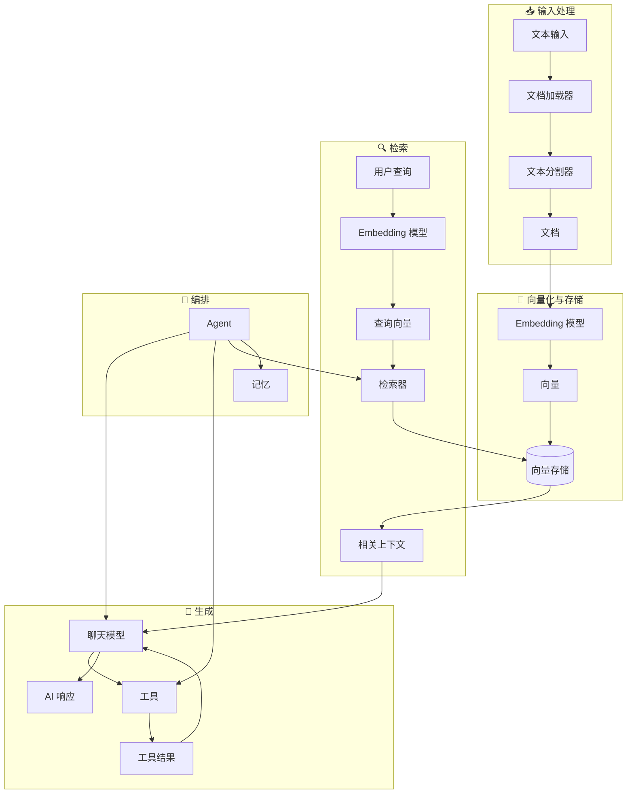
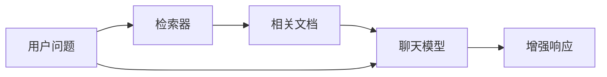
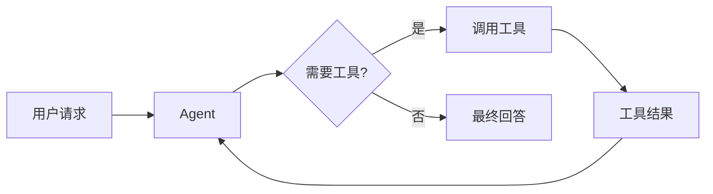
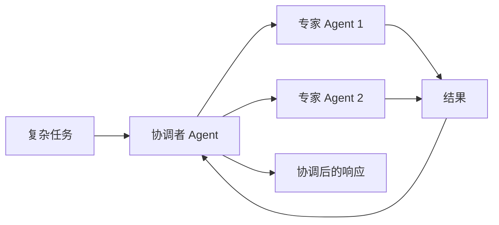

LangChain 的强大之处在于各组件之间的协同工作，共同构建出功能丰富的 AI 应用。本页通过图表展示不同组件之间的关系。

## 核心组件生态

下图展示了 LangChain 的主要组件如何连接，构成完整的 AI 应用：

### 组件如何连接

每一层组件都建立在前一层之上：

1. **输入处理** – 将原始数据转换为结构化文档
2. **向量化与存储** – 将文本转换为可搜索的向量表示
3. **检索** – 根据用户查询查找相关信息
4. **生成** – 使用 AI 模型生成响应，可选配工具
5. **编排** – 通过 Agent 和记忆系统协调所有组件

## 组件分类

LangChain 将组件划分为以下主要类别：

| 类别 | 用途 | 核心组件 | 应用场景 |
|------|------|----------|----------|
| **[模型](/oss/langchain/models)** | AI 推理与生成 | 聊天模型、LLM、Embedding 模型 | 文本生成、推理、语义理解 |
| **[工具](/oss/langchain/tools)** | 外部能力扩展 | API、数据库等 | 网络搜索、数据访问、计算 |
| **[Agent](/oss/langchain/agents)** | 编排与推理 | ReAct Agent、工具调用 Agent | 非确定性工作流、决策 |
| **[记忆](/oss/langchain/short-term-memory)** | 上下文保持 | 消息历史、自定义 state | 对话、有状态交互 |
| **[检索器](/oss/integrations/retrievers)** | 信息获取 | 向量检索器、网络检索器 | RAG、知识库搜索 |
| **[文档处理](/oss/integrations/document_loaders)** | 数据接入 | 加载器、分割器、转换器 | PDF 处理、网页抓取 |
| **[向量存储](/oss/integrations/vectorstores)** | 语义搜索 | Chroma、Pinecone、FAISS | 相似性搜索、向量存储 |

## 常见模式

### RAG（检索增强生成）

### 带工具的 Agent

### 多 Agent 系统

## 了解更多

- [创建 Agent](/oss/langchain/agents)
- [使用工具](/oss/langchain/tools)
- [浏览集成](/oss/integrations/providers/overview)
