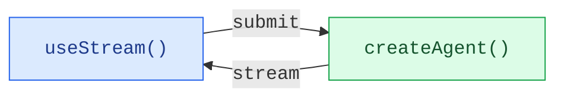

为使用 `createAgent` 创建的 Agent 构建丰富、交互式的前端。这些模式涵盖从基本消息渲染到高级工作流（如人工干预审批和时间旅行调试）的所有内容。

## 架构

每个模式都遵循相同的架构：`createAgent` 后端通过 `useStream` 钩子将状态流式传输到前端。



在后端，`createAgent` 生成一个编译后的 LangGraph 图，该图暴露流式 API。在前端，`useStream` 钩子连接到该 API 并提供响应式状态——包括消息、工具调用、中断和历史记录——你可以使用任何框架进行渲染。

<CodeGroup>

```ts Backend
import { createAgent } from "langchain";
import { MemorySaver } from "@langchain/langgraph";

const agent = createAgent({
  model: "openai:gpt-4.1",
  tools: [getWeather, searchWeb],
  checkpointer: new MemorySaver(),
});
```

```tsx Frontend (React)
import { useStream } from "@langchain/react";

function Chat() {
  const stream = useStream<typeof agent>({
    apiUrl: "http://localhost:2024",
    assistantId: "agent",
  });

  return (
    <div>
      {stream.messages.map((msg) => (
        <Message key={msg.id} message={msg} />
      ))}
    </div>
  );
}
```

</CodeGroup>

`useStream` 适用于 React、Vue、Svelte 和 Angular：

```ts
import { useStream } from "@langchain/react";   // React
import { useStream } from "@langchain/vue";      // Vue
import { useStream } from "@langchain/svelte";   // Svelte
import { useStream } from "@langchain/angular";  // Angular
```

## 模式

### 渲染消息和输出

<CardGroup cols={3}>
  <Card title="Markdown 消息" icon="markdown" href="/oss/langchain/frontend/markdown-messages">
    解析和渲染流式 Markdown，支持正确的格式化和代码高亮。
  </Card>
  <Card title="结构化输出" icon="layout-grid" href="/oss/langchain/frontend/structured-output">
    将类型化的 Agent 响应渲染为自定义 UI 组件，而非纯文本。
  </Card>
  <Card title="推理 Token" icon="brain" href="/oss/langchain/frontend/reasoning-tokens">
    在可折叠块中展示模型的思考过程。
  </Card>
  <Card title="生成式 UI" icon="wand" href="/oss/langchain/frontend/generative-ui">
    使用 json-render 将自然语言提示渲染为 AI 生成的用户界面。
  </Card>
</CardGroup>

### 展示 Agent 操作

<CardGroup cols={3}>
  <Card title="工具调用" icon="tool" href="/oss/langchain/frontend/tool-calling">
    将工具调用展示为丰富的、类型安全的 UI 卡片，包含加载和错误状态。
  </Card>
  <Card title="人工干预" icon="user-check" href="/oss/langchain/frontend/human-in-the-loop">
    暂停 Agent 等待人工审核，支持批准、拒绝和编辑工作流。
  </Card>
</CardGroup>

### 管理对话

<CardGroup cols={3}>
  <Card title="分支对话" icon="git-branch" href="/oss/langchain/frontend/branching-chat">
    编辑消息、重新生成响应并导航对话分支。
  </Card>
  <Card title="消息队列" icon="list-check" href="/oss/langchain/frontend/message-queues">
    在 Agent 顺序处理消息时排队发送多条消息。
  </Card>
</CardGroup>

### 高级流式传输

<CardGroup cols={3}>
  <Card title="加入和重新连接流" icon="plug-connected" href="/oss/langchain/frontend/join-rejoin">
    断开并重新连接到正在运行的 Agent 流，不丢失进度。
  </Card>
  <Card title="时间旅行" icon="history" href="/oss/langchain/frontend/time-travel">
    检查、导航并从对话历史中的任意检查点恢复。
  </Card>
</CardGroup>
