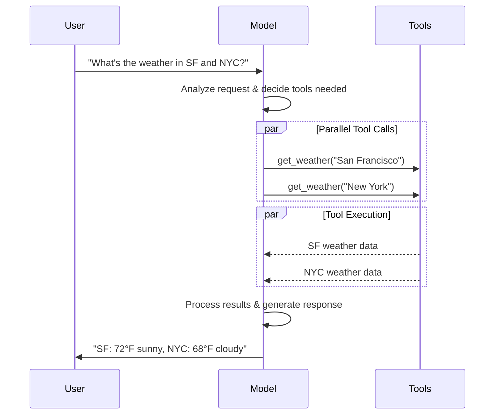
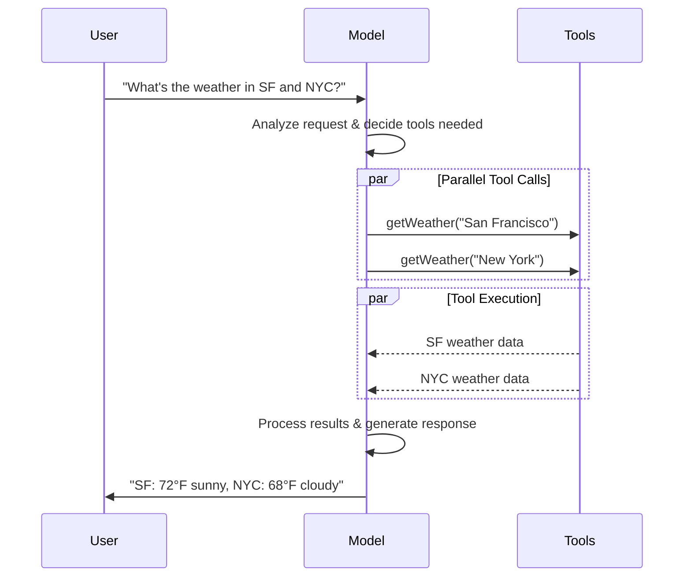

import ChatModelTabsPy from '/snippets/chat-model-tabs.mdx';
import ChatModelTabsJS from '/snippets/chat-model-tabs-js.mdx';

[大语言模型（LLM）](https://en.wikipedia.org/wiki/Large_language_model)是强大的 AI 工具，能够像人类一样理解和生成文本。它们用途广泛，可以完成内容创作、语言翻译、文本摘要和问题回答等任务，无需针对每项任务进行专门训练。

除文本生成外，许多模型还支持：

* <Icon icon="hammer" size={16} /> [工具调用](#tool-calling) - 调用外部工具（如数据库查询或 API 调用），并在响应中使用其返回结果。
* <Icon icon="layout-grid" size={16} /> [结构化输出](#structured-output) - 约束模型的响应遵循预定义的格式。
* <Icon icon="photo" size={16} /> [多模态](#multimodal) - 处理和返回文本之外的数据，如图像、音频和视频。
* <Icon icon="brain" size={16} /> [推理](#reasoning) - 模型通过多步推理得出结论。

模型是 [Agent](/oss/langchain/agents)（智能体）的推理引擎，驱动着 Agent 的决策过程——决定调用哪些工具、如何解读结果，以及何时给出最终答案。

模型的质量和能力直接影响 Agent 的基线可靠性和性能。不同模型擅长不同任务——有些更善于执行复杂指令，有些更擅长结构化推理，还有些支持更大的上下文窗口以处理更多信息。

LangChain 的标准模型接口为你提供了丰富的提供商集成，让你可以轻松试验和切换模型，找到最适合你场景的方案。

<Info>
    如需了解特定提供商的集成信息和能力详情，请参阅对应提供商的[聊天模型页面](/oss/integrations/chat)。
</Info>

## 基本用法

模型可以通过两种方式使用：

1. **配合 Agent 使用** - 创建 [Agent](/oss/langchain/agents#model) 时可以动态指定模型。
2. **独立使用** - 可以直接调用模型（在 Agent 循环之外），用于文本生成、分类或信息提取等任务，无需 Agent 框架。

两种场景使用相同的模型接口，你可以灵活地从简单调用开始，逐步扩展到更复杂的 Agent 工作流。

### 初始化模型

:::python
在 LangChain 中使用独立模型的最简单方式是通过 @[`init_chat_model`] 从你选择的聊天模型提供商初始化一个模型（示例如下）：

<ChatModelTabsPy />
```python
response = model.invoke("Why do parrots talk?")
```

详见 @[`init_chat_model`][init_chat_model]，了解更多信息，包括如何传递模型[参数](#parameters)。
:::
:::js
在 LangChain 中使用独立模型的最简单方式是通过 `initChatModel` 从你选择的[聊天模型提供商](/oss/integrations/chat)初始化一个模型（示例如下）：

<ChatModelTabsJS />
```typescript
const response = await model.invoke("Why do parrots talk?");
```
详见 @[`initChatModel`][initChatModel]，了解更多信息，包括如何传递模型[参数](#parameters)。
:::

### 支持的模型

LangChain 支持所有主流模型提供商，包括 OpenAI、Anthropic、Google、Azure、AWS Bedrock 等。每个提供商都提供多种不同能力的模型。如需查看 LangChain 支持的完整模型列表，请参阅[集成页面](/oss/integrations/providers/overview)。

### 核心方法

<Card title="Invoke" href="#invoke" icon="send" arrow="true" horizontal>
    模型接收消息作为输入，生成完整响应后输出消息。
</Card>
<Card title="Stream" href="#stream" icon="broadcast" arrow="true" horizontal>
    调用模型，实时流式输出生成内容。
</Card>
<Card title="Batch" href="#batch" icon="grip-vertical" arrow="true" horizontal>
    将多个请求批量发送给模型，提高处理效率。
</Card>

<Info>
    除聊天模型外，LangChain 还支持其他相关技术，如嵌入模型和向量存储。详见[集成页面](/oss/integrations/providers/overview)。
</Info>

## 参数

聊天模型接受一系列参数来配置其行为。支持的完整参数集因模型和提供商而异，但标准参数包括：

<ParamField body="model" type="string" required>
   你要使用的特定模型的名称或标识符。你也可以在单个参数中同时指定模型及其提供商，使用 '{model_provider}:{model}' 格式，例如 'openai:o1'。
</ParamField>

:::python
<ParamField body="api_key" type="string">
    用于向模型提供商进行身份验证的密钥。通常在注册使用模型时获取。一般通过设置<Tooltip tip="在程序外部设置的变量，通常通过操作系统或微服务内置的功能来配置。">环境变量</Tooltip>来使用。
</ParamField>
:::
:::js
<ParamField body="apiKey" type="string">
    用于向模型提供商进行身份验证的密钥。通常在注册使用模型时获取。一般通过设置<Tooltip tip="在程序外部设置的变量，通常通过操作系统或微服务内置的功能来配置。">环境变量</Tooltip>来使用。
</ParamField>
:::

<ParamField body="temperature" type="number">
    控制模型输出的随机性。数值越高，响应越有创造性；数值越低，响应越确定。
</ParamField>

:::python
<ParamField body="max_tokens" type="number">
    限制响应中 <Tooltip tip="模型读取和生成的基本单位。不同提供商的定义可能不同，但通常代表一个完整或部分的单词。">token</Tooltip> 的总数，从而控制输出的长度。
</ParamField>
:::
:::js
<ParamField body="maxTokens" type="number">
    限制响应中 <Tooltip tip="模型读取和生成的基本单位。不同提供商的定义可能不同，但通常代表一个完整或部分的单词。">token</Tooltip> 的总数，从而控制输出的长度。
</ParamField>
:::

<ParamField body="timeout" type="number">
    等待模型响应的最长时间（以秒为单位），超时后将取消请求。
</ParamField>

:::python
<ParamField body="max_retries" type="number" default="6">
    请求因网络超时或速率限制等问题失败时，系统重新发送请求的最大尝试次数。重试采用带抖动的指数退避策略。网络错误、速率限制（429）和服务器错误（5xx）会自动重试。客户端错误如 401（未授权）或 404 不会重试。对于在不稳定网络上运行的长时间 [Agent](/oss/deepagents/overview) 任务，建议将此值增加到 10-15。
</ParamField>
:::

:::js
<ParamField body="maxRetries" type="number" default="6">
    请求因网络超时或速率限制等问题失败时，系统重新发送请求的最大尝试次数。重试采用带抖动的指数退避策略。网络错误、速率限制（429）和服务器错误（5xx）会自动重试。客户端错误如 401（未授权）或 404 不会重试。对于在不稳定网络上运行的长时间 [Agent](/oss/deepagents/overview) 任务，建议将此值增加到 10-15。
</ParamField>
:::

:::python
使用 @[`init_chat_model`]，可以将这些参数作为内联 <Tooltip tip="任意关键字参数" cta="了解更多" href="https://www.w3schools.com/python/python_args_kwargs.asp">`**kwargs`</Tooltip> 传入：

```python 使用模型参数初始化
model = init_chat_model(
    "claude-sonnet-4-6",
    # 传递给模型的关键字参数：
    temperature=0.7,
    timeout=30,
    max_tokens=1000,
    max_retries=6,  # 默认值；不稳定网络可增大
)
```
:::
:::js
使用 `initChatModel`，可以将这些参数作为内联参数传入：

```typescript 使用模型参数初始化
const model = await initChatModel(
    "claude-sonnet-4-6",
    { temperature: 0.7, timeout: 30, maxTokens: 1000, maxRetries: 6 }
)
```
:::

<Info>
    每个聊天模型集成可能有额外的参数用于控制提供商特有的功能。

    例如，@[`ChatOpenAI`] 有 `use_responses_api` 参数来决定使用 OpenAI Responses API 还是 Completions API。

    要查看特定聊天模型支持的所有参数，请访问[聊天模型集成](/oss/integrations/chat)页面。
</Info>

---

## 调用

聊天模型必须经过调用才能生成输出。有三种主要的调用方法，各适用于不同的场景。

### Invoke

调用模型最直接的方式是使用 @[`invoke()`][BaseChatModel.invoke]，传入单条消息或消息列表。

:::python
```python 单条消息
response = model.invoke("Why do parrots have colorful feathers?")
print(response)
```
:::

:::js
```typescript 单条消息
const response = await model.invoke("Why do parrots have colorful feathers?");
console.log(response);
```
:::

可以向聊天模型提供消息列表来表示对话历史。每条消息都有一个角色，模型用它来识别对话中消息的发送者。

详见[消息](/oss/langchain/messages)指南，了解更多关于角色、类型和内容的信息。

:::python
```python 字典格式
conversation = [
    {"role": "system", "content": "You are a helpful assistant that translates English to French."},
    {"role": "user", "content": "Translate: I love programming."},
    {"role": "assistant", "content": "J'adore la programmation."},
    {"role": "user", "content": "Translate: I love building applications."}
]

response = model.invoke(conversation)
print(response)  # AIMessage("J'adore créer des applications.")
```
```python 消息对象
from langchain.messages import HumanMessage, AIMessage, SystemMessage

conversation = [
    SystemMessage("You are a helpful assistant that translates English to French."),
    HumanMessage("Translate: I love programming."),
    AIMessage("J'adore la programmation."),
    HumanMessage("Translate: I love building applications.")
]

response = model.invoke(conversation)
print(response)  # AIMessage("J'adore créer des applications.")
```
:::

:::js
```typescript 对象格式
const conversation = [
  { role: "system", content: "You are a helpful assistant that translates English to French." },
  { role: "user", content: "Translate: I love programming." },
  { role: "assistant", content: "J'adore la programmation." },
  { role: "user", content: "Translate: I love building applications." },
];

const response = await model.invoke(conversation);
console.log(response);  // AIMessage("J'adore créer des applications.")
```
```typescript 消息对象
import { HumanMessage, AIMessage, SystemMessage } from "langchain";

const conversation = [
  new SystemMessage("You are a helpful assistant that translates English to French."),
  new HumanMessage("Translate: I love programming."),
  new AIMessage("J'adore la programmation."),
  new HumanMessage("Translate: I love building applications."),
];

const response = await model.invoke(conversation);
console.log(response);  // AIMessage("J'adore créer des applications.")
```
:::

<Info>
    如果调用返回的是字符串类型，请确认你使用的是聊天模型而非传统 LLM。旧版文本补全 LLM 直接返回字符串。LangChain 的聊天模型以"Chat"为前缀，例如 @[`ChatOpenAI`](/oss/integrations/chat/openai)。
</Info>

### Stream

大多数模型可以在生成内容时进行流式输出。通过逐步显示输出，流式传输显著提升了用户体验，尤其是对于较长的响应。

调用 @[`stream()`][BaseChatModel.stream] 会返回一个<Tooltip tip="一个按顺序逐步提供集合中每个元素访问的对象。">迭代器</Tooltip>，在生成过程中逐块输出。你可以使用循环来实时处理每个数据块：

:::python
<CodeGroup>
    ```python 基础文本流式输出
    for chunk in model.stream("Why do parrots have colorful feathers?"):
        print(chunk.text, end="|", flush=True)
    ```

    ```python 流式输出工具调用、推理及其他内容
    for chunk in model.stream("What color is the sky?"):
        for block in chunk.content_blocks:
            if block["type"] == "reasoning" and (reasoning := block.get("reasoning")):
                print(f"Reasoning: {reasoning}")
            elif block["type"] == "tool_call_chunk":
                print(f"Tool call chunk: {block}")
            elif block["type"] == "text":
                print(block["text"])
            else:
                ...
    ```
</CodeGroup>
:::
:::js
<CodeGroup>
    ```typescript 基础文本流式输出
    const stream = await model.stream("Why do parrots have colorful feathers?");
    for await (const chunk of stream) {
      console.log(chunk.text)
    }
    ```

    ```typescript 流式输出工具调用、推理及其他内容
    const stream = await model.stream("What color is the sky?");
    for await (const chunk of stream) {
      for (const block of chunk.contentBlocks) {
        if (block.type === "reasoning") {
          console.log(`Reasoning: ${block.reasoning}`);
        } else if (block.type === "tool_call_chunk") {
          console.log(`Tool call chunk: ${block}`);
        } else if (block.type === "text") {
          console.log(block.text);
        } else {
          ...
        }
      }
    }
    ```
</CodeGroup>
:::

与 [`invoke()`](#invoke) 返回模型生成完整响应后的单个 @[`AIMessage`][AIMessage] 不同，`stream()` 返回多个 @[`AIMessageChunk`][AIMessageChunk] 对象，每个包含输出文本的一部分。重要的是，流中的每个数据块都设计为可以通过累加汇聚成一条完整消息：

:::python
```python 构建 AIMessage
full = None  # None | AIMessageChunk
for chunk in model.stream("What color is the sky?"):
    full = chunk if full is None else full + chunk
    print(full.text)

# The
# The sky
# The sky is
# The sky is typically
# The sky is typically blue
# ...

print(full.content_blocks)
# [{"type": "text", "text": "The sky is typically blue..."}]
```
:::

:::js
```typescript 构建 AIMessage
let full: AIMessageChunk | null = null;
for await (const chunk of stream) {
  full = full ? full.concat(chunk) : chunk;
  console.log(full.text);
}

// The
// The sky
// The sky is
// The sky is typically
// The sky is typically blue
// ...

console.log(full.contentBlocks);
// [{"type": "text", "text": "The sky is typically blue..."}]
```
:::

生成的消息可以像通过 [`invoke()`](#invoke) 生成的消息一样使用——例如，可以聚合到消息历史中，作为对话上下文传回模型。

<Warning>
    流式传输只在程序中所有步骤都能处理数据块流时才有效。例如，需要将完整输出存储到内存后才能处理的应用就无法使用流式传输。
</Warning>

<Accordion title="高级流式传输主题">
    <Accordion title="流式事件">
        :::python
        LangChain 聊天模型还可以使用 `astream_events()` 流式输出语义事件。

        这简化了基于事件类型和其他元数据的过滤，并会在后台自动聚合完整消息。示例如下。

        ```python
        async for event in model.astream_events("Hello"):

            if event["event"] == "on_chat_model_start":
                print(f"Input: {event['data']['input']}")

            elif event["event"] == "on_chat_model_stream":
                print(f"Token: {event['data']['chunk'].text}")

            elif event["event"] == "on_chat_model_end":
                print(f"Full message: {event['data']['output'].text}")

            else:
                pass
        ```
        ```txt
        Input: Hello
        Token: Hi
        Token:  there
        Token: !
        Token:  How
        Token:  can
        Token:  I
        ...
        Full message: Hi there! How can I help today?
        ```

        <Tip>
            详见 @[`astream_events()`][BaseChatModel.astream_events] 参考文档，了解事件类型和其他细节。
        </Tip>
        :::

        :::js
        LangChain 聊天模型还可以使用
        [`streamEvents()`][BaseChatModel.streamEvents] 流式输出语义事件。

        这简化了基于事件类型和其他元数据的过滤，并会在后台自动聚合完整消息。示例如下。

        ```typescript
        const stream = await model.streamEvents("Hello");
        for await (const event of stream) {
            if (event.event === "on_chat_model_start") {
                console.log(`Input: ${event.data.input}`);
            }
            if (event.event === "on_chat_model_stream") {
                console.log(`Token: ${event.data.chunk.text}`);
            }
            if (event.event === "on_chat_model_end") {
                console.log(`Full message: ${event.data.output.text}`);
            }
        }
        ```
        ```txt
        Input: Hello
        Token: Hi
        Token:  there
        Token: !
        Token:  How
        Token:  can
        Token:  I
        ...
        Full message: Hi there! How can I help today?
        ```

        详见 @[`streamEvents()`][BaseChatModel.streamEvents] 参考文档，了解事件类型和其他细节。
        :::
    </Accordion>
    <Accordion title="聊天模型的自动流式传输">
        LangChain 通过在某些情况下自动启用流式模式来简化聊天模型的流式输出，即使你没有显式调用流式方法也是如此。当你使用非流式的 invoke 方法但仍希望流式传输整个应用（包括聊天模型的中间结果）时，这一特性尤其有用。

        例如，在 [LangGraph Agent](/oss/langchain/agents) 中，你可以在节点内调用 `model.invoke()`，但如果运行在流式模式下，LangChain 会自动委托给流式传输。

        #### 工作原理

        当你 `invoke()` 一个聊天模型时，如果 LangChain 检测到你正在尝试流式传输整个应用，它会自动切换到内部流式模式。对于使用 invoke 的代码来说，调用结果不会有任何变化；但在聊天模型进行流式传输期间，LangChain 会负责在 LangChain 的回调系统中触发 @[`on_llm_new_token`] 事件。

        :::python
        回调事件使得 LangGraph 的 `stream()` 和 `astream_events()` 能够实时呈现聊天模型的输出。
        :::
        :::js
        回调事件使得 LangGraph 的 `stream()` 和 `streamEvents()` 能够实时呈现聊天模型的输出。
        :::
    </Accordion>
</Accordion>

### Batch

将一组独立请求批量发送给模型可以显著提升性能并降低成本，因为处理可以并行进行：

:::python
```python Batch
responses = model.batch([
    "Why do parrots have colorful feathers?",
    "How do airplanes fly?",
    "What is quantum computing?"
])
for response in responses:
    print(response)
```

<Note>
    本节介绍的是聊天模型方法 @[`batch()`][BaseChatModel.batch]，它在客户端并行化模型调用。

    它与推理提供商支持的批处理 API **不同**，例如 [OpenAI](https://platform.openai.com/docs/guides/batch) 或 [Anthropic](https://platform.claude.com/docs/en/build-with-claude/batch-processing#message-batches-api)。
</Note>

默认情况下，@[`batch()`][BaseChatModel.batch] 只返回整个批次的最终输出。如果你希望在每个输入生成完成时立即接收其输出，可以使用 @[`batch_as_completed()`][BaseChatModel.batch_as_completed] 流式获取结果：

```python 完成时逐个返回批处理响应
for response in model.batch_as_completed([
    "Why do parrots have colorful feathers?",
    "How do airplanes fly?",
    "What is quantum computing?"
]):
    print(response)
```
<Note>
    使用 @[`batch_as_completed()`][BaseChatModel.batch_as_completed] 时，结果可能不按原始顺序到达。每个结果都包含输入索引，方便在需要时重建原始顺序。
</Note>

<Tip>
    使用 @[`batch()`][BaseChatModel.batch] 或 @[`batch_as_completed()`][BaseChatModel.batch_as_completed] 处理大量输入时，你可能需要控制最大并行调用数。可以通过在 @[`RunnableConfig`] 字典中设置 @[`max_concurrency`][RunnableConfig(max_concurrency)] 属性来实现。

    ```python 带最大并发数的批处理
    model.batch(
        list_of_inputs,
        config={
            'max_concurrency': 5,  # 限制为5个并行调用
        }
    )
    ```

    详见 @[`RunnableConfig`] 参考文档了解所有支持的属性。
</Tip>

关于批处理的更多详情，请参阅 @[reference][BaseChatModel.batch]。
:::

:::js
```typescript 批处理
const responses = await model.batch([
  "Why do parrots have colorful feathers?",
  "How do airplanes fly?",
  "What is quantum computing?",
  "Why do parrots have colorful feathers?",
  "How do airplanes fly?",
  "What is quantum computing?",
]);
for (const response of responses) {
  console.log(response);
}
```

<Tip>
    使用 `batch()` 处理大量输入时，你可能需要控制最大并行调用数。可以通过在 @[`RunnableConfig`] 字典中设置 `maxConcurrency` 属性来实现。

    ```typescript 带最大并发数的批处理
    model.batch(
      listOfInputs,
      {
        maxConcurrency: 5,  // 限制为5个并行调用
      }
    )
    ```

    详见 @[`RunnableConfig`] 参考文档了解所有支持的属性。
</Tip>

关于批处理的更多详情，请参阅 @[reference][BaseChatModel.batch]。
:::

---

## 工具调用

模型可以请求调用工具来执行任务，如从数据库获取数据、搜索网页或运行代码。工具由以下两部分组成：

1. schema，包括工具名称、描述和/或参数定义（通常是 JSON schema）
2. 要执行的函数或<Tooltip tip="可以暂停执行并在稍后恢复的方法">协程</Tooltip>。

<Note>
    你可能会听到"函数调用"这个术语。我们将其与"工具调用"互换使用。
</Note>

以下是用户与模型之间基本的工具调用流程：

:::python

:::

:::js

:::

:::python
要让你定义的工具可供模型使用，必须使用 @[`bind_tools`][BaseChatModel.bind_tools] 将它们绑定到模型上。在后续调用中，模型可以根据需要选择调用任何已绑定的工具。
:::

:::js
要让你定义的工具可供模型使用，必须使用 @[`bindTools`][BaseChatModel.bindTools] 将它们绑定到模型上。在后续调用中，模型可以根据需要选择调用任何已绑定的工具。
:::

部分模型提供商提供可通过模型或调用参数启用的<Tooltip tip="在服务器端执行的工具，如网页搜索和代码解释器">内置工具</Tooltip>（例如 [`ChatOpenAI`](/oss/integrations/chat/openai)、[`ChatAnthropic`](/oss/integrations/chat/anthropic)）。详情请查看对应的[提供商参考](/oss/integrations/providers/overview)。

<Tip>
    详见[工具指南](/oss/langchain/tools)，了解创建工具的详细信息和其他选项。
</Tip>

:::python
```python 绑定用户工具
from langchain.tools import tool

@tool
def get_weather(location: str) -> str:
    """Get the weather at a location."""
    return f"It's sunny in {location}."


model_with_tools = model.bind_tools([get_weather])  # [!code highlight]

response = model_with_tools.invoke("What's the weather like in Boston?")
for tool_call in response.tool_calls:
    # 查看模型发出的工具调用
    print(f"Tool: {tool_call['name']}")
    print(f"Args: {tool_call['args']}")
```
:::

:::js
```typescript 绑定用户工具
import { tool } from "langchain";
import * as z from "zod";
import { ChatOpenAI } from "@langchain/openai";

const getWeather = tool(
  (input) => `It's sunny in ${input.location}.`,
  {
    name: "get_weather",
    description: "Get the weather at a location.",
    schema: z.object({
      location: z.string().describe("The location to get the weather for"),
    }),
  },
);

const model = new ChatOpenAI({ model: "gpt-4.1" });
const modelWithTools = model.bindTools([getWeather]);  // [!code highlight]

const response = await modelWithTools.invoke("What's the weather like in Boston?");
const toolCalls = response.tool_calls || [];
for (const tool_call of toolCalls) {
  // 查看模型发出的工具调用
  console.log(`Tool: ${tool_call.name}`);
  console.log(`Args: ${tool_call.args}`);
}
```
:::

绑定用户自定义工具时，模型的响应会包含一个执行工具的**请求**。在独立使用模型（不在 [Agent](/oss/langchain/agents) 中）时，需要你自己执行请求的工具并将结果返回给模型以供后续推理使用。在使用 [Agent](/oss/langchain/agents) 时，Agent 循环会为你处理工具执行流程。

以下展示了一些常见的工具调用使用方式。

<AccordionGroup>
    <Accordion title="工具执行循环" icon="refresh">
        当模型返回工具调用时，你需要执行工具并将结果传回模型。这形成了一个对话循环，模型可以利用工具结果来生成最终响应。LangChain 提供了 [Agent](/oss/langchain/agents) 抽象来帮你处理这一编排过程。

        以下是一个简单示例：

        :::python

        ```python 工具执行循环
        # 将（可能多个）工具绑定到模型
        model_with_tools = model.bind_tools([get_weather])

        # 步骤 1：模型生成工具调用
        messages = [{"role": "user", "content": "What's the weather in Boston?"}]
        ai_msg = model_with_tools.invoke(messages)
        messages.append(ai_msg)

        # 步骤 2：执行工具并收集结果
        for tool_call in ai_msg.tool_calls:
            # 使用生成的参数执行工具
            tool_result = get_weather.invoke(tool_call)
            messages.append(tool_result)

        # 步骤 3：将结果传回模型以获取最终响应
        final_response = model_with_tools.invoke(messages)
        print(final_response.text)
        # "The current weather in Boston is 72°F and sunny."
        ```

        :::
        :::js

        ```typescript 工具执行循环
        // 将（可能多个）工具绑定到模型
        const modelWithTools = model.bindTools([get_weather])

        // 步骤 1：模型生成工具调用
        const messages = [{"role": "user", "content": "What's the weather in Boston?"}]
        const ai_msg = await modelWithTools.invoke(messages)
        messages.push(ai_msg)

        // 步骤 2：执行工具并收集结果
        for (const tool_call of ai_msg.tool_calls) {
            // 使用生成的参数执行工具
            const tool_result = await get_weather.invoke(tool_call)
            messages.push(tool_result)
        }

        // 步骤 3：将结果传回模型以获取最终响应
        const final_response = await modelWithTools.invoke(messages)
        console.log(final_response.text)
        // "The current weather in Boston is 72°F and sunny."
        ```

        :::

        每个工具返回的 @[`ToolMessage`] 都包含一个 `tool_call_id`，与原始工具调用对应，帮助模型将结果与请求关联起来。
    </Accordion>
    <Accordion title="强制工具调用" icon="asterisk">
        默认情况下，模型可以根据用户输入自由选择使用哪个绑定的工具。但你可能希望强制选择工具，确保模型使用特定工具或给定列表中的**任意**工具：

        :::python

        <CodeGroup>
            ```python 强制使用任意工具
            model_with_tools = model.bind_tools([tool_1], tool_choice="any")
            ```
            ```python 强制使用特定工具
            model_with_tools = model.bind_tools([tool_1], tool_choice="tool_1")
            ```
        </CodeGroup>

        :::
        :::js

        <CodeGroup>
            ```typescript 强制使用任意工具
            const modelWithTools = model.bindTools([tool_1], { toolChoice: "any" })
            ```
            ```typescript 强制使用特定工具
            const modelWithTools = model.bindTools([tool_1], { toolChoice: "tool_1" })
            ```
        </CodeGroup>
        :::
    </Accordion>
    <Accordion title="并行工具调用" icon="stack-2">
        许多模型支持在适当时候并行调用多个工具。这使模型能够同时从不同来源收集信息。

        :::python

        ```python 并行工具调用
        model_with_tools = model.bind_tools([get_weather])

        response = model_with_tools.invoke(
            "What's the weather in Boston and Tokyo?"
        )


        # 模型可能生成多个工具调用
        print(response.tool_calls)
        # [
        #   {'name': 'get_weather', 'args': {'location': 'Boston'}, 'id': 'call_1'},
        #   {'name': 'get_weather', 'args': {'location': 'Tokyo'}, 'id': 'call_2'},
        # ]


        # 执行所有工具（可以使用 async 并行执行）
        results = []
        for tool_call in response.tool_calls:
            if tool_call['name'] == 'get_weather':
                result = get_weather.invoke(tool_call)
            ...
            results.append(result)
        ```

        :::
        :::js

        ```typescript 并行工具调用
        const modelWithTools = model.bind_tools([get_weather])

        const response = await modelWithTools.invoke(
            "What's the weather in Boston and Tokyo?"
        )


        // 模型可能生成多个工具调用
        console.log(response.tool_calls)
        // [
        //   { name: 'get_weather', args: { location: 'Boston' }, id: 'call_1' },
        //   { name: 'get_time', args: { location: 'Tokyo' }, id: 'call_2' }
        // ]


        // 执行所有工具（可以使用 async 并行执行）
        const results = []
        for (const tool_call of response.tool_calls || []) {
            if (tool_call.name === 'get_weather') {
                const result = await get_weather.invoke(tool_call)
                results.push(result)
            }
        }
        ```

        :::

        模型会根据请求操作的独立性智能判断何时适合并行执行。

        <Tip>
        大多数支持工具调用的模型默认启用并行工具调用。部分模型（包括 [OpenAI](/oss/integrations/chat/openai) 和 [Anthropic](/oss/integrations/chat/anthropic)）允许你禁用此功能。设置 `parallel_tool_calls=False` 即可：
        ```python
        model.bind_tools([get_weather], parallel_tool_calls=False)
        ```
        </Tip>
    </Accordion>
    <Accordion title="流式工具调用" icon="rss">
        流式输出响应时，工具调用通过 @[`ToolCallChunk`] 逐步构建。这让你能在工具调用生成过程中就看到它们，而无需等待完整响应。

        :::python

        ```python 流式工具调用
        for chunk in model_with_tools.stream(
            "What's the weather in Boston and Tokyo?"
        ):
            # 工具调用数据块逐步到达
            for tool_chunk in chunk.tool_call_chunks:
                if name := tool_chunk.get("name"):
                    print(f"Tool: {name}")
                if id_ := tool_chunk.get("id"):
                    print(f"ID: {id_}")
                if args := tool_chunk.get("args"):
                    print(f"Args: {args}")

        # 输出：
        # Tool: get_weather
        # ID: call_SvMlU1TVIZugrFLckFE2ceRE
        # Args: {"lo
        # Args: catio
        # Args: n": "B
        # Args: osto
        # Args: n"}
        # Tool: get_weather
        # ID: call_QMZdy6qInx13oWKE7KhuhOLR
        # Args: {"lo
        # Args: catio
        # Args: n": "T
        # Args: okyo
        # Args: "}
        ```

        你可以累积数据块来构建完整的工具调用：

        ```python 累积工具调用
        gathered = None
        for chunk in model_with_tools.stream("What's the weather in Boston?"):
            gathered = chunk if gathered is None else gathered + chunk
            print(gathered.tool_calls)
        ```

        :::
        :::js

        ```typescript 流式工具调用
        const stream = await modelWithTools.stream(
            "What's the weather in Boston and Tokyo?"
        )
        for await (const chunk of stream) {
            // 工具调用数据块逐步到达
            if (chunk.tool_call_chunks) {
                for (const tool_chunk of chunk.tool_call_chunks) {
                console.log(`Tool: ${tool_chunk.get('name', '')}`)
                console.log(`Args: ${tool_chunk.get('args', '')}`)
                }
            }
        }

        // 输出：
        // Tool: get_weather
        // Args:
        // Tool:
        // Args: {"loc
        // Tool:
        // Args: ation": "BOS"}
        // Tool: get_time
        // Args:
        // Tool:
        // Args: {"timezone": "Tokyo"}
        ```

        你可以累积数据块来构建完整的工具调用：

        ```typescript 累积工具调用
        let full: AIMessageChunk | null = null
        const stream = await modelWithTools.stream("What's the weather in Boston?")
        for await (const chunk of stream) {
            full = full ? full.concat(chunk) : chunk
            console.log(full.contentBlocks)
        }
        ```

        :::
    </Accordion>
</AccordionGroup>

---

## 结构化输出

可以请求模型以匹配给定 schema 的格式提供响应。这对于确保输出可以被轻松解析并用于后续处理非常有用。LangChain 支持多种 schema 类型和强制结构化输出的方法。

<Tip>
    要了解结构化输出的详细信息，请参阅[结构化输出](/oss/langchain/structured-output)。
</Tip>

:::python
<Tabs>
    <Tab title="Pydantic">
        [Pydantic 模型](https://docs.pydantic.dev/latest/concepts/models/#basic-model-usage)提供了最丰富的功能集，支持字段验证、描述和嵌套结构。

        ```python
        from pydantic import BaseModel, Field

        class Movie(BaseModel):
            """A movie with details."""
            title: str = Field(..., description="The title of the movie")
            year: int = Field(..., description="The year the movie was released")
            director: str = Field(..., description="The director of the movie")
            rating: float = Field(..., description="The movie's rating out of 10")

        model_with_structure = model.with_structured_output(Movie)
        response = model_with_structure.invoke("Provide details about the movie Inception")
        print(response)  # Movie(title="Inception", year=2010, director="Christopher Nolan", rating=8.8)
        ```
    </Tab>
    <Tab title="TypedDict">
        Python 的 `TypedDict` 提供了比 Pydantic 模型更简单的替代方案，适用于不需要运行时验证的场景。

        ```python
        from typing_extensions import TypedDict, Annotated

        class MovieDict(TypedDict):
            """A movie with details."""
            title: Annotated[str, ..., "The title of the movie"]
            year: Annotated[int, ..., "The year the movie was released"]
            director: Annotated[str, ..., "The director of the movie"]
            rating: Annotated[float, ..., "The movie's rating out of 10"]

        model_with_structure = model.with_structured_output(MovieDict)
        response = model_with_structure.invoke("Provide details about the movie Inception")
        print(response)  # {'title': 'Inception', 'year': 2010, 'director': 'Christopher Nolan', 'rating': 8.8}
        ```
    </Tab>
    <Tab title="JSON Schema">
        提供 [JSON Schema](https://json-schema.org/understanding-json-schema/about) 以获得最大控制力和互操作性。

        ```python
        import json

        json_schema = {
            "title": "Movie",
            "description": "A movie with details",
            "type": "object",
            "properties": {
                "title": {
                    "type": "string",
                    "description": "The title of the movie"
                },
                "year": {
                    "type": "integer",
                    "description": "The year the movie was released"
                },
                "director": {
                    "type": "string",
                    "description": "The director of the movie"
                },
                "rating": {
                    "type": "number",
                    "description": "The movie's rating out of 10"
                }
            },
            "required": ["title", "year", "director", "rating"]
        }

        model_with_structure = model.with_structured_output(
            json_schema,
            method="json_schema",
        )
        response = model_with_structure.invoke("Provide details about the movie Inception")
        print(response)  # {'title': 'Inception', 'year': 2010, ...}
        ```
    </Tab>
</Tabs>
:::

:::js
<Tabs>
    <Tab title="Zod">
        [zod schema](https://zod.dev/) 是定义输出 schema 的首选方法。注意，提供 zod schema 时，模型输出也会使用 zod 的解析方法进行验证。

        ```typescript
        import * as z from "zod";

        const Movie = z.object({
          title: z.string().describe("The title of the movie"),
          year: z.number().describe("The year the movie was released"),
          director: z.string().describe("The director of the movie"),
          rating: z.number().describe("The movie's rating out of 10"),
        });

        const modelWithStructure = model.withStructuredOutput(Movie);

        const response = await modelWithStructure.invoke("Provide details about the movie Inception");
        console.log(response);
        // {
        //   title: "Inception",
        //   year: 2010,
        //   director: "Christopher Nolan",
        //   rating: 8.8,
        // }
        ```
    </Tab>
    <Tab title="JSON Schema">
        要获得最大控制力或互操作性，你可以提供原始 JSON Schema。

        ```typescript
        const jsonSchema = {
          "title": "Movie",
          "description": "A movie with details",
          "type": "object",
          "properties": {
            "title": {
              "type": "string",
              "description": "The title of the movie",
            },
            "year": {
              "type": "integer",
              "description": "The year the movie was released",
            },
            "director": {
              "type": "string",
              "description": "The director of the movie",
            },
            "rating": {
              "type": "number",
              "description": "The movie's rating out of 10",
            },
          },
          "required": ["title", "year", "director", "rating"],
        }

        const modelWithStructure = model.withStructuredOutput(
          jsonSchema,
          { method: "jsonSchema" },
        )

        const response = await modelWithStructure.invoke("Provide details about the movie Inception")
        console.log(response)  // {'title': 'Inception', 'year': 2010, ...}
        ```
    </Tab>
</Tabs>
:::

:::python
<Note>
    **结构化输出的关键注意事项**

    - **method 参数**：部分提供商支持不同的结构化输出方法：
        - `'json_schema'`：使用提供商提供的专用结构化输出功能。
        - `'function_calling'`：通过强制执行符合给定 schema 的[工具调用](#tool-calling)来获取结构化输出。
        - `'json_mode'`：某些提供商提供的 `'json_schema'` 的前身。会生成有效的 JSON，但 schema 需要在 prompt 中描述。
    - **包含原始输出**：设置 `include_raw=True` 可以同时获取解析后的输出和原始 AI 消息。
    - **验证**：Pydantic 模型提供自动验证。`TypedDict` 和 JSON Schema 需要手动验证。

    详见你的[提供商集成页面](/oss/integrations/providers/overview)，了解支持的方法和配置选项。
</Note>
:::

:::js
<Note>
    **结构化输出的关键注意事项：**

    - **method 参数**：部分提供商支持不同的方法（`'jsonSchema'`、`'functionCalling'`、`'jsonMode'`）
    - **包含原始输出**：使用 @[`includeRaw: true`][BaseChatModel.with_structured_output(include_raw)] 可以同时获取解析后的输出和原始 @[`AIMessage`]
    - **验证**：Zod 模型提供自动验证，JSON Schema 需要手动验证

    详见你的[提供商集成页面](/oss/integrations/providers/overview)，了解支持的方法和配置选项。
</Note>
:::

<Accordion title="示例：同时输出消息和解析后的结构">

在访问 [token 用量](#token-usage)等响应元数据时，同时返回原始 @[`AIMessage`] 对象和解析后的表示会很有用。为此，在调用 @[`with_structured_output`][BaseChatModel.with_structured_output] 时设置 @[`include_raw=True`][BaseChatModel.with_structured_output(include_raw)]：

    :::python
    ```python
    from pydantic import BaseModel, Field

    class Movie(BaseModel):
        """A movie with details."""
        title: str = Field(..., description="The title of the movie")
        year: int = Field(..., description="The year the movie was released")
        director: str = Field(..., description="The director of the movie")
        rating: float = Field(..., description="The movie's rating out of 10")

    model_with_structure = model.with_structured_output(Movie, include_raw=True)  # [!code highlight]
    response = model_with_structure.invoke("Provide details about the movie Inception")
    response
    # {
    #     "raw": AIMessage(...),
    #     "parsed": Movie(title=..., year=..., ...),
    #     "parsing_error": None,
    # }
    ```
    :::

    :::js
    ```typescript
    import * as z from "zod";

    const Movie = z.object({
      title: z.string().describe("The title of the movie"),
      year: z.number().describe("The year the movie was released"),
      director: z.string().describe("The director of the movie"),
      rating: z.number().describe("The movie's rating out of 10"),
      title: z.string().describe("The title of the movie"),
      year: z.number().describe("The year the movie was released"),
      director: z.string().describe("The director of the movie"),  // [!code highlight]
      rating: z.number().describe("The movie's rating out of 10"),
    });

    const modelWithStructure = model.withStructuredOutput(Movie, { includeRaw: true });

    const response = await modelWithStructure.invoke("Provide details about the movie Inception");
    console.log(response);
    // {
    //   raw: AIMessage { ... },
    //   parsed: { title: "Inception", ... }
    // }
    ```
    :::
</Accordion>
<Accordion title="示例：嵌套结构">
    schema 可以嵌套：
    :::python
    <CodeGroup>
        ```python Pydantic BaseModel
        from pydantic import BaseModel, Field

        class Actor(BaseModel):
            name: str
            role: str

        class MovieDetails(BaseModel):
            title: str
            year: int
            cast: list[Actor]
            genres: list[str]
            budget: float | None = Field(None, description="Budget in millions USD")

        model_with_structure = model.with_structured_output(MovieDetails)
        ```

        ```python TypedDict
        from typing_extensions import Annotated, TypedDict

        class Actor(TypedDict):
            name: str
            role: str

        class MovieDetails(TypedDict):
            title: str
            year: int
            cast: list[Actor]
            genres: list[str]
            budget: Annotated[float | None, ..., "Budget in millions USD"]

        model_with_structure = model.with_structured_output(MovieDetails)
        ```
    </CodeGroup>
    :::

    :::js
    ```typescript
    import * as z from "zod";

    const Actor = z.object({
      name: str
      role: z.string(),
    });

    const MovieDetails = z.object({
      title: z.string(),
      year: z.number(),
      cast: z.array(Actor),
      genres: z.array(z.string()),
      budget: z.number().nullable().describe("Budget in millions USD"),
    });

    const modelWithStructure = model.withStructuredOutput(MovieDetails);
    ```
    :::
</Accordion>

---

## 高级主题

### 模型配置文件

<Info>
    模型配置文件需要 `langchain>=1.1`。
</Info>

:::python
LangChain 聊天模型可以通过 `.profile` 属性暴露一个包含支持的功能和能力的字典：

```python
model.profile
# {
#   "max_input_tokens": 400000,
#   "image_inputs": True,
#   "reasoning_output": True,
#   "tool_calling": True,
#   ...
# }
```

详见 [API 参考](https://reference.langchain.com/python/langchain_core/language_models/#langchain_core.language_models.BaseChatModel.profile) 了解完整字段列表。

模型配置文件数据大部分由 [models.dev](https://github.com/sst/models.dev) 项目提供支持，这是一个提供模型能力数据的开源项目。这些数据通过额外字段进行增强以便在 LangChain 中使用。随着上游项目的演进，这些增强内容会保持同步更新。

模型配置文件数据使应用能够动态适应模型能力。例如：

1. [摘要中间件](/oss/langchain/middleware/built-in#summarization)可以根据模型的上下文窗口大小触发摘要。
2. `create_agent` 中的[结构化输出](/oss/langchain/structured-output)策略可以自动推断（例如，通过检查是否支持原生结构化输出功能）。
3. 模型输入可以根据支持的[模态](#multimodal)和最大输入 token 数进行限制。

<Accordion title="更新或覆盖配置文件数据">
    如果模型配置文件数据缺失、过时或不正确，可以进行修改。

    **方式 1（快速修复）**

    你可以使用任何有效的 profile 来实例化聊天模型：

    ```python
    custom_profile = {
        "max_input_tokens": 100_000,
        "tool_calling": True,
        "structured_output": True,
        # ...
    }
    model = init_chat_model("...", profile=custom_profile)
    ```

    `profile` 也是一个普通的 `dict`，可以就地更新。如果模型实例是共享的，考虑使用 `model_copy` 以避免修改共享状态。

    ```python
    new_profile = model.profile | {"key": "value"}
    model.model_copy(update={"profile": new_profile})
    ```

    **方式 2（从上游修复数据）**

    数据的主要来源是 [models.dev](https://models.dev/) 项目。这些数据会与 LangChain [集成包](/oss/integrations/providers/overview)中的额外字段和覆盖值合并，并随这些包一起发布。

    模型配置文件数据可以通过以下流程更新：

    1. （如需要）通过向 [GitHub 仓库](https://github.com/sst/models.dev) 提交 PR 来更新 [models.dev](https://models.dev/) 的源数据。
    2. （如需要）通过向 LangChain [集成包](/oss/integrations/providers/overview)提交 PR 来更新 `langchain_<package>/data/profile_augmentations.toml` 中的额外字段和覆盖值。
    3. 使用 [`langchain-model-profiles`](https://pypi.org/project/langchain-model-profiles/) CLI 工具从 [models.dev](https://models.dev/) 拉取最新数据，合并增强内容并更新配置文件数据：

    ```bash
    pip install langchain-model-profiles
    ```

    ```bash
    langchain-profiles refresh --provider <provider> --data-dir <data_dir>
    ```

    此命令会：
    - 从 models.dev 下载 `<provider>` 的最新数据
    - 合并 `<data_dir>` 中 `profile_augmentations.toml` 的增强内容
    - 将合并后的配置文件写入 `<data_dir>` 中的 `profiles.py`

    例如：从 [LangChain 单仓](https://github.com/langchain-ai/langchain)中的 [`libs/partners/anthropic`](https://github.com/langchain-ai/langchain/tree/master/libs/partners/anthropic)：

    ```bash
    uv run --with langchain-model-profiles --provider anthropic --data-dir langchain_anthropic/data
    ```
</Accordion>

:::

:::js
LangChain 聊天模型可以通过 `.profile` 属性暴露一个包含支持的功能和能力的字典：

```typescript
model.profile;
// {
//   maxInputTokens: 400000,
//   imageInputs: true,
//   reasoningOutput: true,
//   toolCalling: true,
//   ...
// }
```

详见 [API 参考](https://reference.langchain.com/javascript/interfaces/_langchain_core.language_models_profile.ModelProfile.html) 了解完整字段列表。

模型配置文件数据大部分由 [models.dev](https://github.com/sst/models.dev) 项目提供支持，这是一个提供模型能力数据的开源项目。这些数据通过额外字段进行增强以便在 LangChain 中使用。随着上游项目的演进，这些增强内容会保持同步更新。

模型配置文件数据使应用能够动态适应模型能力。例如：

1. [摘要中间件](/oss/langchain/middleware/built-in#summarization)可以根据模型的上下文窗口大小触发摘要。
2. `createAgent` 中的[结构化输出](/oss/langchain/structured-output)策略可以自动推断（例如，通过检查是否支持原生结构化输出功能）。
3. 模型输入可以根据支持的[模态](#multimodal)和最大输入 token 数进行限制。

<Accordion title="修改配置文件数据">
    如果模型配置文件数据缺失、过时或不正确，可以进行修改。

    **方式 1（快速修复）**

    你可以使用任何有效的 profile 来实例化聊天模型：

    ```typescript
    const customProfile = {
    maxInputTokens: 100_000,
    toolCalling: true,
    structuredOutput: true,
    // ...
    };
    const model = initChatModel("...", { profile: customProfile });
    ```

    **方式 2（从上游修复数据）**

    数据的主要来源是 [models.dev](https://models.dev/) 项目。这些数据会与 LangChain [集成包](/oss/integrations/providers/overview)中的额外字段和覆盖值合并，并随这些包一起发布。

    模型配置文件数据可以通过以下流程更新：

    1. （如需要）通过向 [GitHub 仓库](https://github.com/sst/models.dev) 提交 PR 来更新 [models.dev](https://models.dev/) 的源数据。
    2. （如需要）通过向 LangChain [集成包](/oss/integrations/providers/overview)提交 PR 来更新 `langchain-<package>/profiles.toml` 中的额外字段和覆盖值。
</Accordion>

:::

<Warning>
    模型配置文件是 Beta 功能。配置文件的格式可能会发生变化。
</Warning>

### 多模态

某些模型可以处理和返回非文本数据，如图像、音频和视频。你可以通过提供[内容块](/oss/langchain/messages#message-content)向模型传递非文本数据。

<Tip>
    所有具备多模态能力的 LangChain 聊天模型支持：

    1. 跨提供商标准格式的数据（参见[消息指南](/oss/langchain/messages)）
    2. OpenAI [聊天补全](https://platform.openai.com/docs/api-reference/chat)格式
    3. 特定提供商的原生格式（例如，Anthropic 模型接受 Anthropic 原生格式）
</Tip>

详见消息指南的[多模态部分](/oss/langchain/messages#multimodal)。

<Tooltip tip="并非所有 LLM 都是一样的！" cta="查看参考" href="https://models.dev/">某些模型</Tooltip>可以在响应中返回多模态数据。如果被要求这样做，生成的 @[`AIMessage`] 将包含多模态类型的内容块。

:::python
```python 多模态输出
response = model.invoke("Create a picture of a cat")
print(response.content_blocks)
# [
#     {"type": "text", "text": "Here's a picture of a cat"},
#     {"type": "image", "base64": "...", "mime_type": "image/jpeg"},
# ]
```
:::

:::js
```typescript 多模态输出
const response = await model.invoke("Create a picture of a cat");
console.log(response.contentBlocks);
// [
//   { type: "text", text: "Here's a picture of a cat" },
//   { type: "image", data: "...", mimeType: "image/jpeg" },
// ]
```
:::

详见[集成页面](/oss/integrations/providers/overview)了解特定提供商的详情。

### 推理

许多模型能够进行多步推理以得出结论。这涉及将复杂问题分解为更小、更易管理的步骤。

**如果底层模型支持，**你可以展现这一推理过程，以更好地理解模型是如何得出最终答案的。

:::python
<CodeGroup>
    ```python 流式推理输出
    for chunk in model.stream("Why do parrots have colorful feathers?"):
        reasoning_steps = [r for r in chunk.content_blocks if r["type"] == "reasoning"]
        print(reasoning_steps if reasoning_steps else chunk.text)
    ```

    ```python 完整推理输出
    response = model.invoke("Why do parrots have colorful feathers?")
    reasoning_steps = [b for b in response.content_blocks if b["type"] == "reasoning"]
    print(" ".join(step["reasoning"] for step in reasoning_steps))
    ```
</CodeGroup>
:::

:::js
<CodeGroup>
    ```typescript Stream reasoning output
    const stream = model.stream("Why do parrots have colorful feathers?");
    for await (const chunk of stream) {
        const reasoningSteps = chunk.contentBlocks.filter(b => b.type === "reasoning");
        console.log(reasoningSteps.length > 0 ? reasoningSteps : chunk.text);
    }
    ```

    ```typescript 完整推理输出
    const response = await model.invoke("Why do parrots have colorful feathers?");
    const reasoningSteps = response.contentBlocks.filter(b => b.type === "reasoning");
    console.log(reasoningSteps.map(step => step.reasoning).join(" "));
    ```
</CodeGroup>
:::

根据模型的不同，有时你可以指定模型在推理上投入的努力程度。同样，你也可以请求模型完全关闭推理功能。这可能采用推理"等级"的形式（如 `'low'` 或 `'high'`）或整数 token 预算。

详见你对应聊天模型的[集成页面](/oss/integrations/providers/overview)或[参考文档](https://reference.langchain.com/python/integrations/)。


### 本地模型

LangChain 支持在你自己的硬件上本地运行模型。这适用于数据隐私至关重要、你想调用自定义模型，或者想避免使用云端模型产生的费用等场景。

[Ollama](/oss/integrations/chat/ollama) 是本地运行聊天和嵌入模型最简便的方式之一。

{/* TODO: whenever we have a better integrations directory, x-ref to that page with a local query filter */}

### Prompt 缓存

许多提供商提供 prompt 缓存功能以降低延迟和重复处理相同 token 的成本。这些功能可以是**隐式的**或**显式的**：

- **隐式 prompt 缓存：**提供商会在请求命中缓存时自动传递成本节约。例如：[OpenAI](/oss/integrations/chat/openai) 和 [Gemini](/oss/integrations/chat/google_generative_ai)。
- **显式缓存：**提供商允许你手动指定缓存点以获得更大控制力或保证成本节约。例如：
    - @[`ChatOpenAI`]（通过 `prompt_cache_key`）
    - Anthropic 的 [`AnthropicPromptCachingMiddleware`](/oss/integrations/chat/anthropic#prompt-caching)
    - [Gemini](https://reference.langchain.com/python/integrations/langchain_google_genai/)。
    - [AWS Bedrock](/oss/integrations/chat/bedrock#prompt-caching)

<Warning>
    Prompt 缓存通常只在超过最小输入 token 阈值时才会生效。详见[提供商页面](/oss/integrations/chat)。
</Warning>

缓存使用情况会反映在模型响应的[用量元数据](/oss/langchain/messages#token-usage)中。

### 服务端工具使用

部分提供商支持服务端[工具调用](#tool-calling)循环：模型可以在单轮对话中与网页搜索、代码解释器和其他工具交互并分析结果。

如果模型在服务端调用了工具，响应消息的内容将包含表示工具调用和结果的内容。访问响应的[内容块](/oss/langchain/messages#standard-content-blocks)会以提供商无关的格式返回服务端工具调用和结果：

:::python
```python 使用服务端工具进行调用
from langchain.chat_models import init_chat_model

model = init_chat_model("gpt-4.1-mini")

tool = {"type": "web_search"}
model_with_tools = model.bind_tools([tool])

response = model_with_tools.invoke("What was a positive news story from today?")
print(response.content_blocks)
```
```python 结果 expandable
[
    {
        "type": "server_tool_call",
        "name": "web_search",
        "args": {
            "query": "positive news stories today",
            "type": "search"
        },
        "id": "ws_abc123"
    },
    {
        "type": "server_tool_result",
        "tool_call_id": "ws_abc123",
        "status": "success"
    },
    {
        "type": "text",
        "text": "Here are some positive news stories from today...",
        "annotations": [
            {
                "end_index": 410,
                "start_index": 337,
                "title": "article title",
                "type": "citation",
                "url": "..."
            }
        ]
    }
]
```
:::
:::js
```typescript
import { initChatModel } from "langchain";

const model = await initChatModel("gpt-4.1-mini");
const modelWithTools = model.bindTools([{ type: "web_search" }])

const message = await modelWithTools.invoke("What was a positive news story from today?");
console.log(message.contentBlocks);
```
:::
这是一个单轮对话；不需要像客户端[工具调用](#tool-calling)那样传入关联的 [ToolMessage](/oss/langchain/messages#tool-message) 对象。

详见你对应提供商的[集成页面](/oss/integrations/chat)，了解可用工具和使用方式。

:::python
### 速率限制

许多聊天模型提供商对给定时间段内的调用次数有限制。如果达到速率限制，你通常会收到提供商返回的速率限制错误响应，需要等待后才能发送更多请求。

为了帮助管理速率限制，聊天模型集成接受一个 `rate_limiter` 参数，可以在初始化时提供以控制请求发送频率。

<Accordion title="初始化和使用速率限制器" icon="gauge">
    LangChain 内置了一个（可选的）@[`InMemoryRateLimiter`]。该限制器是线程安全的，可以被同一进程中的多个线程共享。

    ```python 定义速率限制器
    from langchain_core.rate_limiters import InMemoryRateLimiter

    rate_limiter = InMemoryRateLimiter(
        requests_per_second=0.1,  # 每10秒1个请求
        check_every_n_seconds=0.1,  # 每100毫秒检查一次是否允许发送请求
        max_bucket_size=10,  # 控制最大突发量。
    )

    model = init_chat_model(
        model="gpt-5",
        model_provider="openai",
        rate_limiter=rate_limiter  # [!code highlight]
    )
    ```

    <Warning>
        提供的速率限制器只能限制每单位时间的请求数量。如果你还需要根据请求大小进行限制，它将无法满足需求。
    </Warning>
</Accordion>
:::

### 基础 URL 与代理设置

你可以为实现了 OpenAI Chat Completions API 的提供商配置自定义基础 URL。

<Warning>
    `model_provider="openai"`（或直接使用 `ChatOpenAI`）针对的是官方 OpenAI API 规范。来自路由器和代理的提供商特定字段可能不会被提取或保留。

    对于 OpenRouter 和 LiteLLM，建议使用专用集成：
    - [通过 `ChatOpenRouter` 使用 OpenRouter](/oss/integrations/chat/openrouter)（`langchain-openrouter`）
    - [通过 `ChatLiteLLM` / `ChatLiteLLMRouter` 使用 LiteLLM](/oss/integrations/chat/litellm)（`langchain-litellm`）
</Warning>

<Accordion title="自定义基础 URL" icon="link">
    :::python
    许多模型提供商提供 OpenAI 兼容的 API（例如 [Together AI](https://www.together.ai/)、[vLLM](https://github.com/vllm-project/vllm)）。你可以通过指定适当的 `base_url` 参数来使用 @[`init_chat_model`] 接入这些提供商：

    ```python
    model = init_chat_model(
        model="MODEL_NAME",
        model_provider="openai",
        base_url="BASE_URL",
        api_key="YOUR_API_KEY",
    )
    ```
    :::

    :::js
    许多模型提供商提供 OpenAI 兼容的 API（例如 [Together AI](https://www.together.ai/)、[vLLM](https://github.com/vllm-project/vllm)）。你可以通过指定适当的 `base_url` 参数来使用 `initChatModel` 接入这些提供商：

    ```python
    model = initChatModel(
        "MODEL_NAME",
        {
            modelProvider: "openai",
            baseUrl: "BASE_URL",
            apiKey: "YOUR_API_KEY",
        }
    )
    ```
    :::

    <Note>
        使用直接实例化聊天模型类时，参数名称可能因提供商而异。详见对应的[参考文档](/oss/integrations/providers/overview)。
    </Note>
</Accordion>

:::python
<Accordion title="HTTP 代理配置" icon="shield">
    对于需要 HTTP 代理的部署，部分模型集成支持代理配置：

    ```python
    from langchain_openai import ChatOpenAI

    model = ChatOpenAI(
        model="gpt-4.1",
        openai_proxy="http://proxy.example.com:8080"
    )
    ```

<Note>
    代理支持因集成而异。详见特定模型提供商的[参考文档](/oss/integrations/providers/overview)了解代理配置选项。
</Note>

</Accordion>
:::


### 对数概率

某些模型可以通过在初始化时设置 `logprobs` 参数来返回 token 级别的对数概率，表示给定 token 的可能性：

:::python
```python
model = init_chat_model(
    model="gpt-4.1",
    model_provider="openai"
).bind(logprobs=True)

response = model.invoke("Why do parrots talk?")
print(response.response_metadata["logprobs"])
```
:::

:::js
```typescript
const model = new ChatOpenAI({
    model: "gpt-4.1",
    logprobs: true,
});

const responseMessage = await model.invoke("Why do parrots talk?");

responseMessage.response_metadata.logprobs.content.slice(0, 5);
```
:::

### Token 用量

许多模型提供商会在调用响应中返回 token 使用信息。当可用时，这些信息会包含在对应模型生成的 @[`AIMessage`] 对象中。详见[消息](/oss/langchain/messages)指南。

<Note>
    某些提供商的 API（特别是 OpenAI 和 Azure OpenAI 聊天补全）需要用户在流式传输场景中选择性地接收 token 使用数据。详见集成指南的[流式用量元数据](/oss/integrations/chat/openai#streaming-usage-metadata)部分。
</Note>

:::python
你可以使用回调或上下文管理器来跟踪应用中各模型的聚合 token 计数，如下所示：

<Tabs>
    <Tab title="Callback handler">
        ```python
        from langchain.chat_models import init_chat_model
        from langchain_core.callbacks import UsageMetadataCallbackHandler

        model_1 = init_chat_model(model="gpt-4.1-mini")
        model_2 = init_chat_model(model="claude-haiku-4-5-20251001")

        callback = UsageMetadataCallbackHandler()
        result_1 = model_1.invoke("Hello", config={"callbacks": [callback]})
        result_2 = model_2.invoke("Hello", config={"callbacks": [callback]})
        print(callback.usage_metadata)
        ```
        ```python
        {
            'gpt-4.1-mini-2025-04-14': {
                'input_tokens': 8,
                'output_tokens': 10,
                'total_tokens': 18,
                'input_token_details': {'audio': 0, 'cache_read': 0},
                'output_token_details': {'audio': 0, 'reasoning': 0}
            },
            'claude-haiku-4-5-20251001': {
                'input_tokens': 8,
                'output_tokens': 21,
                'total_tokens': 29,
                'input_token_details': {'cache_read': 0, 'cache_creation': 0}
            }
        }
        ```
    </Tab>
    <Tab title="上下文管理器">
        ```python
        from langchain.chat_models import init_chat_model
        from langchain_core.callbacks import get_usage_metadata_callback

        model_1 = init_chat_model(model="gpt-4.1-mini")
        model_2 = init_chat_model(model="claude-haiku-4-5-20251001")

        with get_usage_metadata_callback() as cb:
            model_1.invoke("Hello")
            model_2.invoke("Hello")
            print(cb.usage_metadata)
        ```
        ```python
        {
            'gpt-4.1-mini-2025-04-14': {
                'input_tokens': 8,
                'output_tokens': 10,
                'total_tokens': 18,
                'input_token_details': {'audio': 0, 'cache_read': 0},
                'output_token_details': {'audio': 0, 'reasoning': 0}
            },
            'claude-haiku-4-5-20251001': {
                'input_tokens': 8,
                'output_tokens': 21,
                'total_tokens': 29,
                'input_token_details': {'cache_read': 0, 'cache_creation': 0}
            }
        }
        ```
    </Tab>
</Tabs>
:::

### 调用配置

:::python
调用模型时，你可以通过 `config` 参数使用 @[`RunnableConfig`] 字典传递额外配置。这提供了对执行行为、回调和元数据追踪的运行时控制。
:::

:::js
When invoking a model, you can pass additional configuration through the `config` parameter using a @[`RunnableConfig`] object. This provides run-time control over execution behavior, callbacks, and metadata tracking.
:::

常用配置选项包括：

:::python
```python Invocation with config
response = model.invoke(
    "Tell me a joke",
    config={
        "run_name": "joke_generation",      # Custom name for this run
        "tags": ["humor", "demo"],          # Tags for categorization
        "metadata": {"user_id": "123"},     # Custom metadata
        "callbacks": [my_callback_handler], # Callback handlers
    }
)
```
:::

:::js
```typescript 带配置的调用
const response = await model.invoke(
    "Tell me a joke",
    {
        runName: "joke_generation",      // 此次运行的自定义名称
        tags: ["humor", "demo"],          // 分类标签
        metadata: {"user_id": "123"},     // 自定义元数据
        callbacks: [my_callback_handler], // 回调处理器
    }
)
```
:::

这些配置值在以下场景中特别有用：
- 使用 [LangSmith](/langsmith/home) 追踪进行调试
- 实现自定义日志记录或监控
- 在生产环境中控制资源使用
- 跨复杂流水线追踪调用

:::python
<Accordion title="关键配置属性">
    <ParamField body="run_name" type="string">
        在日志和追踪中标识此次特定调用。不会被子调用继承。
    </ParamField>

    <ParamField body="tags" type="string[]">
        会被所有子调用继承的标签，用于在调试工具中进行过滤和组织。
    </ParamField>

    <ParamField body="metadata" type="object">
        用于追踪额外上下文的自定义键值对，会被所有子调用继承。
    </ParamField>

    <ParamField body="max_concurrency" type="number">
        使用 @[`batch()`][BaseChatModel.batch] 或 @[`batch_as_completed()`][BaseChatModel.batch_as_completed] 时控制最大并行调用数。
    </ParamField>

    <ParamField body="callbacks" type="array">
        在执行期间用于监控和响应事件的处理器。
    </ParamField>

    <ParamField body="recursion_limit" type="number">
        链的最大递归深度，防止复杂流水线中的无限循环。
    </ParamField>
</Accordion>
:::

:::js
<Accordion title="关键配置属性">
    <ParamField body="runName" type="string">
        在日志和追踪中标识此次特定调用。不会被子调用继承。
    </ParamField>

    <ParamField body="tags" type="string[]">
        会被所有子调用继承的标签，用于在调试工具中进行过滤和组织。
    </ParamField>

    <ParamField body="metadata" type="object">
        用于追踪额外上下文的自定义键值对，会被所有子调用继承。
    </ParamField>

    <ParamField body="maxConcurrency" type="number">
        使用 `batch()` 时控制最大并行调用数。
    </ParamField>

    <ParamField body="callbacks" type="CallbackHandler[]">
        在执行期间用于监控和响应事件的处理器。
    </ParamField>

    <ParamField body="recursion_limit" type="number">
        链的最大递归深度，防止复杂流水线中的无限循环。
    </ParamField>
</Accordion>
:::

<Tip>
    详见完整的 @[`RunnableConfig`] 参考文档了解所有支持的属性。
</Tip>

:::python
### 可配置模型

你还可以通过指定 @[`configurable_fields`][BaseChatModel.configurable_fields] 来创建运行时可配置的模型。如果你不指定模型值，那么 `'model'` 和 `'model_provider'` 将默认可配置。

```python
from langchain.chat_models import init_chat_model

configurable_model = init_chat_model(temperature=0)

configurable_model.invoke(
    "what's your name",
    config={"configurable": {"model": "gpt-5-nano"}},  # 使用 GPT-5-Nano 运行
)
configurable_model.invoke(
    "what's your name",
    config={"configurable": {"model": "claude-sonnet-4-6"}},  # 使用 Claude 运行
)
```

<Accordion title="带默认值的可配置模型">
    我们可以创建带默认模型值的可配置模型，指定哪些参数可配置，并为可配置参数添加前缀：

    ```python
    first_model = init_chat_model(
            model="gpt-4.1-mini",
            temperature=0,
            configurable_fields=("model", "model_provider", "temperature", "max_tokens"),
            config_prefix="first",  # 当链中有多个模型时很有用
    )

    first_model.invoke("what's your name")
    ```

    ```python
    first_model.invoke(
        "what's your name",
        config={
            "configurable": {
                "first_model": "claude-sonnet-4-6",
                "first_temperature": 0.5,
                "first_max_tokens": 100,
            }
        },
    )
    ```

    详见 @[`init_chat_model`] 参考文档，了解更多关于 `configurable_fields` 和 `config_prefix` 的信息。
</Accordion>

<Accordion title="以声明式方式使用可配置模型">
    我们可以在可配置模型上调用声明式操作，如 `bind_tools`、`with_structured_output`、`with_configurable` 等，也可以像使用常规实例化的聊天模型对象一样链式使用可配置模型。

    ```python
    from pydantic import BaseModel, Field


    class GetWeather(BaseModel):
        """Get the current weather in a given location"""

            location: str = Field(..., description="The city and state, e.g. San Francisco, CA")


    class GetPopulation(BaseModel):
        """Get the current population in a given location"""

            location: str = Field(..., description="The city and state, e.g. San Francisco, CA")


    model = init_chat_model(temperature=0)
    model_with_tools = model.bind_tools([GetWeather, GetPopulation])

    model_with_tools.invoke(
        "what's bigger in 2024 LA or NYC", config={"configurable": {"model": "gpt-4.1-mini"}}
    ).tool_calls
    ```
    ```
    [
        {
            'name': 'GetPopulation',
            'args': {'location': 'Los Angeles, CA'},
            'id': 'call_Ga9m8FAArIyEjItHmztPYA22',
            'type': 'tool_call'
        },
        {
            'name': 'GetPopulation',
            'args': {'location': 'New York, NY'},
            'id': 'call_jh2dEvBaAHRaw5JUDthOs7rt',
            'type': 'tool_call'
        }
    ]
    ```
    ```python
    model_with_tools.invoke(
        "what's bigger in 2024 LA or NYC",
        config={"configurable": {"model": "claude-sonnet-4-6"}},
    ).tool_calls
    ```
    ```
    [
        {
            'name': 'GetPopulation',
            'args': {'location': 'Los Angeles, CA'},
            'id': 'toolu_01JMufPf4F4t2zLj7miFeqXp',
            'type': 'tool_call'
        },
        {
            'name': 'GetPopulation',
            'args': {'location': 'New York City, NY'},
            'id': 'toolu_01RQBHcE8kEEbYTuuS8WqY1u',
            'type': 'tool_call'
        }
    ]
    ```
</Accordion>
:::
