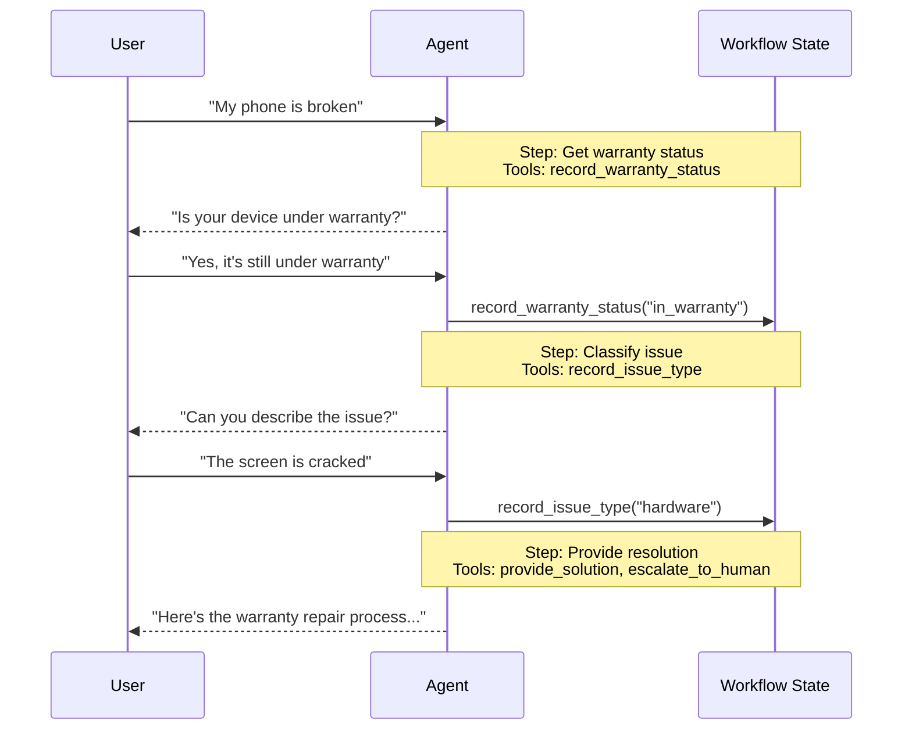

在**交接**架构中，行为会根据状态动态变化。核心机制是：[工具](/oss/langchain/tools)更新一个状态变量（如 `current_step` 或 `active_agent`），该变量在轮次间持久化，系统读取该变量来调整行为 —— 要么应用不同的配置（系统提示词、工具），要么路由到不同的 [Agent](/oss/langchain/agents)。此模式同时支持不同 Agent 之间的交接和单个 Agent 内的动态配置变更。

<Tip>
**交接**（handoffs）这个术语由 [OpenAI](https://openai.github.io/openai-agents-python/handoffs/) 创造，指使用工具调用（如 `transfer_to_sales_agent`）在 Agent 或状态之间转移控制权。
</Tip>



## 核心特征

* 状态驱动的行为：行为根据状态变量（如 `current_step` 或 `active_agent`）变化
* 基于工具的转换：工具更新状态变量以在状态之间移动
* 直接用户交互：每个状态的配置直接处理用户消息
* 持久化状态：状态在对话轮次间保持

## 适用场景

当你需要强制顺序约束（仅在满足前置条件后才解锁能力）、Agent 需要在不同状态下直接与用户对话、或你正在构建多阶段对话流时，使用交接模式。此模式对客户支持场景特别有价值，例如你需要按特定顺序收集信息 —— 比如在处理退款之前先收集保修编号。

## 基本实现

核心机制是一个返回 [`Command`](/oss/langgraph/graph-api#command) 来更新状态的[工具](/oss/langchain/tools)，触发向新步骤或 Agent 的转换：

:::python
```python
from langchain.tools import tool
from langchain.messages import ToolMessage
from langgraph.types import Command

@tool
def transfer_to_specialist(runtime) -> Command:
    """Transfer to the specialist agent."""
    return Command(
        update={
            "messages": [
                ToolMessage(  # [!code highlight]
                    content="Transferred to specialist",
                    tool_call_id=runtime.tool_call_id  # [!code highlight]
                )
            ],
            "current_step": "specialist"  # Triggers behavior change
        }
    )
```
:::
:::js
```typescript
import { tool, ToolMessage, type ToolRuntime } from "langchain";
import { Command } from "@langchain/langgraph";
import { z } from "zod";

const transferToSpecialist = tool(
  async (_, config: ToolRuntime<typeof StateSchema>) => {
    return new Command({
      update: {
        messages: [
          new ToolMessage({  // [!code highlight]
            content: "Transferred to specialist",
            tool_call_id: config.toolCallId  // [!code highlight]
          })
        ],
        currentStep: "specialist"  // Triggers behavior change
      }
    });
  },
  {
    name: "transfer_to_specialist",
    description: "Transfer to the specialist agent.",
    schema: z.object({})
  }
);
```
:::

<Note>
**为什么要包含 `ToolMessage`？** 当 LLM 调用工具时，它期望收到响应。带有匹配 `tool_call_id` 的 `ToolMessage` 完成了这个请求-响应循环 —— 没有它，对话历史就会变得格式错误。当你的交接工具更新消息时，这是必须的。
</Note>

完整实现请参见以下教程。

<Card
    title="教程：使用交接构建客户支持"
    icon="users"
    href="/oss/langchain/multi-agent/handoffs-customer-support"
    arrow cta="了解更多"
>
    学习如何使用交接模式构建客户支持 Agent，其中单个 Agent 在不同配置之间转换。
</Card>

## 实现方式

实现交接有两种方式：**[带中间件的单 Agent](#single-agent-with-middleware)**（一个具有动态配置的 Agent）或**[多 Agent 子图](#multiple-agent-subgraphs)**（作为图节点的不同 Agent）。

### 带中间件的单 Agent

单个 Agent 根据状态改变其行为。中间件拦截每次模型调用，并动态调整系统提示词和可用工具。工具更新状态变量以触发转换：

:::python
```python
from langchain.tools import ToolRuntime, tool
from langchain.messages import ToolMessage
from langgraph.types import Command

@tool
def record_warranty_status(
    status: str,
    runtime: ToolRuntime[None, SupportState]
) -> Command:
    """Record warranty status and transition to next step."""
    return Command(
        update={
            "messages": [
                ToolMessage(
                    content=f"Warranty status recorded: {status}",
                    tool_call_id=runtime.tool_call_id
                )
            ],
            "warranty_status": status,
            "current_step": "specialist"  # Update state to trigger transition
        }
    )
```
:::
:::js
```typescript
import { tool, ToolMessage, type ToolRuntime } from "langchain";
import { Command } from "@langchain/langgraph";
import { z } from "zod";

const recordWarrantyStatus = tool(
  async ({ status }, config: ToolRuntime<typeof StateSchema>) => {
    return new Command({
      update: {
        messages: [
          new ToolMessage({
            content: `Warranty status recorded: ${status}`,
            tool_call_id: config.toolCallId,
          }),
        ],
        warrantyStatus: status,
        currentStep: "specialist", // Update state to trigger transition
      },
    });
  },
  {
    name: "record_warranty_status",
    description: "Record warranty status and transition to next step.",
    schema: z.object({
      status: z.string(),
    }),
  }
);
```
:::

<Accordion title="完整示例：使用中间件的客户支持">

:::python
```python
from langchain.agents import AgentState, create_agent
from langchain.agents.middleware import wrap_model_call, ModelRequest, ModelResponse
from langchain.tools import tool, ToolRuntime
from langchain.messages import ToolMessage
from langgraph.types import Command
from typing import Callable

# 1. Define state with current_step tracker
class SupportState(AgentState):  # [!code highlight]
    """Track which step is currently active."""
    current_step: str = "triage"  # [!code highlight]
    warranty_status: str | None = None

# 2. Tools update current_step via Command
@tool
def record_warranty_status(
    status: str,
    runtime: ToolRuntime[None, SupportState]
) -> Command:  # [!code highlight]
    """Record warranty status and transition to next step."""
    return Command(update={  # [!code highlight]
        "messages": [  # [!code highlight]
            ToolMessage(
                content=f"Warranty status recorded: {status}",
                tool_call_id=runtime.tool_call_id
            )
        ],
        "warranty_status": status,
        # Transition to next step
        "current_step": "specialist"    # [!code highlight]
    })

# 3. Middleware applies dynamic configuration based on current_step
@wrap_model_call  # [!code highlight]
def apply_step_config(
    request: ModelRequest,
    handler: Callable[[ModelRequest], ModelResponse]
) -> ModelResponse:
    """Configure agent behavior based on current_step."""
    step = request.state.get("current_step", "triage")  # [!code highlight]

    # Map steps to their configurations
    configs = {
        "triage": {
            "prompt": "Collect warranty information...",
            "tools": [record_warranty_status]
        },
        "specialist": {
            "prompt": "Provide solutions based on warranty: {warranty_status}",
            "tools": [provide_solution, escalate]
        }
    }

    config = configs[step]
    request = request.override(  # [!code highlight]
        system_prompt=config["prompt"].format(**request.state),  # [!code highlight]
        tools=config["tools"]  # [!code highlight]
    )
    return handler(request)

# 4. Create agent with middleware
agent = create_agent(
    model,
    tools=[record_warranty_status, provide_solution, escalate],
    state_schema=SupportState,
    middleware=[apply_step_config],  # [!code highlight]
    checkpointer=InMemorySaver()  # Persist state across turns  # [!code highlight]
)
```
:::
:::js
```typescript
import {
  createAgent,
  createMiddleware,
  tool,
  ToolMessage,
  type ToolRuntime,
} from "langchain";
import { Command, MemorySaver, StateSchema } from "@langchain/langgraph";
import { z } from "zod";

// 1. Define state with current_step tracker
const SupportState = new StateSchema({ // [!code highlight]
  currentStep: z.string().default("triage"), // [!code highlight]
  warrantyStatus: z.string().optional(),
});

// 2. Tools update currentStep via Command
const recordWarrantyStatus = tool(
  async ({ status }, config: ToolRuntime<typeof SupportState.State>) => {
    return new Command({ // [!code highlight]
      update: { // [!code highlight]
        messages: [ // [!code highlight]
          new ToolMessage({
            content: `Warranty status recorded: ${status}`,
            tool_call_id: config.toolCallId,
          }),
        ],
        warrantyStatus: status,
        // Transition to next step
        currentStep: "specialist", // [!code highlight]
      },
    });
  },
  {
    name: "record_warranty_status",
    description: "Record warranty status and transition",
    schema: z.object({ status: z.string() }),
  }
);

// 3. Middleware applies dynamic configuration based on currentStep
const applyStepConfig = createMiddleware({
  name: "applyStepConfig",
  stateSchema: SupportState, // [!code highlight]
  wrapModelCall: async (request, handler) => {
    const step = request.state.currentStep || "triage"; // [!code highlight]

    // Map steps to their configurations
    const configs = {
      triage: {
        prompt: "Collect warranty information...",
        tools: [recordWarrantyStatus],
      },
      specialist: {
        prompt: `Provide solutions based on warranty: ${request.state.warrantyStatus}`,
        tools: [provideSolution, escalate],
      },
    };

    const config = configs[step as keyof typeof configs];
    return handler({
      ...request,
      systemPrompt: config.prompt,
      tools: config.tools,
    });
  },
});

// 4. Create agent with middleware
const agent = createAgent({
  model,
  tools: [recordWarrantyStatus, provideSolution, escalate],
  middleware: [applyStepConfig], // [!code highlight]
  checkpointer: new MemorySaver(), // Persist state across turns  // [!code highlight]
});
```
:::

</Accordion>

### 多 Agent 子图

多个不同的 Agent 作为图中的独立节点存在。交接工具使用 `Command.PARENT` 在 Agent 节点之间导航，指定下一个要执行的节点。

<Warning>
子图交接需要仔细的**[上下文工程](/oss/langchain/context-engineering)**。与单 Agent 中间件（消息历史自然流转）不同，你必须显式地决定哪些消息在 Agent 之间传递。如果处理不当，Agent 会收到格式错误的对话历史或臃肿的上下文。参见下方[上下文工程](#context-engineering)。
</Warning>

:::python
```python
from langchain.messages import AIMessage, ToolMessage
from langchain.tools import tool, ToolRuntime
from langgraph.types import Command

@tool
def transfer_to_sales(
    runtime: ToolRuntime,
) -> Command:
    """Transfer to the sales agent."""
    last_ai_message = next(  # [!code highlight]
        msg for msg in reversed(runtime.state["messages"]) if isinstance(msg, AIMessage)  # [!code highlight]
    )  # [!code highlight]
    transfer_message = ToolMessage(  # [!code highlight]
        content="Transferred to sales agent",  # [!code highlight]
        tool_call_id=runtime.tool_call_id,  # [!code highlight]
    )  # [!code highlight]
    return Command(
        goto="sales_agent",
        update={
            "active_agent": "sales_agent",
            "messages": [last_ai_message, transfer_message],  # [!code highlight]
        },
        graph=Command.PARENT
    )
```
:::
:::js
```typescript
import {
  tool,
  ToolMessage,
  AIMessage,
  type ToolRuntime,
} from "langchain";
import { Command, StateSchema, MessagesValue } from "@langchain/langgraph";

const CustomState = new StateSchema({
  messages: MessagesValue,
});

const transferToSales = tool(
  async (_, runtime: ToolRuntime<typeof CustomState.State>) => {
    const lastAiMessage = runtime.state.messages // [!code highlight]
      .reverse() // [!code highlight]
      .find(AIMessage.isInstance); // [!code highlight]

    const transferMessage = new ToolMessage({ // [!code highlight]
      content: "Transferred to sales agent", // [!code highlight]
      tool_call_id: runtime.toolCallId, // [!code highlight]
    }); // [!code highlight]
    return new Command({
      goto: "sales_agent",
      update: {
        activeAgent: "sales_agent",
        messages: [lastAiMessage, transferMessage].filter(Boolean), // [!code highlight]
      },
      graph: Command.PARENT,
    });
  },
  {
    name: "transfer_to_sales",
    description: "Transfer to the sales agent.",
    schema: z.object({}),
  }
);
```
:::

<Accordion title="完整示例：使用交接的销售与支持">

本示例展示了一个具有独立销售和支持 Agent 的多 Agent 系统。每个 Agent 是图中的独立节点，交接工具允许 Agent 互相转移对话。

:::python
```python
from typing import Literal

from langchain.agents import AgentState, create_agent
from langchain.messages import AIMessage, ToolMessage
from langchain.tools import tool, ToolRuntime
from langgraph.graph import StateGraph, START, END
from langgraph.types import Command
from typing_extensions import NotRequired


# 1. Define state with active_agent tracker
class MultiAgentState(AgentState):
    active_agent: NotRequired[str]


# 2. Create handoff tools
@tool
def transfer_to_sales(
    runtime: ToolRuntime,
) -> Command:
    """Transfer to the sales agent."""
    last_ai_message = next(  # [!code highlight]
        msg for msg in reversed(runtime.state["messages"]) if isinstance(msg, AIMessage)  # [!code highlight]
    )  # [!code highlight]
    transfer_message = ToolMessage(  # [!code highlight]
        content="Transferred to sales agent from support agent",  # [!code highlight]
        tool_call_id=runtime.tool_call_id,  # [!code highlight]
    )  # [!code highlight]
    return Command(
        goto="sales_agent",
        update={
            "active_agent": "sales_agent",
            "messages": [last_ai_message, transfer_message],  # [!code highlight]
        },
        graph=Command.PARENT,
    )


@tool
def transfer_to_support(
    runtime: ToolRuntime,
) -> Command:
    """Transfer to the support agent."""
    last_ai_message = next(  # [!code highlight]
        msg for msg in reversed(runtime.state["messages"]) if isinstance(msg, AIMessage)  # [!code highlight]
    )  # [!code highlight]
    transfer_message = ToolMessage(  # [!code highlight]
        content="Transferred to support agent from sales agent",  # [!code highlight]
        tool_call_id=runtime.tool_call_id,  # [!code highlight]
    )  # [!code highlight]
    return Command(
        goto="support_agent",
        update={
            "active_agent": "support_agent",
            "messages": [last_ai_message, transfer_message],  # [!code highlight]
        },
        graph=Command.PARENT,
    )


# 3. Create agents with handoff tools
sales_agent = create_agent(
    model="anthropic:claude-sonnet-4-20250514",
    tools=[transfer_to_support],
    system_prompt="You are a sales agent. Help with sales inquiries. If asked about technical issues or support, transfer to the support agent.",
)

support_agent = create_agent(
    model="anthropic:claude-sonnet-4-20250514",
    tools=[transfer_to_sales],
    system_prompt="You are a support agent. Help with technical issues. If asked about pricing or purchasing, transfer to the sales agent.",
)


# 4. Create agent nodes that invoke the agents
def call_sales_agent(state: MultiAgentState) -> Command:
    """Node that calls the sales agent."""
    response = sales_agent.invoke(state)
    return response


def call_support_agent(state: MultiAgentState) -> Command:
    """Node that calls the support agent."""
    response = support_agent.invoke(state)
    return response


# 5. Create router that checks if we should end or continue
def route_after_agent(
    state: MultiAgentState,
) -> Literal["sales_agent", "support_agent", "__end__"]:
    """Route based on active_agent, or END if the agent finished without handoff."""
    messages = state.get("messages", [])

    # Check the last message - if it's an AIMessage without tool calls, we're done
    if messages:
        last_msg = messages[-1]
        if isinstance(last_msg, AIMessage) and not last_msg.tool_calls:  # [!code highlight]
            return "__end__"  # [!code highlight]

    # Otherwise route to the active agent
    active = state.get("active_agent", "sales_agent")
    return active if active else "sales_agent"


def route_initial(
    state: MultiAgentState,
) -> Literal["sales_agent", "support_agent"]:
    """Route to the active agent based on state, default to sales agent."""
    return state.get("active_agent") or "sales_agent"


# 6. Build the graph
builder = StateGraph(MultiAgentState)
builder.add_node("sales_agent", call_sales_agent)
builder.add_node("support_agent", call_support_agent)

# Start with conditional routing based on initial active_agent
builder.add_conditional_edges(START, route_initial, ["sales_agent", "support_agent"])

# After each agent, check if we should end or route to another agent
builder.add_conditional_edges(
    "sales_agent", route_after_agent, ["sales_agent", "support_agent", END]
)
builder.add_conditional_edges(
    "support_agent", route_after_agent, ["sales_agent", "support_agent", END]
)

graph = builder.compile()
result = graph.invoke(
    {
        "messages": [
            {
                "role": "user",
                "content": "Hi, I'm having trouble with my account login. Can you help?",
            }
        ]
    }
)

for msg in result["messages"]:
    msg.pretty_print()
```
:::

:::js
```typescript
import {
  StateGraph,
  START,
  END,
  StateSchema,
  MessagesValue,
  Command,
  ConditionalEdgeRouter,
  GraphNode,
} from "@langchain/langgraph";
import { createAgent, AIMessage, ToolMessage } from "langchain";
import { tool, ToolRuntime } from "@langchain/core/tools";
import { z } from "zod/v4";

// 1. Define state with active_agent tracker
const MultiAgentState = new StateSchema({
  messages: MessagesValue,
  activeAgent: z.string().optional(),
});

// 2. Create handoff tools
const transferToSales = tool(
  async (_, runtime: ToolRuntime<typeof MultiAgentState.State>) => {
    const lastAiMessage = [...runtime.state.messages] // [!code highlight]
      .reverse() // [!code highlight]
      .find(AIMessage.isInstance); // [!code highlight]
    const transferMessage = new ToolMessage({ // [!code highlight]
      content: "Transferred to sales agent from support agent", // [!code highlight]
      tool_call_id: runtime.toolCallId, // [!code highlight]
    }); // [!code highlight]
    return new Command({
      goto: "sales_agent",
      update: {
        activeAgent: "sales_agent",
        messages: [lastAiMessage, transferMessage].filter(Boolean), // [!code highlight]
      },
      graph: Command.PARENT,
    });
  },
  {
    name: "transfer_to_sales",
    description: "Transfer to the sales agent.",
    schema: z.object({}),
  }
);

const transferToSupport = tool(
  async (_, runtime: ToolRuntime<typeof MultiAgentState.State>) => {
    const lastAiMessage = [...runtime.state.messages] // [!code highlight]
      .reverse() // [!code highlight]
      .find(AIMessage.isInstance); // [!code highlight]
    const transferMessage = new ToolMessage({ // [!code highlight]
      content: "Transferred to support agent from sales agent", // [!code highlight]
      tool_call_id: runtime.toolCallId, // [!code highlight]
    }); // [!code highlight]
    return new Command({
      goto: "support_agent",
      update: {
        activeAgent: "support_agent",
        messages: [lastAiMessage, transferMessage].filter(Boolean), // [!code highlight]
      },
      graph: Command.PARENT,
    });
  },
  {
    name: "transfer_to_support",
    description: "Transfer to the support agent.",
    schema: z.object({}),
  }
);

// 3. Create agents with handoff tools
const salesAgent = createAgent({
  model: "anthropic:claude-sonnet-4-20250514",
  tools: [transferToSupport],
  systemPrompt:
    "You are a sales agent. Help with sales inquiries. If asked about technical issues or support, transfer to the support agent.",
});

const supportAgent = createAgent({
  model: "anthropic:claude-sonnet-4-20250514",
  tools: [transferToSales],
  systemPrompt:
    "You are a support agent. Help with technical issues. If asked about pricing or purchasing, transfer to the sales agent.",
});

// 4. Create agent nodes that invoke the agents
const callSalesAgent: GraphNode<typeof MultiAgentState.State> = async (state) => {
  const response = await salesAgent.invoke(state);
  return response;
};

const callSupportAgent: GraphNode<typeof MultiAgentState.State> = async (state) => {
  const response = await supportAgent.invoke(state);
  return response;
};

// 5. Create router that checks if we should end or continue
const routeAfterAgent: ConditionalEdgeRouter<
  typeof MultiAgentState.State,
  "sales_agent" | "support_agent"
> = (state) => {
  const messages = state.messages ?? [];

  // Check the last message - if it's an AIMessage without tool calls, we're done
  if (messages.length > 0) {
    const lastMsg = messages[messages.length - 1];
    if (lastMsg instanceof AIMessage && !lastMsg.tool_calls?.length) { // [!code highlight]
      return END; // [!code highlight]
    } // [!code highlight]
  }

  // Otherwise route to the active agent
  const active = state.activeAgent ?? "sales_agent";
  return active as "sales_agent" | "support_agent";
};

const routeInitial: ConditionalEdgeRouter<
  typeof MultiAgentState.State,
  "sales_agent" | "support_agent"
> = (state) => {
  // Route to the active agent based on state, default to sales agent
  return (state.activeAgent ?? "sales_agent") as
    | "sales_agent"
    | "support_agent";
};

// 6. Build the graph
const builder = new StateGraph(MultiAgentState)
  .addNode("sales_agent", callSalesAgent)
  .addNode("support_agent", callSupportAgent);
  // Start with conditional routing based on initial activeAgent
  .addConditionalEdges(START, routeInitial, [
    "sales_agent",
    "support_agent",
  ])
  // After each agent, check if we should end or route to another agent
  .addConditionalEdges("sales_agent", routeAfterAgent, [
    "sales_agent",
    "support_agent",
    END,
  ]);
  builder.addConditionalEdges("support_agent", routeAfterAgent, [
    "sales_agent",
    "support_agent",
    END,
  ]);

const graph = builder.compile();
const result = await graph.invoke({
  messages: [
    {
      role: "user",
      content: "Hi, I'm having trouble with my account login. Can you help?",
    },
  ],
});

for (const msg of result.messages) {
  console.log(msg.content);
}
```
:::

</Accordion>

<Tip>
大多数交接场景使用**带中间件的单 Agent** —— 更简单。仅当你需要定制化的 Agent 实现（例如一个节点本身就是带有反思或检索步骤的复杂图）时，才使用**多 Agent 子图**。
</Tip>

#### 上下文工程

使用子图交接时，你可以精确控制哪些消息在 Agent 之间流动。这种精确性对于维护有效的对话历史和避免可能混淆下游 Agent 的上下文臃肿至关重要。更多相关内容请参见[上下文工程](/oss/langchain/context-engineering)。

**交接时的上下文处理**

在 Agent 之间交接时，你需要确保对话历史保持有效。LLM 期望工具调用与其响应配对，因此当使用 `Command.PARENT` 交接到另一个 Agent 时，你必须同时包含：

1. **包含工具调用的 `AIMessage`**（触发交接的消息）
2. **确认交接的 `ToolMessage`**（对该工具调用的人工响应）

没有这种配对，接收 Agent 会看到不完整的对话，可能产生错误或意外行为。

以下示例假设只调用了交接工具（没有并行工具调用）：

:::python
```python
@tool
def transfer_to_sales(runtime: ToolRuntime) -> Command:
    # Get the AI message that triggered this handoff
    last_ai_message = runtime.state["messages"][-1]

    # Create an artificial tool response to complete the pair
    transfer_message = ToolMessage(
        content="Transferred to sales agent",
        tool_call_id=runtime.tool_call_id,
    )

    return Command(
        goto="sales_agent",
        update={
            "active_agent": "sales_agent",
            # Pass only these two messages, not the full subagent history
            "messages": [last_ai_message, transfer_message],
        },
        graph=Command.PARENT,
    )
```
:::

:::js
```typescript
const transferToSales = tool(
  async (_, runtime: ToolRuntime<typeof MultiAgentState.State>) => {
    // Get the AI message that triggered this handoff
    const lastAiMessage = runtime.state.messages.at(-1);

    // Create an artificial tool response to complete the pair
    const transferMessage = new ToolMessage({
      content: "Transferred to sales agent",
      tool_call_id: runtime.toolCallId,
    });

    return new Command({
      goto: "sales_agent",
      update: {
        activeAgent: "sales_agent",
        // Pass only these two messages, not the full subagent history
        messages: [lastAiMessage, transferMessage],
      },
      graph: Command.PARENT,
    });
  },
  {
    name: "transfer_to_sales",
    description: "Transfer to the sales agent.",
    schema: z.object({}),
  }
);
```
:::

<Note>
**为什么不传递所有子 Agent 消息？** 虽然你可以在交接中包含完整的子 Agent 对话，但这通常会带来问题。接收 Agent 可能被不相关的内部推理混淆，而且 token 成本也会不必要地增加。通过只传递交接消息对，你可以保持父图的上下文专注于高层协调。如果接收 Agent 需要额外上下文，考虑在 ToolMessage 内容中总结子 Agent 的工作，而不是传递原始消息历史。
</Note>

**将控制权返回给用户**

当将控制权返回给用户（结束 Agent 的轮次）时，确保最后一条消息是 `AIMessage`。这保持了有效的对话历史，并向用户界面发出 Agent 已完成工作的信号。

## 实现考虑事项

在设计多 Agent 系统时，需要考虑：

* **上下文过滤策略**：每个 Agent 是接收完整的对话历史、过滤后的部分还是摘要？不同的 Agent 可能根据其角色需要不同的上下文。
* **工具语义**：明确交接工具是仅更新路由状态还是还会执行副作用。例如，`transfer_to_sales()` 是否应该同时创建工单，还是应该将其作为单独的操作？
* **Token 效率**：在上下文完整性和 token 成本之间取得平衡。随着对话变长，摘要和选择性上下文传递变得更加重要。
