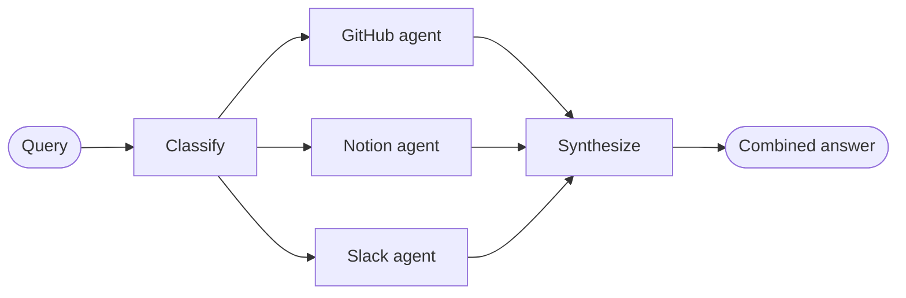

import ChatModelTabsPy from '/snippets/chat-model-tabs.mdx';
import ChatModelTabsJs from '/snippets/chat-model-tabs-js.mdx';

## 概述

**路由器模式**是一种[多 Agent](/oss/langchain/multi-agent)架构，其中路由步骤对输入进行分类并将其导向专门化的 Agent，结果综合成一个组合响应。当你的组织知识分布在不同的**垂直领域** —— 各自需要拥有专门工具和提示词的独立知识领域时，此模式尤为出色。

在本教程中，你将构建一个多源知识库路由器，通过真实的企业场景展示这些优势。系统将协调三个专家：

- **GitHub Agent**：搜索代码、Issue 和 Pull Request。
- **Notion Agent**：搜索内部文档和 Wiki。
- **Slack Agent**：搜索相关的主题和讨论。

当用户问“如何认证 API 请求？”时，路由器将查询分解为针对每个数据源的子问题，并行路由到相关 Agent，然后将结果综合为一个连贯的答案。



### 为什么使用路由器？

路由器模式提供了以下优势：

- **并行执行**：同时查询多个数据源，相比顺序方式减少延迟。
- **专门化 Agent**：每个垂直领域拥有针对其领域优化的专门工具和提示词。
- **选择性路由**：并非每个查询都需要每个数据源 —— 路由器智能地选择相关的垂直领域。
- **精准的子问题**：每个 Agent 收到针对其领域定制的问题，提高结果质量。
- **清晰的综合**：多个数据源的结果被组合成一个单一、连贯的响应。

### 概念

本教程将涵盖以下概念：

- [多 Agent 系统](/oss/langchain/multi-agent)
- 用于工作流编排的 [StateGraph](/oss/langgraph/graph-api)
- 用于并行执行的 [Send API](/oss/langgraph/graph-api#send)

<Tip>
**路由器 vs. 子 Agent**：[子 Agent 模式](/oss/langchain/multi-agent/subagents)也可以路由到多个 Agent。当你需要专门的预处理、自定义路由逻辑或想要对并行执行进行显式控制时，使用路由器模式。当你想让 LLM 动态决定调用哪些 Agent 时，使用子 Agent 模式。
</Tip>

## 设置

### 安装

本教程需要 `langchain` 和 `langgraph` 包：

:::python
<CodeGroup>
```bash pip
pip install langchain langgraph
```
```bash uv
uv add langchain langgraph
```
```bash conda
conda install langchain langgraph -c conda-forge
```
</CodeGroup>
:::

:::js
<CodeGroup>
```bash npm
npm install langchain @langchain/langgraph
```
```bash yarn
yarn add langchain @langchain/langgraph
```
```bash pnpm
pnpm add langchain @langchain/langgraph
```
</CodeGroup>
:::

更多详情请参见我们的[安装指南](/oss/langchain/install)。

### LangSmith

设置 [LangSmith](https://smith.langchain.com) 来检查 Agent 内部的运行情况。然后设置以下环境变量：

:::python
<CodeGroup>
```bash bash
export LANGSMITH_TRACING="true"
export LANGSMITH_API_KEY="..."
```
```python python
import getpass
import os

os.environ["LANGSMITH_TRACING"] = "true"
os.environ["LANGSMITH_API_KEY"] = getpass.getpass()
```
</CodeGroup>
:::

:::js
<CodeGroup>
```bash bash
export LANGSMITH_TRACING="true"
export LANGSMITH_API_KEY="..."
```
```typescript typescript
process.env.LANGSMITH_TRACING = "true";
process.env.LANGSMITH_API_KEY = "...";
```
</CodeGroup>
:::

### 选择 LLM

从 LangChain 的集成套件中选择一个聊天模型：

:::python
<ChatModelTabsPy />
:::

:::js
<ChatModelTabsJs />
:::

## 1. 定义状态

首先，定义状态 Schema。我们使用三种类型：

- **`AgentInput`**：传递给每个子 Agent 的简单状态（仅查询）
- **`AgentOutput`**：每个子 Agent 返回的结果（源名称 + 结果）
- **`RouterState`**：主工作流状态，跟踪查询、分类、结果和最终答案

:::python
```python
from typing import Annotated, Literal, TypedDict
import operator


class AgentInput(TypedDict):
    """Simple input state for each subagent."""
    query: str


class AgentOutput(TypedDict):
    """Output from each subagent."""
    source: str
    result: str


class Classification(TypedDict):
    """A single routing decision: which agent to call with what query."""
    source: Literal["github", "notion", "slack"]
    query: str


class RouterState(TypedDict):
    query: str
    classifications: list[Classification]
    results: Annotated[list[AgentOutput], operator.add]  # Reducer collects parallel results
    final_answer: str
```
:::

:::js
```typescript
import { StateSchema, ReducedValue } from "@langchain/langgraph";
import { z } from "zod/v4";

const AgentOutput = z.object({
  source: z.string(),
  result: z.string(),
});

const RouterState = new StateSchema({
  query: z.string(),
  classifications: z.array(
    z.object({
      source: z.enum(["github", "notion", "slack"]),
      query: z.string(),
    })
  ),
  results: new ReducedValue(
    z.array(AgentOutput).default(() => []),
    { reducer: (current, update) => current.concat(update) }
  ),
  finalAnswer: z.string(),
});
```
:::

`results` 字段使用 **reducer**（Python 中的 `operator.add`，JS 中的 concat 函数）将并行 Agent 执行的输出收集到单个列表中。

## 2. 为每个垂直领域定义工具

为每个知识领域创建工具。在生产系统中，这些将调用实际 API。本教程使用返回模拟数据的存根实现。我们在 3 个垂直领域定义了 7 个工具：GitHub（搜索代码、Issue、PR）、Notion（搜索文档、获取页面）和 Slack（搜索消息、获取主题）。

:::python
```python expandable
from langchain.tools import tool


@tool
def search_code(query: str, repo: str = "main") -> str:
    """Search code in GitHub repositories."""
    return f"Found code matching '{query}' in {repo}: authentication middleware in src/auth.py"


@tool
def search_issues(query: str) -> str:
    """Search GitHub issues and pull requests."""
    return f"Found 3 issues matching '{query}': #142 (API auth docs), #89 (OAuth flow), #203 (token refresh)"


@tool
def search_prs(query: str) -> str:
    """Search pull requests for implementation details."""
    return f"PR #156 added JWT authentication, PR #178 updated OAuth scopes"


@tool
def search_notion(query: str) -> str:
    """Search Notion workspace for documentation."""
    return f"Found documentation: 'API Authentication Guide' - covers OAuth2 flow, API keys, and JWT tokens"


@tool
def get_page(page_id: str) -> str:
    """Get a specific Notion page by ID."""
    return f"Page content: Step-by-step authentication setup instructions"


@tool
def search_slack(query: str) -> str:
    """Search Slack messages and threads."""
    return f"Found discussion in #engineering: 'Use Bearer tokens for API auth, see docs for refresh flow'"


@tool
def get_thread(thread_id: str) -> str:
    """Get a specific Slack thread."""
    return f"Thread discusses best practices for API key rotation"
```
:::

:::js
```typescript expandable
import { tool } from "langchain";
import { z } from "zod";

const searchCode = tool(
  async ({ query, repo }) => {
    return `Found code matching '${query}' in ${repo || "main"}: authentication middleware in src/auth.py`;
  },
  {
    name: "search_code",
    description: "Search code in GitHub repositories.",
    schema: z.object({
      query: z.string(),
      repo: z.string().optional().default("main"),
    }),
  }
);

const searchIssues = tool(
  async ({ query }) => {
    return `Found 3 issues matching '${query}': #142 (API auth docs), #89 (OAuth flow), #203 (token refresh)`;
  },
  {
    name: "search_issues",
    description: "Search GitHub issues and pull requests.",
    schema: z.object({
      query: z.string(),
    }),
  }
);

const searchPrs = tool(
  async ({ query }) => {
    return `PR #156 added JWT authentication, PR #178 updated OAuth scopes`;
  },
  {
    name: "search_prs",
    description: "Search pull requests for implementation details.",
    schema: z.object({
      query: z.string(),
    }),
  }
);

const searchNotion = tool(
  async ({ query }) => {
    return `Found documentation: 'API Authentication Guide' - covers OAuth2 flow, API keys, and JWT tokens`;
  },
  {
    name: "search_notion",
    description: "Search Notion workspace for documentation.",
    schema: z.object({
      query: z.string(),
    }),
  }
);

const getPage = tool(
  async ({ pageId }) => {
    return `Page content: Step-by-step authentication setup instructions`;
  },
  {
    name: "get_page",
    description: "Get a specific Notion page by ID.",
    schema: z.object({
      pageId: z.string(),
    }),
  }
);

const searchSlack = tool(
  async ({ query }) => {
    return `Found discussion in #engineering: 'Use Bearer tokens for API auth, see docs for refresh flow'`;
  },
  {
    name: "search_slack",
    description: "Search Slack messages and threads.",
    schema: z.object({
      query: z.string(),
    }),
  }
);

const getThread = tool(
  async ({ threadId }) => {
    return `Thread discusses best practices for API key rotation`;
  },
  {
    name: "get_thread",
    description: "Get a specific Slack thread.",
    schema: z.object({
      threadId: z.string(),
    }),
  }
);
```
:::

## 3. 创建专门化 Agent

为每个垂直领域创建一个 Agent。每个 Agent 拥有针对其知识源优化的领域专用工具和提示词。三个 Agent 遵循相同的模式 —— 只有工具和系统提示词不同。

:::python
```python expandable
from langchain.agents import create_agent
from langchain.chat_models import init_chat_model

model = init_chat_model("openai:gpt-4.1")

github_agent = create_agent(
    model,
    tools=[search_code, search_issues, search_prs],
    system_prompt=(
        "You are a GitHub expert. Answer questions about code, "
        "API references, and implementation details by searching "
        "repositories, issues, and pull requests."
    ),
)

notion_agent = create_agent(
    model,
    tools=[search_notion, get_page],
    system_prompt=(
        "You are a Notion expert. Answer questions about internal "
        "processes, policies, and team documentation by searching "
        "the organization's Notion workspace."
    ),
)

slack_agent = create_agent(
    model,
    tools=[search_slack, get_thread],
    system_prompt=(
        "You are a Slack expert. Answer questions by searching "
        "relevant threads and discussions where team members have "
        "shared knowledge and solutions."
    ),
)
```
:::

:::js
```typescript expandable
import { createAgent } from "langchain";
import { ChatOpenAI } from "@langchain/openai";

const llm = new ChatOpenAI({ model: "gpt-4.1" });

const githubAgent = createAgent({
  model: llm,
  tools: [searchCode, searchIssues, searchPrs],
  systemPrompt: `
You are a GitHub expert. Answer questions about code,
API references, and implementation details by searching
repositories, issues, and pull requests.
  `.trim(),
});

const notionAgent = createAgent({
  model: llm,
  tools: [searchNotion, getPage],
  systemPrompt: `
You are a Notion expert. Answer questions about internal
processes, policies, and team documentation by searching
the organization's Notion workspace.
  `.trim(),
});

const slackAgent = createAgent({
  model: llm,
  tools: [searchSlack, getThread],
  systemPrompt: `
You are a Slack expert. Answer questions by searching
relevant threads and discussions where team members have
shared knowledge and solutions.
  `.trim(),
});
```
:::

## 4. 构建路由器工作流

现在使用 StateGraph 构建路由器工作流。工作流有四个主要步骤：

1. **分类**：分析查询并确定调用哪些 Agent 以及用什么子问题
2. **路由**：使用 `Send` 并行分发到选定的 Agent
3. **查询 Agent**：每个 Agent 接收一个简单的 `AgentInput` 并返回 `AgentOutput`
4. **综合**：将收集到的结果组合成连贯的响应

:::python
```python
from pydantic import BaseModel, Field
from langgraph.graph import StateGraph, START, END
from langgraph.types import Send

router_llm = init_chat_model("openai:gpt-4.1-mini")


# Define structured output schema for the classifier
class ClassificationResult(BaseModel):  # [!code highlight]
    """Result of classifying a user query into agent-specific sub-questions."""
    classifications: list[Classification] = Field(
        description="List of agents to invoke with their targeted sub-questions"
    )


def classify_query(state: RouterState) -> dict:
    """Classify query and determine which agents to invoke."""
    structured_llm = router_llm.with_structured_output(ClassificationResult)  # [!code highlight]

    result = structured_llm.invoke([
        {
            "role": "system",
            "content": """Analyze this query and determine which knowledge bases to consult.
For each relevant source, generate a targeted sub-question optimized for that source.

Available sources:
- github: Code, API references, implementation details, issues, pull requests
- notion: Internal documentation, processes, policies, team wikis
- slack: Team discussions, informal knowledge sharing, recent conversations

Return ONLY the sources that are relevant to the query. Each source should have
a targeted sub-question optimized for that specific knowledge domain.

Example for "How do I authenticate API requests?":
- github: "What authentication code exists? Search for auth middleware, JWT handling"
- notion: "What authentication documentation exists? Look for API auth guides"
(slack omitted because it's not relevant for this technical question)"""
        },
        {"role": "user", "content": state["query"]}
    ])

    return {"classifications": result.classifications}


def route_to_agents(state: RouterState) -> list[Send]:
    """Fan out to agents based on classifications."""
    return [
        Send(c["source"], {"query": c["query"]})  # [!code highlight]
        for c in state["classifications"]
    ]


def query_github(state: AgentInput) -> dict:
    """Query the GitHub agent."""
    result = github_agent.invoke({
        "messages": [{"role": "user", "content": state["query"]}]  # [!code highlight]
    })
    return {"results": [{"source": "github", "result": result["messages"][-1].content}]}


def query_notion(state: AgentInput) -> dict:
    """Query the Notion agent."""
    result = notion_agent.invoke({
        "messages": [{"role": "user", "content": state["query"]}]  # [!code highlight]
    })
    return {"results": [{"source": "notion", "result": result["messages"][-1].content}]}


def query_slack(state: AgentInput) -> dict:
    """Query the Slack agent."""
    result = slack_agent.invoke({
        "messages": [{"role": "user", "content": state["query"]}]  # [!code highlight]
    })
    return {"results": [{"source": "slack", "result": result["messages"][-1].content}]}


def synthesize_results(state: RouterState) -> dict:
    """Combine results from all agents into a coherent answer."""
    if not state["results"]:
        return {"final_answer": "No results found from any knowledge source."}

    # Format results for synthesis
    formatted = [
        f"**From {r['source'].title()}:**\n{r['result']}"
        for r in state["results"]
    ]

    synthesis_response = router_llm.invoke([
        {
            "role": "system",
            "content": f"""Synthesize these search results to answer the original question: "{state['query']}"

- Combine information from multiple sources without redundancy
- Highlight the most relevant and actionable information
- Note any discrepancies between sources
- Keep the response concise and well-organized"""
        },
        {"role": "user", "content": "\n\n".join(formatted)}
    ])

    return {"final_answer": synthesis_response.content}
```
:::

:::js
```typescript
import { StateGraph, START, END, Send } from "@langchain/langgraph";
import { z } from "zod";

const routerLlm = new ChatOpenAI({ model: "gpt-4.1-mini" });


// Define structured output schema for the classifier
const ClassificationResultSchema = z.object({  // [!code highlight]
  classifications: z.array(z.object({
    source: z.enum(["github", "notion", "slack"]),
    query: z.string(),
  })).describe("List of agents to invoke with their targeted sub-questions"),
});


async function classifyQuery(state: typeof RouterState.State) {
  const structuredLlm = routerLlm.withStructuredOutput(ClassificationResultSchema);  // [!code highlight]

  const result = await structuredLlm.invoke([
    {
      role: "system",
      content: `Analyze this query and determine which knowledge bases to consult.
For each relevant source, generate a targeted sub-question optimized for that source.

Available sources:
- github: Code, API references, implementation details, issues, pull requests
- notion: Internal documentation, processes, policies, team wikis
- slack: Team discussions, informal knowledge sharing, recent conversations

Return ONLY the sources that are relevant to the query. Each source should have
a targeted sub-question optimized for that specific knowledge domain.

Example for "How do I authenticate API requests?":
- github: "What authentication code exists? Search for auth middleware, JWT handling"
- notion: "What authentication documentation exists? Look for API auth guides"
(slack omitted because it's not relevant for this technical question)`
    },
    { role: "user", content: state.query }
  ]);

  return { classifications: result.classifications };
}


function routeToAgents(state: typeof RouterState.State): Send[] {
  return state.classifications.map(
    (c) => new Send(c.source, { query: c.query })  // [!code highlight]
  );
}


async function queryGithub(state: AgentInput) {
  const result = await githubAgent.invoke({
    messages: [{ role: "user", content: state.query }]  // [!code highlight]
  });
  return { results: [{ source: "github", result: result.messages.at(-1)?.content }] };
}


async function queryNotion(state: AgentInput) {
  const result = await notionAgent.invoke({
    messages: [{ role: "user", content: state.query }]  // [!code highlight]
  });
  return { results: [{ source: "notion", result: result.messages.at(-1)?.content }] };
}


async function querySlack(state: AgentInput) {
  const result = await slackAgent.invoke({
    messages: [{ role: "user", content: state.query }]  // [!code highlight]
  });
  return { results: [{ source: "slack", result: result.messages.at(-1)?.content }] };
}


async function synthesizeResults(state: typeof RouterState.State) {
  if (state.results.length === 0) {
    return { finalAnswer: "No results found from any knowledge source." };
  }

  // Format results for synthesis
  const formatted = state.results.map(
    (r) => `**From ${r.source.charAt(0).toUpperCase() + r.source.slice(1)}:**\n${r.result}`
  );

  const synthesisResponse = await routerLlm.invoke([
    {
      role: "system",
      content: `Synthesize these search results to answer the original question: "${state.query}"

- Combine information from multiple sources without redundancy
- Highlight the most relevant and actionable information
- Note any discrepancies between sources
- Keep the response concise and well-organized`
    },
    { role: "user", content: formatted.join("\n\n") }
  ]);

  return { finalAnswer: synthesisResponse.content };
}
```
:::

## 5. 编译工作流

现在通过连接节点和边来组装工作流。关键是使用 `add_conditional_edges` 配合路由函数来实现并行执行：

:::python
```python
workflow = (
    StateGraph(RouterState)
    .add_node("classify", classify_query)
    .add_node("github", query_github)
    .add_node("notion", query_notion)
    .add_node("slack", query_slack)
    .add_node("synthesize", synthesize_results)
    .add_edge(START, "classify")
    .add_conditional_edges("classify", route_to_agents, ["github", "notion", "slack"])
    .add_edge("github", "synthesize")
    .add_edge("notion", "synthesize")
    .add_edge("slack", "synthesize")
    .add_edge("synthesize", END)
    .compile()
)
```
:::

:::js
```typescript
const workflow = new StateGraph(RouterState)
  .addNode("classify", classifyQuery)
  .addNode("github", queryGithub)
  .addNode("notion", queryNotion)
  .addNode("slack", querySlack)
  .addNode("synthesize", synthesizeResults)
  .addEdge(START, "classify")
  .addConditionalEdges("classify", routeToAgents, ["github", "notion", "slack"])
  .addEdge("github", "synthesize")
  .addEdge("notion", "synthesize")
  .addEdge("slack", "synthesize")
  .addEdge("synthesize", END)
  .compile();
```
:::

`add_conditional_edges` 调用通过 `route_to_agents` 函数将分类节点连接到 Agent 节点。当 `route_to_agents` 返回多个 `Send` 对象时，这些节点会并行执行。

## 6. 使用路由器

用跨多个知识领域的查询来测试你的路由器：

:::python
```python
result = workflow.invoke({
    "query": "How do I authenticate API requests?"
})

print("Original query:", result["query"])
print("\nClassifications:")
for c in result["classifications"]:
    print(f"  {c['source']}: {c['query']}")
print("\n" + "=" * 60 + "\n")
print("Final Answer:")
print(result["final_answer"])
```
:::

:::js
```typescript
const result = await workflow.invoke({
  query: "How do I authenticate API requests?"
});

console.log("Original query:", result.query);
console.log("\nClassifications:");
for (const c of result.classifications) {
  console.log(`  ${c.source}: ${c.query}`);
}
console.log("\n" + "=".repeat(60) + "\n");
console.log("Final Answer:");
console.log(result.finalAnswer);
```
:::

预期输出：
```
Original query: How do I authenticate API requests?

Classifications:
  github: What authentication code exists? Search for auth middleware, JWT handling
  notion: What authentication documentation exists? Look for API auth guides

============================================================

Final Answer:
To authenticate API requests, you have several options:

1. **JWT Tokens**: The recommended approach for most use cases.
   Implementation details are in `src/auth.py` (PR #156).

2. **OAuth2 Flow**: For third-party integrations, follow the OAuth2
   flow documented in Notion's 'API Authentication Guide'.

3. **API Keys**: For server-to-server communication, use Bearer tokens
   in the Authorization header.

For token refresh handling, see issue #203 and PR #178 for the latest
OAuth scope updates.
```

路由器分析了查询，进行分类以确定调用哪些 Agent（GitHub 和 Notion，但对于这个技术问题排除了 Slack），并行查询两个 Agent，然后将结果综合成一个连贯的答案。

## 7. 理解架构

路由器工作流遵循一个清晰的模式：

### 分类阶段

`classify_query` 函数使用**结构化输出**来分析用户查询并确定调用哪些 Agent。路由智能就在这里：

- 使用 Pydantic 模型（Python）或 Zod Schema（JS）确保有效输出
- 返回 `Classification` 对象列表，每个包含 `source` 和精准的 `query`
- 只包含相关的数据源 —— 不相关的会被简单省略

这种结构化方法比自由格式 JSON 解析更可靠，且使路由逻辑更加明确。

### 使用 Send 并行执行

`route_to_agents` 函数将分类结果映射为 `Send` 对象。每个 `Send` 指定目标节点和要传递的状态：

:::python
```python
# Classifications: [{"source": "github", "query": "..."}, {"source": "notion", "query": "..."}]
# Becomes:
[Send("github", {"query": "..."}), Send("notion", {"query": "..."})]
# Both agents execute simultaneously, each receiving only the query it needs
```
:::

:::js
```typescript
// Classifications: [{ source: "github", query: "..." }, { source: "notion", query: "..." }]
// Becomes:
[new Send("github", { query: "..." }), new Send("notion", { query: "..." })]
// Both agents execute simultaneously, each receiving only the query it needs
```
:::

每个 Agent 节点收到一个只包含 `query` 字段的简单 `AgentInput` —— 而不是完整的路由器状态。这保持了接口的清晰和明确。

### 使用 Reducer 收集结果

Agent 结果通过 **reducer** 流回主状态。每个 Agent 返回：

:::python
```python
{"results": [{"source": "github", "result": "..."}]}
```
:::

:::js
```typescript
{ results: [{ source: "github", result: "..." }] }
```
:::

reducer（Python 中的 `operator.add`）将这些列表连接起来，将所有并行结果收集到 `state["results"]` 中。

### 综合阶段

所有 Agent 完成后，`synthesize_results` 函数遍历收集到的结果：

- 等待所有并行分支完成（LangGraph 自动处理）
- 引用原始查询以确保答案回应用户的问题
- 组合所有数据源的信息，避免冗余

<Note>
**部分结果**：在本教程中，所有选定的 Agent 必须全部完成后才进行综合。
</Note>

## 8. 完整可运行示例

以下是一个可运行的完整脚本：

<Expandable title="查看完整代码" defaultOpen={false}>

:::python
```python
"""
Multi-Source Knowledge Router Example

This example demonstrates the router pattern for multi-agent systems.
A router classifies queries, routes them to specialized agents in parallel,
and synthesizes results into a combined response.
"""

import operator
from typing import Annotated, Literal, TypedDict

from langchain.agents import create_agent
from langchain.chat_models import init_chat_model
from langchain.tools import tool
from langgraph.graph import StateGraph, START, END
from langgraph.types import Send
from pydantic import BaseModel, Field


# State definitions
class AgentInput(TypedDict):
    """Simple input state for each subagent."""
    query: str


class AgentOutput(TypedDict):
    """Output from each subagent."""
    source: str
    result: str


class Classification(TypedDict):
    """A single routing decision: which agent to call with what query."""
    source: Literal["github", "notion", "slack"]
    query: str


class RouterState(TypedDict):
    query: str
    classifications: list[Classification]
    results: Annotated[list[AgentOutput], operator.add]
    final_answer: str


# Structured output schema for classifier
class ClassificationResult(BaseModel):
    """Result of classifying a user query into agent-specific sub-questions."""
    classifications: list[Classification] = Field(
        description="List of agents to invoke with their targeted sub-questions"
    )


# Tools
@tool
def search_code(query: str, repo: str = "main") -> str:
    """Search code in GitHub repositories."""
    return f"Found code matching '{query}' in {repo}: authentication middleware in src/auth.py"


@tool
def search_issues(query: str) -> str:
    """Search GitHub issues and pull requests."""
    return f"Found 3 issues matching '{query}': #142 (API auth docs), #89 (OAuth flow), #203 (token refresh)"


@tool
def search_prs(query: str) -> str:
    """Search pull requests for implementation details."""
    return f"PR #156 added JWT authentication, PR #178 updated OAuth scopes"


@tool
def search_notion(query: str) -> str:
    """Search Notion workspace for documentation."""
    return f"Found documentation: 'API Authentication Guide' - covers OAuth2 flow, API keys, and JWT tokens"


@tool
def get_page(page_id: str) -> str:
    """Get a specific Notion page by ID."""
    return f"Page content: Step-by-step authentication setup instructions"


@tool
def search_slack(query: str) -> str:
    """Search Slack messages and threads."""
    return f"Found discussion in #engineering: 'Use Bearer tokens for API auth, see docs for refresh flow'"


@tool
def get_thread(thread_id: str) -> str:
    """Get a specific Slack thread."""
    return f"Thread discusses best practices for API key rotation"


# Models and agents
model = init_chat_model("openai:gpt-4.1")
router_llm = init_chat_model("openai:gpt-4.1-mini")

github_agent = create_agent(
    model,
    tools=[search_code, search_issues, search_prs],
    system_prompt=(
        "You are a GitHub expert. Answer questions about code, "
        "API references, and implementation details by searching "
        "repositories, issues, and pull requests."
    ),
)

notion_agent = create_agent(
    model,
    tools=[search_notion, get_page],
    system_prompt=(
        "You are a Notion expert. Answer questions about internal "
        "processes, policies, and team documentation by searching "
        "the organization's Notion workspace."
    ),
)

slack_agent = create_agent(
    model,
    tools=[search_slack, get_thread],
    system_prompt=(
        "You are a Slack expert. Answer questions by searching "
        "relevant threads and discussions where team members have "
        "shared knowledge and solutions."
    ),
)


# Workflow nodes
def classify_query(state: RouterState) -> dict:
    """Classify query and determine which agents to invoke."""
    structured_llm = router_llm.with_structured_output(ClassificationResult)

    result = structured_llm.invoke([
        {
            "role": "system",
            "content": """Analyze this query and determine which knowledge bases to consult.
For each relevant source, generate a targeted sub-question optimized for that source.

Available sources:
- github: Code, API references, implementation details, issues, pull requests
- notion: Internal documentation, processes, policies, team wikis
- slack: Team discussions, informal knowledge sharing, recent conversations

Return ONLY the sources that are relevant to the query."""
        },
        {"role": "user", "content": state["query"]}
    ])

    return {"classifications": result.classifications}


def route_to_agents(state: RouterState) -> list[Send]:
    """Fan out to agents based on classifications."""
    return [
        Send(c["source"], {"query": c["query"]})
        for c in state["classifications"]
    ]


def query_github(state: AgentInput) -> dict:
    """Query the GitHub agent."""
    result = github_agent.invoke({
        "messages": [{"role": "user", "content": state["query"]}]
    })
    return {"results": [{"source": "github", "result": result["messages"][-1].content}]}


def query_notion(state: AgentInput) -> dict:
    """Query the Notion agent."""
    result = notion_agent.invoke({
        "messages": [{"role": "user", "content": state["query"]}]
    })
    return {"results": [{"source": "notion", "result": result["messages"][-1].content}]}


def query_slack(state: AgentInput) -> dict:
    """Query the Slack agent."""
    result = slack_agent.invoke({
        "messages": [{"role": "user", "content": state["query"]}]
    })
    return {"results": [{"source": "slack", "result": result["messages"][-1].content}]}


def synthesize_results(state: RouterState) -> dict:
    """Combine results from all agents into a coherent answer."""
    if not state["results"]:
        return {"final_answer": "No results found from any knowledge source."}

    formatted = [
        f"**From {r['source'].title()}:**\n{r['result']}"
        for r in state["results"]
    ]

    synthesis_response = router_llm.invoke([
        {
            "role": "system",
            "content": f"""Synthesize these search results to answer the original question: "{state['query']}"

- Combine information from multiple sources without redundancy
- Highlight the most relevant and actionable information
- Note any discrepancies between sources
- Keep the response concise and well-organized"""
        },
        {"role": "user", "content": "\n\n".join(formatted)}
    ])

    return {"final_answer": synthesis_response.content}


# Build workflow
workflow = (
    StateGraph(RouterState)
    .add_node("classify", classify_query)
    .add_node("github", query_github)
    .add_node("notion", query_notion)
    .add_node("slack", query_slack)
    .add_node("synthesize", synthesize_results)
    .add_edge(START, "classify")
    .add_conditional_edges("classify", route_to_agents, ["github", "notion", "slack"])
    .add_edge("github", "synthesize")
    .add_edge("notion", "synthesize")
    .add_edge("slack", "synthesize")
    .add_edge("synthesize", END)
    .compile()
)


if __name__ == "__main__":
    result = workflow.invoke({
        "query": "How do I authenticate API requests?"
    })

    print("Original query:", result["query"])
    print("\nClassifications:")
    for c in result["classifications"]:
        print(f"  {c['source']}: {c['query']}")
    print("\n" + "=" * 60 + "\n")
    print("Final Answer:")
    print(result["final_answer"])
```
:::

:::js
```typescript
/**
 * Multi-Source Knowledge Router Example
 *
 * This example demonstrates the router pattern for multi-agent systems.
 * A router classifies queries, routes them to specialized agents in parallel,
 * and synthesizes results into a combined response.
 */
import { z } from "zod/v4";
import { tool } from "langchain";
import { StateGraph, START, END, Send, StateSchema, ReducedValue } from "@langchain/langgraph";

const AgentOutput = z.object({
  source: z.string(),
  result: z.string(),
});

const RouterState = new StateSchema({
  query: z.string(),
  classifications: z.array(
    z.object({
      source: z.enum(["github", "notion", "slack"]),
      query: z.string(),
    })
  ),
  results: new ReducedValue(
    z.array(AgentOutput).default(() => []),
    { reducer: (current, update) => current.concat(update) }
  ),
  finalAnswer: z.string(),
});

const searchCode = tool(
  async ({ query, repo }) => {
    return `Found code matching '${query}' in ${repo || "main"}: authentication middleware in src/auth.py`;
  },
  {
    name: "search_code",
    description: "Search code in GitHub repositories.",
    schema: z.object({
      query: z.string(),
      repo: z.string().optional().default("main"),
    }),
  }
);

const searchIssues = tool(
  async ({ query }) => {
    return `Found 3 issues matching '${query}': #142 (API auth docs), #89 (OAuth flow), #203 (token refresh)`;
  },
  {
    name: "search_issues",
    description: "Search GitHub issues and pull requests.",
    schema: z.object({
      query: z.string(),
    }),
  }
);

const searchPrs = tool(
  async ({ query }) => {
    return `PR #156 added JWT authentication, PR #178 updated OAuth scopes`;
  },
  {
    name: "search_prs",
    description: "Search pull requests for implementation details.",
    schema: z.object({
      query: z.string(),
    }),
  }
);

const searchNotion = tool(
  async ({ query }) => {
    return `Found documentation: 'API Authentication Guide' - covers OAuth2 flow, API keys, and JWT tokens`;
  },
  {
    name: "search_notion",
    description: "Search Notion workspace for documentation.",
    schema: z.object({
      query: z.string(),
    }),
  }
);

const getPage = tool(
  async ({ pageId }) => {
    return `Page content: Step-by-step authentication setup instructions`;
  },
  {
    name: "get_page",
    description: "Get a specific Notion page by ID.",
    schema: z.object({
      pageId: z.string(),
    }),
  }
);

const searchSlack = tool(
  async ({ query }) => {
    return `Found discussion in #engineering: 'Use Bearer tokens for API auth, see docs for refresh flow'`;
  },
  {
    name: "search_slack",
    description: "Search Slack messages and threads.",
    schema: z.object({
      query: z.string(),
    }),
  }
);

const getThread = tool(
  async ({ threadId }) => {
    return `Thread discusses best practices for API key rotation`;
  },
  {
    name: "get_thread",
    description: "Get a specific Slack thread.",
    schema: z.object({
      threadId: z.string(),
    }),
  }
);

import { createAgent } from "langchain";
import { ChatOpenAI } from "@langchain/openai";

const llm = new ChatOpenAI({ model: "gpt-4.1" });

const githubAgent = createAgent({
  model: llm,
  tools: [searchCode, searchIssues, searchPrs],
  systemPrompt: `
You are a GitHub expert. Answer questions about code,
API references, and implementation details by searching
repositories, issues, and pull requests.
  `.trim(),
});

const notionAgent = createAgent({
  model: llm,
  tools: [searchNotion, getPage],
  systemPrompt: `
You are a Notion expert. Answer questions about internal
processes, policies, and team documentation by searching
the organization's Notion workspace.
  `.trim(),
});

const slackAgent = createAgent({
  model: llm,
  tools: [searchSlack, getThread],
  systemPrompt: `
You are a Slack expert. Answer questions by searching
relevant threads and discussions where team members have
shared knowledge and solutions.
  `.trim(),
});

const routerLlm = new ChatOpenAI({ model: "gpt-4.1-mini" });

// Define structured output schema for the classifier
const ClassificationResultSchema = z.object({
  // [!code highlight]
  classifications: z
    .array(
      z.object({
        source: z.enum(["github", "notion", "slack"]),
        query: z.string(),
      })
    )
    .describe("List of agents to invoke with their targeted sub-questions"),
});

async function classifyQuery(state: typeof RouterState.State) {
  const structuredLlm = routerLlm.withStructuredOutput(
    ClassificationResultSchema
  ); // [!code highlight]

  const result = await structuredLlm.invoke([
    {
      role: "system",
      content: `Analyze this query and determine which knowledge bases to consult.
For each relevant source, generate a targeted sub-question optimized for that source.

Available sources:
- github: Code, API references, implementation details, issues, pull requests
- notion: Internal documentation, processes, policies, team wikis
- slack: Team discussions, informal knowledge sharing, recent conversations

Return ONLY the sources that are relevant to the query. Each source should have
a targeted sub-question optimized for that specific knowledge domain.

Example for "How do I authenticate API requests?":
- github: "What authentication code exists? Search for auth middleware, JWT handling"
- notion: "What authentication documentation exists? Look for API auth guides"
(slack omitted because it's not relevant for this technical question)`,
    },
    { role: "user", content: state.query },
  ]);

  return { classifications: result.classifications };
}

function routeToAgents(state: typeof RouterState.State): Send[] {
  return state.classifications.map(
    (c) => new Send(c.source, { query: c.query }) // [!code highlight]
  );
}

async function queryGithub(state: typeof RouterState.State) {
  const result = await githubAgent.invoke({
    messages: [{ role: "user", content: state.query }], // [!code highlight]
  });
  return {
    results: [{ source: "github", result: result.messages.at(-1)?.content }],
  };
}

async function queryNotion(state: typeof RouterState.State) {
  const result = await notionAgent.invoke({
    messages: [{ role: "user", content: state.query }], // [!code highlight]
  });
  return {
    results: [{ source: "notion", result: result.messages.at(-1)?.content }],
  };
}

async function querySlack(state: typeof RouterState.State) {
  const result = await slackAgent.invoke({
    messages: [{ role: "user", content: state.query }], // [!code highlight]
  });
  return {
    results: [{ source: "slack", result: result.messages.at(-1)?.content }],
  };
}

async function synthesizeResults(state: typeof RouterState.State) {
  if (state.results.length === 0) {
    return { finalAnswer: "No results found from any knowledge source." };
  }

  // Format results for synthesis
  const formatted = state.results.map(
    (r) =>
      `**From ${r.source.charAt(0).toUpperCase() + r.source.slice(1)}:**\n${r.result}`
  );

  const synthesisResponse = await routerLlm.invoke([
    {
      role: "system",
      content: `Synthesize these search results to answer the original question: "${state.query}"

- Combine information from multiple sources without redundancy
- Highlight the most relevant and actionable information
- Note any discrepancies between sources
- Keep the response concise and well-organized`,
    },
    { role: "user", content: formatted.join("\n\n") },
  ]);

  return { finalAnswer: synthesisResponse.content };
}

const workflow = new StateGraph(RouterState)
  .addNode("classify", classifyQuery)
  .addNode("github", queryGithub)
  .addNode("notion", queryNotion)
  .addNode("slack", querySlack)
  .addNode("synthesize", synthesizeResults)
  .addEdge(START, "classify")
  .addConditionalEdges("classify", routeToAgents, ["github", "notion", "slack"])
  .addEdge("github", "synthesize")
  .addEdge("notion", "synthesize")
  .addEdge("slack", "synthesize")
  .addEdge("synthesize", END)
  .compile();

const result = await workflow.invoke({
  query: "How do I authenticate API requests?",
});

console.log("Original query:", result.query);
console.log("\nClassifications:");
for (const c of result.classifications) {
  console.log(`  ${c.source}: ${c.query}`);
}
console.log(`\n${"=".repeat(60)}\n`);
console.log("Final Answer:");
console.log(result.finalAnswer);
```
:::

</Expandable>

## 9. 进阶：有状态路由器

到目前为止，我们构建的路由器是**无状态**的 —— 每个请求独立处理，调用之间没有记忆。对于多轮对话，你需要一种**有状态**的方法。

### 工具包装方法

添加对话记忆最简单的方法是将无状态路由器包装为一个工具，供对话式 Agent 调用：

:::python
```python
from langgraph.checkpoint.memory import InMemorySaver


@tool
def search_knowledge_base(query: str) -> str:
    """Search across multiple knowledge sources (GitHub, Notion, Slack).

    Use this to find information about code, documentation, or team discussions.
    """
    result = workflow.invoke({"query": query})
    return result["final_answer"]


conversational_agent = create_agent(
    model,
    tools=[search_knowledge_base],
    system_prompt=(
        "You are a helpful assistant that answers questions about our organization. "
        "Use the search_knowledge_base tool to find information across our code, "
        "documentation, and team discussions."
    ),
    checkpointer=InMemorySaver(),
)
```
:::

:::js
```typescript
import { MemorySaver } from "@langchain/langgraph";

const searchKnowledgeBase = tool(
  async ({ query }) => {
    const result = await workflow.invoke({ query });
    return result.finalAnswer;
  },
  {
    name: "search_knowledge_base",
    description: `Search across multiple knowledge sources (GitHub, Notion, Slack).
Use this to find information about code, documentation, or team discussions.`,
    schema: z.object({
      query: z.string().describe("The search query"),
    }),
  }
);

const conversationalAgent = createAgent({
  model: llm,
  tools: [searchKnowledgeBase],
  systemPrompt: `
You are a helpful assistant that answers questions about our organization.
Use the search_knowledge_base tool to find information across our code,
documentation, and team discussions.
  `.trim(),
  checkpointer: new MemorySaver(),
});
```
:::

这种方法保持路由器无状态，而由对话式 Agent 处理记忆和上下文。用户可以进行多轮对话，Agent 会根据需要调用路由器工具。

:::python
```python
config = {"configurable": {"thread_id": "user-123"}}

result = conversational_agent.invoke(
    {"messages": [{"role": "user", "content": "How do I authenticate API requests?"}]},
    config
)
print(result["messages"][-1].content)

result = conversational_agent.invoke(
    {"messages": [{"role": "user", "content": "What about rate limiting for those endpoints?"}]},
    config
)
print(result["messages"][-1].content)
```
:::

:::js
```typescript
const config = { configurable: { thread_id: "user-123" } };
let conversationalAgentResult = await conversationalAgent.invoke(
  {
    messages: [
      { role: "user", content: "How do I authenticate API requests?" },
    ],
  },
  config
);
console.log(conversationalAgentResult.messages.at(-1)?.content);

conversationalAgentResult = await conversationalAgent.invoke(
  {
    messages: [
      {
        role: "user",
        content: "What about rate limiting for those endpoints?",
      },
    ],
  },
  config
);
console.log(conversationalAgentResult.messages.at(-1)?.content);
```
:::

<Tip>
对于大多数用例，推荐使用工具包装方法。它提供了清晰的职责分离：路由器处理多源查询，而对话式 Agent 处理上下文和记忆。
</Tip>

### 完全持久化方法

如果你需要路由器本身维护状态 —— 例如在路由决策中使用之前的搜索结果 —— 使用[持久化](/oss/langchain/short-term-memory)在路由器级别存储消息历史。

<Warning>
**有状态路由器会增加复杂性。** 当跨轮次路由到不同 Agent 时，如果 Agent 具有不同的风格或提示词，对话可能会感觉不一致。可以考虑使用[交接模式](/oss/langchain/multi-agent/handoffs)或[子 Agent 模式](/oss/langchain/multi-agent/subagents) —— 两者都为与不同 Agent 的多轮对话提供了更清晰的语义。
</Warning>

## 10. 关键要点

路由器模式在以下场景中表现出色：

- **独立的垂直领域**：各自需要专门工具和提示词的独立知识领域
- **并行查询需求**：受益于同时查询多个数据源的问题
- **综合需求**：多个数据源的结果需要组合成连贯的响应

该模式包含三个阶段：**分解**（分析查询并生成精准的子问题）、**路由**（并行执行查询）和**综合**（组合结果）。

<Tip>
**何时使用路由器模式**

当你有多个独立的知识源、需要低延迟的并行查询、并想对路由逻辑进行显式控制时，使用路由器模式。

对于动态工具选择的简单场景，考虑使用[子 Agent 模式](/oss/langchain/multi-agent/subagents)。对于 Agent 需要与用户顺序对话的工作流，考虑使用[交接模式](/oss/langchain/multi-agent/handoffs)。
</Tip>

## 下一步

- 了解[交接](/oss/langchain/multi-agent/handoffs)用于 Agent 间对话
- 探索[子 Agent 模式](/oss/langchain/multi-agent/subagents-personal-assistant)用于集中化编排
- 阅读[多 Agent 概述](/oss/langchain/multi-agent)比较不同模式
- 使用 [LangSmith](https://smith.langchain.com) 调试和监控你的路由器
