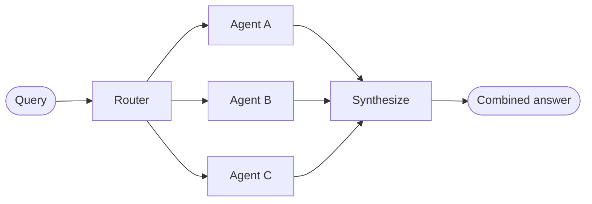

在**路由器**架构中，一个路由步骤对输入进行分类，并将其定向到专门化的 [Agent](/oss/langchain/agents)。当你拥有不同的**垂直领域** —— 各自需要独立 Agent 的独立知识域时，这种模式非常有用。



## 核心特征

* 路由器对查询进行分解
* 零个或多个专门化 Agent 被并行调用
* 结果被综合成一个连贯的响应

## 适用场景

当你拥有不同的垂直领域（各自需要独立 Agent 的独立知识域）、需要并行查询多个数据源并将结果综合成组合响应时，使用路由器模式。

## 基本实现

路由器对查询进行分类并将其定向到相应的 Agent。使用 [`Command`](/oss/langgraph/graph-api#command) 进行单 Agent 路由，或使用 [`Send`](/oss/langgraph/graph-api#send) 进行并行扩散到多个 Agent。

<Tabs>
<Tab title="单个 Agent">

使用 `Command` 路由到单个专门化 Agent：

:::python
```python
from langgraph.types import Command

def classify_query(query: str) -> str:
    """Use LLM to classify query and determine the appropriate agent."""
    # Classification logic here
    ...

def route_query(state: State) -> Command:
    """Route to the appropriate agent based on query classification."""
    active_agent = classify_query(state["query"])

    # Route to the selected agent
    return Command(goto=active_agent)
```
:::
:::js
```typescript
import { z } from "zod";
import { Command } from "@langchain/langgraph";

const ClassificationResult = z.object({
  query: z.string(),
  agent: z.string(),
});

function classifyQuery(query: string): z.infer<typeof ClassificationResult> {
  // Use LLM to classify query and determine the appropriate agent
  // Classification logic here
  ...
}

function routeQuery(state: z.infer<typeof ClassificationResult>) {
  const classification = classifyQuery(state.query);

  // Route to the selected agent
  return new Command({ goto: classification.agent });
}
```
:::

</Tab>
<Tab title="多个 Agent（并行）">

使用 `Send` 并行扩散到多个专门化 Agent：

:::python
```python
from typing import TypedDict
from langgraph.types import Send

class ClassificationResult(TypedDict):
    query: str
    agent: str

def classify_query(query: str) -> list[ClassificationResult]:
    """Use LLM to classify query and determine which agents to invoke."""
    # Classification logic here
    ...

def route_query(state: State):
    """Route to relevant agents based on query classification."""
    classifications = classify_query(state["query"])

    # Fan out to selected agents in parallel
    return [
        Send(c["agent"], {"query": c["query"]})
        for c in classifications
    ]
```
:::
:::js
```typescript
import { z } from "zod";
import { Command } from "@langchain/langgraph";

const ClassificationResult = z.object({
  query: z.string(),
  agent: z.string(),
});

function classifyQuery(query: string): z.infer<typeof ClassificationResult>[] {
  // Use LLM to classify query and determine the appropriate agent
  // Classification logic here
  ...
}

function routeQuery(state: typeof State.State) {
  const classifications = classifyQuery(state.query);

  // Fan out to selected agents in parallel
  return classifications.map(
    (c) => new Send(c.agent, { query: c.query })
  );
}
```
:::

</Tab>
</Tabs>

完整实现请参见以下教程。

<Card title="教程：构建带路由的多源知识库" icon="book" href="/oss/langchain/multi-agent/router-knowledge-base">
构建一个并行查询 GitHub、Notion 和 Slack 的路由器，然后将结果综合成一个连贯的答案。涵盖状态定义、专门化 Agent、使用 `Send` 的并行执行以及结果综合。
</Card>

## 无状态 vs. 有状态

两种方法：
* [**无状态路由器**](#stateless) 独立处理每个请求
* [**有状态路由器**](#stateful) 在请求之间保持对话历史

## 无状态

每个请求独立路由 —— 调用之间没有记忆。如需多轮对话，请参见[有状态路由器](#stateful)。

<Tip>
**路由器 vs. 子 Agent**：两种模式都可以将工作分发到多个 Agent，但它们在路由决策的方式上有所不同：

- **路由器**：一个专门的路由步骤（通常是一次 LLM 调用或基于规则的逻辑），对输入进行分类并分发到 Agent。路由器本身通常不维护对话历史或进行多轮编排 —— 它是一个预处理步骤。
- **子 Agent**：一个主监督 Agent 在持续对话中动态决定调用哪些[子 Agent](/oss/langchain/multi-agent/subagents)。主 Agent 维护上下文，可以跨轮次调用多个子 Agent，并编排复杂的多步骤工作流。

当你有清晰的输入类别并希望确定性或轻量级分类时，使用**路由器**。当你需要灵活的、对话感知的编排，LLM 根据不断变化的上下文决定下一步做什么时，使用**监督器**。
</Tip>


## 有状态

对于多轮对话，你需要在多次调用之间保持上下文。

### 工具包装

最简单的方法：将无状态路由器包装为一个可被对话 Agent 调用的工具。对话 Agent 处理记忆和上下文；路由器保持无状态。这避免了在多个并行 Agent 之间管理对话历史的复杂性。

:::python
```python
@tool
def search_docs(query: str) -> str:
    """Search across multiple documentation sources."""
    result = workflow.invoke({"query": query})  # [!code highlight]
    return result["final_answer"]

# Conversational agent uses the router as a tool
conversational_agent = create_agent(
    model,
    tools=[search_docs],
    prompt="You are a helpful assistant. Use search_docs to answer questions."
)
```
:::
:::js
```typescript
const searchDocs = tool(
  async ({ query }) => {
    const result = await workflow.invoke({ query }); // [!code highlight]
    return result.finalAnswer;
  },
  {
    name: "search_docs",
    description: "Search across multiple documentation sources",
    schema: z.object({
      query: z.string().describe("The search query"),
    }),
  }
);

// Conversational agent uses the router as a tool
const conversationalAgent = createAgent({
  model,
  tools: [searchDocs],
  systemPrompt: "You are a helpful assistant. Use search_docs to answer questions.",
});
```
:::

### 完整持久化

如果你需要路由器本身保持状态，使用[持久化](/oss/langchain/short-term-memory)来存储消息历史。当路由到 Agent 时，从状态中获取之前的消息，并有选择性地将它们包含在 Agent 的上下文中 —— 这是[上下文工程](/oss/langchain/context-engineering)的一个调控手段。

<Warning>
**有状态路由器需要自定义历史管理。** 如果路由器在轮次间切换 Agent，当 Agent 具有不同的语气或提示词时，对话可能会让终端用户感觉不流畅。对于并行调用，你需要在路由器层级维护历史记录（输入和综合输出），并在路由逻辑中利用这些历史。考虑使用[交接模式](/oss/langchain/multi-agent/handoffs)或[子 Agent 模式](/oss/langchain/multi-agent/subagents)作为替代 —— 两者都为多轮对话提供了更清晰的语义。
</Warning>
