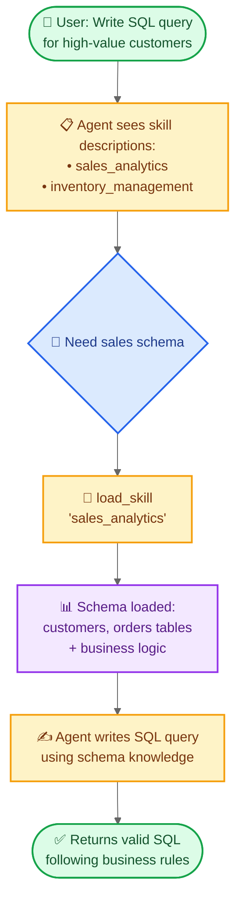

import ChatModelTabsPy from '/snippets/chat-model-tabs.mdx';
import ChatModelTabsJs from '/snippets/chat-model-tabs-js.mdx';

本教程展示如何使用**渐进式披露** —— 一种 Agent 按需而非预先加载信息的上下文管理技术 —— 来实现**技能**（专门化的基于提示词的指令）。Agent 通过工具调用加载技能，而不是动态更改系统提示词，只发现和加载每个任务所需的技能。

**用例：** 假设你要构建一个帮助在大型企业中跨不同业务垂直领域编写 SQL 查询的 Agent。你的组织可能为每个垂直领域有单独的数据存储，或拥有一个包含数千张表的单一巨型数据库。无论哪种情况，预先加载所有 Schema 都会填满上下文窗口。渐进式披露通过仅在需要时加载相关 Schema 来解决这个问题。此架构还允许不同的产品负责人和利益相关者独立贡献和维护其特定业务垂直领域的技能。

**你将构建：** 一个带有两个技能（销售分析和库存管理）的 SQL 查询助手。Agent 在系统提示词中看到轻量级技能描述，然后仅在与用户查询相关时通过工具调用加载完整的数据库 Schema 和业务逻辑。

<Note>
如需更完整的 SQL Agent 示例（包括查询执行、错误纠正和验证），请参见我们的 [SQL Agent 教程](/oss/langchain/sql-agent)。本教程专注于渐进式披露模式，可应用于任何领域。
</Note>

<Tip>
渐进式披露由 Anthropic 推广，作为构建可扩展 Agent 技能系统的技术。该方法使用三层架构（元数据 → 核心内容 → 详细资源），Agent 仅在需要时加载信息。更多关于此技术的信息，请参见 [Equipping agents for the real world with Agent Skills](https://www.anthropic.com/engineering/equipping-agents-for-the-real-world-with-agent-skills)。
</Tip>

## 工作原理

当用户请求 SQL 查询时的流程如下：



**为什么使用渐进式披露：**
- **减少上下文用量** —— 只加载任务所需的 2-3 个技能，而不是所有可用技能
- **支持团队自治** —— 不同团队可以独立开发专门化技能（与其他多 Agent 架构类似）
- **高效扩展** —— 可添加数十或数百个技能而不会填满上下文
- **简化对话历史** —— 单个 Agent，一个对话线程

**什么是技能：** 技能（由 Claude Code 推广）主要是基于提示词的：用于特定业务任务的独立专门指令单元。在 Claude Code 中，技能以文件系统上的目录和文件形式暴露，通过文件操作发现。技能通过提示词引导行为，可以提供工具使用信息或包含供编码 Agent 执行的示例代码。

<Tip>
渐进式披露的技能可以看作 [RAG（检索增强生成）](/oss/langchain/rag)的一种形式，其中每个技能是一个检索单元 —— 不一定基于嵌入或关键词搜索，而是通过浏览内容的工具（如文件操作或本教程中的直接查找）。
</Tip>

**权衡：**
- **延迟**：按需加载技能需要额外的工具调用，会给首次需要每个技能的请求增加延迟
- **工作流控制**：基本实现依赖提示词来引导技能使用 —— 无法强制硬性约束（如“总是先尝试技能 A 再尝试技能 B”），除非添加自定义逻辑

<Tip>
**实现你自己的技能系统**

构建自己的技能实现（如本教程所做）时，核心概念是渐进式披露 —— 按需加载信息。除此之外，你在实现上有完全的灵活性：

- **存储**：数据库、S3、内存数据结构或任何后端
- **发现**：直接查找（本教程）、用于大量技能集合的 RAG、文件系统扫描或 API 调用
- **加载逻辑**：自定义延迟特性并添加搜索技能内容或排序相关性的逻辑
- **副作用**：定义技能加载时发生什么，例如暴露与该技能关联的工具（第 8 节介绍）

这种灵活性让你可以根据性能、存储和工作流控制的具体需求进行优化。
</Tip>

## 设置

### 安装

本教程需要 `langchain` 包：

:::python
<CodeGroup>
```bash pip
pip install langchain
```
```bash uv
uv add langchain
```
```bash conda
conda install langchain -c conda-forge
```
</CodeGroup>
:::

:::js
<CodeGroup>
```bash npm
npm install langchain
```
```bash yarn
yarn add langchain
```
```bash pnpm
pnpm add langchain
```
</CodeGroup>
:::

更多详情请参见我们的[安装指南](/oss/langchain/install)。

### LangSmith

设置 [LangSmith](https://smith.langchain.com) 来检查 Agent 内部的运行情况。然后设置以下环境变量：

:::python
<CodeGroup>
```bash bash
export LANGSMITH_TRACING="true"
export LANGSMITH_API_KEY="..."
```
```python python
import getpass
import os

os.environ["LANGSMITH_TRACING"] = "true"
os.environ["LANGSMITH_API_KEY"] = getpass.getpass()
```
</CodeGroup>
:::

:::js
<CodeGroup>
```bash bash
export LANGSMITH_TRACING="true"
export LANGSMITH_API_KEY="..."
```
```typescript typescript
process.env.LANGSMITH_TRACING = "true";
process.env.LANGSMITH_API_KEY = "...";
```
</CodeGroup>
:::

### 选择 LLM

从 LangChain 的集成套件中选择一个聊天模型：

:::python
<ChatModelTabsPy />
:::

:::js
<ChatModelTabsJs />
:::

## 1. 定义技能

首先，定义技能的结构。每个技能都有一个名称、一个简短描述（显示在系统提示词中）和完整内容（按需加载）：

:::python
```python
from typing import TypedDict

class Skill(TypedDict):  # [!code highlight]
    """A skill that can be progressively disclosed to the agent."""
    name: str  # Unique identifier for the skill
    description: str  # 1-2 sentence description to show in system prompt
    content: str  # Full skill content with detailed instructions
```
:::

:::js
```typescript
import { z } from "zod";

// A skill that can be progressively disclosed to the agent
const SkillSchema = z.object({  // [!code highlight]
  name: z.string(),  // Unique identifier for the skill
  description: z.string(),  // 1-2 sentence description to show in system prompt
  content: z.string(),  // Full skill content with detailed instructions
});

type Skill = z.infer<typeof SkillSchema>;
```
:::

现在定义 SQL 查询助手的示例技能。技能被设计为**描述轻量化**（预先展示给 Agent）但**内容详细**（仅在需要时加载）：

<Accordion title="查看完整技能定义">

:::python
```python
SKILLS: list[Skill] = [
    {
        "name": "sales_analytics",
        "description": "Database schema and business logic for sales data analysis including customers, orders, and revenue.",
        "content": """# Sales Analytics Schema

## Tables

### customers
- customer_id (PRIMARY KEY)
- name
- email
- signup_date
- status (active/inactive)
- customer_tier (bronze/silver/gold/platinum)

### orders
- order_id (PRIMARY KEY)
- customer_id (FOREIGN KEY -> customers)
- order_date
- status (pending/completed/cancelled/refunded)
- total_amount
- sales_region (north/south/east/west)

### order_items
- item_id (PRIMARY KEY)
- order_id (FOREIGN KEY -> orders)
- product_id
- quantity
- unit_price
- discount_percent

## Business Logic

**Active customers**: status = 'active' AND signup_date <= CURRENT_DATE - INTERVAL '90 days'

**Revenue calculation**: Only count orders with status = 'completed'. Use total_amount from orders table, which already accounts for discounts.

**Customer lifetime value (CLV)**: Sum of all completed order amounts for a customer.

**High-value orders**: Orders with total_amount > 1000

## Example Query

-- Get top 10 customers by revenue in the last quarter
SELECT
    c.customer_id,
    c.name,
    c.customer_tier,
    SUM(o.total_amount) as total_revenue
FROM customers c
JOIN orders o ON c.customer_id = o.customer_id
WHERE o.status = 'completed'
  AND o.order_date >= CURRENT_DATE - INTERVAL '3 months'
GROUP BY c.customer_id, c.name, c.customer_tier
ORDER BY total_revenue DESC
LIMIT 10;
""",
    },
    {
        "name": "inventory_management",
        "description": "Database schema and business logic for inventory tracking including products, warehouses, and stock levels.",
        "content": """# Inventory Management Schema

## Tables

### products
- product_id (PRIMARY KEY)
- product_name
- sku
- category
- unit_cost
- reorder_point (minimum stock level before reordering)
- discontinued (boolean)

### warehouses
- warehouse_id (PRIMARY KEY)
- warehouse_name
- location
- capacity

### inventory
- inventory_id (PRIMARY KEY)
- product_id (FOREIGN KEY -> products)
- warehouse_id (FOREIGN KEY -> warehouses)
- quantity_on_hand
- last_updated

### stock_movements
- movement_id (PRIMARY KEY)
- product_id (FOREIGN KEY -> products)
- warehouse_id (FOREIGN KEY -> warehouses)
- movement_type (inbound/outbound/transfer/adjustment)
- quantity (positive for inbound, negative for outbound)
- movement_date
- reference_number

## Business Logic

**Available stock**: quantity_on_hand from inventory table where quantity_on_hand > 0

**Products needing reorder**: Products where total quantity_on_hand across all warehouses is less than or equal to the product's reorder_point

**Active products only**: Exclude products where discontinued = true unless specifically analyzing discontinued items

**Stock valuation**: quantity_on_hand * unit_cost for each product

## Example Query

-- Find products below reorder point across all warehouses
SELECT
    p.product_id,
    p.product_name,
    p.reorder_point,
    SUM(i.quantity_on_hand) as total_stock,
    p.unit_cost,
    (p.reorder_point - SUM(i.quantity_on_hand)) as units_to_reorder
FROM products p
JOIN inventory i ON p.product_id = i.product_id
WHERE p.discontinued = false
GROUP BY p.product_id, p.product_name, p.reorder_point, p.unit_cost
HAVING SUM(i.quantity_on_hand) <= p.reorder_point
ORDER BY units_to_reorder DESC;
""",
    },
]
```
:::

:::js
```typescript
import { context } from "langchain";

const SKILLS: Skill[] = [
  {
    name: "sales_analytics",
    description:
      "Database schema and business logic for sales data analysis including customers, orders, and revenue.",
    content: context`
    # Sales Analytics Schema

    ## Tables

    ### customers
    - customer_id (PRIMARY KEY)
    - name
    - email
    - signup_date
    - status (active/inactive)
    - customer_tier (bronze/silver/gold/platinum)

    ### orders
    - order_id (PRIMARY KEY)
    - customer_id (FOREIGN KEY -> customers)
    - order_date
    - status (pending/completed/cancelled/refunded)
    - total_amount
    - sales_region (north/south/east/west)

    ### order_items
    - item_id (PRIMARY KEY)
    - order_id (FOREIGN KEY -> orders)
    - product_id
    - quantity
    - unit_price
    - discount_percent

    ## Business Logic

    **Active customers**:
    status = 'active' AND signup_date <= CURRENT_DATE - INTERVAL '90 days'

    **Revenue calculation**:
    Only count orders with status = 'completed'.
    Use total_amount from orders table, which already accounts for discounts.

    **Customer lifetime value (CLV)**:
    Sum of all completed order amounts for a customer.

    **High-value orders**:
    Orders with total_amount > 1000

    ## Example Query

    -- Get top 10 customers by revenue in the last quarter
    SELECT
        c.customer_id,
        c.name,
        c.customer_tier,
        SUM(o.total_amount) as total_revenue
    FROM customers c
    JOIN orders o ON c.customer_id = o.customer_id
    WHERE o.status = 'completed'
    AND o.order_date >= CURRENT_DATE - INTERVAL '3 months'
    GROUP BY c.customer_id, c.name, c.customer_tier
    ORDER BY total_revenue DESC
    LIMIT 10;`,
  },
  {
    name: "inventory_management",
    description:
      "Database schema and business logic for inventory tracking including products, warehouses, and stock levels.",
    content: context`
    # Inventory Management Schema

    ## Tables

    ### products
    - product_id (PRIMARY KEY)
    - product_name
    - sku
    - category
    - unit_cost
    - reorder_point (minimum stock level before reordering)
    - discontinued (boolean)

    ### warehouses
    - warehouse_id (PRIMARY KEY)
    - warehouse_name
    - location
    - capacity

    ### inventory
    - inventory_id (PRIMARY KEY)
    - product_id (FOREIGN KEY -> products)
    - warehouse_id (FOREIGN KEY -> warehouses)
    - quantity_on_hand
    - last_updated

    ### stock_movements
    - movement_id (PRIMARY KEY)
    - product_id (FOREIGN KEY -> products)
    - warehouse_id (FOREIGN KEY -> warehouses)
    - movement_type (inbound/outbound/transfer/adjustment)
    - quantity (positive for inbound, negative for outbound)
    - movement_date
    - reference_number

    ## Business Logic

    **Available stock**:
    quantity_on_hand from inventory table where quantity_on_hand > 0

    **Products needing reorder**:
    Products where total quantity_on_hand across all warehouses is less
    than or equal to the product's reorder_point

    **Active products only**:
    Exclude products where discontinued = true unless specifically analyzing discontinued items

    **Stock valuation**:
    quantity_on_hand * unit_cost for each product

    ## Example Query

    -- Find products below reorder point across all warehouses
    SELECT
        p.product_id,
        p.product_name,
        p.reorder_point,
        SUM(i.quantity_on_hand) as total_stock,
        p.unit_cost,
        (p.reorder_point - SUM(i.quantity_on_hand)) as units_to_reorder
    FROM products p
    JOIN inventory i ON p.product_id = i.product_id
    WHERE p.discontinued = false
    GROUP BY p.product_id, p.product_name, p.reorder_point, p.unit_cost
    HAVING SUM(i.quantity_on_hand) <= p.reorder_point
    ORDER BY units_to_reorder DESC;`,
  },
];
```
:::

</Accordion>

## 2. 创建技能加载工具

创建一个按需加载完整技能内容的工具：

:::python
```python
from langchain.tools import tool

@tool  # [!code highlight]
def load_skill(skill_name: str) -> str:
    """Load the full content of a skill into the agent's context.

    Use this when you need detailed information about how to handle a specific
    type of request. This will provide you with comprehensive instructions,
    policies, and guidelines for the skill area.

    Args:
        skill_name: The name of the skill to load (e.g., "expense_reporting", "travel_booking")
    """
    # Find and return the requested skill
    for skill in SKILLS:
        if skill["name"] == skill_name:
            return f"Loaded skill: {skill_name}\n\n{skill['content']}"  # [!code highlight]

    # Skill not found
    available = ", ".join(s["name"] for s in SKILLS)
    return f"Skill '{skill_name}' not found. Available skills: {available}"
```
:::

:::js
```typescript
import { tool } from "langchain";
import { z } from "zod";

const loadSkill = tool(  // [!code highlight]
  async ({ skillName }) => {
    // Find and return the requested skill
    const skill = SKILLS.find((s) => s.name === skillName);
    if (skill) {
      return `Loaded skill: ${skillName}\n\n${skill.content}`;  // [!code highlight]
    }

    // Skill not found
    const available = SKILLS.map((s) => s.name).join(", ");
    return `Skill '${skillName}' not found. Available skills: ${available}`;
  },
  {
    name: "load_skill",
    description: `Load the full content of a skill into the agent's context.

Use this when you need detailed information about how to handle a specific
type of request. This will provide you with comprehensive instructions,
policies, and guidelines for the skill area.`,
    schema: z.object({
      skillName: z.string().describe("The name of the skill to load"),
    }),
  }
);
```
:::

`load_skill` 工具以字符串形式返回完整的技能内容，它会作为 ToolMessage 成为对话的一部分。更多关于创建和使用工具的详情，请参见[工具指南](/oss/langchain/tools)。

## 3. 构建技能中间件

创建自定义中间件，将技能描述注入到系统提示词中。此中间件使技能可被发现，而无需预先加载其完整内容。

<Note>
本指南演示创建自定义中间件。有关中间件概念和模式的全面指南，请参见[自定义中间件文档](/oss/langchain/middleware/custom)。
</Note>

:::python
```python
from langchain.agents.middleware import ModelRequest, ModelResponse, AgentMiddleware
from langchain.messages import SystemMessage
from typing import Callable

class SkillMiddleware(AgentMiddleware):  # [!code highlight]
    """Middleware that injects skill descriptions into the system prompt."""

    # Register the load_skill tool as a class variable
    tools = [load_skill]  # [!code highlight]

    def __init__(self):
        """Initialize and generate the skills prompt from SKILLS."""
        # Build skills prompt from the SKILLS list
        skills_list = []
        for skill in SKILLS:
            skills_list.append(
                f"- **{skill['name']}**: {skill['description']}"
            )
        self.skills_prompt = "\n".join(skills_list)

    def wrap_model_call(
        self,
        request: ModelRequest,
        handler: Callable[[ModelRequest], ModelResponse],
    ) -> ModelResponse:
        """Sync: Inject skill descriptions into system prompt."""
        # Build the skills addendum
        skills_addendum = ( # [!code highlight]
            f"\n\n## Available Skills\n\n{self.skills_prompt}\n\n" # [!code highlight]
            "Use the load_skill tool when you need detailed information " # [!code highlight]
            "about handling a specific type of request." # [!code highlight]
        )

        # Append to system message content blocks
        new_content = list(request.system_message.content_blocks) + [
            {"type": "text", "text": skills_addendum}
        ]
        new_system_message = SystemMessage(content=new_content)
        modified_request = request.override(system_message=new_system_message)
        return handler(modified_request)
```
:::

:::js
```typescript
import { createMiddleware } from "langchain";

// Build skills prompt from the SKILLS list
const skillsPrompt = SKILLS.map(
  (skill) => `- **${skill.name}**: ${skill.description}`
).join("\n");

const skillMiddleware = createMiddleware({  // [!code highlight]
  name: "skillMiddleware",
  tools: [loadSkill],  // [!code highlight]
  wrapModelCall: async (request, handler) => {
    // Build the skills addendum
    const skillsAddendum =  // [!code highlight]
      `\n\n## Available Skills\n\n${skillsPrompt}\n\n` +  // [!code highlight]
      "Use the load_skill tool when you need detailed information " +  // [!code highlight]
      "about handling a specific type of request.";  // [!code highlight]

    // Append to system prompt
    const newSystemPrompt = request.systemPrompt + skillsAddendum;

    return handler({
      ...request,
      systemPrompt: newSystemPrompt,
    });
  },
});
```
:::

中间件将技能描述追加到系统提示词中，让 Agent 了解可用技能而无需加载完整内容。`load_skill` 工具作为类变量注册，使其对 Agent 可用。

<Note>
**生产环境考虑**：本教程为简单起见在 `__init__` 中加载技能列表。在生产系统中，你可能希望在 `before_agent` 钩子中加载技能，以便定期刷新以反映最新变更（例如添加新技能或修改现有技能）。详见 [before_agent 钩子文档](/oss/langchain/middleware/custom#before_agent)。
</Note>

## 4. 创建支持技能的 Agent

现在使用技能中间件和用于状态持久化的 checkpointer 创建 Agent：

:::python
```python
from langchain.agents import create_agent
from langgraph.checkpoint.memory import InMemorySaver

# Create the agent with skill support
agent = create_agent(
    model,
    system_prompt=(
        "You are a SQL query assistant that helps users "
        "write queries against business databases."
    ),
    middleware=[SkillMiddleware()],  # [!code highlight]
    checkpointer=InMemorySaver(),
)
```
:::

:::js
```typescript
import { createAgent } from "langchain";
import { MemorySaver } from "@langchain/langgraph";

// Create the agent with skill support
const agent = createAgent({
  model,
  systemPrompt:
    "You are a SQL query assistant that helps users " +
    "write queries against business databases.",
  middleware: [skillMiddleware],  // [!code highlight]
  checkpointer: new MemorySaver(),
});
```
:::

Agent 现在可以在系统提示词中访问技能描述，并可以调用 `load_skill` 检索完整的技能内容。checkpointer 在对话轮次间维护对话历史。

## 5. 测试渐进式披露

使用需要技能特定知识的问题测试 Agent：

:::python
```python
import uuid

# Configuration for this conversation thread
thread_id = str(uuid.uuid4())
config = {"configurable": {"thread_id": thread_id}}

# Ask for a SQL query
result = agent.invoke(  # [!code highlight]
    {
        "messages": [
            {
                "role": "user",
                "content": (
                    "Write a SQL query to find all customers "
                    "who made orders over $1000 in the last month"
                ),
            }
        ]
    },
    config
)

# Print the conversation
for message in result["messages"]:
    if hasattr(message, 'pretty_print'):
        message.pretty_print()
    else:
        print(f"{message.type}: {message.content}")
```
:::

:::js
```typescript
import { v4 as uuidv4 } from "uuid";

// Configuration for this conversation thread
const threadId = uuidv4();
const config = { configurable: { thread_id: threadId } };

// Ask for a SQL query
const result = await agent.invoke(  // [!code highlight]
  {
    messages: [
      {
        role: "user",
        content:
          "Write a SQL query to find all customers " +
          "who made orders over $1000 in the last month",
      },
    ],
  },
  config
);

// Print the conversation
for (const message of result.messages) {
  console.log(`${message._getType()}: ${message.content}`);
}
```
:::

Expected output:

```
================================ Human Message =================================

Write a SQL query to find all customers who made orders over $1000 in the last month
================================== Ai Message ==================================
Tool Calls:
  load_skill (call_abc123)
 Call ID: call_abc123
  Args:
    skill_name: sales_analytics
================================= Tool Message =================================
Name: load_skill

Loaded skill: sales_analytics

# Sales Analytics Schema

## Tables

### customers
- customer_id (PRIMARY KEY)
- name
- email
- signup_date
- status (active/inactive)
- customer_tier (bronze/silver/gold/platinum)

### orders
- order_id (PRIMARY KEY)
- customer_id (FOREIGN KEY -> customers)
- order_date
- status (pending/completed/cancelled/refunded)
- total_amount
- sales_region (north/south/east/west)

[... rest of schema ...]

## Business Logic

**High-value orders**: Orders with `total_amount > 1000`
**Revenue calculation**: Only count orders with `status = 'completed'`

================================== Ai Message ==================================

Here's a SQL query to find all customers who made orders over $1000 in the last month:

\`\`\`sql
SELECT DISTINCT
    c.customer_id,
    c.name,
    c.email,
    c.customer_tier
FROM customers c
JOIN orders o ON c.customer_id = o.customer_id
WHERE o.total_amount > 1000
  AND o.status = 'completed'
  AND o.order_date >= CURRENT_DATE - INTERVAL '1 month'
ORDER BY c.customer_id;
\`\`\`

This query:
- Joins customers with their orders
- Filters for high-value orders (>$1000) using the total_amount field
- Only includes completed orders (as per the business logic)
- Restricts to orders from the last month
- Returns distinct customers to avoid duplicates if they made multiple qualifying orders
```

Agent 在系统提示词中看到了轻量级的技能描述，识别出问题需要销售数据库知识，调用 `load_skill("sales_analytics")` 获取完整的 Schema 和业务逻辑，然后利用这些信息按照数据库规范编写了正确的查询。

## 6. 进阶：使用自定义状态添加约束

<Accordion title="可选：跟踪已加载技能并强制工具约束">

你可以添加约束来强制某些工具只有在加载了特定技能后才可用。这需要在自定义 Agent 状态中跟踪哪些技能已被加载。

### 定义自定义状态

首先，扩展 Agent 状态以跟踪已加载的技能：

:::python
```python
from langchain.agents.middleware import AgentState

class CustomState(AgentState):  # [!code highlight]
    skills_loaded: NotRequired[list[str]]  # Track which skills have been loaded  # [!code highlight]
```
:::

:::js
```typescript
import { StateSchema } from "@langchain/langgraph";
import { z } from "zod";

const CustomState = new StateSchema({
  skillsLoaded: z.array(z.string()).optional(),  // Track which skills have been loaded  // [!code highlight]
});
```
:::

### Update load_skill to modify state

Modify the `load_skill` tool to update state when a skill is loaded:

:::python
```python
from langgraph.types import Command  # [!code highlight]
from langchain.tools import tool, ToolRuntime
from langchain.messages import ToolMessage  # [!code highlight]

@tool
def load_skill(skill_name: str, runtime: ToolRuntime) -> Command:  # [!code highlight]
    """Load the full content of a skill into the agent's context.

    Use this when you need detailed information about how to handle a specific
    type of request. This will provide you with comprehensive instructions,
    policies, and guidelines for the skill area.

    Args:
        skill_name: The name of the skill to load
    """
    # Find and return the requested skill
    for skill in SKILLS:
        if skill["name"] == skill_name:
            skill_content = f"Loaded skill: {skill_name}\n\n{skill['content']}"

            # Update state to track loaded skill
            return Command(  # [!code highlight]
                update={  # [!code highlight]
                    "messages": [  # [!code highlight]
                        ToolMessage(  # [!code highlight]
                            content=skill_content,  # [!code highlight]
                            tool_call_id=runtime.tool_call_id,  # [!code highlight]
                        )  # [!code highlight]
                    ],  # [!code highlight]
                    "skills_loaded": [skill_name],  # [!code highlight]
                }  # [!code highlight]
            )  # [!code highlight]

    # Skill not found
    available = ", ".join(s["name"] for s in SKILLS)
    return Command(
        update={
            "messages": [
                ToolMessage(
                    content=f"Skill '{skill_name}' not found. Available skills: {available}",
                    tool_call_id=runtime.tool_call_id,
                )
            ]
        }
    )
```
:::

:::js
```typescript
import { tool, ToolMessage, type ToolRuntime } from "langchain";
import { Command } from "@langchain/langgraph";  // [!code highlight]
import { z } from "zod";

const loadSkill = tool(  // [!code highlight]
  async ({ skillName }, runtime: ToolRuntime<typeof CustomState.State>) => {
    // Find and return the requested skill
    const skill = SKILLS.find((s) => s.name === skillName);

    if (skill) {
      const skillContent = `Loaded skill: ${skillName}\n\n${skill.content}`;

      // Update state to track loaded skill
      return new Command({  // [!code highlight]
        update: {  // [!code highlight]
          messages: [  // [!code highlight]
            new ToolMessage({  // [!code highlight]
              content: skillContent,  // [!code highlight]
              tool_call_id: runtime.toolCallId,  // [!code highlight]
            }),  // [!code highlight]
          ],  // [!code highlight]
          skillsLoaded: [skillName],  // [!code highlight]
        },  // [!code highlight]
      });  // [!code highlight]
    }

    // Skill not found
    const available = SKILLS.map((s) => s.name).join(", ");
    return new Command({
      update: {
        messages: [
          new ToolMessage({
            content: `Skill '${skillName}' not found. Available skills: ${available}`,
            tool_call_id: runtime.toolCallId,
          }),
        ],
      },
    });
  },
  {
    name: "load_skill",
    description: `Load the full content of a skill into the agent's context.`,
    schema: z.object({
      skillName: z.string().describe("The name of the skill to load"),
    }),
  }
);
```
:::

### Create constrained tool

Create a tool that's only usable after a specific skill has been loaded:

:::python
```python
@tool
def write_sql_query(  # [!code highlight]
    query: str,
    vertical: str,
    runtime: ToolRuntime,
) -> str:
    """Write and validate a SQL query for a specific business vertical.

    This tool helps format and validate SQL queries. You must load the
    appropriate skill first to understand the database schema.

    Args:
        query: The SQL query to write
        vertical: The business vertical (sales_analytics or inventory_management)
    """
    # Check if the required skill has been loaded
    skills_loaded = runtime.state.get("skills_loaded", [])  # [!code highlight]

    if vertical not in skills_loaded:  # [!code highlight]
        return (  # [!code highlight]
            f"Error: You must load the '{vertical}' skill first "  # [!code highlight]
            f"to understand the database schema before writing queries. "  # [!code highlight]
            f"Use load_skill('{vertical}') to load the schema."  # [!code highlight]
        )  # [!code highlight]

    # Validate and format the query
    return (
        f"SQL Query for {vertical}:\n\n"
        f"```sql\n{query}\n```\n\n"
        f"✓ Query validated against {vertical} schema\n"
        f"Ready to execute against the database."
    )
```
:::

:::js
```typescript
const writeSqlQuery = tool(  // [!code highlight]
  async ({ query, vertical }, runtime: ToolRuntime<typeof CustomState.State>) => {
    // Check if the required skill has been loaded
    const skillsLoaded = runtime.state.skillsLoaded ?? [];  // [!code highlight]

    if (!skillsLoaded.includes(vertical)) {  // [!code highlight]
      return (  // [!code highlight]
        `Error: You must load the '${vertical}' skill first ` +  // [!code highlight]
        `to understand the database schema before writing queries. ` +  // [!code highlight]
        `Use load_skill('${vertical}') to load the schema.`  // [!code highlight]
      );  // [!code highlight]
    }

    // Validate and format the query
    return (
      `SQL Query for ${vertical}:\n\n` +
      `\`\`\`sql\n${query}\n\`\`\`\n\n` +
      `✓ Query validated against ${vertical} schema\n` +
      `Ready to execute against the database.`
    );
  },
  {
    name: "write_sql_query",
    description: `Write and validate a SQL query for a specific business vertical.

This tool helps format and validate SQL queries. You must load the
appropriate skill first to understand the database schema.`,
    schema: z.object({
      query: z.string().describe("The SQL query to write"),
      vertical: z.string().describe("The business vertical (sales_analytics or inventory_management)"),
    }),
  }
);
```
:::

### Update middleware and agent

Update the middleware to use the custom state schema:

:::python
```python
class SkillMiddleware(AgentMiddleware[CustomState]):  # [!code highlight]
    """Middleware that injects skill descriptions into the system prompt."""

    state_schema = CustomState  # [!code highlight]
    tools = [load_skill, write_sql_query]  # [!code highlight]

    # ... rest of the middleware implementation stays the same
```
:::

:::js
```typescript
const skillMiddleware = createMiddleware({  // [!code highlight]
  name: "skillMiddleware",
  stateSchema: CustomState,  // [!code highlight]
  tools: [loadSkill, writeSqlQuery],  // [!code highlight]
  // ... rest of the middleware implementation stays the same
});
```
:::

Create the agent with the middleware that registers the constrained tool:

:::python
```python
agent = create_agent(
    model,
    system_prompt=(
        "You are a SQL query assistant that helps users "
        "write queries against business databases."
    ),
    middleware=[SkillMiddleware()],  # [!code highlight]
    checkpointer=InMemorySaver(),
)
```
:::

:::js
```typescript
const agent = createAgent({
  model,
  systemPrompt:
    "You are a SQL query assistant that helps users " +
    "write queries against business databases.",
  middleware: [skillMiddleware],  // [!code highlight]
  checkpointer: new MemorySaver(),
});
```
:::

现在如果 Agent 在加载所需技能之前尝试使用 `write_sql_query`，它将收到一条错误消息，提示它先加载相应的技能（如 `sales_analytics` 或 `inventory_management`）。这确保了 Agent 在尝试验证查询之前具有必要的 Schema 知识。

</Accordion>

## 完整示例

<Accordion title="查看完整可运行脚本">

以下是将本教程所有部分组合在一起的完整可运行实现：

:::python
```python
import uuid
from typing import TypedDict, NotRequired
from langchain.tools import tool
from langchain.agents import create_agent
from langchain.agents.middleware import ModelRequest, ModelResponse, AgentMiddleware
from langchain.messages import SystemMessage
from langgraph.checkpoint.memory import InMemorySaver
from typing import Callable

# Define skill structure
class Skill(TypedDict):
    """A skill that can be progressively disclosed to the agent."""
    name: str
    description: str
    content: str

# Define skills with schemas and business logic
SKILLS: list[Skill] = [
    {
        "name": "sales_analytics",
        "description": "Database schema and business logic for sales data analysis including customers, orders, and revenue.",
        "content": """# Sales Analytics Schema

## Tables

### customers
- customer_id (PRIMARY KEY)
- name
- email
- signup_date
- status (active/inactive)
- customer_tier (bronze/silver/gold/platinum)

### orders
- order_id (PRIMARY KEY)
- customer_id (FOREIGN KEY -> customers)
- order_date
- status (pending/completed/cancelled/refunded)
- total_amount
- sales_region (north/south/east/west)

### order_items
- item_id (PRIMARY KEY)
- order_id (FOREIGN KEY -> orders)
- product_id
- quantity
- unit_price
- discount_percent

## Business Logic

**Active customers**: status = 'active' AND signup_date <= CURRENT_DATE - INTERVAL '90 days'

**Revenue calculation**: Only count orders with status = 'completed'. Use total_amount from orders table, which already accounts for discounts.

**Customer lifetime value (CLV)**: Sum of all completed order amounts for a customer.

**High-value orders**: Orders with total_amount > 1000

## Example Query

-- Get top 10 customers by revenue in the last quarter
SELECT
    c.customer_id,
    c.name,
    c.customer_tier,
    SUM(o.total_amount) as total_revenue
FROM customers c
JOIN orders o ON c.customer_id = o.customer_id
WHERE o.status = 'completed'
  AND o.order_date >= CURRENT_DATE - INTERVAL '3 months'
GROUP BY c.customer_id, c.name, c.customer_tier
ORDER BY total_revenue DESC
LIMIT 10;
""",
    },
    {
        "name": "inventory_management",
        "description": "Database schema and business logic for inventory tracking including products, warehouses, and stock levels.",
        "content": """# Inventory Management Schema

## Tables

### products
- product_id (PRIMARY KEY)
- product_name
- sku
- category
- unit_cost
- reorder_point (minimum stock level before reordering)
- discontinued (boolean)

### warehouses
- warehouse_id (PRIMARY KEY)
- warehouse_name
- location
- capacity

### inventory
- inventory_id (PRIMARY KEY)
- product_id (FOREIGN KEY -> products)
- warehouse_id (FOREIGN KEY -> warehouses)
- quantity_on_hand
- last_updated

### stock_movements
- movement_id (PRIMARY KEY)
- product_id (FOREIGN KEY -> products)
- warehouse_id (FOREIGN KEY -> warehouses)
- movement_type (inbound/outbound/transfer/adjustment)
- quantity (positive for inbound, negative for outbound)
- movement_date
- reference_number

## Business Logic

**Available stock**: quantity_on_hand from inventory table where quantity_on_hand > 0

**Products needing reorder**: Products where total quantity_on_hand across all warehouses is less than or equal to the product's reorder_point

**Active products only**: Exclude products where discontinued = true unless specifically analyzing discontinued items

**Stock valuation**: quantity_on_hand * unit_cost for each product

## Example Query

-- Find products below reorder point across all warehouses
SELECT
    p.product_id,
    p.product_name,
    p.reorder_point,
    SUM(i.quantity_on_hand) as total_stock,
    p.unit_cost,
    (p.reorder_point - SUM(i.quantity_on_hand)) as units_to_reorder
FROM products p
JOIN inventory i ON p.product_id = i.product_id
WHERE p.discontinued = false
GROUP BY p.product_id, p.product_name, p.reorder_point, p.unit_cost
HAVING SUM(i.quantity_on_hand) <= p.reorder_point
ORDER BY units_to_reorder DESC;
""",
    },
]

# Create skill loading tool
@tool
def load_skill(skill_name: str) -> str:
    """Load the full content of a skill into the agent's context.

    Use this when you need detailed information about how to handle a specific
    type of request. This will provide you with comprehensive instructions,
    policies, and guidelines for the skill area.

    Args:
        skill_name: The name of the skill to load (e.g., "sales_analytics", "inventory_management")
    """
    # Find and return the requested skill
    for skill in SKILLS:
        if skill["name"] == skill_name:
            return f"Loaded skill: {skill_name}\n\n{skill['content']}"

    # Skill not found
    available = ", ".join(s["name"] for s in SKILLS)
    return f"Skill '{skill_name}' not found. Available skills: {available}"

# Create skill middleware
class SkillMiddleware(AgentMiddleware):
    """Middleware that injects skill descriptions into the system prompt."""

    # Register the load_skill tool as a class variable
    tools = [load_skill]

    def __init__(self):
        """Initialize and generate the skills prompt from SKILLS."""
        # Build skills prompt from the SKILLS list
        skills_list = []
        for skill in SKILLS:
            skills_list.append(
                f"- **{skill['name']}**: {skill['description']}"
            )
        self.skills_prompt = "\n".join(skills_list)

    def wrap_model_call(
        self,
        request: ModelRequest,
        handler: Callable[[ModelRequest], ModelResponse],
    ) -> ModelResponse:
        """Sync: Inject skill descriptions into system prompt."""
        # Build the skills addendum
        skills_addendum = (
            f"\n\n## Available Skills\n\n{self.skills_prompt}\n\n"
            "Use the load_skill tool when you need detailed information "
            "about handling a specific type of request."
        )

        # Append to system message content blocks
        new_content = list(request.system_message.content_blocks) + [
            {"type": "text", "text": skills_addendum}
        ]
        new_system_message = SystemMessage(content=new_content)
        modified_request = request.override(system_message=new_system_message)
        return handler(modified_request)

# Initialize your chat model (replace with your model)
# Example: from langchain_anthropic import ChatAnthropic
# model = ChatAnthropic(model="claude-3-5-sonnet-20241022")
from langchain_openai import ChatOpenAI
model = ChatOpenAI(model="gpt-4")

# Create the agent with skill support
agent = create_agent(
    model,
    system_prompt=(
        "You are a SQL query assistant that helps users "
        "write queries against business databases."
    ),
    middleware=[SkillMiddleware()],
    checkpointer=InMemorySaver(),
)

# Example usage
if __name__ == "__main__":
    # Configuration for this conversation thread
    thread_id = str(uuid.uuid4())
    config = {"configurable": {"thread_id": thread_id}}

    # Ask for a SQL query
    result = agent.invoke(
        {
            "messages": [
                {
                    "role": "user",
                    "content": (
                        "Write a SQL query to find all customers "
                        "who made orders over $1000 in the last month"
                    ),
                }
            ]
        },
        config
    )

    # Print the conversation
    for message in result["messages"]:
        if hasattr(message, 'pretty_print'):
            message.pretty_print()
        else:
            print(f"{message.type}: {message.content}")
```
:::

:::js
```typescript
import {
  tool,
  createAgent,
  createMiddleware,
  ToolMessage,
  context,
  type ToolRuntime,
} from "langchain";
import { MemorySaver, Command } from "@langchain/langgraph";
import { ChatOpenAI } from "@langchain/openai";
import { v4 as uuidv4 } from "uuid";
import { z } from "zod";

// A skill that can be progressively disclosed to the agent
const SkillSchema = z.object({
  name: z.string(), // Unique identifier for the skill
  description: z.string(), // 1-2 sentence description to show in system prompt
  content: z.string(), // Full skill content with detailed instructions
});

type Skill = z.infer<typeof SkillSchema>;

const SKILLS: Skill[] = [
  {
    name: "sales_analytics",
    description:
      "Database schema and business logic for sales data analysis including customers, orders, and revenue.",
    content: context`
    # Sales Analytics Schema

    ## Tables

    ### customers
    - customer_id (PRIMARY KEY)
    - name
    - email
    - signup_date
    - status (active/inactive)
    - customer_tier (bronze/silver/gold/platinum)

    ### orders
    - order_id (PRIMARY KEY)
    - customer_id (FOREIGN KEY -> customers)
    - order_date
    - status (pending/completed/cancelled/refunded)
    - total_amount
    - sales_region (north/south/east/west)

    ### order_items
    - item_id (PRIMARY KEY)
    - order_id (FOREIGN KEY -> orders)
    - product_id
    - quantity
    - unit_price
    - discount_percent

    ## Business Logic

    **Active customers**: status = 'active' AND signup_date <= CURRENT_DATE - INTERVAL '90 days'

    **Revenue calculation**:
    Only count orders with status = 'completed'. Use total_amount from orders table,
    which already accounts for discounts.

    **Customer lifetime value (CLV)**:
    Sum of all completed order amounts for a customer.

    **High-value orders**:
    Orders with total_amount > 1000

    ## Example Query
    -- Get top 10 customers by revenue in the last quarter
    SELECT
        c.customer_id,
        c.name,
        c.customer_tier,
        SUM(o.total_amount) as total_revenue
    FROM customers c
    JOIN orders o ON c.customer_id = o.customer_id
    WHERE o.status = 'completed'
    AND o.order_date >= CURRENT_DATE - INTERVAL '3 months'
    GROUP BY c.customer_id, c.name, c.customer_tier
    ORDER BY total_revenue DESC
    LIMIT 10;`,
  },
  {
    name: "inventory_management",
    description:
      "Database schema and business logic for inventory tracking including products, warehouses, and stock levels.",
    content: context`
    # Inventory Management Schema

    ## Tables

    ### products
    - product_id (PRIMARY KEY)
    - product_name
    - sku
    - category
    - unit_cost
    - reorder_point (minimum stock level before reordering)
    - discontinued (boolean)

    ### warehouses
    - warehouse_id (PRIMARY KEY)
    - warehouse_name
    - location
    - capacity

    ### inventory
    - inventory_id (PRIMARY KEY)
    - product_id (FOREIGN KEY -> products)
    - warehouse_id (FOREIGN KEY -> warehouses)
    - quantity_on_hand
    - last_updated

    ### stock_movements
    - movement_id (PRIMARY KEY)
    - product_id (FOREIGN KEY -> products)
    - warehouse_id (FOREIGN KEY -> warehouses)
    - movement_type (inbound/outbound/transfer/adjustment)
    - quantity (positive for inbound, negative for outbound)
    - movement_date
    - reference_number

    ## Business Logic

    **Available stock**:
    quantity_on_hand from inventory table where quantity_on_hand > 0

    **Products needing reorder**:
    Products where total quantity_on_hand across all warehouses is
    less than or equal to the product's reorder_point

    **Active products only**:
    Exclude products where discontinued = true unless specifically
    analyzing discontinued items

    **Stock valuation**:
    quantity_on_hand * unit_cost for each product

    ## Example Query

    -- Find products below reorder point across all warehouses
    SELECT
        p.product_id,
        p.product_name,
        p.reorder_point,
        SUM(i.quantity_on_hand) as total_stock,
        p.unit_cost,
        (p.reorder_point - SUM(i.quantity_on_hand)) as units_to_reorder
    FROM products p
    JOIN inventory i ON p.product_id = i.product_id
    WHERE p.discontinued = false
    GROUP BY p.product_id, p.product_name, p.reorder_point, p.unit_cost
    HAVING SUM(i.quantity_on_hand) <= p.reorder_point
    ORDER BY units_to_reorder DESC;`,
  },
];

// const loadSkill = tool(
//   async ({ skillName }) => {
//     // Find and return the requested skill
//     const skill = SKILLS.find((s) => s.name === skillName);
//     if (skill) {
//       return `Loaded skill: ${skillName}\n\n${skill.content}`;
//     }

//     // Skill not found
//     const available = SKILLS.map((s) => s.name).join(", ");
//     return `Skill '${skillName}' not found. Available skills: ${available}`;
//   },
//   {
//     name: "load_skill",
//     description: `Load the full content of a skill into the agent's context.

// Use this when you need detailed information about how to handle a specific
// type of request. This will provide you with comprehensive instructions,
// policies, and guidelines for the skill area.`,
//     schema: z.object({
//       skillName: z.string().describe("The name of the skill to load"),
//     }),
//   }
// );

// Build skills prompt from the SKILLS list
const skillsPrompt = SKILLS.map(
  (skill) => `- **${skill.name}**: ${skill.description}`
).join("\n");

const skillMiddleware = createMiddleware({
  name: "skillMiddleware",
  tools: [loadSkill],
  wrapModelCall: async (request, handler) => {
    // Build the skills addendum
    const skillsAddendum =
      `\n\n## Available Skills\n\n${skillsPrompt}\n\n` +
      "Use the load_skill tool when you need detailed information " +
      "about handling a specific type of request.";

    // Append to system prompt
    const newSystemPrompt = request.systemPrompt + skillsAddendum;

    return handler({
      ...request,
      systemPrompt: newSystemPrompt,
    });
  },
});

const model = new ChatOpenAI({
  model: "gpt-4.1-mini",
  temperature: 0,
});

// Create the agent with skill support
const agent = createAgent({
  model,
  systemPrompt:
    "You are a SQL query assistant that helps users " +
    "write queries against business databases.",
  middleware: [skillMiddleware],
  checkpointer: new MemorySaver(),
});

// Configuration for this conversation thread
const threadId = uuidv4();
const config = { configurable: { thread_id: threadId } };

// Ask for a SQL query
const result = await agent.invoke(
  {
    messages: [
      {
        role: "user",
        content:
          "Write a SQL query to find all customers " +
          "who made orders over $1000 in the last month",
      },
    ],
  },
  config
);

// Print the conversation
for (const message of result.messages) {
  console.log(`${message.type}: ${message.content}`);
}
```
:::

This complete example includes:
- Skill definitions with full database schemas
- The `load_skill` tool for on-demand loading
- `SkillMiddleware` that injects skill descriptions into the system prompt
- Agent creation with middleware and checkpointer
- Example usage showing how the agent loads skills and writes SQL queries

To run this, you'll need to:
1. Install required packages: `pip install langchain langchain-openai langgraph`
2. Set your API key (e.g., `export OPENAI_API_KEY=...`)
3. Replace the model initialization with your preferred LLM provider

</Accordion>

## 实现变体

<Accordion title="查看实现选项和权衡">

本教程将技能实现为通过工具调用加载的内存 Python 字典。然而，渐进式披露有多种实现方式：

**存储后端：**
- **内存**（本教程）：技能定义为 Python 数据结构，访问快速，无 I/O 开销
- **文件系统**（Claude Code 方式）：技能以目录和文件形式存储，通过 `read_file` 等文件操作发现
- **远程存储**：技能存储在 S3、数据库、Notion 或 API 中，按需获取

**技能发现**（Agent 如何了解哪些技能可用）：
- **系统提示词列表**：技能描述在系统提示词中（本教程使用）
- **基于文件**：通过扫描目录发现技能（Claude Code 方式）
- **基于注册表**：查询技能注册服务或 API 获取可用技能
- **动态查找**：通过工具调用列出可用技能

**渐进式披露策略**（技能内容如何加载）：
- **单次加载**：一次工具调用加载全部技能内容（本教程使用）
- **分页加载**：将技能内容分多页/分块加载，适用于大型技能
- **基于搜索**：在特定技能的内容中搜索相关部分（如在技能文件上使用 grep/read 操作）
- **层次化**：先加载技能概述，再深入具体子部分

**大小考虑**（未标定的心智模型 —— 请根据你的系统优化）：
- **小型技能**（< 1K token / 级750 词）：可直接包含在系统提示词中，并使用提示词缓存节省成本和加速响应
- **中型技能**（1-10K token / 级750-7.5K 词）：适合按需加载以避免上下文开销（本教程）
- **大型技能**（> 10K token / 级7.5K 词，或超过上下文窗口的 5-10%）：应使用分页、基于搜索的加载或层次化探索等渐进式披露技术，避免消耗过多上下文

选择取决于你的需求：内存最快但更新技能需要重新部署，而文件系统或远程存储支持动态技能管理而无需修改代码。

</Accordion>

## 渐进式披露与上下文工程

<Accordion title="与少样本提示及其他技术结合">

渐进式披露本质上是一种 **[上下文工程](/oss/langchain/context-engineering)技术** —— 你在管理哪些信息对 Agent 可用以及何时可用。本教程专注于加载数据库 Schema，但相同原则适用于其他类型的上下文。

### 与少样本提示结合

对于 SQL 查询用例，你可以扩展渐进式披露来动态加载与用户查询匹配的**少样本示例**：

**示例方法：**
1. 用户询问：“找到 6 个月没有下单的客户”
2. Agent 加载 `sales_analytics` Schema（如本教程所示）
3. Agent 还加载 2-3 个相关示例查询（通过语义搜索或基于标签的查找）：
   - 查找不活跃客户的查询
   - 带日期过滤的查询
   - 联接 customers 和 orders 表的查询
4. Agent 同时使用 Schema 知识和示例模式编写查询

这种渐进式披露（按需加载 Schema）和动态少样本提示（加载相关示例）的结合创建了一个强大的上下文工程模式，可以扩展到大型知识库，同时提供高质量、有依据的输出。

</Accordion>

## 下一步

- 了解[中间件](/oss/langchain/middleware)以实现更多动态 Agent 行为
- 探索[上下文工程](/oss/langchain/context-engineering)技术来管理 Agent 上下文
- 探索[交接模式](/oss/langchain/multi-agent/handoffs-customer-support)用于顺序工作流
- 阅读[子 Agent 模式](/oss/langchain/multi-agent/subagents-personal-assistant)用于并行任务路由
- 查看[多 Agent 模式](/oss/langchain/multi-agent)了解其他专门化 Agent 方法
- 使用 [LangSmith](https://smith.langchain.com) 调试和监控技能加载
