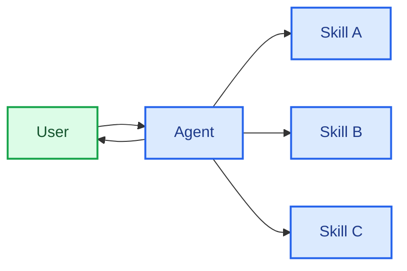

在**技能**架构中，专门化的能力被封装为可调用的“技能”，用于增强 [Agent](/oss/langchain/agents) 的行为。技能主要是提示词驱动的专门化，Agent 可以按需调用。
内置技能支持请参见 [Deep Agents](/oss/deepagents/skills)。

<Tip>
此模式在概念上与 [Agent Skills](https://agentskills.io/) 和 [llms.txt](https://llmstxt.org/)（由 Jeremy Howard 提出）相同，后者使用工具调用进行文档的渐进式披露。技能模式将渐进式披露应用于专门化的提示词和领域知识，而不仅仅是文档页面。
</Tip>



## 核心特征

* 提示词驱动的专门化：技能主要通过专门化提示词来定义
* 渐进式披露：技能根据上下文或用户需求变得可用
* 团队分布：不同团队可以独立开发和维护技能
* 轻量级组合：技能比完整的子 Agent 更简单
* 资源感知：技能可以引用脚本、模板和其他资源

## 适用场景

当你想要一个拥有多种可能专门化的单一 [Agent](/oss/langchain/agents)、不需要在技能之间强制特定约束、或不同团队需要独立开发能力时，使用技能模式。常见示例包括编程助手（不同语言或任务的技能）、知识库（不同领域的技能）和创意助手（不同格式的技能）。

## 基本实现

:::python
```python
from langchain.tools import tool
from langchain.agents import create_agent

@tool
def load_skill(skill_name: str) -> str:
    """Load a specialized skill prompt.

    Available skills:
    - write_sql: SQL query writing expert
    - review_legal_doc: Legal document reviewer

    Returns the skill's prompt and context.
    """
    # Load skill content from file/database
    ...

agent = create_agent(
    model="gpt-4.1",
    tools=[load_skill],
    system_prompt=(
        "You are a helpful assistant. "
        "You have access to two skills: "
        "write_sql and review_legal_doc. "
        "Use load_skill to access them."
    ),
)
```
:::
:::js
```typescript
import { tool, createAgent } from "langchain";
import * as z from "zod";

const loadSkill = tool(
  async ({ skillName }) => {
    // Load skill content from file/database
    return "";
  },
  {
    name: "load_skill",
    description: `Load a specialized skill.

Available skills:
- write_sql: SQL query writing expert
- review_legal_doc: Legal document reviewer

Returns the skill's prompt and context.`,
    schema: z.object({
      skillName: z
        .string()
        .describe("Name of skill to load")
    })
  }
);

const agent = createAgent({
  model: "gpt-4.1",
  tools: [loadSkill],
  systemPrompt: (
    "You are a helpful assistant. " +
    "You have access to two skills: " +
    "write_sql and review_legal_doc. " +
    "Use load_skill to access them."
  ),
});
```
:::

完整实现请参见以下教程。

<Card
    title="教程：构建带按需技能的 SQL 助手"
    icon="wand"
    href="/oss/langchain/multi-agent/skills-sql-assistant"
    arrow cta="了解更多"
>
    学习如何通过渐进式披露实现技能，其中 Agent 按需加载专门化的提示词和 Schema，而不是预先加载。
</Card>

## 扩展模式

在编写自定义实现时，你可以通过以下方式扩展基本技能模式：

- **动态工具注册**：将渐进式披露与状态管理结合，在技能加载时注册新的[工具](/oss/langchain/tools)。例如，加载“database_admin”技能可以同时添加专门化上下文并注册数据库特定工具（备份、恢复、迁移）。这使用了多 Agent 模式中通用的工具和状态机制 —— 通过工具更新状态来动态改变 Agent 能力。

- **层次化技能**：技能可以以树状结构定义其他技能，创建嵌套的专门化。例如，加载“data_science”技能可能会使“pandas_expert”、“visualization”和“statistical_analysis”等子技能变得可用。每个子技能可以根据需要独立加载，允许对领域知识进行细粒度的渐进式披露。这种层次化方法通过将能力组织成逻辑分组来帮助管理大型知识库，这些分组可以按需发现和加载。

- **资源感知**：虽然每个技能只有一个提示词，但该提示词可以引用其他资源的位置，并提供 Agent 应何时使用这些资源的信息。
当这些资源变得相关时，Agent 将知道这些文件的存在，并根据需要将它们读入内存以完成任务。
这也遵循渐进式披露模式，限制了上下文窗口中的信息量。
