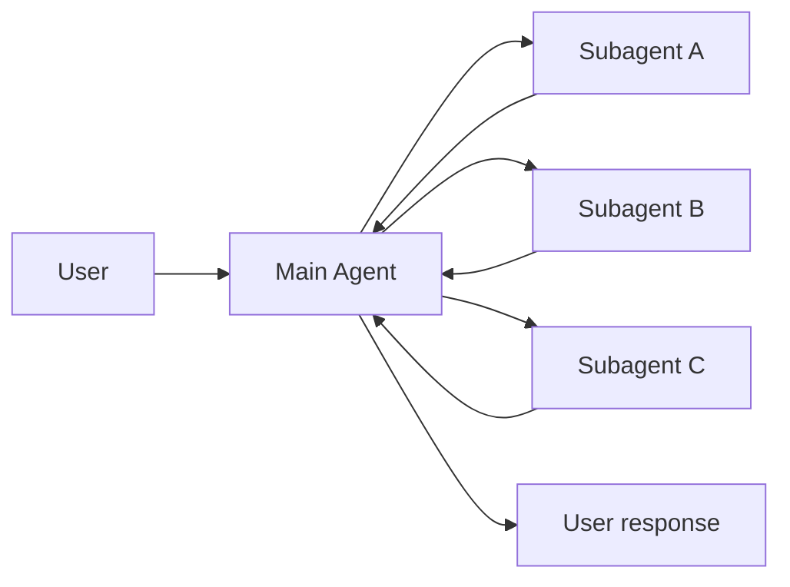
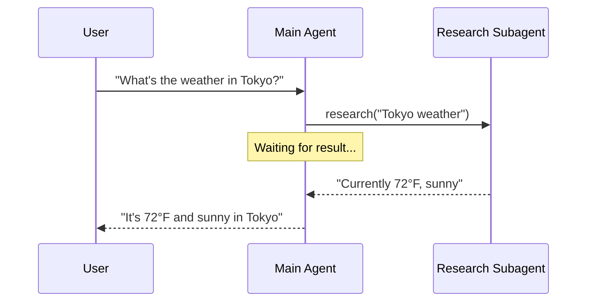
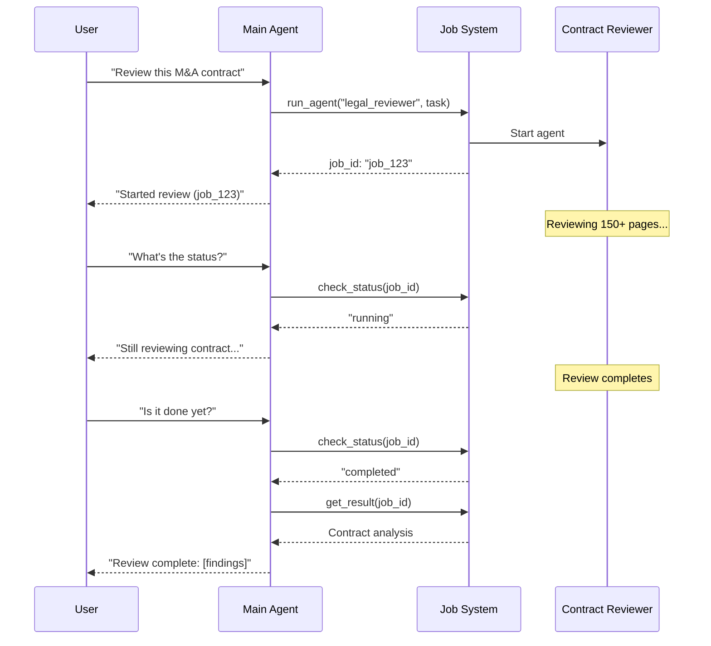
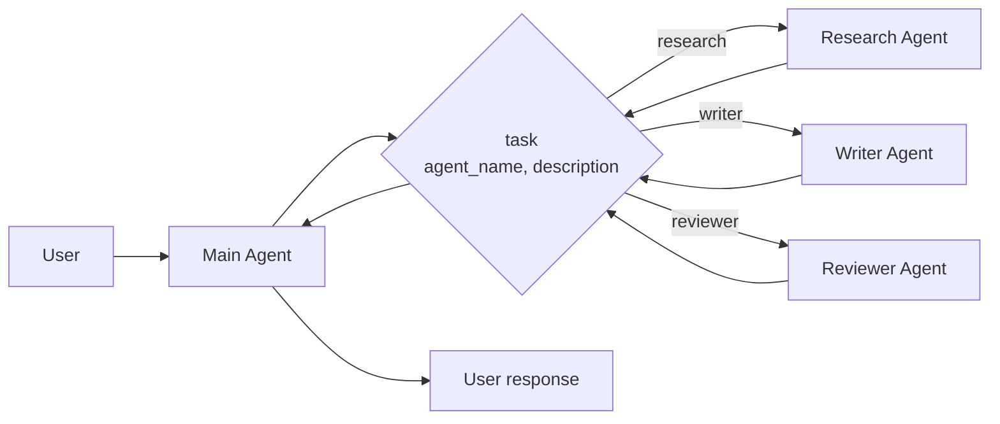

在**子 Agent** 架构中，一个中央的主 [Agent](/oss/langchain/agents)（通常称为**监督器**）通过将子 Agent 作为[工具](/oss/langchain/tools)调用来协调它们。主 Agent 决定调用哪个子 Agent、提供什么输入以及如何组合结果。子 Agent 是无状态的 —— 它们不会记住过去的交互，所有对话记忆由主 Agent 维护。这提供了[上下文](/oss/langchain/context-engineering)隔离：每次子 Agent 调用都在干净的上下文窗口中工作，防止主对话中的上下文臃肿。



## 核心特征

* 集中控制：所有路由都通过主 Agent
* 无直接用户交互：子 Agent 将结果返回给主 Agent 而不是用户（但你可以在子 Agent 内使用[中断](/oss/langgraph/interrupts#interrupt)来允许用户交互）
* 通过工具调用子 Agent：子 Agent 通过工具被调用
* 并行执行：主 Agent 可以在单轮中调用多个子 Agent

<Note>
**监督器 vs. 路由器**：监督器 Agent（此模式）与[路由器](/oss/langchain/multi-agent/router)不同。监督器是一个完整的 Agent，维护对话上下文并跨多轮动态决定调用哪些子 Agent。路由器通常是一个单次分类步骤，将请求分发到 Agent，而不维护持续的对话状态。
</Note>

## 适用场景

当你拥有多个不同领域（如日历、邮件、CRM、数据库）、子 Agent 不需要直接与用户对话、或你想要集中化工作流控制时，使用子 Agent 模式。对于只有少量[工具](/oss/langchain/tools)的简单场景，使用[单个 Agent](/oss/langchain/agents)即可。

<Tip>
**需要在子 Agent 内进行用户交互？** 虽然子 Agent 通常将结果返回给主 Agent 而不是直接与用户对话，但你可以在子 Agent 内使用[中断](/oss/langgraph/interrupts#interrupt)来暂停执行并收集用户输入。当子 Agent 在继续执行前需要用户的澄清或审批时，这非常有用。主 Agent 仍然是编排者，但子 Agent 可以在任务中途从用户收集信息。
</Tip>

## 基本实现

核心机制是将子 Agent 包装为主 Agent 可以调用的工具：

:::python
```python
from langchain.tools import tool
from langchain.agents import create_agent

# Create a subagent
subagent = create_agent(model="anthropic:claude-sonnet-4-20250514", tools=[...])

# Wrap it as a tool
@tool("research", description="Research a topic and return findings")
def call_research_agent(query: str):
    result = subagent.invoke({"messages": [{"role": "user", "content": query}]})
    return result["messages"][-1].content

# Main agent with subagent as a tool
main_agent = create_agent(model="anthropic:claude-sonnet-4-20250514", tools=[call_research_agent])
```
:::
:::js
```typescript
import { createAgent, tool } from "langchain";
import { z } from "zod";

// Create a subagent
const subagent = createAgent({ model: "anthropic:claude-sonnet-4-20250514", tools: [...] });

// Wrap it as a tool
const callResearchAgent = tool(
  async ({ query }) => {
    const result = await subagent.invoke({
      messages: [{ role: "user", content: query }]
    });
    return result.messages.at(-1)?.content;
  },
  {
    name: "research",
    description: "Research a topic and return findings",
    schema: z.object({ query: z.string() })
  }
);

// Main agent with subagent as a tool
const mainAgent = createAgent({ model: "anthropic:claude-sonnet-4-20250514", tools: [callResearchAgent] });
```
:::

<Card
    title="教程：使用子 Agent 构建个人助手"
    icon="sitemap"
    href="/oss/langchain/multi-agent/subagents-personal-assistant"
    arrow cta="了解更多"
>
    学习如何使用子 Agent 模式构建个人助手，其中中央主 Agent（监督器）协调专门化的工作 Agent。
</Card>

## 设计决策

实现子 Agent 模式时，你需要做出几个关键设计选择。下表总结了这些选项 —— 每个都在下面的章节中详细介绍。

| 决策 | 选项 |
|------|------|
| [**同步 vs. 异步**](#sync-vs-async) | 同步（阻塞）vs. 异步（后台） |
| [**工具模式**](#tool-patterns) | 每个 Agent 一个工具 vs. 单一分发工具 |
| [**子 Agent 规格**](#subagent-specs) | 系统提示词 vs. 枚举约束 vs. 基于工具的发现（仅单一分发工具） |
| [**子 Agent 输入**](#subagent-inputs) | 仅查询 vs. 完整上下文 |
| [**子 Agent 输出**](#subagent-outputs) | 子 Agent 结果 vs. 完整对话历史 |
## 同步 vs. 异步

子 Agent 执行可以是**同步**（阻塞）或**异步**（后台）的。你的选择取决于主 Agent 是否需要结果才能继续。

| 模式 | 主 Agent 行为 | 最适合 | 权衡 |
|------|------------|---------|------|
| **同步** | 等待子 Agent 完成 | 主 Agent 需要结果才能继续 | 简单，但会阻塞对话 |
| **异步** | 子 Agent 在后台运行时继续 | 独立任务，用户不应等待 | 响应更快，但更复杂 |

<Tip>
不要与 Python 的 `async`/`await` 混淆。这里的“异步”是指主 Agent 启动一个后台任务（通常在单独的进程或服务中），然后继续执行而不阻塞。
</Tip>

### 同步（默认）

默认情况下，子 Agent 调用是**同步**的 —— 主 Agent 等待每个子 Agent 完成后再继续。当主 Agent 的下一步操作依赖子 Agent 的结果时，使用同步模式。



**何时使用同步：**
- 主 Agent 需要子 Agent 的结果来形成其响应
- 任务具有顺序依赖（如获取数据 → 分析 → 响应）
- 子 Agent 失败应阻塞主 Agent 的响应

**权衡：**
- 实现简单 —— 只需调用并等待
- 在所有子 Agent 完成之前用户看不到响应
- 长时间任务会冻结对话

### 异步

当子 Agent 的工作是独立的 —— 主 Agent 不需要结果就能继续与用户对话时，使用**异步执行**。主 Agent 启动一个后台任务并保持响应能力。



**何时使用异步：**
- 子 Agent 工作独立于主对话流程
- 用户应该能在工作进行时继续聊天
- 你想要并行运行多个独立任务

**三工具模式：**
1. **启动任务**：启动后台任务，返回任务 ID
2. **检查状态**：返回当前状态（pending、running、completed、failed）
3. **获取结果**：检索已完成的结果

**处理任务完成：** 当任务完成时，你的应用需要通知用户。一种方法是弹出通知，用户点击后发送一条 `HumanMessage`，如“检查 job_123 并总结结果”。

## 工具模式

有两种主要方式将子 Agent 暴露为工具：

| 模式 | 最适合 | 权衡 |
|------|---------|------|
| [**每个 Agent 一个工具**](#tool-per-agent) | 对每个子 Agent 的输入/输出进行细粒度控制 | 更多设置，但更多定制 |
| [**单一分发工具**](#single-dispatch-tool) | 大量 Agent、分布式团队、约定优先于配置 | 更简单的组合，更少的每 Agent 定制 |

### 每个 Agent 一个工具


关键思想是将子 Agent 包装为主 Agent 可以调用的工具：

:::python
```python
from langchain.tools import tool
from langchain.agents import create_agent

# Create a sub-agent
subagent = create_agent(model="...", tools=[...])  # [!code highlight]

# Wrap it as a tool  # [!code highlight]
@tool("subagent_name", description="subagent_description")  # [!code highlight]
def call_subagent(query: str):  # [!code highlight]
    result = subagent.invoke({"messages": [{"role": "user", "content": query}]})
    return result["messages"][-1].content

# Main agent with subagent as a tool  # [!code highlight]
main_agent = create_agent(model="...", tools=[call_subagent])  # [!code highlight]
```
:::
:::js
```typescript
import { createAgent, tool } from "langchain";
import * as z from "zod";

// Create a sub-agent
const subagent = createAgent({...});  // [!code highlight]

// Wrap it as a tool  // [!code highlight]
const callSubagent = tool(  // [!code highlight]
  async ({ query }) => {  // [!code highlight]
    const result = await subagent.invoke({
      messages: [{ role: "user", content: query }]
    });
    return result.messages.at(-1)?.text;
  },
  {
    name: "subagent_name",
    description: "subagent_description",
    schema: z.object({
      query: z.string().describe("The query to send to subagent")
    })
  }
);

// Main agent with subagent as a tool  // [!code highlight]
const mainAgent = createAgent({ model, tools: [callSubagent] });  // [!code highlight]
```
:::

主 Agent 在判断任务匹配子 Agent 的描述时调用子 Agent 工具，接收结果，并继续编排。参见[上下文工程](#context-engineering)了解细粒度控制。

### 单一分发工具

另一种方法是使用单个参数化工具为独立任务调用临时子 Agent。与[每个 Agent 一个工具](#tool-per-agent)的方法不同，这里使用基于约定的方法，通过单个 `task` 工具：任务描述作为 human 消息传递给子 Agent，子 Agent 的最终消息作为工具结果返回。

当你想要跨多个团队分布 Agent 开发、需要将复杂任务隔离到单独的上下文窗口、需要一种可扩展的方式来添加新 Agent 而不修改协调器、或偏好约定优先于定制时，使用此方法。此方法以上下文工程的灵活性换取了 Agent 组合的简单性和强大的上下文隔离。



**关键特征：**

* 单一 task 工具：一个参数化工具，可以通过名称调用任何已注册的子 Agent
* 基于约定的调用：按名称选择 Agent，任务作为 human 消息传递，最终消息作为工具结果返回
* 团队分布：不同团队可以独立开发和部署 Agent
* Agent 发现：子 Agent 可以通过系统提示词（列出可用 Agent）或通过[渐进式披露](/oss/langchain/multi-agent/skills-sql-assistant)（通过工具按需加载 Agent 信息）被发现

<Tip>
这种方法的一个有趣之处在于，子 Agent 可能与主 Agent 拥有完全相同的能力。在这种情况下，调用子 Agent **真正的目的是上下文隔离** —— 允许复杂的多步骤任务在隔离的上下文窗口中运行，而不会使主 Agent 的对话历史臃肿。子 Agent 自主完成其工作，仅返回简洁的总结，保持主线程的专注和高效。
</Tip>

<Accordion title="带任务分发器的 Agent 注册表">

:::python
```python
from langchain.tools import tool
from langchain.agents import create_agent

# Sub-agents developed by different teams
research_agent = create_agent(
    model="gpt-4.1",
    prompt="You are a research specialist..."
)

writer_agent = create_agent(
    model="gpt-4.1",
    prompt="You are a writing specialist..."
)

# Registry of available sub-agents
SUBAGENTS = {
    "research": research_agent,
    "writer": writer_agent,
}

@tool
def task(
    agent_name: str,
    description: str
) -> str:
    """Launch an ephemeral subagent for a task.

    Available agents:
    - research: Research and fact-finding
    - writer: Content creation and editing
    """
    agent = SUBAGENTS[agent_name]
    result = agent.invoke({
        "messages": [
            {"role": "user", "content": description}
        ]
    })
    return result["messages"][-1].content

# Main coordinator agent
main_agent = create_agent(
    model="gpt-4.1",
    tools=[task],
    system_prompt=(
        "You coordinate specialized sub-agents. "
        "Available: research (fact-finding), "
        "writer (content creation). "
        "Use the task tool to delegate work."
    ),
)
```
:::
:::js
```typescript
import { tool, createAgent } from "langchain";
import * as z from "zod";

// Sub-agents developed by different teams
const researchAgent = createAgent({
  model: "gpt-4.1",
  prompt: "You are a research specialist...",
});

const writerAgent = createAgent({
  model: "gpt-4.1",
  prompt: "You are a writing specialist...",
});

// Registry of available sub-agents
const SUBAGENTS = {
  research: researchAgent,
  writer: writerAgent,
};

const task = tool(
  async ({ agentName, description }) => {
    const agent = SUBAGENTS[agentName];
    const result = await agent.invoke({
      messages: [
        { role: "user", content: description }
      ],
    });
    return result.messages.at(-1)?.content;
  },
  {
    name: "task",
    description: `Launch an ephemeral subagent.

Available agents:
- research: Research and fact-finding
- writer: Content creation and editing`,
    schema: z.object({
      agentName: z
        .string()
        .describe("Name of agent to invoke"),
      description: z
        .string()
        .describe("Task description"),
    }),
  }
);

// Main coordinator agent
const mainAgent = createAgent({
  model: "gpt-4.1",
  tools: [task],
  prompt: (
    "You coordinate specialized sub-agents. " +
    "Available: research (fact-finding), " +
    "writer (content creation). " +
    "Use the task tool to delegate work."
  ),
});
```
:::

</Accordion>

## 上下文工程

控制上下文如何在主 Agent 和其子 Agent 之间流动：

| 类别 | 目的 | 影响 |
|------|------|------|
| [**子 Agent 规格**](#subagent-specs) | 确保子 Agent 在应该被调用时被调用 | 主 Agent 路由决策 |
| [**子 Agent 输入**](#subagent-inputs) | 确保子 Agent 能以优化的上下文良好执行 | 子 Agent 性能 |
| [**子 Agent 输出**](#subagent-outputs) | 确保监督器能根据子 Agent 结果采取行动 | 主 Agent 性能 |

另请参见我们关于 Agent [上下文工程](/oss/langchain/context-engineering)的全面指南。

### 子 Agent 规格

与子 Agent 关联的**名称**和**描述**是主 Agent 了解应调用哪些子 Agent 的主要方式。这些是提示词调控手段 —— 请仔细选择。

* **名称**：主 Agent 引用子 Agent 的方式。保持清晰且面向动作（如 `research_agent`、`code_reviewer`）。
* **描述**：主 Agent 对子 Agent 能力的了解。明确说明它处理哪些任务以及何时使用。

对于[单一分发工具](#single-dispatch-tool)设计，你还必须向主 Agent 提供其可调用的子 Agent 的信息。
你可以根据 Agent 数量和注册表是静态还是动态的，以不同方式提供这些信息：

| 方法 | 最适合 | 权衡 |
|------|---------|------|
| **系统提示词枚举** | 小型、静态 Agent 列表（< 10 个） | 简单，但 Agent 变更时需要更新提示词 |
| **枚举约束** | 小型、静态 Agent 列表（< 10 个） | 类型安全且显式，但 Agent 变更时需要修改代码 |
| **基于工具的发现** | 大型或动态 Agent 注册表 | 灵活且可扩展，但增加复杂性 |
#### 系统提示词枚举

直接在主 Agent 的系统提示词中列出可用 Agent。主 Agent 将 Agent 列表及其描述作为指令的一部分查看。

**何时使用：**
- 你有一组小型、固定的 Agent（< 10 个）
- Agent 注册表很少变化
- 你想要最简单的实现

**Example:**
```python
main_agent = create_agent(
    model="...",
    tools=[task],
    system_prompt=(
        "You coordinate specialized sub-agents. "
        "Available agents:\n"
        "- research: Research and fact-finding\n"
        "- writer: Content creation and editing\n"
        "- reviewer: Code and document review\n"
        "Use the task tool to delegate work."
    ),
)
```

#### 分发工具的枚举约束

在分发工具的 `agent_name` 参数上添加枚举约束。这提供了类型安全，并使可用 Agent 在工具 Schema 中显式明确。

**何时使用：**
- 你有一组小型、固定的 Agent（< 10 个）
- 你想要类型安全和显式的 Agent 名称
- 你偏好基于 Schema 的验证而非基于提示词的引导

**Example:**
```python
from enum import Enum

class AgentName(str, Enum):
    RESEARCH = "research"
    WRITER = "writer"
    REVIEWER = "reviewer"

@tool
def task(
    agent_name: AgentName,  # Enum constraint
    description: str
) -> str:
    """Launch an ephemeral subagent for a task."""
    # ...
```

#### 基于工具的发现

提供一个单独的工具（如 `list_agents` 或 `search_agents`），主 Agent 可以调用它来按需发现可用 Agent。这实现了渐进式披露并支持动态注册表。

**何时使用：**
- 你有很多 Agent（> 10 个）或注册表不断增长
- Agent 注册表经常变化或是动态的
- 你想要减少提示词大小和 token 用量
- 不同团队独立管理不同的 Agent

**Example:**
```python
@tool
def list_agents(query: str = "") -> str:
    """List available subagents, optionally filtered by query."""
    agents = search_agent_registry(query)
    return format_agent_list(agents)

@tool
def task(agent_name: str, description: str) -> str:
    """Launch an ephemeral subagent for a task."""
    # ...

main_agent = create_agent(
    model="...",
    tools=[task, list_agents],
    system_prompt="Use list_agents to discover available subagents, then use task to invoke them."
)
```

### 子 Agent 输入

自定义子 Agent 接收的上下文以执行其任务。添加无法在静态提示词中捕获的输入 —— 完整的消息历史、先前的结果或任务元数据 —— 通过从 Agent 状态中拉取。

:::python
```python Subagent inputs example expandable
from langchain.agents import AgentState
from langchain.tools import tool, ToolRuntime

class CustomState(AgentState):
    example_state_key: str

@tool(
    "subagent1_name",
    description="subagent1_description"
)
def call_subagent1(query: str, runtime: ToolRuntime[None, CustomState]):
    # Apply any logic needed to transform the messages into a suitable input
    subagent_input = some_logic(query, runtime.state["messages"])
    result = subagent1.invoke({
        "messages": subagent_input,
        # You could also pass other state keys here as needed.
        # Make sure to define these in both the main and subagent's
        # state schemas.
        "example_state_key": runtime.state["example_state_key"]
    })
    return result["messages"][-1].content
```
:::
:::js
```typescript Subagent inputs example expandable
import { createAgent, tool, AgentState, ToolMessage } from "langchain";
import { Command } from "@langchain/langgraph";
import * as z from "zod";

// Example of passing the full conversation history to the sub agent via the state.
const callSubagent1 = tool(
  async ({query}) => {
    const state = getCurrentTaskInput<AgentState>();
    // Apply any logic needed to transform the messages into a suitable input
    const subAgentInput = someLogic(query, state.messages);
    const result = await subagent1.invoke({
      messages: subAgentInput,
      // You could also pass other state keys here as needed.
      // Make sure to define these in both the main and subagent's
      // state schemas.
      exampleStateKey: state.exampleStateKey
    });
    return result.messages.at(-1)?.content;
  },
  {
    name: "subagent1_name",
    description: "subagent1_description",
  }
);
```
:::

### 子 Agent 输出

自定义主 Agent 收到的返回内容，以便它可以做出好的决策。两种策略：

1. **提示子 Agent**：明确指定应返回的内容。一个常见的失败模式是子 Agent 执行了工具调用或推理但没有在最终消息中包含结果 —— 提醒它监督器只能看到最终输出。
2. **在代码中格式化**：在返回前调整或丰富响应。例如，使用 [`Command`](/oss/langgraph/graph-api#command) 在最终文本之外传递特定的状态键。

:::python
```python Subagent outputs example expandable
from typing import Annotated
from langchain.agents import AgentState
from langchain.tools import InjectedToolCallId
from langgraph.types import Command


@tool(
    "subagent1_name",
    description="subagent1_description"
)
def call_subagent1(
    query: str,
    tool_call_id: Annotated[str, InjectedToolCallId],
) -> Command:
    result = subagent1.invoke({
        "messages": [{"role": "user", "content": query}]
    })
    return Command(update={
        # Pass back additional state from the subagent
        "example_state_key": result["example_state_key"],
        "messages": [
            ToolMessage(
                content=result["messages"][-1].content,
                tool_call_id=tool_call_id
            )
        ]
    })
```
:::
:::js
```typescript Subagent outputs example expandable
import { tool, ToolMessage } from "langchain";
import { Command } from "@langchain/langgraph";
import * as z from "zod";

const callSubagent1 = tool(
  async ({ query }, config) => {
    const result = await subagent1.invoke({
      messages: [{ role: "user", content: query }]
    });

    // Return a Command to update multiple state keys
    return new Command({
      update: {
        // Pass back additional state from the subagent
        exampleStateKey: result.exampleStateKey,
        messages: [
          new ToolMessage({
            content: result.messages.at(-1)?.text,
            tool_call_id: config.toolCall?.id!
          })
        ]
      }
    });
  },
  {
    name: "subagent1_name",
    description: "subagent1_description",
    schema: z.object({
      query: z.string().describe("The query to send to subagent1")
    })
  }
);
```
:::

## 检查点和状态检查

默认情况下，子 Agent 使用**继承 checkpointer** 模式 —— 每次调用都以新状态开始，支持[中断](/oss/langgraph/interrupts#interrupt)，并可安全地并行运行。如果你需要子 Agent 在跨调用间维护其自己的持久化对话历史，请使用 `checkpointer=True`（续续模式）编译。参见[子图持久化](/oss/langgraph/use-subgraphs#subgraph-persistence)了解各模式的完整对比。

由于子 Agent 是在工具函数内调用的，LangGraph 无法[静态发现](/oss/langgraph/use-subgraphs#view-subgraph-state)它们。这意味着带 `subgraphs` 参数的 [`get_state`](/oss/langgraph/use-subgraphs#view-subgraph-state) 不会返回子 Agent 状态。如果你需要读取嵌套图状态（例如在[中断](/oss/langgraph/interrupts#interrupt)期间），请从自定义图中的[节点函数](/oss/langgraph/use-subgraphs#call-a-subgraph-inside-a-node)调用子 Agent。参见[子图持久化](/oss/langgraph/use-subgraphs#subgraph-persistence)了解每种模式如何影响状态可见性。
