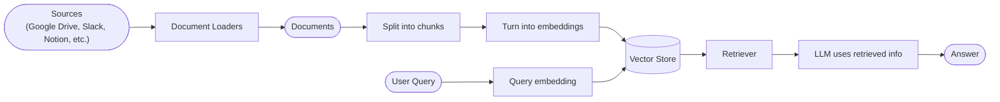
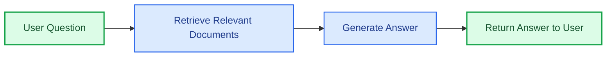
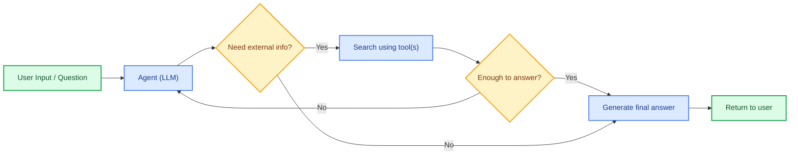
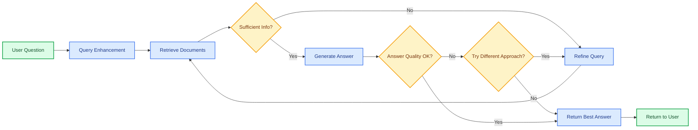

大语言模型（LLM）功能强大，但存在两个关键局限：

* **有限的上下文** — 无法一次性接收整个语料库。
* **静态知识** — 训练数据固定在某个时间节点。

检索（Retrieval）通过在查询时获取相关的外部知识来解决这些问题。这就是**检索增强生成（RAG，Retrieval-Augmented Generation）**的基础：利用特定上下文信息来增强 LLM 的回答质量。


## 构建知识库

**知识库（Knowledge Base）**是在检索过程中使用的文档或结构化数据仓库。

如果你需要自定义知识库，可以使用 LangChain 的文档加载器和向量存储，从你自己的数据中构建。

<Note>
    如果你已经拥有知识库（如 SQL 数据库、CRM 系统或内部文档系统），则**无需**重新构建。你可以：
    - 在 Agentic RAG 中将其作为 Agent 的**工具**进行连接。
    - 查询知识库并将检索到的内容作为上下文提供给 LLM [（两步式 RAG）](#2-step-rag)。
</Note>

参阅以下教程来构建可搜索的知识库和最简 RAG 工作流：

<Card
    title="教程：语义搜索"
    icon="database"
    href="/oss/langchain/knowledge-base"
    arrow cta="了解更多"
>
    学习如何使用 LangChain 的文档加载器、嵌入模型和向量存储，从你自己的数据中创建可搜索的知识库。
    在本教程中，你将基于 PDF 构建一个搜索引擎，实现与查询相关的段落检索。你还将在此搜索引擎之上实现一个最简 RAG 工作流，了解如何将外部知识整合到 LLM 的推理过程中。
</Card>

### 从检索到 RAG

检索使 LLM 能够在运行时访问相关上下文。但大多数实际应用会更进一步：**将检索与生成相结合**，产出有据可依、感知上下文的回答。

这就是**检索增强生成（RAG）**的核心思想。检索流水线成为一个更广泛系统的基础，该系统将搜索与生成相结合。

### 检索流水线

一个典型的检索工作流如下所示：



每个组件都是模块化的：你可以替换加载器、分割器、嵌入模型或向量存储，而无需重写应用的核心逻辑。

### 核心组件

<Columns cols={2}>
    <Card
        title="文档加载器"
        icon="file-import"
        href="/oss/integrations/document_loaders"
        arrow cta="了解更多"
    >
        从外部数据源（Google Drive、Slack、Notion 等）中摄取数据，返回标准化的 @[`Document`] 对象。
    </Card>

    :::python
    <Card
        title="文本分割器"
        icon="scissors"
        href="/oss/integrations/splitters"
        arrow
        cta="了解更多"
    >
        将大型文档拆分为更小的块，使其可以被单独检索，并适合模型的上下文窗口。
    </Card>
    :::
    <Card
        title="嵌入模型"
        icon="sitemap"
        href="/oss/integrations/text_embedding"
        arrow
        cta="了解更多"
    >
        嵌入模型将文本转换为数值向量，使语义相近的文本在向量空间中彼此靠近。
    </Card>

    <Card
        title="向量存储"
        icon="database"
        href="/oss/integrations/vectorstores/"
        arrow
        cta="了解更多"
    >
        用于存储和检索嵌入向量的专用数据库。
    </Card>

    <Card
        title="检索器"
        icon="binoculars"
        href="/oss/integrations/retrievers/"
        arrow
        cta="了解更多"
    >
        检索器是一个接口，根据非结构化查询返回相关文档。
    </Card>
</Columns>

## RAG 架构

RAG 可以根据系统需求以多种方式实现。以下各节分别介绍每种架构类型。

| 架构 | 描述 | 可控性 | 灵活性 | 延迟 | 使用场景示例 |
|-------------------------|----------------------------------------------------------------------------|-----------|-------------|----------------|-------------------------------------------------------|
| **两步式 RAG** | 检索总是在生成之前执行，简单且可预测 | ✅ 高 | ❌ 低 | ⚡ 快 | FAQ、文档问答机器人 |
| **Agentic RAG** | 由 LLM 驱动的 Agent 在推理过程中决定*何时*以及*如何*检索 | ❌ 低 | ✅ 高 | ⏳ 不定 | 具有多工具访问能力的研究助手 |
| **混合式** | 结合两种方式的特点，并加入验证步骤 | ⚖️ 中等 | ⚖️ 中等 | ⏳ 不定 | 带质量验证的领域问答 |

<Info>
**关于延迟**：**两步式 RAG** 的延迟通常更**可预测**，因为 LLM 调用的最大次数是已知且固定的。这种可预测性基于 LLM 推理时间是主导因素的假设。然而，实际延迟还可能受到检索步骤性能的影响——例如 API 响应时间、网络延迟或数据库查询——这些会因所使用的工具和基础设施而有所不同。
</Info>

### 两步式 RAG

在**两步式 RAG（2-Step RAG）**中，检索步骤总是在生成步骤之前执行。这种架构直观且可预测，适用于许多以检索相关文档为明确前提的应用场景。



<Card
    title="教程：检索增强生成（RAG）"
    icon="robot"
    href="/oss/langchain/rag#rag-chains"
    arrow cta="了解更多"
>
    了解如何使用检索增强生成构建一个能够基于你的数据回答问题的 Q&A 聊天机器人。
    本教程介绍两种方式：
    * **RAG Agent** — 通过灵活的工具执行搜索，适合通用场景。
    * **两步式 RAG 链** — 每个查询仅需一次 LLM 调用，快速高效，适合较简单的任务。
</Card>

### Agentic RAG

**Agentic 检索增强生成（Agentic RAG）**将检索增强生成的优势与基于 Agent 的推理能力相结合。Agent（由 LLM 驱动）不是在回答之前检索文档，而是逐步推理并在交互过程中决定**何时**以及**如何**检索信息。

<Tip>
Agent 要实现 RAG 行为，唯一需要的就是能够访问一个或多个可以获取外部知识的**工具**——例如文档加载器、Web API 或数据库查询。
</Tip>



:::python
```python
import requests
from langchain.tools import tool
from langchain.chat_models import init_chat_model
from langchain.agents import create_agent


@tool
def fetch_url(url: str) -> str:
    """Fetch text content from a URL"""
    response = requests.get(url, timeout=10.0)
    response.raise_for_status()
    return response.text

system_prompt = """\
Use fetch_url when you need to fetch information from a web-page; quote relevant snippets.
"""

agent = create_agent(
    model="claude-sonnet-4-6",
    tools=[fetch_url], # A tool for retrieval [!code highlight]
    system_prompt=system_prompt,
)
```
:::

:::js
```typescript
import { tool, createAgent } from "langchain";

const fetchUrl = tool(
    (url: string) => {
        return `Fetched content from ${url}`;
    },
    { name: "fetch_url", description: "Fetch text content from a URL" }
);

const agent = createAgent({
    model: "claude-sonnet-4-0",
    tools: [fetchUrl],
    systemPrompt,
});
```
:::

<Expandable title="扩展示例：基于 LangGraph 的 llms.txt 实现 Agentic RAG">

本示例实现了一个 **Agentic RAG 系统**，用于辅助用户查询 LangGraph 文档。Agent 首先加载 [llms.txt](https://llmstxt.org/)（其中列出了可用的文档 URL），然后可以根据用户的问题动态使用 `fetch_documentation` 工具来检索和处理相关内容。

:::python
```python
import requests
from langchain.agents import create_agent
from langchain.messages import HumanMessage
from langchain.tools import tool
from markdownify import markdownify


ALLOWED_DOMAINS = ["https://langchain-ai.github.io/"]
LLMS_TXT = 'https://langchain-ai.github.io/langgraph/llms.txt'


@tool
def fetch_documentation(url: str) -> str:  # [!code highlight]
    """Fetch and convert documentation from a URL"""
    if not any(url.startswith(domain) for domain in ALLOWED_DOMAINS):
        return (
            "Error: URL not allowed. "
            f"Must start with one of: {', '.join(ALLOWED_DOMAINS)}"
        )
    response = requests.get(url, timeout=10.0)
    response.raise_for_status()
    return markdownify(response.text)


# We will fetch the content of llms.txt, so this can
# be done ahead of time without requiring an LLM request.
llms_txt_content = requests.get(LLMS_TXT).text

# System prompt for the agent
system_prompt = f"""
You are an expert Python developer and technical assistant.
Your primary role is to help users with questions about LangGraph and related tools.

Instructions:

1. If a user asks a question you're unsure about — or one that likely involves API usage,
   behavior, or configuration — you MUST use the `fetch_documentation` tool to consult the relevant docs.
2. When citing documentation, summarize clearly and include relevant context from the content.
3. Do not use any URLs outside of the allowed domain.
4. If a documentation fetch fails, tell the user and proceed with your best expert understanding.

You can access official documentation from the following approved sources:

{llms_txt_content}

You MUST consult the documentation to get up to date documentation
before answering a user's question about LangGraph.

Your answers should be clear, concise, and technically accurate.
"""

tools = [fetch_documentation]

model = init_chat_model("claude-sonnet-4-0", max_tokens=32_000)

agent = create_agent(
    model=model,
    tools=tools,  # [!code highlight]
    system_prompt=system_prompt,  # [!code highlight]
    name="Agentic RAG",
)

response = agent.invoke({
    'messages': [
        HumanMessage(content=(
            "Write a short example of a langgraph agent using the "
            "prebuilt create react agent. the agent should be able "
            "to look up stock pricing information."
        ))
    ]
})

print(response['messages'][-1].content)
```
:::
:::js
```typescript
import { tool, createAgent, HumanMessage } from "langchain";
import * as z from "zod";

const ALLOWED_DOMAINS = ["https://langchain-ai.github.io/"];
const LLMS_TXT = "https://langchain-ai.github.io/langgraph/llms.txt";

const fetchDocumentation = tool(
  async (input) => {  // [!code highlight]
    if (!ALLOWED_DOMAINS.some((domain) => input.url.startsWith(domain))) {
      return `Error: URL not allowed. Must start with one of: ${ALLOWED_DOMAINS.join(", ")}`;
    }
    const response = await fetch(input.url);
    if (!response.ok) {
      throw new Error(`HTTP error! status: ${response.status}`);
    }
    return response.text();
  },
  {
    name: "fetch_documentation",
    description: "Fetch and convert documentation from a URL",
    schema: z.object({
      url: z.string().describe("The URL of the documentation to fetch"),
    }),
  }
);

const llmsTxtResponse = await fetch(LLMS_TXT);
const llmsTxtContent = await llmsTxtResponse.text();

const systemPrompt = `
You are an expert TypeScript developer and technical assistant.
Your primary role is to help users with questions about LangGraph and related tools.

Instructions:

1. If a user asks a question you're unsure about — or one that likely involves API usage,
   behavior, or configuration — you MUST use the \`fetch_documentation\` tool to consult the relevant docs.
2. When citing documentation, summarize clearly and include relevant context from the content.
3. Do not use any URLs outside of the allowed domain.
4. If a documentation fetch fails, tell the user and proceed with your best expert understanding.

You can access official documentation from the following approved sources:

${llmsTxtContent}

You MUST consult the documentation to get up to date documentation
before answering a user's question about LangGraph.

Your answers should be clear, concise, and technically accurate.
`;

const tools = [fetchDocumentation];

const agent = createAgent({
  model: "claude-sonnet-4-0"
  tools,  // [!code highlight]
  systemPrompt,  // [!code highlight]
  name: "Agentic RAG",
});

const response = await agent.invoke({
  messages: [
    new HumanMessage(
      "Write a short example of a langgraph agent using the " +
      "prebuilt create react agent. the agent should be able " +
      "to look up stock pricing information."
    ),
  ],
});

console.log(response.messages.at(-1)?.content);
```
:::
</Expandable>

<Card
    title="教程：检索增强生成（RAG）"
    icon="robot"
    href="/oss/langchain/rag"
    arrow cta="了解更多"
>
    了解如何使用检索增强生成构建一个能够基于你的数据回答问题的 Q&A 聊天机器人。
    本教程介绍两种方式：
    * **RAG Agent** — 通过灵活的工具执行搜索，适合通用场景。
    * **两步式 RAG 链** — 每个查询仅需一次 LLM 调用，快速高效，适合较简单的任务。
</Card>

### 混合式 RAG

混合式 RAG 结合了两步式和 Agentic RAG 的特点，引入了查询预处理、检索验证和生成后检查等中间步骤。这类系统比固定流水线更灵活，同时仍保持一定的执行控制。

典型组件包括：

* **查询增强**：修改输入问题以提升检索质量。这可以包括改写不清晰的查询、生成多个变体，或通过附加上下文扩展查询。
* **检索验证**：评估检索到的文档是否相关且充分。如果不满足要求，系统可以优化查询并重新检索。
* **回答验证**：检查生成的回答的准确性、完整性以及与源内容的一致性。如有需要，系统可以重新生成或修订回答。

该架构通常支持在这些步骤之间进行多次迭代：



这种架构适用于：

* 查询模糊或描述不完整的应用场景
* 需要验证或质量控制步骤的系统
* 涉及多数据源或需要迭代优化的工作流

<Card
    title="教程：带自我纠正的 Agentic RAG"
    icon="robot"
    href="/oss/langgraph/agentic-rag"
    arrow cta="了解更多"
>
    一个**混合式 RAG** 示例，结合了 Agentic 推理与检索及自我纠正机制。
</Card>
