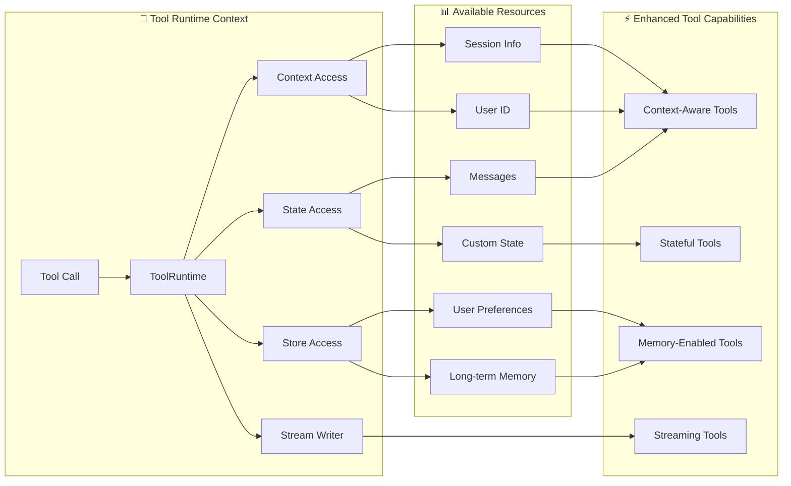

工具扩展了 [Agent](/oss/langchain/agents) 的能力——使其能够获取实时数据、执行代码、查询外部数据库，以及在真实环境中执行操作。

在底层，工具是具有明确定义的输入和输出的可调用函数，会被传递给[聊天模型](/oss/langchain/models)。模型根据对话上下文决定何时调用工具以及提供什么输入参数。

<Tip>
    关于模型如何处理工具调用的详细信息，请参阅[工具调用](/oss/langchain/models#tool-calling)。
</Tip>

## 创建工具

### 基本工具定义

:::python
创建工具最简单的方式是使用 @[`@tool`] 装饰器。默认情况下，函数的文档字符串会作为工具的描述，帮助模型理解何时应该使用该工具：

```python
from langchain.tools import tool

@tool
def search_database(query: str, limit: int = 10) -> str:
    """Search the customer database for records matching the query.

    Args:
        query: Search terms to look for
        limit: Maximum number of results to return
    """
    return f"Found {limit} results for '{query}'"
```

类型提示是**必需的**，因为它们定义了工具的输入 schema。文档字符串应当简洁明了，帮助模型理解工具的用途。
:::

:::js
创建工具最简单的方式是从 `langchain` 包中导入 `tool` 函数。你可以使用 [zod](https://zod.dev/) 来定义工具的输入 schema：

```ts
import * as z from "zod"
import { tool } from "langchain"

const searchDatabase = tool(
  ({ query, limit }) => `Found ${limit} results for '${query}'`,
  {
    name: "search_database",
    description: "Search the customer database for records matching the query.",
    schema: z.object({
      query: z.string().describe("Search terms to look for"),
      limit: z.number().describe("Maximum number of results to return"),
    }),
  }
);
```
:::

<Note>
    **服务端工具调用：** 部分聊天模型内置了工具（如网页搜索、代码解释器），这些工具在服务端执行。详见[服务端工具调用](#server-side-tool-use)。
</Note>

<Warning>
    工具名称推荐使用 `snake_case`（例如 `web_search` 而非 `Web Search`）。某些模型提供商对包含空格或特殊字符的名称支持不佳，甚至会报错。建议仅使用字母、数字、下划线和连字符，以确保跨提供商的兼容性。
</Warning>

:::python
### 自定义工具属性

#### 自定义工具名称

默认情况下，工具名称来自函数名。当你需要更具描述性的名称时，可以覆盖它：

```python
@tool("web_search")  # 自定义名称
def search(query: str) -> str:
    """Search the web for information."""
    return f"Results for: {query}"

print(search.name)  # web_search
```

#### 自定义工具描述

覆盖自动生成的工具描述，为模型提供更清晰的指引：

```python
@tool("calculator", description="Performs arithmetic calculations. Use this for any math problems.")
def calc(expression: str) -> str:
    """Evaluate mathematical expressions."""
    return str(eval(expression))
```

### 高级 schema 定义

使用 Pydantic 模型或 JSON schema 定义复杂的输入：

<CodeGroup>
    ```python Pydantic model
    from pydantic import BaseModel, Field
    from typing import Literal

    class WeatherInput(BaseModel):
        """Input for weather queries."""
        location: str = Field(description="City name or coordinates")
        units: Literal["celsius", "fahrenheit"] = Field(
            default="celsius",
            description="Temperature unit preference"
        )
        include_forecast: bool = Field(
            default=False,
            description="Include 5-day forecast"
        )

    @tool(args_schema=WeatherInput)
    def get_weather(location: str, units: str = "celsius", include_forecast: bool = False) -> str:
        """Get current weather and optional forecast."""
        temp = 22 if units == "celsius" else 72
        result = f"Current weather in {location}: {temp} degrees {units[0].upper()}"
        if include_forecast:
            result += "\nNext 5 days: Sunny"
        return result
    ```

    ```python JSON Schema
    weather_schema = {
        "type": "object",
        "properties": {
            "location": {"type": "string"},
            "units": {"type": "string"},
            "include_forecast": {"type": "boolean"}
        },
        "required": ["location", "units", "include_forecast"]
    }

    @tool(args_schema=weather_schema)
    def get_weather(location: str, units: str = "celsius", include_forecast: bool = False) -> str:
        """Get current weather and optional forecast."""
        temp = 22 if units == "celsius" else 72
        result = f"Current weather in {location}: {temp} degrees {units[0].upper()}"
        if include_forecast:
            result += "\nNext 5 days: Sunny"
        return result
    ```
</CodeGroup>

### 保留参数名

以下参数名是保留的，不能用作工具参数。使用这些名称将导致运行时错误。

| 参数名 | 用途 |
|--------|------|
| `config` | 保留用于内部传递 `RunnableConfig` |
| `runtime` | 保留用于 `ToolRuntime` 参数（访问 state、context、store） |

要访问运行时信息，请使用 @[`ToolRuntime`] 参数，而不是自行命名 `config` 或 `runtime` 参数。
:::

## 访问上下文

工具在能够访问运行时信息（如对话历史、用户数据和持久化记忆）时最为强大。本节介绍如何在工具内部访问和更新这些信息。

:::python
工具可以通过 @[`ToolRuntime`] 参数访问运行时信息，提供以下组件：

| 组件 | 说明 | 使用场景 |
|------|------|----------|
| **State** | 短期记忆 - 当前对话期间存在的可变数据（消息、计数器、自定义字段） | 访问对话历史，追踪工具调用次数 |
| **Context** | 调用时传入的不可变配置（用户 ID、会话信息） | 根据用户身份个性化响应 |
| **Store** | 长期记忆 - 跨对话持久化的数据 | 保存用户偏好，维护知识库 |
| **Stream Writer** | 在工具执行过程中发送实时更新 | 为长时间运行的操作显示进度 |
| **Config** | 执行所用的 @[`RunnableConfig`] | 访问回调、标签和元数据 |
| **Tool Call ID** | 当前工具调用的唯一标识符 | 关联工具调用的日志和模型调用 |



### 短期记忆（State）

State 表示在对话期间存在的短期记忆。它包含消息历史以及你在[图状态](/oss/langgraph/graph-api#state)中定义的任何自定义字段。

<Info>
    在工具签名中添加 `runtime: ToolRuntime` 即可访问 state。此参数会自动注入且对 LLM 不可见——它不会出现在工具的 schema 中。
</Info>

#### 访问 state

工具可以使用 `runtime.state` 访问当前对话状态：

```python
from langchain.tools import tool, ToolRuntime
from langchain.messages import HumanMessage

@tool
def get_last_user_message(runtime: ToolRuntime) -> str:
    """Get the most recent message from the user."""
    messages = runtime.state["messages"]

    # 找到最后一条人类消息
    for message in reversed(messages):
        if isinstance(message, HumanMessage):
            return message.content

    return "No user messages found"

# 访问自定义 state 字段
@tool
def get_user_preference(
    pref_name: str,
    runtime: ToolRuntime
) -> str:
    """Get a user preference value."""
    preferences = runtime.state.get("user_preferences", {})
    return preferences.get(pref_name, "Not set")
```

<Warning>
    `runtime` 参数对模型不可见。在上面的示例中，模型只能看到工具 schema 中的 `pref_name`。
</Warning>

#### 更新 state

使用 @[`Command`] 来更新 Agent 的状态。这在工具需要更新自定义 state 字段时非常有用：

```python
from langgraph.types import Command
from langchain.tools import tool

@tool
def set_user_name(new_name: str) -> Command:
    """Set the user's name in the conversation state."""
    return Command(update={"user_name": new_name})
```

<Tip>
    当工具更新 state 变量时，建议为这些字段定义 [reducer](/oss/langgraph/graph-api#reducers)。由于 LLM 可能并行调用多个工具，reducer 决定了当同一 state 字段被并发工具调用同时更新时如何解决冲突。
</Tip>
:::

### 上下文（Context）

上下文提供调用时传入的不可变配置数据。用于用户 ID、会话详情或在对话期间不应改变的应用特定设置。

:::python
通过 `runtime.context` 访问上下文：

```python
from dataclasses import dataclass
from langchain_openai import ChatOpenAI
from langchain.agents import create_agent
from langchain.tools import tool, ToolRuntime


USER_DATABASE = {
    "user123": {
        "name": "Alice Johnson",
        "account_type": "Premium",
        "balance": 5000,
        "email": "alice@example.com"
    },
    "user456": {
        "name": "Bob Smith",
        "account_type": "Standard",
        "balance": 1200,
        "email": "bob@example.com"
    }
}

@dataclass
class UserContext:
    user_id: str

@tool
def get_account_info(runtime: ToolRuntime[UserContext]) -> str:
    """Get the current user's account information."""
    user_id = runtime.context.user_id

    if user_id in USER_DATABASE:
        user = USER_DATABASE[user_id]
        return f"Account holder: {user['name']}\nType: {user['account_type']}\nBalance: ${user['balance']}"
    return "User not found"

model = ChatOpenAI(model="gpt-4.1")
agent = create_agent(
    model,
    tools=[get_account_info],
    context_schema=UserContext,
    system_prompt="You are a financial assistant."
)

result = agent.invoke(
    {"messages": [{"role": "user", "content": "What's my current balance?"}]},
    context=UserContext(user_id="user123")
)
```
:::

:::js
工具可以通过 `config` 参数访问 Agent 的运行时上下文：

```ts
import * as z from "zod"
import { ChatOpenAI } from "@langchain/openai"
import { createAgent } from "langchain"

const getUserName = tool(
  (_, config) => {
    return config.context.user_name
  },
  {
    name: "get_user_name",
    description: "Get the user's name.",
    schema: z.object({}),
  }
);

const contextSchema = z.object({
  user_name: z.string(),
});

const agent = createAgent({
  model: new ChatOpenAI({ model: "gpt-4.1" }),
  tools: [getUserName],
  contextSchema,
});

const result = await agent.invoke(
  {
    messages: [{ role: "user", content: "What is my name?" }]
  },
  {
    context: { user_name: "John Smith" }
  }
);
```
:::

### 长期记忆（Store）

@[`BaseStore`] 提供跨对话持久化的存储。与 state（短期记忆）不同，保存到 store 中的数据在后续会话中仍然可用。

:::python
通过 `runtime.store` 访问 store。store 使用命名空间/键模式来组织数据：

<Tip>
    在生产环境中，请使用持久化 store 实现（如 @[`PostgresStore`]）替代 `InMemoryStore`。详见[记忆文档](/oss/langgraph/memory)。
</Tip>

```python expandable
from typing import Any
from langgraph.store.memory import InMemoryStore
from langchain.agents import create_agent
from langchain.tools import tool, ToolRuntime


# 访问记忆
@tool
def get_user_info(user_id: str, runtime: ToolRuntime) -> str:
    """Look up user info."""
    store = runtime.store
    user_info = store.get(("users",), user_id)
    return str(user_info.value) if user_info else "Unknown user"

# 更新记忆
@tool
def save_user_info(user_id: str, user_info: dict[str, Any], runtime: ToolRuntime) -> str:
    """Save user info."""
    store = runtime.store
    store.put(("users",), user_id, user_info)
    return "Successfully saved user info."

store = InMemoryStore()
agent = create_agent(
    model,
    tools=[get_user_info, save_user_info],
    store=store
)

# 第一次会话：保存用户信息
agent.invoke({
    "messages": [{"role": "user", "content": "Save the following user: userid: abc123, name: Foo, age: 25, email: foo@langchain.dev"}]
})

# 第二次会话：获取用户信息
agent.invoke({
    "messages": [{"role": "user", "content": "Get user info for user with id 'abc123'"}]
})
# Here is the user info for user with ID "abc123":
# - Name: Foo
# - Age: 25
# - Email: foo@langchain.dev
```
:::

:::js
通过 `config.store` 访问 store。store 使用命名空间/键模式来组织数据：

```ts expandable
import * as z from "zod";
import { createAgent, tool } from "langchain";
import { InMemoryStore } from "@langchain/langgraph";
import { ChatOpenAI } from "@langchain/openai";

const store = new InMemoryStore();

// 访问记忆
const getUserInfo = tool(
  async ({ user_id }) => {
    const value = await store.get(["users"], user_id);
    console.log("get_user_info", user_id, value);
    return value;
  },
  {
    name: "get_user_info",
    description: "Look up user info.",
    schema: z.object({
      user_id: z.string(),
    }),
  }
);

// 更新记忆
const saveUserInfo = tool(
  async ({ user_id, name, age, email }) => {
    console.log("save_user_info", user_id, name, age, email);
    await store.put(["users"], user_id, { name, age, email });
    return "Successfully saved user info.";
  },
  {
    name: "save_user_info",
    description: "Save user info.",
    schema: z.object({
      user_id: z.string(),
      name: z.string(),
      age: z.number(),
      email: z.string(),
    }),
  }
);

const agent = createAgent({
  model: new ChatOpenAI({ model: "gpt-4.1" }),
  tools: [getUserInfo, saveUserInfo],
  store,
});

// 第一次会话：保存用户信息
await agent.invoke({
  messages: [
    {
      role: "user",
      content: "Save the following user: userid: abc123, name: Foo, age: 25, email: foo@langchain.dev",
    },
  ],
});

// 第二次会话：获取用户信息
const result = await agent.invoke({
  messages: [
    { role: "user", content: "Get user info for user with id 'abc123'" },
  ],
});

console.log(result);
// Here is the user info for user with ID "abc123":
// - Name: Foo
// - Age: 25
// - Email: foo@langchain.dev
```
:::

### 流式写入器（Stream Writer）

在工具执行过程中向客户端流式发送实时更新。这在为长时间运行的操作提供进度反馈时非常有用。

:::python
使用 `runtime.stream_writer` 发送自定义更新：

```python
from langchain.tools import tool, ToolRuntime

@tool
def get_weather(city: str, runtime: ToolRuntime) -> str:
    """Get weather for a given city."""
    writer = runtime.stream_writer

    # 在工具执行过程中流式发送自定义更新
    writer(f"Looking up data for city: {city}")
    writer(f"Acquired data for city: {city}")

    return f"It's always sunny in {city}!"
```

<Note>
如果你在工具中使用了 `runtime.stream_writer`，该工具必须在 LangGraph 执行上下文中调用。详见[流式输出](/oss/langchain/streaming)。
</Note>
:::

:::js
使用 `config.writer` 发送自定义更新：

```ts
import * as z from "zod";
import { tool, ToolRuntime } from "langchain";

const getWeather = tool(
  ({ city }, config: ToolRuntime) => {
    const writer = config.writer;

    // 在工具执行过程中流式发送自定义更新
    if (writer) {
      writer(`Looking up data for city: ${city}`);
      writer(`Acquired data for city: ${city}`);
    }

    return `It's always sunny in ${city}!`;
  },
  {
    name: "get_weather",
    description: "Get weather for a given city.",
    schema: z.object({
      city: z.string(),
    }),
  }
);
```
:::

## ToolNode

@[`ToolNode`] 是一个预构建的节点，用于在 LangGraph 工作流中执行工具。它自动处理并行工具执行、错误处理和 state 注入。

<Info>
    当你需要对工具执行模式进行精细控制的自定义工作流时，请使用 @[`ToolNode`] 而非 @[`create_agent`]。它是驱动 Agent 工具执行的底层构建模块。
</Info>

### 基本用法

:::python
```python
from langchain.tools import tool
from langgraph.prebuilt import ToolNode
from langgraph.graph import StateGraph, MessagesState, START, END

@tool
def search(query: str) -> str:
    """Search for information."""
    return f"Results for: {query}"

@tool
def calculator(expression: str) -> str:
    """Evaluate a math expression."""
    return str(eval(expression))

# 使用你的工具创建 ToolNode
tool_node = ToolNode([search, calculator])

# 在图中使用
builder = StateGraph(MessagesState)
builder.add_node("tools", tool_node)
# ... 添加其他节点和边
```
:::

:::js
```typescript
import { ToolNode } from "@langchain/langgraph/prebuilt";
import { tool } from "@langchain/core/tools";
import * as z from "zod";

const search = tool(
  ({ query }) => `Results for: ${query}`,
  {
    name: "search",
    description: "Search for information.",
    schema: z.object({ query: z.string() }),
  }
);

const calculator = tool(
  ({ expression }) => String(eval(expression)),
  {
    name: "calculator",
    description: "Evaluate a math expression.",
    schema: z.object({ expression: z.string() }),
  }
);

// 使用你的工具创建 ToolNode
const toolNode = new ToolNode([search, calculator]);
```
:::

### 错误处理

配置工具错误的处理方式。所有选项请参阅 @[`ToolNode`] API 参考文档。

:::python
```python
from langgraph.prebuilt import ToolNode

# 默认：捕获调用错误，重新抛出执行错误
tool_node = ToolNode(tools)

# 捕获所有错误并将错误信息返回给 LLM
tool_node = ToolNode(tools, handle_tool_errors=True)

# 自定义错误信息
tool_node = ToolNode(tools, handle_tool_errors="Something went wrong, please try again.")

# 自定义错误处理器
def handle_error(e: ValueError) -> str:
    return f"Invalid input: {e}"

tool_node = ToolNode(tools, handle_tool_errors=handle_error)

# 仅捕获特定异常类型
tool_node = ToolNode(tools, handle_tool_errors=(ValueError, TypeError))
```
:::

:::js
```typescript
import { ToolNode } from "@langchain/langgraph/prebuilt";

// 默认行为
const toolNode = new ToolNode(tools);

// 捕获所有错误
const toolNode = new ToolNode(tools, { handleToolErrors: true });

// 自定义错误信息
const toolNode = new ToolNode(tools, {
  handleToolErrors: "Something went wrong, please try again."
});
```
:::

### 使用 tools_condition 进行路由

使用 @[`tools_condition`] 根据 LLM 是否发起了工具调用进行条件路由：

:::python
```python
from langgraph.prebuilt import ToolNode, tools_condition
from langgraph.graph import StateGraph, MessagesState, START, END

builder = StateGraph(MessagesState)
builder.add_node("llm", call_llm)
builder.add_node("tools", ToolNode(tools))

builder.add_edge(START, "llm")
builder.add_conditional_edges("llm", tools_condition)  # 路由到 "tools" 或 END
builder.add_edge("tools", "llm")

graph = builder.compile()
```
:::

:::js
```typescript
import { ToolNode, toolsCondition } from "@langchain/langgraph/prebuilt";
import { StateGraph, MessagesAnnotation } from "@langchain/langgraph";

const builder = new StateGraph(MessagesAnnotation)
  .addNode("llm", callLlm)
  .addNode("tools", new ToolNode(tools))
  .addEdge("__start__", "llm")
  .addConditionalEdges("llm", toolsCondition)  // 路由到 "tools" 或 "__end__"
  .addEdge("tools", "llm");

const graph = builder.compile();
```
:::

### State 注入

工具可以通过 @[`ToolRuntime`] 访问当前图状态：

:::python
```python
from langchain.tools import tool, ToolRuntime
from langgraph.prebuilt import ToolNode

@tool
def get_message_count(runtime: ToolRuntime) -> str:
    """Get the number of messages in the conversation."""
    messages = runtime.state["messages"]
    return f"There are {len(messages)} messages."

tool_node = ToolNode([get_message_count])
```
:::

关于从工具中访问 state、上下文和长期记忆的更多详情，请参阅[访问上下文](#access-context)。

## 预构建工具

LangChain 提供了大量预构建的工具和工具包，涵盖网页搜索、代码解释、数据库访问等常见任务。这些开箱即用的工具可以直接集成到你的 Agent 中，无需编写自定义代码。

完整的可用工具列表（按类别组织），请参阅[工具与工具包](/oss/integrations/tools)集成页面。

## 服务端工具调用

部分聊天模型内置了由模型提供商在服务端执行的工具。这些工具包括网页搜索和代码解释器等能力，无需你自行定义或托管工具逻辑。

关于启用和使用这些内置工具的详细信息，请参阅各[聊天模型集成页面](/oss/integrations/providers)和[工具调用文档](/oss/langchain/models#server-side-tool-use)。
