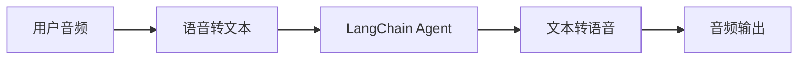
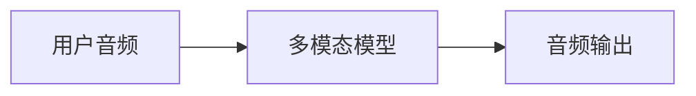

## 概述

聊天界面一直主导着我们与 AI 的交互方式，但多模态 AI 的最新突破正在开启令人兴奋的新可能。高质量的生成模型和富有表现力的文本转语音（TTS）系统，使得构建更像对话伙伴而非工具的 Agent 成为可能。

语音 Agent 就是一个典型例子。你无需通过键盘和鼠标向 Agent 输入文字，而是可以用语音与其交互。这是一种更自然、更有吸引力的 AI 交互方式，在某些场景下尤其有用。

### 什么是语音 Agent？

语音 Agent 是能与用户进行自然语音对话的 [Agent](/oss/langchain/agents)。它们结合了语音识别、自然语言处理、生成式 AI 和文本转语音技术，创造出流畅、自然的对话体验。

适用场景包括：

- 客户支持
- 个人助理
- 免提交互界面
- 培训与辅导

### 语音 Agent 的工作原理

从宏观上看，每个语音 Agent 都需要处理三个任务：

1. **听** - 采集音频并转录
2. **想** - 理解意图、推理、规划
3. **说** - 生成音频并流式传输给用户

差异在于这些步骤的编排和耦合方式。在实际生产中，Agent 通常采用以下两种主要架构之一：

#### 1. STT > Agent > TTS 架构（"三明治"架构）

三明治架构由三个独立组件组成：语音转文本（STT）、基于文本的 LangChain Agent 和文本转语音（TTS）。



**优点：**
- 对每个组件拥有完全控制权（可按需替换 STT/TTS 提供商）
- 可使用现代文本模态模型的最新能力
- 组件边界清晰，行为透明

**缺点：**
- 需要编排多个服务
- 管道管理增加了额外复杂性
- 语音转文本的过程会丢失信息（如语气、情感）

#### 2. 语音到语音架构（S2S）

语音到语音架构使用多模态模型，直接处理音频输入并原生生成音频输出。



**优点：**
- 架构更简单，组件更少
- 简单交互场景下通常延迟更低
- 直接处理音频，能捕捉语气等语音细微特征

**缺点：**
- 可选模型有限，供应商锁定风险更大
- 功能可能落后于文本模态模型
- 音频处理过程透明度较低
- 可控性和自定义选项受限

本指南演示的是**三明治架构**，以兼顾性能、可控性和对现代模型能力的访问。借助某些 STT 和 TTS 提供商，三明治架构可以在保持模块化组件控制的同时，实现低于 700ms 的延迟。

### 示例应用概述

我们将逐步介绍如何使用三明治架构构建一个基于语音的 Agent。该 Agent 将为一家三明治店管理订单。应用将展示三明治架构的所有三个组件，使用 [AssemblyAI](https://www.assemblyai.com/) 提供 STT 服务，使用 [Cartesia](https://cartesia.ai/) 提供 TTS 服务（当然也可以为大多数提供商构建适配器）。

完整的端到端参考应用可在 [voice-sandwich-demo](https://github.com/langchain-ai/voice-sandwich-demo) 仓库中获取。我们将在此逐步解读该应用。

示例使用 WebSocket 实现浏览器与服务器之间的实时双向通信。相同的架构也可以适配其他传输方式，如电话系统（Twilio、Vonage）或 WebRTC 连接。

### 架构

示例实现了一个流式处理管道，每个阶段都异步处理数据：

**客户端（浏览器）**
- 采集麦克风音频并编码为 PCM 格式
- 与后端服务器建立 WebSocket 连接
- 实时将音频块流式传输到服务器
- 接收并播放合成语音音频

:::python
**服务端（Python）**
:::
:::js
**服务端（Node.js）**
:::

- 接受客户端的 WebSocket 连接
- 编排三步管道：
  - [语音转文本（STT）](#1-speech-to-text)：将音频转发给 STT 提供商（如 AssemblyAI），接收转录事件
  - [Agent](#2-langchain-agent)：使用 LangChain Agent 处理转录文本，流式输出响应 token
  - [文本转语音（TTS）](#3-text-to-speech)：将 Agent 响应发送给 TTS 提供商（如 Cartesia），接收音频块

- 将合成音频返回客户端进行播放

:::python
管道使用异步生成器（async generator）实现每个阶段的流式处理。这使得下游组件可以在上游阶段完成之前就开始处理，从而最大限度地降低端到端延迟。
:::
:::js
管道使用异步迭代器（async iterator）实现每个阶段的流式处理。这使得下游组件可以在上游阶段完成之前就开始处理，从而最大限度地降低端到端延迟。
:::

## 环境配置

详细的安装说明和配置步骤，请参阅[仓库 README](https://github.com/langchain-ai/voice-sandwich-demo#readme)。

## 1. 语音转文本

STT 阶段将传入的音频流转换为文本转录。实现中使用了生产者-消费者模式来并发处理音频流和转录接收。

### 核心概念

**生产者-消费者模式**：音频块发送到 STT 服务与接收转录事件是并发进行的。这使得转录可以在所有音频到达之前就开始。

**事件类型**：
- `stt_chunk`：STT 服务处理音频时提供的部分转录
- `stt_output`：触发 Agent 处理的最终格式化转录

**WebSocket 连接**：与 AssemblyAI 的实时 STT API 保持持久连接，配置为 16kHz PCM 音频，支持自动轮次格式化。

### 实现

:::python
```python
from typing import AsyncIterator
import asyncio
from assemblyai_stt import AssemblyAISTT
from events import VoiceAgentEvent

async def stt_stream(
    audio_stream: AsyncIterator[bytes],
) -> AsyncIterator[VoiceAgentEvent]:
    """
    Transform stream: Audio (Bytes) → Voice Events (VoiceAgentEvent)

    Uses a producer-consumer pattern where:
    - Producer: Reads audio chunks and sends them to AssemblyAI
    - Consumer: Receives transcription events from AssemblyAI
    """
    stt = AssemblyAISTT(sample_rate=16000)

    async def send_audio():
        """Background task that pumps audio chunks to AssemblyAI."""
        try:
            async for audio_chunk in audio_stream:
                await stt.send_audio(audio_chunk)
        finally:
            # Signal completion when audio stream ends
            await stt.close()

    # Launch audio sending in background
    send_task = asyncio.create_task(send_audio())

    try:
        # Receive and yield transcription events as they arrive
        async for event in stt.receive_events():
            yield event
    finally:
        # Cleanup
        with contextlib.suppress(asyncio.CancelledError):
            send_task.cancel()
            await send_task
        await stt.close()
```
:::

:::js
```typescript
import { AssemblyAISTT } from "./assemblyai";
import type { VoiceAgentEvent } from "./types";

async function* sttStream(
  audioStream: AsyncIterable<Uint8Array>
): AsyncGenerator<VoiceAgentEvent> {
  const stt = new AssemblyAISTT({ sampleRate: 16000 });
  const passthrough = writableIterator<VoiceAgentEvent>();

  // Producer: pump audio chunks to AssemblyAI
  const producer = (async () => {
    try {
      for await (const audioChunk of audioStream) {
        await stt.sendAudio(audioChunk);
      }
    } finally {
      await stt.close();
    }
  })();

  // Consumer: receive transcription events
  const consumer = (async () => {
    for await (const event of stt.receiveEvents()) {
      passthrough.push(event);
    }
  })();

  try {
    // Yield events as they arrive
    yield* passthrough;
  } finally {
    // Wait for producer and consumer to complete
    await Promise.all([producer, consumer]);
  }
}
```
:::

应用实现了一个 AssemblyAI 客户端来管理 WebSocket 连接和消息解析。实现代码见下方；可以类似地为其他 STT 提供商构建适配器。

<Accordion title="AssemblyAI 客户端">

:::python
```python
class AssemblyAISTT:
    def __init__(self, api_key: str | None = None, sample_rate: int = 16000):
        self.api_key = api_key or os.getenv("ASSEMBLYAI_API_KEY")
        self.sample_rate = sample_rate
        self._ws: WebSocketClientProtocol | None = None

    async def send_audio(self, audio_chunk: bytes) -> None:
        """Send PCM audio bytes to AssemblyAI."""
        ws = await self._ensure_connection()
        await ws.send(audio_chunk)

    async def receive_events(self) -> AsyncIterator[STTEvent]:
        """Yield STT events as they arrive from AssemblyAI."""
        async for raw_message in self._ws:
            message = json.loads(raw_message)

            if message["type"] == "Turn":
                # Final formatted transcript
                if message.get("turn_is_formatted"):
                    yield STTOutputEvent.create(message["transcript"])
                # Partial transcript
                else:
                    yield STTChunkEvent.create(message["transcript"])

    async def _ensure_connection(self) -> WebSocketClientProtocol:
        """Establish WebSocket connection if not already connected."""
        if self._ws is None:
            url = f"wss://streaming.assemblyai.com/v3/ws?sample_rate={self.sample_rate}&format_turns=true"
            self._ws = await websockets.connect(
                url,
                additional_headers={"Authorization": self.api_key}
            )
        return self._ws
```
:::

:::js
```typescript
export class AssemblyAISTT {
  protected _bufferIterator = writableIterator<VoiceAgentEvent.STTEvent>();
  protected _connectionPromise: Promise<WebSocket> | null = null;

  async sendAudio(buffer: Uint8Array): Promise<void> {
    const conn = await this._connection;
    conn.send(buffer);
  }

  async *receiveEvents(): AsyncGenerator<VoiceAgentEvent.STTEvent> {
    yield* this._bufferIterator;
  }

  protected get _connection(): Promise<WebSocket> {
    if (this._connectionPromise) return this._connectionPromise;

    this._connectionPromise = new Promise((resolve, reject) => {
      const params = new URLSearchParams({
        sample_rate: this.sampleRate.toString(),
        format_turns: "true",
      });
      const url = `wss://streaming.assemblyai.com/v3/ws?${params}`;
      const ws = new WebSocket(url, {
        headers: { Authorization: this.apiKey },
      });

      ws.on("open", () => resolve(ws));

      ws.on("message", (data) => {
        const message = JSON.parse(data.toString());
        if (message.type === "Turn") {
          if (message.turn_is_formatted) {
            this._bufferIterator.push({
              type: "stt_output",
              transcript: message.transcript,
              ts: Date.now()
            });
          } else {
            this._bufferIterator.push({
              type: "stt_chunk",
              transcript: message.transcript,
              ts: Date.now()
            });
          }
        }
      });
    });

    return this._connectionPromise;
  }
}
```
:::

</Accordion>

## 2. LangChain Agent

Agent 阶段通过 LangChain [Agent](/oss/langchain/agents) 处理文本转录并流式输出响应 token。在本例中，我们流式输出 Agent 生成的所有[文本内容块](/oss/langchain/messages#content-block-reference)。

### 核心概念

**流式响应**：Agent 使用 [`stream_mode="messages"`](/oss/langchain/streaming#llm-tokens) 在 token 生成时即时发出，而非等待完整响应。这使 TTS 阶段能够立即开始合成。

**对话记忆**：通过 [checkpointer](/oss/langchain/short-term-memory) 使用唯一的 thread ID 维护跨轮次的对话状态。这使 Agent 能够引用对话中的先前交流。

### 实现

:::python
```python
from uuid import uuid4
from langchain.agents import create_agent
from langchain.messages import HumanMessage
from langgraph.checkpoint.memory import InMemorySaver

# Define agent tools
def add_to_order(item: str, quantity: int) -> str:
    """Add an item to the customer's sandwich order."""
    return f"Added {quantity} x {item} to the order."

def confirm_order(order_summary: str) -> str:
    """Confirm the final order with the customer."""
    return f"Order confirmed: {order_summary}. Sending to kitchen."

# Create agent with tools and memory
agent = create_agent(
    model="anthropic:claude-haiku-4-5",  # Select your model
    tools=[add_to_order, confirm_order],
    system_prompt="""You are a helpful sandwich shop assistant.
    Your goal is to take the user's order. Be concise and friendly.
    Do NOT use emojis, special characters, or markdown.
    Your responses will be read by a text-to-speech engine.""",
    checkpointer=InMemorySaver(),
)

async def agent_stream(
    event_stream: AsyncIterator[VoiceAgentEvent],
) -> AsyncIterator[VoiceAgentEvent]:
    """
    Transform stream: Voice Events → Voice Events (with Agent Responses)

    Passes through all upstream events and adds agent_chunk events
    when processing STT transcripts.
    """
    # Generate unique thread ID for conversation memory
    thread_id = str(uuid4())

    async for event in event_stream:
        # Pass through all upstream events
        yield event

        # Process final transcripts through the agent
        if event.type == "stt_output":
            # Stream agent response with conversation context
            stream = agent.astream(
                {"messages": [HumanMessage(content=event.transcript)]},
                {"configurable": {"thread_id": thread_id}},
                stream_mode="messages",
            )

            # Yield agent response chunks as they arrive
            async for message, _ in stream:
                if message.text:
                    yield AgentChunkEvent.create(message.text)
```
:::

:::js
```typescript
import { createAgent } from "langchain";
import { HumanMessage } from "@langchain/core/messages";
import { MemorySaver } from "@langchain/langgraph";
import { tool } from "@langchain/core/tools";
import { z } from "zod";
import { v4 as uuidv4 } from "uuid";

// Define agent tools
const addToOrder = tool(
  async ({ item, quantity }) => {
    return `Added ${quantity} x ${item} to the order.`;
  },
  {
    name: "add_to_order",
    description: "Add an item to the customer's sandwich order.",
    schema: z.object({
      item: z.string(),
      quantity: z.number(),
    }),
  }
);

const confirmOrder = tool(
  async ({ orderSummary }) => {
    return `Order confirmed: ${orderSummary}. Sending to kitchen.`;
  },
  {
    name: "confirm_order",
    description: "Confirm the final order with the customer.",
    schema: z.object({
      orderSummary: z.string().describe("Summary of the order"),
    }),
  }
);

// Create agent with tools and memory
const agent = createAgent({
  model: "claude-haiku-4-5",
  tools: [addToOrder, confirmOrder],
  checkpointer: new MemorySaver(),
  systemPrompt: `You are a helpful sandwich shop assistant.
Your goal is to take the user's order. Be concise and friendly.
Do NOT use emojis, special characters, or markdown.
Your responses will be read by a text-to-speech engine.`,
});

async function* agentStream(
  eventStream: AsyncIterable<VoiceAgentEvent>
): AsyncGenerator<VoiceAgentEvent> {
  // Generate unique thread ID for conversation memory
  const threadId = uuidv4();

  for await (const event of eventStream) {
    // Pass through all upstream events
    yield event;

    // Process final transcripts through the agent
    if (event.type === "stt_output") {
      const stream = await agent.stream(
        { messages: [new HumanMessage(event.transcript)] },
        {
          configurable: { thread_id: threadId },
          streamMode: "messages",
        }
      );

      // Yield agent response chunks as they arrive
      for await (const [message] of stream) {
        yield { type: "agent_chunk", text: message.text, ts: Date.now() };
      }
    }
  }
}
```
:::

## 3. 文本转语音

TTS 阶段将 Agent 响应文本合成为音频，并流式传输回客户端。与 STT 阶段类似，它使用生产者-消费者模式来并发处理文本发送和音频接收。

### 核心概念

**并发处理**：实现中合并了两个异步流：
- **上游处理**：透传所有事件，并将 Agent 文本块发送给 TTS 提供商
- **音频接收**：从 TTS 提供商接收合成的音频块

**流式 TTS**：某些提供商（如 [Cartesia](https://cartesia.ai/)）在收到文本后立即开始合成音频，使音频播放可以在 Agent 生成完整响应之前就开始。

**事件透传**：所有上游事件会原封不动地流过，使客户端或其他观察者能够跟踪完整的管道状态。

### 实现

:::python
```python
from cartesia_tts import CartesiaTTS
from utils import merge_async_iters

async def tts_stream(
    event_stream: AsyncIterator[VoiceAgentEvent],
) -> AsyncIterator[VoiceAgentEvent]:
    """
    Transform stream: Voice Events → Voice Events (with Audio)

    Merges two concurrent streams:
    1. process_upstream(): passes through events and sends text to Cartesia
    2. tts.receive_events(): yields audio chunks from Cartesia
    """
    tts = CartesiaTTS()

    async def process_upstream() -> AsyncIterator[VoiceAgentEvent]:
        """Process upstream events and send agent text to Cartesia."""
        async for event in event_stream:
            # Pass through all events
            yield event
            # Send agent text to Cartesia for synthesis
            if event.type == "agent_chunk":
                await tts.send_text(event.text)

    try:
        # Merge upstream events with TTS audio events
        # Both streams run concurrently
        async for event in merge_async_iters(
            process_upstream(),
            tts.receive_events()
        ):
            yield event
    finally:
        await tts.close()
```
:::

:::js
```typescript
import { CartesiaTTS } from "./cartesia";

async function* ttsStream(
  eventStream: AsyncIterable<VoiceAgentEvent>
): AsyncGenerator<VoiceAgentEvent> {
  const tts = new CartesiaTTS();
  const passthrough = writableIterator<VoiceAgentEvent>();

  // Producer: read upstream events and send text to Cartesia
  const producer = (async () => {
    try {
      for await (const event of eventStream) {
        passthrough.push(event);
        if (event.type === "agent_chunk") {
          await tts.sendText(event.text);
        }
      }
    } finally {
      await tts.close();
    }
  })();

  // Consumer: receive audio from Cartesia
  const consumer = (async () => {
    for await (const event of tts.receiveEvents()) {
      passthrough.push(event);
    }
  })();

  try {
    // Yield events from both producer and consumer
    yield* passthrough;
  } finally {
    await Promise.all([producer, consumer]);
  }
}
```
:::

应用实现了一个 Cartesia 客户端来管理 WebSocket 连接和音频流。实现代码见下方；可以类似地为其他 TTS 提供商构建适配器。

<Accordion title="Cartesia 客户端">

:::python
```python
import base64
import json
import websockets

class CartesiaTTS:
    def __init__(
        self,
        api_key: Optional[str] = None,
        voice_id: str = "f6ff7c0c-e396-40a9-a70b-f7607edb6937",
        model_id: str = "sonic-3",
        sample_rate: int = 24000,
        encoding: str = "pcm_s16le",
    ):
        self.api_key = api_key or os.getenv("CARTESIA_API_KEY")
        self.voice_id = voice_id
        self.model_id = model_id
        self.sample_rate = sample_rate
        self.encoding = encoding
        self._ws: WebSocketClientProtocol | None = None

    def _generate_context_id(self) -> str:
        """Generate a valid context_id for Cartesia."""
        timestamp = int(time.time() * 1000)
        counter = self._context_counter
        self._context_counter += 1
        return f"ctx_{timestamp}_{counter}"

    async def send_text(self, text: str | None) -> None:
        """Send text to Cartesia for synthesis."""
        if not text or not text.strip():
            return

        ws = await self._ensure_connection()
        payload = {
            "model_id": self.model_id,
            "transcript": text,
            "voice": {
                "mode": "id",
                "id": self.voice_id,
            },
            "output_format": {
                "container": "raw",
                "encoding": self.encoding,
                "sample_rate": self.sample_rate,
            },
            "language": self.language,
            "context_id": self._generate_context_id(),
        }
        await ws.send(json.dumps(payload))

    async def receive_events(self) -> AsyncIterator[TTSChunkEvent]:
        """Yield audio chunks as they arrive from Cartesia."""
        async for raw_message in self._ws:
            message = json.loads(raw_message)

            # Decode and yield audio chunks
            if "data" in message and message["data"]:
                audio_chunk = base64.b64decode(message["data"])
                if audio_chunk:
                    yield TTSChunkEvent.create(audio_chunk)

    async def _ensure_connection(self) -> WebSocketClientProtocol:
        """Establish WebSocket connection if not already connected."""
        if self._ws is None:
            url = (
                f"wss://api.cartesia.ai/tts/websocket"
                f"?api_key={self.api_key}&cartesia_version={self.cartesia_version}"
            )
            self._ws = await websockets.connect(url)

        return self._ws
```
:::

:::js
```typescript
export class CartesiaTTS {
  protected _bufferIterator = writableIterator<VoiceAgentEvent.TTSEvent>();
  protected _connectionPromise: Promise<WebSocket> | null = null;

  async sendText(text: string | null): Promise<void> {
    if (!text || !text.trim()) return;

    const conn = await this._connection;
    const payload = { text, try_trigger_generation: false };
    conn.send(JSON.stringify(payload));
  }

  async *receiveEvents(): AsyncGenerator<VoiceAgentEvent.TTSEvent> {
    yield* this._bufferIterator;
  }

  protected _generateContextId(): string {
    const timestamp = Date.now();
    const counter = this._contextCounter++;
    return `ctx_${timestamp}_${counter}`;
  }

  protected get _connection(): Promise<WebSocket> {
    if (this._connectionPromise) return this._connectionPromise;

    this._connectionPromise = new Promise((resolve, reject) => {
      const params = new URLSearchParams({
        api_key: this.apiKey,
        cartesia_version: this.cartesiaVersion,
      });
      const url = `wss://api.cartesia.ai/tts/websocket?${params.toString()}`;
      const ws = new WebSocket(url);

      ws.on("open", () => {
        resolve(ws);
      });

      ws.on("message", (data: WebSocket.RawData) => {
        const message: CartesiaTTSResponse = JSON.parse(data.toString());
        if (message.data) {
          this._bufferIterator.push({
            type: "tts_chunk",
            audio: message.data,
            ts: Date.now(),
          });
        } else if (message.error) {
          throw new Error(`Cartesia error: ${message.error}`);
        }
      });
    });

    return this._connectionPromise;
  }
}
```
:::
</Accordion>

### LangSmith

你使用 LangChain 构建的许多应用会包含多个步骤和多次 LLM 调用。随着应用变得越来越复杂，能够检查链或 Agent 内部的确切运行情况变得至关重要。最佳方式是使用 [LangSmith](https://smith.langchain.com)。

在上述链接注册后，确保设置环境变量以开始记录跟踪：

```shell
export LANGSMITH_TRACING="true"
export LANGSMITH_API_KEY="..."
```

:::python
或者在 Python 中设置：

```python
import getpass
import os

os.environ["LANGSMITH_TRACING"] = "true"
os.environ["LANGSMITH_API_KEY"] = getpass.getpass()
```
:::

## 完整组装

完整的管道将三个阶段串联在一起：

:::python
```python
from langchain_core.runnables import RunnableGenerator

pipeline = (
    RunnableGenerator(stt_stream)      # Audio → STT events
    | RunnableGenerator(agent_stream)  # STT events → Agent events
    | RunnableGenerator(tts_stream)    # Agent events → TTS audio
)

# Use in WebSocket endpoint
@app.websocket("/ws")
async def websocket_endpoint(websocket: WebSocket):
    await websocket.accept()

    async def websocket_audio_stream():
        """Yield audio bytes from WebSocket."""
        while True:
            data = await websocket.receive_bytes()
            yield data

    # Transform audio through pipeline
    output_stream = pipeline.atransform(websocket_audio_stream())

    # Send TTS audio back to client
    async for event in output_stream:
        if event.type == "tts_chunk":
            await websocket.send_bytes(event.audio)
```

我们使用 [RunnableGenerator](https://reference.langchain.com/python/langchain_core/runnables/#langchain_core.runnables.base.RunnableGenerator) 来组合管道的每个步骤。这是 LangChain 内部用于管理[跨组件流式处理](https://reference.langchain.com/python/langchain_core/runnables/)的抽象。
:::

:::js
```typescript
// using https://hono.dev/
app.get("/ws", upgradeWebSocket(async () => {
  const inputStream = writableIterator<Uint8Array>();

  // Chain the three stages
  const transcriptEventStream = sttStream(inputStream);
  const agentEventStream = agentStream(transcriptEventStream);
  const outputEventStream = ttsStream(agentEventStream);

  // Process pipeline and send TTS audio to client
  const flushPromise = (async () => {
    for await (const event of outputEventStream) {
      if (event.type === "tts_chunk") {
        currentSocket?.send(event.audio);
      }
    }
  })();

  return {
    onMessage(event) {
      // Push incoming audio into pipeline
      const data = event.data;
      if (Buffer.isBuffer(data)) {
        inputStream.push(new Uint8Array(data));
      }
    },
    async onClose() {
      inputStream.cancel();
      await flushPromise;
    },
  };
}));
```
:::

每个阶段独立且并发地处理事件：音频一到达就开始转录，转录一可用 Agent 就开始推理，Agent 文本一生成就开始语音合成。这种架构可以实现低于 700ms 的延迟，支持自然对话。

更多关于使用 LangChain 构建 Agent 的信息，请参见 [Agent 指南](/oss/langchain/agents)。
