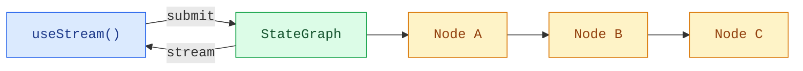

构建能够实时可视化 LangGraph 流水线的前端。这些模式展示了如何渲染多步骤图执行过程，包括每个节点的状态和来自自定义 `StateGraph` 工作流的流式内容。

## 架构

LangGraph 图由命名节点通过边连接组成。每个节点执行一个步骤（分类、研究、分析、综合），并将输出写入特定的状态键。在前端，`useStream` 提供对节点输出、流式 token 和图元数据的响应式访问，让你可以将每个节点映射到 UI 卡片。



:::python

```python
from langgraph.graph import StateGraph, MessagesState, START, END

class State(MessagesState):
    classification: str
    research: str
    analysis: str

graph = StateGraph(State)
graph.add_node("classify", classify_node)
graph.add_node("research", research_node)
graph.add_node("analyze", analyze_node)
graph.add_edge(START, "classify")
graph.add_edge("classify", "research")
graph.add_edge("research", "analyze")
graph.add_edge("analyze", END)

app = graph.compile()
```

:::

:::js

```ts
import { StateGraph, StateSchema, MessagesValue, START, END } from "@langchain/langgraph";
import * as z from "zod";

const State = new StateSchema({
  messages: MessagesValue,
  classification: z.string(),
  research: z.string(),
  analysis: z.string(),
});

const graph = new StateGraph(State)
  .addNode("classify", classifyNode)
  .addNode("research", researchNode)
  .addNode("analyze", analyzeNode)
  .addEdge(START, "classify")
  .addEdge("classify", "research")
  .addEdge("research", "analyze")
  .addEdge("analyze", END)
  .compile();
```

:::

在前端，`useStream` 通过 `stream.values` 暴露已完成的节点输出，通过 `getMessagesMetadata` 标识每个流式 token 由哪个节点产生。

```ts
import { useStream } from "@langchain/react";

function Pipeline() {
  const stream = useStream<typeof graph>({
    apiUrl: "http://localhost:2024",
    assistantId: "pipeline",
  });

  const classification = stream.values?.classification;
  const research = stream.values?.research;
  const analysis = stream.values?.analysis;
}
```

## 模式

<CardGroup cols={2}>
  <Card title="图执行" icon="chart-dots" href="/oss/langgraph/frontend/graph-execution">
    可视化多步骤图流水线，展示每个节点的状态和流式内容。
  </Card>
</CardGroup>

## 相关模式

[LangChain 前端模式](/oss/langchain/frontend/overview)——Markdown 消息、工具调用、乐观更新等——适用于任何 LangGraph 图。`useStream` 钩子提供相同的核心 API，无论你使用 `createAgent`、`createDeepAgent` 还是自定义的 `StateGraph`。
