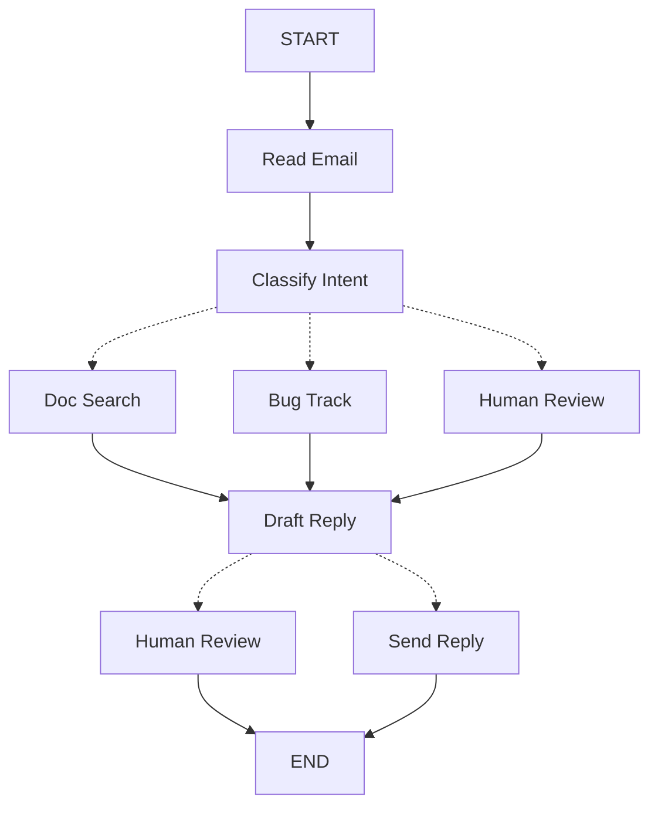

当你使用 LangGraph 构建 Agent 时，你首先要将其分解为称为**节点**的离散步骤。然后，描述每个节点的不同决策和转换。最后，通过每个节点都可以读取和写入的共享**状态**连接节点。

在本次实践中，我们将引导你思考如何用 LangGraph 构建一个客户支持邮件 Agent。

## 从你想要自动化的流程开始

假设你需要构建一个处理客户支持邮件的 AI Agent。你的产品团队给了你这些需求：

```txt
The agent should:

- 读取传入的客户邮件
- 按紧急程度和主题分类
- 搜索相关文档来回答问题
- 起草适当的回复
- 将复杂问题升级给人工客服
- 在需要时安排后续跟进

需要处理的示例场景：

1. 简单产品问题：“我如何重置密码？”
2. Bug 报告：“当我选择 PDF 格式时导出功能崩溃了”
3. 紧急计费问题：“我的订阅被重复收费了！”
4. 功能请求：“你们能给移动端加个深色模式吗？”
5. 复杂技术问题：“我们的 API 集成间歇性地出现 504 错误”
```

要在 LangGraph 中实现一个 Agent，你通常会遵循相同的五个步骤。

## 第一步：将工作流映射为离散步骤

首先识别流程中的不同步骤。每个步骤将成为一个**节点**（一个做一件特定事情的函数）。然后，勾勒出这些步骤如何相互连接。



图中的箭头表示可能的路径，但实际决定走哪条路径发生在每个节点内部。

现在我们已经识别了工作流中的组件，让我们了解每个节点需要做什么：

- `Read Email`：提取和解析邮件内容
- `Classify Intent`：使用 LLM 对紧急程度和主题进行分类，然后路由到适当的动作
- `Doc Search`：查询你的知识库获取相关信息
- `Bug Track`：在跟踪系统中创建或更新问题
- `Draft Reply`：生成适当的回复
- `Human Review`：升级到人工客服进行审批或处理
- `Send Reply`：发送邮件回复

<Tip>
注意，某些节点会决定接下来走哪里（`Classify Intent`、`Draft Reply`、`Human Review`），而其他节点始终进入相同的下一步（`Read Email` 始终去 `Classify Intent`，`Doc Search` 始终去 `Draft Reply`）。
</Tip>

## 第二步：确定每个步骤需要做什么

对于图中的每个节点，确定它代表什么类型的操作，以及它需要什么上下文才能正常工作。

<CardGroup cols={2}>
    <Card title="LLM 步骤" icon="brain" href="#llm-steps">
        当你需要理解、分析、生成文本或做出推理决策时使用
    </Card>
    <Card title="数据步骤" icon="database" href="#data-steps">
        当你需要从外部源检索信息时使用
    </Card>
    <Card title="动作步骤" icon="bolt" href="#action-steps">
        当你需要执行外部操作时使用
    </Card>
    <Card title="用户输入步骤" icon="user" href="#user-input-steps">
        当你需要人工介入时使用
    </Card>
</CardGroup>

### LLM 步骤

当某个步骤需要理解、分析、生成文本或做出推理决策时：

<AccordionGroup>
    <Accordion title="分类意图">
        - 静态上下文（提示词）：分类类别、紧急程度定义、响应格式
        - 动态上下文（来自状态）：邮件内容、发件人信息
        - 期望结果：决定路由的结构化分类
    </Accordion>

    <Accordion title="起草回复">
        - 静态上下文（提示词）：语气指南、公司政策、回复模板
        - 动态上下文（来自状态）：分类结果、搜索结果、客户历史
        - 期望结果：准备好审核的专业邮件回复
    </Accordion>
</AccordionGroup>

### 数据步骤

当某个步骤需要从外部源检索信息时：

<AccordionGroup>
    <Accordion title="文档搜索">
        - 参数：根据意图和主题构建的查询
        - 重试策略：是，对临时失败使用指数退避
        - 缓存：可以缓存常见查询以减少 API 调用
    </Accordion>

    <Accordion title="客户历史查询">
        - 参数：来自状态的客户邮箱或 ID
        - 重试策略：是，但如果不可用则回退到基本信息
        - 缓存：是，带有生存时间以平衡新鲜度和性能
    </Accordion>
</AccordionGroup>

### 动作步骤

当某个步骤需要执行外部操作时：

<AccordionGroup>
    <Accordion title="发送回复">
        - 何时执行节点：审批后（人工或自动）
        - 重试策略：是，对网络问题使用指数退避
        - 不应缓存：每次发送都是唯一的操作
    </Accordion>

    <Accordion title="Bug 跟踪">
        - 何时执行节点：当意图为 "bug" 时始终执行
        - 重试策略：是，不能丢失 bug 报告至关重要
        - 返回：工单 ID，用于包含在回复中
    </Accordion>
</AccordionGroup>

### 用户输入步骤

当某个步骤需要人工介入时：

<AccordionGroup>
    <Accordion title="人工审核节点">
        - 决策上下文：原始邮件、回复草稿、紧急程度、分类
        - 期望输入格式：审批布尔值加可选的编辑后回复
        - 触发时机：高紧急、复杂问题或质量问题
    </Accordion>
</AccordionGroup>

## 第三步：设计你的状态

状态是 Agent 中所有节点都可访问的共享[记忆](/oss/concepts/memory)。可以把它想象成 Agent 在处理流程时用来记录它学到的所有信息和做出的所有决定的笔记本。

### 哪些数据应该放在状态中？

对于每一条数据，问自己这些问题：

<CardGroup cols={2}>
    <Card title="包含在状态中" icon="check">
        它需要跨步骤持久化吗？如果是，放入状态。
    </Card>

    <Card title="不储存" icon="code">
        你能从其他数据推导出来吗？如果是，在需要时计算而不是储存在状态中。
    </Card>
</CardGroup>

对于我们的邮件 Agent，我们需要跟踪：

- 原始邮件和发件人信息（之后无法重建）
- 分类结果（多个后续/下游节点需要）
- 搜索结果和客户数据（重新获取代价高昂）
- 回复草稿（需要在审核过程中持久化）
- 执行元数据（用于调试和恢复）

### 状态储存原始数据，按需格式化提示词

<Tip>
    一个关键原则：你的状态应该储存原始数据，而不是格式化的文本。在节点内部按需格式化提示词。
</Tip>

这种分离意味着：

- 不同节点可以以不同方式格式化相同的数据
- 你可以在不修改状态 schema 的情况下更改提示词模板
- 调试更清晰——你能确切看到每个节点收到了什么数据
- 你的 Agent 可以演进而不会破坏现有状态

让我们定义我们的状态：

:::python

```python
from typing import TypedDict, Literal

# Define the structure for email classification
class EmailClassification(TypedDict):
    intent: Literal["question", "bug", "billing", "feature", "complex"]
    urgency: Literal["low", "medium", "high", "critical"]
    topic: str
    summary: str

class EmailAgentState(TypedDict):
    # Raw email data
    email_content: str
    sender_email: str
    email_id: str

    # Classification result
    classification: EmailClassification | None

    # Raw search/API results
    search_results: list[str] | None  # List of raw document chunks
    customer_history: dict | None  # Raw customer data from CRM

    # Generated content
    draft_response: str | None
    messages: list[str] | None
```

:::

:::js

```typescript
import { StateSchema } from "@langchain/langgraph";
import * as z from "zod";

// Define the structure for email classification
const EmailClassificationSchema = z.object({
  intent: z.enum(["question", "bug", "billing", "feature", "complex"]),
  urgency: z.enum(["low", "medium", "high", "critical"]),
  topic: z.string(),
  summary: z.string(),
});

const EmailAgentState = new StateSchema({
  // Raw email data
  emailContent: z.string(),
  senderEmail: z.string(),
  emailId: z.string(),

  // Classification result
  classification: EmailClassificationSchema.optional(),

  // Raw search/API results
  searchResults: z.array(z.string()).optional(),  // List of raw document chunks
  customerHistory: z.record(z.string(), z.any()).optional(),  // Raw customer data from CRM

  // Generated content
  responseText: z.string().optional(),
});

type EmailClassificationType = z.infer<typeof EmailClassificationSchema>;
```

:::


注意，状态只包含原始数据——没有提示词模板、没有格式化字符串、没有指令。分类输出作为单个字典储存，直接来自 LLM。

## 第四步：构建你的节点

:::python

现在我们将每个步骤实现为一个函数。LangGraph 中的节点就是一个 Python 函数，接受当前状态并返回更新。

:::

:::js

现在我们将每个步骤实现为一个函数。LangGraph 中的节点就是一个 JavaScript 函数，接受当前状态并返回更新。

:::

### 适当处理错误

不同的错误需要不同的处理策略：

| 错误类型 | 谁来修复 | 策略 | 何时使用 |
|------------|--------------|----------|-------------|
| 瞬时错误（网络问题、速率限制） | 系统（自动） | 重试策略 | 通常在重试时解决的临时失败 |
| LLM 可恢复错误（工具失败、解析问题） | LLM | 将错误储存在状态中并回环 | LLM 可以看到错误并调整方法 |
| 用户可修复错误（缺少信息、不明确的指令） | 人工 | 使用 `interrupt()` 暂停 | 需要用户输入才能继续 |
| 意外错误 | 开发者 | 向上抛出 | 需要调试的未知问题 |

<Tabs>
    <Tab title="瞬时错误" icon="rotate">
        添加重试策略以自动重试网络问题和速率限制：

    :::python

    ```python
    from langgraph.types import RetryPolicy

    workflow.add_node(
        "search_documentation",
        search_documentation,
        retry_policy=RetryPolicy(max_attempts=3, initial_interval=1.0)
    )
    ```

    :::

    :::js

    ```typescript
    import type { RetryPolicy } from "@langchain/langgraph";

    workflow.addNode(
      "searchDocumentation",
      searchDocumentation,
      {
        retryPolicy: { maxAttempts: 3, initialInterval: 1.0 },
      },
    );
    ```

    :::

    </Tab>

    <Tab title="LLM 可恢复" icon="brain">
        将错误储存在状态中并回环，让 LLM 能看到出了什么问题并重试：

    :::python

    ```python
    from langgraph.types import Command


    def execute_tool(state: State) -> Command[Literal["agent", "execute_tool"]]:
        try:
            result = run_tool(state['tool_call'])
            return Command(update={"tool_result": result}, goto="agent")
        except ToolError as e:
            # Let the LLM see what went wrong and try again
            return Command(
                update={"tool_result": f"Tool error: {str(e)}"},
                goto="agent"
            )
    ```

    :::

    :::js

    ```typescript
    import { Command, GraphNode } from "@langchain/langgraph";

    const executeTool: GraphNode<typeof State> = async (state, config) => {
      try {
        const result = await runTool(state.toolCall);
        return new Command({
          update: { toolResult: result },
          goto: "agent",
        });
      } catch (error) {
        // Let the LLM see what went wrong and try again
        return new Command({
          update: { toolResult: `Tool error: ${error}` },
          goto: "agent"
        });
      }
    }
    ```

    :::

    </Tab>

    <Tab title="用户可修复" icon="user">
        当需要时暂停并从用户收集信息（如账户 ID、订单号或澄清信息）：

    :::python

    ```python
    from langgraph.types import Command


    def lookup_customer_history(state: State) -> Command[Literal["draft_response"]]:
        if not state.get('customer_id'):
            user_input = interrupt({
                "message": "Customer ID needed",
                "request": "Please provide the customer's account ID to look up their subscription history"
            })
            return Command(
                update={"customer_id": user_input['customer_id']},
                goto="lookup_customer_history"
            )
        # Now proceed with the lookup
        customer_data = fetch_customer_history(state['customer_id'])
        return Command(update={"customer_history": customer_data}, goto="draft_response")
    ```

    :::

    :::js

    ```typescript
    import { Command, GraphNode, interrupt } from "@langchain/langgraph";

    const lookupCustomerHistory: GraphNode<typeof State> = async (state, config) => {
      if (!state.customerId) {
        const userInput = interrupt({
          message: "Customer ID needed",
          request: "Please provide the customer's account ID to look up their subscription history",
        });
        return new Command({
          update: { customerId: userInput.customerId },
          goto: "lookupCustomerHistory",
        });
      }
      // Now proceed with the lookup
      const customerData = await fetchCustomerHistory(state.customerId);
      return new Command({
        update: { customerHistory: customerData },
        goto: "draftResponse",
      });
    }
    ```

    :::

    </Tab>

    <Tab title="意外错误" icon="alert-triangle">
        向上抛出以便调试。不要捕获你无法处理的异常：

    :::python

    ```python
    def send_reply(state: EmailAgentState):
        try:
            email_service.send(state["draft_response"])
        except Exception:
            raise  # Surface unexpected errors
    ```

    :::

    :::js

    ```typescript
    import { Command, GraphNode } from "@langchain/langgraph";

    const sendReply: GraphNode<typeof EmailAgentState> = async (state, config) => {
      try {
        await emailService.send(state.responseText);
      } catch (error) {
        throw error;  // Surface unexpected errors
      }
    }
    ```

    :::

    </Tab>
</Tabs>


### 实现我们的邮件 Agent 节点

我们将每个节点实现为一个简单的函数。记住：节点接受状态，执行工作，返回更新。

<AccordionGroup>
    <Accordion title="读取和分类节点" icon="brain">

    :::python

    ```python
    from typing import Literal
    from langgraph.graph import StateGraph, START, END
    from langgraph.types import interrupt, Command, RetryPolicy
    from langchain_openai import ChatOpenAI
    from langchain.messages import HumanMessage

    llm = ChatOpenAI(model="gpt-5-nano")

    def read_email(state: EmailAgentState) -> dict:
        """Extract and parse email content"""
        # In production, this would connect to your email service
        return {
            "messages": [HumanMessage(content=f"Processing email: {state['email_content']}")]
        }

    def classify_intent(state: EmailAgentState) -> Command[Literal["search_documentation", "human_review", "draft_response", "bug_tracking"]]:
        """Use LLM to classify email intent and urgency, then route accordingly"""

        # Create structured LLM that returns EmailClassification dict
        structured_llm = llm.with_structured_output(EmailClassification)

        # Format the prompt on-demand, not stored in state
        classification_prompt = f"""
        Analyze this customer email and classify it:

        Email: {state['email_content']}
        From: {state['sender_email']}

        Provide classification including intent, urgency, topic, and summary.
        """

        # Get structured response directly as dict
        classification = structured_llm.invoke(classification_prompt)

        # Determine next node based on classification
        if classification['intent'] == 'billing' or classification['urgency'] == 'critical':
            goto = "human_review"
        elif classification['intent'] in ['question', 'feature']:
            goto = "search_documentation"
        elif classification['intent'] == 'bug':
            goto = "bug_tracking"
        else:
            goto = "draft_response"

        # Store classification as a single dict in state
        return Command(
            update={"classification": classification},
            goto=goto
        )
    ```

    :::

    :::js

    ```typescript
    import { StateGraph, START, END, GraphNode, Command } from "@langchain/langgraph";
    import { HumanMessage } from "@langchain/core/messages";
    import { ChatAnthropic } from "@langchain/anthropic";

    const llm = new ChatAnthropic({ model: "claude-sonnet-4-6" });

    const readEmail: GraphNode<typeof EmailAgentState> = async (state, config) => {
      // Extract and parse email content
      // In production, this would connect to your email service
      console.log(`Processing email: ${state.emailContent}`);
      return {};
    }

    const classifyIntent: GraphNode<typeof EmailAgentState> = async (state, config) => {
      // Use LLM to classify email intent and urgency, then route accordingly

      // Create structured LLM that returns EmailClassification object
      const structuredLlm = llm.withStructuredOutput(EmailClassificationSchema);

      // Format the prompt on-demand, not stored in state
      const classificationPrompt = `
      Analyze this customer email and classify it:

      Email: ${state.emailContent}
      From: ${state.senderEmail}

      Provide classification including intent, urgency, topic, and summary.
      `;

      // Get structured response directly as object
      const classification = await structuredLlm.invoke(classificationPrompt);

      // Determine next node based on classification
      let nextNode: "searchDocumentation" | "humanReview" | "draftResponse" | "bugTracking";

      if (classification.intent === "billing" || classification.urgency === "critical") {
        nextNode = "humanReview";
      } else if (classification.intent === "question" || classification.intent === "feature") {
        nextNode = "searchDocumentation";
      } else if (classification.intent === "bug") {
        nextNode = "bugTracking";
      } else {
        nextNode = "draftResponse";
      }

      // Store classification as a single object in state
      return new Command({
        update: { classification },
        goto: nextNode,
      });
    }
    ```

    :::

    </Accordion>

    <Accordion title="搜索和跟踪节点" icon="database">

    :::python

    ```python
    def search_documentation(state: EmailAgentState) -> Command[Literal["draft_response"]]:
        """Search knowledge base for relevant information"""

        # Build search query from classification
        classification = state.get('classification', {})
        query = f"{classification.get('intent', '')} {classification.get('topic', '')}"

        try:
            # Implement your search logic here
            # Store raw search results, not formatted text
            search_results = [
                "Reset password via Settings > Security > Change Password",
                "Password must be at least 12 characters",
                "Include uppercase, lowercase, numbers, and symbols"
            ]
        except SearchAPIError as e:
            # For recoverable search errors, store error and continue
            search_results = [f"Search temporarily unavailable: {str(e)}"]

        return Command(
            update={"search_results": search_results},  # Store raw results or error
            goto="draft_response"
        )

    def bug_tracking(state: EmailAgentState) -> Command[Literal["draft_response"]]:
        """Create or update bug tracking ticket"""

        # Create ticket in your bug tracking system
        ticket_id = "BUG-12345"  # Would be created via API

        return Command(
            update={
                "search_results": [f"Bug ticket {ticket_id} created"],
                "current_step": "bug_tracked"
            },
            goto="draft_response"
        )
    ```

    :::

    :::js

    ```typescript
    import { Command, GraphNode } from "@langchain/langgraph";

    const searchDocumentation: GraphNode<typeof EmailAgentState> = async (state, config) => {
      // Search knowledge base for relevant information

      // Build search query from classification
      const classification = state.classification!;
      const query = `${classification.intent} ${classification.topic}`;

      let searchResults: string[];

      try {
        // Implement your search logic here
        // Store raw search results, not formatted text
        searchResults = [
          "Reset password via Settings > Security > Change Password",
          "Password must be at least 12 characters",
          "Include uppercase, lowercase, numbers, and symbols",
        ];
      } catch (error) {
        // For recoverable search errors, store error and continue
        searchResults = [`Search temporarily unavailable: ${error}`];
      }

      return new Command({
        update: { searchResults },  // Store raw results or error
        goto: "draftResponse",
      });
    }

    const bugTracking: GraphNode<typeof EmailAgentState> = async (state, config) => {
      // Create or update bug tracking ticket

      // Create ticket in your bug tracking system
      const ticketId = "BUG-12345";  // Would be created via API

      return new Command({
        update: { searchResults: [`Bug ticket ${ticketId} created`] },
        goto: "draftResponse",
      });
    }
    ```
    :::
    </Accordion>

    <Accordion title="响应节点" icon="edit">

    :::python

    ```python
    def draft_response(state: EmailAgentState) -> Command[Literal["human_review", "send_reply"]]:
        """Generate response using context and route based on quality"""

        classification = state.get('classification', {})

        # Format context from raw state data on-demand
        context_sections = []

        if state.get('search_results'):
            # Format search results for the prompt
            formatted_docs = "\n".join([f"- {doc}" for doc in state['search_results']])
            context_sections.append(f"Relevant documentation:\n{formatted_docs}")

        if state.get('customer_history'):
            # Format customer data for the prompt
            context_sections.append(f"Customer tier: {state['customer_history'].get('tier', 'standard')}")

        # Build the prompt with formatted context
        draft_prompt = f"""
        Draft a response to this customer email:
        {state['email_content']}

        Email intent: {classification.get('intent', 'unknown')}
        Urgency level: {classification.get('urgency', 'medium')}

        {chr(10).join(context_sections)}

        Guidelines:
        - Be professional and helpful
        - Address their specific concern
        - Use the provided documentation when relevant
        """

        response = llm.invoke(draft_prompt)

        # Determine if human review needed based on urgency and intent
        needs_review = (
            classification.get('urgency') in ['high', 'critical'] or
            classification.get('intent') == 'complex'
        )

        # Route to appropriate next node
        goto = "human_review" if needs_review else "send_reply"

        return Command(
            update={"draft_response": response.content},  # Store only the raw response
            goto=goto
        )

    def human_review(state: EmailAgentState) -> Command[Literal["send_reply", END]]:
        """Pause for human review using interrupt and route based on decision"""

        classification = state.get('classification', {})

        # interrupt() must come first - any code before it will re-run on resume
        human_decision = interrupt({
            "email_id": state.get('email_id',''),
            "original_email": state.get('email_content',''),
            "draft_response": state.get('draft_response',''),
            "urgency": classification.get('urgency'),
            "intent": classification.get('intent'),
            "action": "Please review and approve/edit this response"
        })

        # Now process the human's decision
        if human_decision.get("approved"):
            return Command(
                update={"draft_response": human_decision.get("edited_response", state.get('draft_response',''))},
                goto="send_reply"
            )
        else:
            # Rejection means human will handle directly
            return Command(update={}, goto=END)

    def send_reply(state: EmailAgentState) -> dict:
        """Send the email response"""
        # Integrate with email service
        print(f"Sending reply: {state['draft_response'][:100]}...")
        return {}
    ```

    :::

    :::js

    ```typescript
    import { Command, interrupt } from "@langchain/langgraph";

    const draftResponse: GraphNode<typeof EmailAgentState> = async (state, config) => {
      // Generate response using context and route based on quality

      const classification = state.classification!;

      // Format context from raw state data on-demand
      const contextSections: string[] = [];

      if (state.searchResults) {
        // Format search results for the prompt
        const formattedDocs = state.searchResults.map(doc => `- ${doc}`).join("\n");
        contextSections.push(`Relevant documentation:\n${formattedDocs}`);
      }

      if (state.customerHistory) {
        // Format customer data for the prompt
        contextSections.push(`Customer tier: ${state.customerHistory.tier ?? "standard"}`);
      }

      // Build the prompt with formatted context
      const draftPrompt = `
      Draft a response to this customer email:
      ${state.emailContent}

      Email intent: ${classification.intent}
      Urgency level: ${classification.urgency}

      ${contextSections.join("\n\n")}

      Guidelines:
      - Be professional and helpful
      - Address their specific concern
      - Use the provided documentation when relevant
      `;

      const response = await llm.invoke([new HumanMessage(draftPrompt)]);

      // Determine if human review needed based on urgency and intent
      const needsReview = (
        classification.urgency === "high" ||
        classification.urgency === "critical" ||
        classification.intent === "complex"
      );

      // Route to appropriate next node
      const nextNode = needsReview ? "humanReview" : "sendReply";

      return new Command({
        update: { responseText: response.content.toString() },  // Store only the raw response
        goto: nextNode,
      });
    }

    const humanReview: GraphNode<typeof EmailAgentState> = async (state, config) => {
      // Pause for human review using interrupt and route based on decision
      const classification = state.classification!;

      // interrupt() must come first - any code before it will re-run on resume
      const humanDecision = interrupt({
        emailId: state.emailId,
        originalEmail: state.emailContent,
        draftResponse: state.responseText,
        urgency: classification.urgency,
        intent: classification.intent,
        action: "Please review and approve/edit this response",
      });

      // Now process the human's decision
      if (humanDecision.approved) {
        return new Command({
          update: { responseText: humanDecision.editedResponse || state.responseText },
          goto: "sendReply",
        });
      } else {
        // Rejection means human will handle directly
        return new Command({ update: {}, goto: END });
      }
    }

    const sendReply: GraphNode<typeof EmailAgentState> = async (state, config) => {
      // Send the email response
      // Integrate with email service
      console.log(`Sending reply: ${state.responseText!.substring(0, 100)}...`);
      return {};
    }
    ```

    :::

    </Accordion>
</AccordionGroup>

## 第五步：将它们连接在一起

现在我们将节点连接成一个工作图。由于我们的节点自行处理路由决策，我们只需要少量必要的边。

要使用 `interrupt()` 启用[人工干预](/oss/langgraph/interrupts)，我们需要使用 [checkpointer](/oss/langgraph/persistence) 编译以在运行之间保存状态：

<Accordion title="图编译代码" icon="sitemap" defaultOpen={true}>

:::python

```python
from langgraph.checkpoint.memory import MemorySaver
from langgraph.types import RetryPolicy

# Create the graph
workflow = StateGraph(EmailAgentState)

# Add nodes with appropriate error handling
workflow.add_node("read_email", read_email)
workflow.add_node("classify_intent", classify_intent)

# Add retry policy for nodes that might have transient failures
workflow.add_node(
    "search_documentation",
    search_documentation,
    retry_policy=RetryPolicy(max_attempts=3)
)
workflow.add_node("bug_tracking", bug_tracking)
workflow.add_node("draft_response", draft_response)
workflow.add_node("human_review", human_review)
workflow.add_node("send_reply", send_reply)

# Add only the essential edges
workflow.add_edge(START, "read_email")
workflow.add_edge("read_email", "classify_intent")
workflow.add_edge("send_reply", END)

# Compile with checkpointer for persistence, in case run graph with Local_Server --> Please compile without checkpointer
memory = MemorySaver()
app = workflow.compile(checkpointer=memory)
```

:::

:::js

```typescript
import { MemorySaver, RetryPolicy } from "@langchain/langgraph";

// Create the graph
const workflow = new StateGraph(EmailAgentState)
  // Add nodes with appropriate error handling
  .addNode("readEmail", readEmail)
  .addNode("classifyIntent", classifyIntent)
  // Add retry policy for nodes that might have transient failures
  .addNode(
    "searchDocumentation",
    searchDocumentation,
    { retryPolicy: { maxAttempts: 3 } },
  )
  .addNode("bugTracking", bugTracking)
  .addNode("draftResponse", draftResponse)
  .addNode("humanReview", humanReview)
  .addNode("sendReply", sendReply)
  // Add only the essential edges
  .addEdge(START, "readEmail")
  .addEdge("readEmail", "classifyIntent")
  .addEdge("sendReply", END);

// Compile with checkpointer for persistence
const memory = new MemorySaver();
const app = workflow.compile({ checkpointer: memory });
```
:::

</Accordion>

:::python
图结构是最小化的，因为路由发生在节点内部，通过 @[`Command`] 对象实现。每个节点使用类型提示（如 `Command[Literal["node1", "node2"]]`）声明它可以去哪里，使流程显式且可追踪。
:::

:::js
图结构是最小化的，因为路由发生在节点内部，通过 `Command` 对象实现。每个节点声明它可以去哪里，使流程显式且可追踪。
:::

### 试试你的 Agent

让我们用一个需要人工审核的紧急计费问题来运行我们的 Agent：

<Accordion title="测试 Agent" icon="flask">

:::python

```python
# Test with an urgent billing issue
initial_state = {
    "email_content": "I was charged twice for my subscription! This is urgent!",
    "sender_email": "customer@example.com",
    "email_id": "email_123",
    "messages": []
}

# Run with a thread_id for persistence
config = {"configurable": {"thread_id": "customer_123"}}
result = app.invoke(initial_state, config)
# The graph will pause at human_review
print(f"human review interrupt:{result['__interrupt__']}")

# When ready, provide human input to resume
from langgraph.types import Command

human_response = Command(
    resume={
        "approved": True,
        "edited_response": "We sincerely apologize for the double charge. I've initiated an immediate refund..."
    }
)

# Resume execution
final_result = app.invoke(human_response, config)
print(f"Email sent successfully!")
```

:::

:::js

```typescript
// Test with an urgent billing issue
const initialState: EmailAgentStateType = {
  emailContent: "I was charged twice for my subscription! This is urgent!",
  senderEmail: "customer@example.com",
  emailId: "email_123"
};

// Run with a thread_id for persistence
const config = { configurable: { thread_id: "customer_123" } };
const result = await app.invoke(initialState, config);
// The graph will pause at human_review
console.log(`Draft ready for review: ${result.responseText?.substring(0, 100)}...`);
```
```typescript
import { Command } from "@langchain/langgraph";

// When ready, provide human input to resume
const humanResponse = new Command({
  resume: {
    approved: true,
    editedResponse: "We sincerely apologize for the double charge. I've initiated an immediate refund...",
  }
});

// Resume execution
const finalResult = await app.invoke(humanResponse, config);
console.log("Email sent successfully!");
```

:::

</Accordion>

图在碰到 `interrupt()` 时暂停，将所有内容保存到 checkpointer，然后等待。它可以在数天后恢复，准确地从中断的地方继续。`thread_id` 确保这次对话的所有状态都一起保存。

## 总结与下一步

### 关键洞察

构建这个邮件 Agent 展示了 LangGraph 的思维方式：

<CardGroup cols={2}>
    <Card title="分解为离散步骤" icon="sitemap" href="#step-1-map-out-your-workflow-as-discrete-steps">
        每个节点做好一件事。这种分解能够实现流式进度更新、可暂停和恢复的持久化执行，以及清晰的调试（因为你可以检查步骤之间的状态）。
    </Card>

    <Card title="状态是共享记忆" icon="database" href="#step-3-design-your-state">
        储存原始数据，而不是格式化的文本。这让不同的节点可以以不同的方式使用相同的信息。
    </Card>

    <Card title="节点就是函数" icon="code" href="#step-4-build-your-nodes">
        它们接受状态，执行工作，返回更新。当需要做路由决策时，它们同时指定状态更新和下一个目标。
    </Card>

    <Card title="错误是流程的一部分" icon="alert-triangle" href="#handle-errors-appropriately">
        瞬时失败获得重试，LLM 可恢复错误带上下文回环，用户可修复问题暂停等待输入，意外错误向上抛出以便调试。
    </Card>

    <Card title="人工输入是一等公民" icon="user" href="/oss/langgraph/interrupts">
        `interrupt()` 函数无限期暂停执行，保存所有状态，并在你提供输入时准确地从中断处恢复。当与节点中的其他操作结合使用时，它必须放在最前面。
    </Card>

    <Card title="图结构自然涌现" icon="sitemap" href="#step-5-wire-it-together">
        你定义必要的连接，节点处理自己的路由逻辑。这使控制流显式且可追踪——你可以通过查看当前节点来始终理解你的 Agent 接下来会做什么。
    </Card>
</CardGroup>

### 高级考虑

<Accordion title="节点粒度的权衡" icon="adjustments">
<Info>
本节探讨节点粒度设计中的权衡。大多数应用可以跳过此部分，使用上面展示的模式即可。
</Info>

你可能会问：为什么不将 `Read Email` 和 `Classify Intent` 合并为一个节点？

或者为什么要将 Doc Search 和 Draft Reply 分开？

答案涉及弹性和可观测性之间的权衡。

**弹性考虑：**LangGraph 的[持久化执行](/oss/langgraph/durable-execution)在节点边界创建检查点。当工作流在中断或失败后恢复时，它从执行停止处的节点开头重新开始。更小的节点意味着更频繁的检查点，也就意味着出错时需要重复的工作更少。如果你将多个操作合并为一个大节点，接近结尾时的失败意味着需要从该节点的开头重新执行所有内容。

我们为邮件 Agent 选择这种分解的原因：

- **外部服务隔离：**Doc Search 和 Bug Track 是单独的节点，因为它们调用外部 API。如果搜索服务缓慢或失败，我们希望将其与 LLM 调用隔离。我们可以为这些特定节点添加重试策略而不影响其他节点。

- **中间可见性：**将 `Classify Intent` 作为单独节点让我们可以在采取操作之前检查 LLM 做了什么决定。这对于调试和监控很有价值——你可以确切地看到 Agent 何时以及为什么路由到人工审核。

- **不同的失败模式：**LLM 调用、数据库查询和邮件发送有不同的重试策略。单独的节点让你可以独立配置这些。

- **可重用性和可测试性：**更小的节点更容易单独测试和在其他工作流中重用。

另一种有效的方法：你可以将 `Read Email` 和 `Classify Intent` 合并为单个节点。你会失去在分类前检查原始邮件的能力，并会在该节点任何失败时重复两个操作。对于大多数应用，单独节点的可观测性和调试优势是值得的。

应用级别的关注点：第二步中的缓存讨论（是否缓存搜索结果）是应用级别的决策，不是 LangGraph 框架的功能。你根据具体需求在节点函数中实现缓存——LangGraph 不会规定这一点。

性能考虑：更多的节点并不意味着更慢的执行。LangGraph 默认在后台写入检查点（[异步持久化模式](/oss/langgraph/durable-execution#durability-modes)），因此你的图可以继续运行而无需等待检查点完成。这意味着你可以以最小的性能影响获得频繁的检查点。如果需要，你可以调整此行为——使用 `"exit"` 模式仅在完成时设置检查点，或使用 `"sync"` 模式在每个检查点写入前阻塞执行。
</Accordion>

### 从这里去向何方

这是对用 LangGraph 构建 Agent 的思维方式的介绍。你可以在此基础上扩展：

<CardGroup cols={2}>
    <Card title="人工干预模式" icon="user-check" href="/oss/langgraph/interrupts">
        学习如何在执行前添加工具审批、批量审批等模式
    </Card>

    <Card title="子图" icon="hierarchy" href="/oss/langgraph/use-subgraphs">
        为复杂的多步骤操作创建子图
    </Card>

    <Card title="流式输出" icon="broadcast" href="/oss/langgraph/streaming">
        添加流式输出以向用户展示实时进度
    </Card>

    <Card title="可观测性" icon="chart-line" href="/oss/langgraph/observability">
        使用 LangSmith 添加可观测性，用于调试和监控
    </Card>

    <Card title="工具集成" icon="tool" href="/oss/langchain/tools">
        集成更多工具，用于网络搜索、数据库查询和 API 调用
    </Card>

    <Card title="重试逻辑" icon="rotate" href="/oss/langgraph/use-graph-api#add-retry-policies">
        实现带有指数退避的重试逻辑，处理失败操作
    </Card>
</CardGroup>
